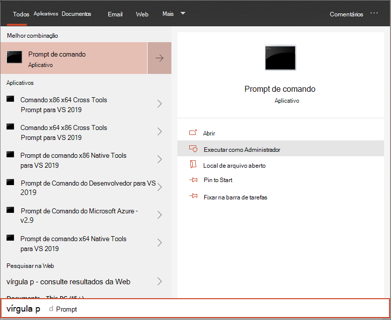

# <a name="run-a-detection-test-on-a-newly-onboarded-microsoft-defender-for-endpoint-device"></a>Executar um teste de detecção em um dispositivo recém-integrado do Microsoft Defender para Ponto de Extremidade 

[!INCLUDE [Microsoft 365 Defender rebranding](../../includes/microsoft-defender.md)]


**Aplica-se a:**
- Versões com suporte do Windows 10
- Windows Server 2012 R2
- Windows Server 2016
- Windows Server, versão 1803
- Windows Server, 2019
- [Microsoft Defender para Ponto de Extremidade](https://go.microsoft.com/fwlink/?linkid=2154037)
- [Microsoft 365 Defender](https://go.microsoft.com/fwlink/?linkid=2118804)

> Deseja experimentar o Microsoft Defender para Ponto de Extremidade? [Inscreva-se para uma avaliação gratuita.](https://www.microsoft.com/microsoft-365/windows/microsoft-defender-atp?ocid=docs-wdatp-exposedapis-abovefoldlink)

Execute o seguinte script do PowerShell em um dispositivo recém-conectado para verificar se ele está relatando corretamente para o serviço Defender para Ponto de Extremidade.

1. Crie uma pasta: 'C:\test-MDATP-test'.
2. Abra um prompt de linha de comando elevada no dispositivo e execute o script:

   1. Vá para **Iniciar** e digite **cmd**.

   1. Clique com o botão direito do mouse **em Prompt de Comando** e selecione Executar como **administrador**.

      

3. No prompt, copie e execute o seguinte comando:

   ```powershell
   powershell.exe -NoExit -ExecutionPolicy Bypass -WindowStyle Hidden $ErrorActionPreference= 'silentlycontinue';(New-Object System.Net.WebClient).DownloadFile('http://127.0.0.1/1.exe', 'C:\\test-MDATP-test\\invoice.exe');Start-Process 'C:\\test-MDATP-test\\invoice.exe'
   ```

A janela prompt de comando será fechada automaticamente. Se bem-sucedido, o teste de detecção será marcado como concluído e um novo alerta aparecerá no portal do dispositivo conectado em aproximadamente 10 minutos.

## <a name="related-topics"></a>Tópicos relacionados
- [Dispositivos integrados do Windows 10](configure-endpoints.md)
- [Servidores de integração](configure-server-endpoints.md)
- [Solucionar problemas de integração do Microsoft Defender para pontos de extremidade](https://docs.microsoft.com/microsoft-365/security/defender-endpoint/troubleshoot-onboarding)
