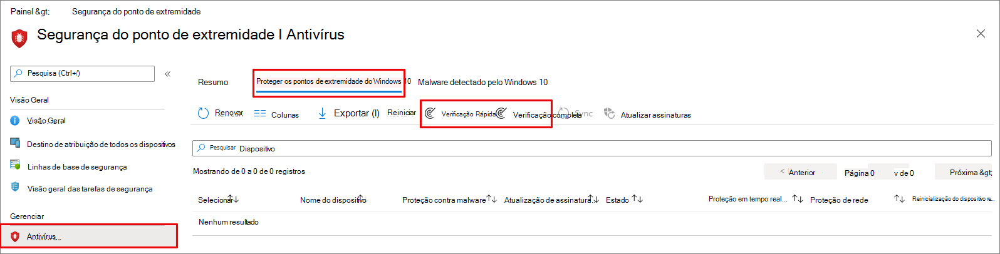

# <a name="configure-and-run-on-demand-microsoft-defender-antivirus-scans"></a><span data-ttu-id="9b4ca-104">Configurar e executar verificações do Microsoft Defender Antivírus sob demanda</span><span class="sxs-lookup"><span data-stu-id="9b4ca-104">Configure and run on-demand Microsoft Defender Antivirus scans</span></span>

[!INCLUDE [Microsoft 365 Defender rebranding](../../includes/microsoft-defender.md)]

<span data-ttu-id="9b4ca-105">**Aplica-se a:**</span><span class="sxs-lookup"><span data-stu-id="9b4ca-105">**Applies to:**</span></span>

- [<span data-ttu-id="9b4ca-106">Microsoft Defender para Ponto de Extremidade</span><span class="sxs-lookup"><span data-stu-id="9b4ca-106">Microsoft Defender for Endpoint</span></span>](/microsoft-365/security/defender-endpoint/)

<span data-ttu-id="9b4ca-107">Você pode executar uma verificação sob demanda em pontos de extremidade individuais.</span><span class="sxs-lookup"><span data-stu-id="9b4ca-107">You can run an on-demand scan on individual endpoints.</span></span> <span data-ttu-id="9b4ca-108">Essas verificações serão iniciais imediatamente e você pode definir parâmetros para a verificação, como o local ou o tipo.</span><span class="sxs-lookup"><span data-stu-id="9b4ca-108">These scans will start immediately, and you can define parameters for the scan, such as the location or type.</span></span>

## <a name="quick-scan-versus-full-scan"></a><span data-ttu-id="9b4ca-109">Verificação rápida versus verificação completa</span><span class="sxs-lookup"><span data-stu-id="9b4ca-109">Quick scan versus full scan</span></span>

<span data-ttu-id="9b4ca-110">A verificação rápida analisa todos os locais onde pode haver malware registrado para começar com o sistema, como chaves do Registro e pastas de inicialização conhecidas do Windows.</span><span class="sxs-lookup"><span data-stu-id="9b4ca-110">Quick scan looks at all the locations where there could be malware registered to start with the system, such as registry keys and known Windows startup folders.</span></span>

> [!IMPORTANT]
> <span data-ttu-id="9b4ca-111">O Microsoft Defender Antivírus é executado no contexto da [conta LocalSystem](/windows/win32/services/localsystem-account) ao executar uma verificação local.</span><span class="sxs-lookup"><span data-stu-id="9b4ca-111">Microsoft Defender Antivirus runs in the context of the [LocalSystem](/windows/win32/services/localsystem-account) account when performing a local scan.</span></span> <span data-ttu-id="9b4ca-112">Para verificações de rede, ele usa o contexto da conta do dispositivo.</span><span class="sxs-lookup"><span data-stu-id="9b4ca-112">For network scans, it uses the context of the device account.</span></span> <span data-ttu-id="9b4ca-113">Se a conta do dispositivo de domínio não tiver permissões apropriadas para acessar o compartilhamento, a verificação não funcionará.</span><span class="sxs-lookup"><span data-stu-id="9b4ca-113">If the domain device account doesn't have appropriate permissions to access the share, the scan won't work.</span></span> <span data-ttu-id="9b4ca-114">Verifique se o dispositivo tem permissões para o compartilhamento de rede de acesso.</span><span class="sxs-lookup"><span data-stu-id="9b4ca-114">Ensure that the device has permissions to the access network share.</span></span>

<span data-ttu-id="9b4ca-115">Combinado com a funcionalidade de proteção sempre em tempo [real](configure-real-time-protection-microsoft-defender-antivirus.md)-- que revisa os arquivos quando eles são abertos e fechados e sempre que um usuário navega para uma pasta --, uma verificação rápida ajuda a fornecer uma cobertura forte tanto para malware que começa com o sistema quanto o malware no nível do kernel.</span><span class="sxs-lookup"><span data-stu-id="9b4ca-115">Combined with [always-on real-time protection capability](configure-real-time-protection-microsoft-defender-antivirus.md)--which reviews files when they're opened and closed, and whenever a user navigates to a folder--a quick scan helps provide strong coverage both for malware that starts with the system and kernel-level malware.</span></span>  

<span data-ttu-id="9b4ca-116">Na maioria dos casos, uma verificação rápida é adequada para encontrar malware que não foi escolhido pela proteção em tempo real.</span><span class="sxs-lookup"><span data-stu-id="9b4ca-116">In most instances, a quick scan is adequate to find malware that wasn't picked up by real-time protection.</span></span>

<span data-ttu-id="9b4ca-117">Uma verificação completa pode ser útil em pontos de extremidade que relataram uma ameaça de malware.</span><span class="sxs-lookup"><span data-stu-id="9b4ca-117">A full scan can be useful on endpoints that have reported a malware threat.</span></span> <span data-ttu-id="9b4ca-118">A verificação pode identificar se há componentes inativos que exigem uma limpeza mais completa.</span><span class="sxs-lookup"><span data-stu-id="9b4ca-118">The scan can identify if there are any inactive components that require a more thorough clean-up.</span></span> <span data-ttu-id="9b4ca-119">Isso é ideal se sua organização estiver executando verificações sob demanda.</span><span class="sxs-lookup"><span data-stu-id="9b4ca-119">This is  ideal if your organization is running on-demand scans.</span></span>

> [!NOTE]
> <span data-ttu-id="9b4ca-120">Por padrão, verificações rápidas são executados em dispositivos removíveis montados, como unidades USB.</span><span class="sxs-lookup"><span data-stu-id="9b4ca-120">By default, quick scans run on mounted removable devices, such as USB drives.</span></span>

## <a name="use-microsoft-endpoint-manager-to-run-a-scan"></a><span data-ttu-id="9b4ca-121">Usar o Microsoft Endpoint Manager para executar uma verificação</span><span class="sxs-lookup"><span data-stu-id="9b4ca-121">Use Microsoft Endpoint Manager to run a scan</span></span>

1. <span data-ttu-id="9b4ca-122">Vá para o Centro de administração do Microsoft Endpoint Manager ( [https://endpoint.microsoft.com](https://endpoint.microsoft.com) ) e faça logoff.</span><span class="sxs-lookup"><span data-stu-id="9b4ca-122">Go to the Microsoft Endpoint Manager admin center ([https://endpoint.microsoft.com](https://endpoint.microsoft.com)) and log in.</span></span>
2. <span data-ttu-id="9b4ca-123">Escolha **Endpoint security**  >  **Antivírus**.</span><span class="sxs-lookup"><span data-stu-id="9b4ca-123">Choose **Endpoint security** > **Antivirus**.</span></span>
3. <span data-ttu-id="9b4ca-124">Na lista de guias, selecione Pontos de extremidade não ais do **Windows 10**.</span><span class="sxs-lookup"><span data-stu-id="9b4ca-124">In the list of tabs, select **Windows 10 unhealthy endpoints**.</span></span>
4. <span data-ttu-id="9b4ca-125">Na lista de ações fornecidas, selecione **Verificação Rápida** ou **Verificação Completa**.</span><span class="sxs-lookup"><span data-stu-id="9b4ca-125">From the list of actions provided, select **Quick Scan** or **Full Scan**.</span></span>

<span data-ttu-id="9b4ca-126">[](images/mem-antivirus-scan-on-demand.png#lightbox)</span><span class="sxs-lookup"><span data-stu-id="9b4ca-126">[  ](images/mem-antivirus-scan-on-demand.png#lightbox)</span></span>

> [!TIP]
> <span data-ttu-id="9b4ca-127">Para obter mais informações sobre como usar o Microsoft Endpoint Manager para executar uma verificação, consulte [Tarefas de antimalware](/configmgr/protect/deploy-use/endpoint-antimalware-firewall#how-to-perform-an-on-demand-scan-of-computers)e firewall: Como executar uma verificação sob demanda.</span><span class="sxs-lookup"><span data-stu-id="9b4ca-127">For more information about using Microsoft Endpoint Manager to run a scan, see [Antimalware and firewall tasks: How to perform an on-demand scan](/configmgr/protect/deploy-use/endpoint-antimalware-firewall#how-to-perform-an-on-demand-scan-of-computers).</span></span>

## <a name="use-the-mpcmdrunexe-command-line-utility-to-run-a-scan"></a><span data-ttu-id="9b4ca-128">Use o mpcmdrun.exe de linha de comando para executar uma verificação</span><span class="sxs-lookup"><span data-stu-id="9b4ca-128">Use the mpcmdrun.exe command-line utility to run a scan</span></span>

<span data-ttu-id="9b4ca-129">Use o seguinte `-scan` parâmetro:</span><span class="sxs-lookup"><span data-stu-id="9b4ca-129">Use the following `-scan` parameter:</span></span>

```console
mpcmdrun.exe -scan -scantype 1
```

<span data-ttu-id="9b4ca-130">Para obter mais informações sobre como usar a ferramenta e parâmetros adicionais, incluindo iniciar uma verificação completa ou definir caminhos, consulte Usar a ferramenta de linha de comando mpcmdrun.exe para configurar e gerenciar o [Microsoft Defender Antivírus](command-line-arguments-microsoft-defender-antivirus.md).</span><span class="sxs-lookup"><span data-stu-id="9b4ca-130">For more information about how to use the tool and additional parameters, including starting a full scan, or defining paths, see [Use the mpcmdrun.exe commandline tool to configure and manage Microsoft Defender Antivirus](command-line-arguments-microsoft-defender-antivirus.md).</span></span>

## <a name="use-microsoft-intune-to-run-a-scan"></a><span data-ttu-id="9b4ca-131">Usar o Microsoft Intune para executar uma verificação</span><span class="sxs-lookup"><span data-stu-id="9b4ca-131">Use Microsoft Intune to run a scan</span></span>

1. <span data-ttu-id="9b4ca-132">Vá para o Centro de administração do Microsoft Endpoint Manager ( [https://endpoint.microsoft.com](https://endpoint.microsoft.com) ) e faça logoff.</span><span class="sxs-lookup"><span data-stu-id="9b4ca-132">Go to the Microsoft Endpoint Manager admin center ([https://endpoint.microsoft.com](https://endpoint.microsoft.com)) and log in.</span></span>
2. <span data-ttu-id="9b4ca-133">Na barra lateral, selecione **Dispositivos > Todos os** Dispositivos e escolha o dispositivo que você deseja examinar.</span><span class="sxs-lookup"><span data-stu-id="9b4ca-133">From the sidebar, select **Devices > All Devices** and choose the device you want to scan.</span></span>
3. <span data-ttu-id="9b4ca-134">Selecione **... Mais**.</span><span class="sxs-lookup"><span data-stu-id="9b4ca-134">Select **...More**.</span></span> <span data-ttu-id="9b4ca-135">Nas opções, selecione **Verificação Rápida** ou **Verificação Completa.**</span><span class="sxs-lookup"><span data-stu-id="9b4ca-135">From the options, select **Quick Scan** or **Full Scan**.</span></span>

## <a name="use-the-windows-security-app-to-run-a-scan"></a><span data-ttu-id="9b4ca-136">Usar o aplicativo segurança do Windows para executar uma verificação</span><span class="sxs-lookup"><span data-stu-id="9b4ca-136">Use the Windows Security app to run a scan</span></span>

<span data-ttu-id="9b4ca-137">Consulte [Executar uma verificação no aplicativo segurança do Windows](microsoft-defender-security-center-antivirus.md) para obter instruções sobre como executar uma verificação em pontos de extremidade individuais.</span><span class="sxs-lookup"><span data-stu-id="9b4ca-137">See [Run a scan in the Windows Security app](microsoft-defender-security-center-antivirus.md) for instructions on running a scan on individual endpoints.</span></span>

## <a name="use-powershell-cmdlets-to-run-a-scan"></a><span data-ttu-id="9b4ca-138">Usar cmdlets do PowerShell para executar uma verificação</span><span class="sxs-lookup"><span data-stu-id="9b4ca-138">Use PowerShell cmdlets to run a scan</span></span>

<span data-ttu-id="9b4ca-139">Use o seguinte cmdlet:</span><span class="sxs-lookup"><span data-stu-id="9b4ca-139">Use the following cmdlet:</span></span>

```PowerShell
Start-MpScan
```

<span data-ttu-id="9b4ca-140">Para obter mais informações sobre como usar o PowerShell com o Microsoft Defender Antivírus, consulte [Usar cmdlets](use-powershell-cmdlets-microsoft-defender-antivirus.md) do PowerShell para configurar e executar [cmdlets](/powershell/module/defender/)do Microsoft Defender Antivírus e do Defender.</span><span class="sxs-lookup"><span data-stu-id="9b4ca-140">For more information on how to use PowerShell with Microsoft Defender Antivirus, see [Use PowerShell cmdlets to configure and run Microsoft Defender Antivirus](use-powershell-cmdlets-microsoft-defender-antivirus.md) and [Defender cmdlets](/powershell/module/defender/).</span></span>

## <a name="use-windows-management-instruction-wmi-to-run-a-scan"></a><span data-ttu-id="9b4ca-141">Usar a Instrução de Gerenciamento do Windows (WMI) para executar uma verificação</span><span class="sxs-lookup"><span data-stu-id="9b4ca-141">Use Windows Management Instruction (WMI) to run a scan</span></span>

<span data-ttu-id="9b4ca-142">Use o [ **método Start**](/previous-versions/windows/desktop/defender/start-msft-mpscan) da **classe MSFT_MpScan.**</span><span class="sxs-lookup"><span data-stu-id="9b4ca-142">Use the [**Start** method](/previous-versions/windows/desktop/defender/start-msft-mpscan) of the **MSFT_MpScan** class.</span></span>

<span data-ttu-id="9b4ca-143">Para obter mais informações sobre quais parâmetros são permitidos, [consulte Windows Defender APIs WMIv2](/previous-versions/windows/desktop/defender/windows-defender-wmiv2-apis-portal)</span><span class="sxs-lookup"><span data-stu-id="9b4ca-143">For more information about which parameters are allowed, see [Windows Defender WMIv2 APIs](/previous-versions/windows/desktop/defender/windows-defender-wmiv2-apis-portal)</span></span>

## <a name="related-articles"></a><span data-ttu-id="9b4ca-144">Artigos relacionados</span><span class="sxs-lookup"><span data-stu-id="9b4ca-144">Related articles</span></span>

- [<span data-ttu-id="9b4ca-145">Configurar opções de verificação do Microsoft Defender Antivírus</span><span class="sxs-lookup"><span data-stu-id="9b4ca-145">Configure Microsoft Defender Antivirus scanning options</span></span>](configure-advanced-scan-types-microsoft-defender-antivirus.md)
- [<span data-ttu-id="9b4ca-146">Configurar verificações agendadas do Microsoft Defender Antivírus</span><span class="sxs-lookup"><span data-stu-id="9b4ca-146">Configure scheduled Microsoft Defender Antivirus scans</span></span>](scheduled-catch-up-scans-microsoft-defender-antivirus.md)
- [<span data-ttu-id="9b4ca-147">Microsoft Defender Antivírus no Windows 10</span><span class="sxs-lookup"><span data-stu-id="9b4ca-147">Microsoft Defender Antivirus in Windows 10</span></span>](microsoft-defender-antivirus-in-windows-10.md)