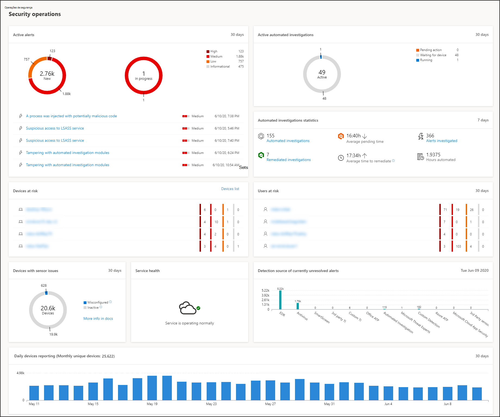
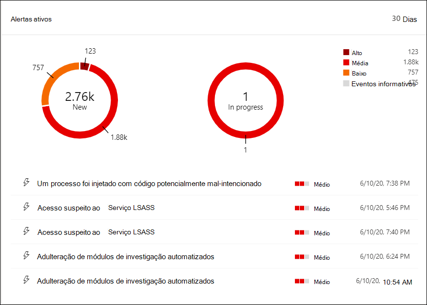
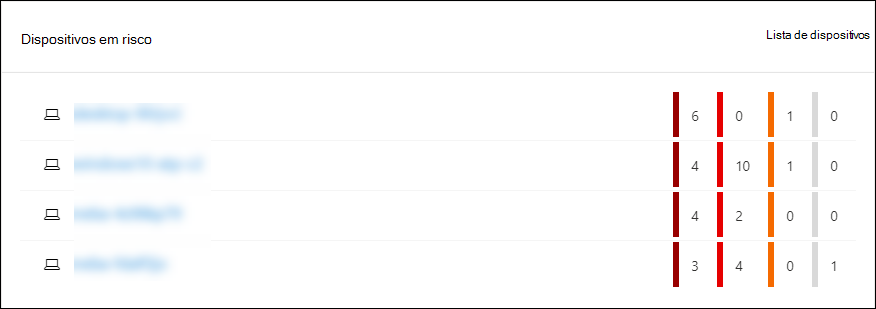
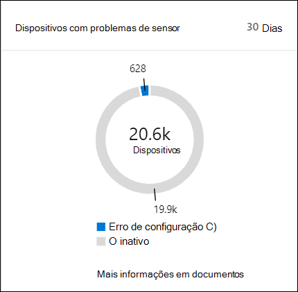
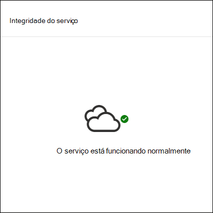
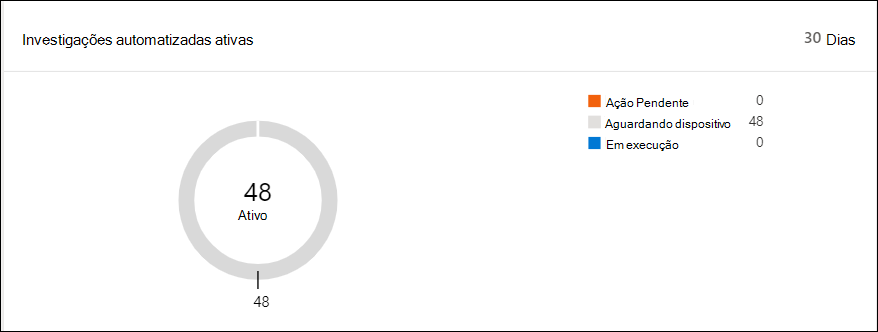
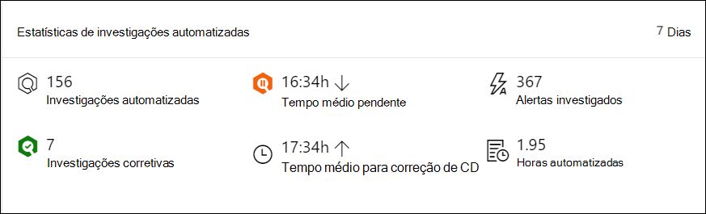
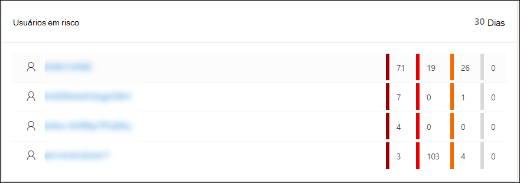

# Painel de operações do Centro de Segurança do Microsoft DefenderMicrosoft Defender Security Center Security operations dashboard

[!INCLUDE [Microsoft 365 Defender rebranding](../../includes/microsoft-defender.md)]

**Aplica-se a:****Applies to:**
- [Microsoft Defender para Ponto de ExtremidadeMicrosoft Defender for Endpoint](https://go.microsoft.com/fwlink/?linkid=2154037)

>Deseja experimentar o Microsoft Defender para Ponto de Extremidade?Want to experience Microsoft Defender for Endpoint? [Inscreva-se para uma avaliação gratuita.Sign up for a free trial.](https://www.microsoft.com/microsoft-365/windows/microsoft-defender-atp?ocid=docs-wdatp-secopsdashboard-abovefoldlink) 

O **painel operações de segurança** é onde os recursos de detecção e resposta do ponto de extremidade são a superfície.The **Security operations dashboard** is where the endpoint detection and response capabilities are surfaced. Ele fornece uma visão geral de alto nível de onde as detecções foram vistas e realça onde as ações de resposta são necessárias.It provides a high level overview of where detections were seen and highlights where response actions are needed. 

O painel exibe um instantâneo de:The dashboard displays a snapshot of:

- Alertas ativosActive alerts
- Dispositivos em riscoDevices at risk
- Saúde do sensorSensor health
- Integridade do serviçoService health
- Relatórios diários de dispositivosDaily devices reporting
- Investigações automatizadas ativasActive automated investigations
- Estatísticas de investigações automatizadasAutomated investigations statistics
- Usuários em riscoUsers at risk
- Atividades suspeitasSuspicious activities

Você pode explorar e investigar alertas e dispositivos para determinar rapidamente se, onde e quando atividades suspeitas ocorreram em sua rede para ajudá-lo a entender o contexto em que eles surgiram.You can explore and investigate alerts and devices to quickly determine if, where, and when suspicious activities occurred in your network to help you understand the context they appeared in.

No painel **Operações de segurança,** você verá eventos agregados para facilitar a identificação de eventos significativos ou comportamentos em um dispositivo.From the **Security operations dashboard** you will see aggregated events to facilitate the identification of significant events or behaviors on a device. Você também pode detalhar eventos granulares e indicadores de baixo nível.You can also drill down into granular events and low-level indicators.

Ele também tem blocos clicáveis que dão dicas visuais sobre o estado de saúde geral da sua organização.It also has clickable tiles that give visual cues on the overall health state of your organization. Cada tile abre uma exibição detalhada da visão geral correspondente.Each tile opens a detailed view of the corresponding overview.

## Alertas ativosActive alerts
Você pode exibir o número geral de alertas ativos dos últimos 30 dias em sua rede a partir do azulejo.You can view the overall number of active alerts from the last 30 days in your network from the tile. Os alertas são agrupados **em Novo** e **Em andamento.**Alerts are grouped into **New** and **In progress**.

Cada grupo é ainda mais sub categorizado em seus níveis de gravidade de alerta correspondentes.Each group is further sub-categorized into their corresponding alert severity levels. Clique no número de alertas dentro de cada anel de alerta para ver uma exibição classificação da fila dessa categoria (**Novo** **ou Em andamento**).Click the number of alerts inside each alert ring to see a sorted view of that category's queue (**New** or **In progress**).

Para obter mais informações, consulte Visão [geral de alertas.](alerts-queue.md)For more information see, [Alerts overview](alerts-queue.md).

Cada linha inclui uma categoria de gravidade de alerta e uma breve descrição do alerta.Each row includes an alert severity category and a short description of the alert. Você pode clicar em um alerta para ver sua exibição detalhada.You can click an alert to see its detailed view. Para obter mais informações, [consulte Investigar o Microsoft Defender para alertas](investigate-alerts.md) de ponto de extremidade e visão geral de [alertas.](alerts-queue.md)For more information see,  [Investigate Microsoft Defender for Endpoint alerts](investigate-alerts.md) and [Alerts overview](alerts-queue.md).

## Dispositivos em riscoDevices at risk
Esse azulejo mostra uma lista de dispositivos com o maior número de alertas ativos.This tile shows you a list of devices with the highest number of active alerts. O número total de alertas para cada dispositivo é mostrado em um círculo ao lado do nome do dispositivo e, em seguida, categorizado ainda mais por níveis de severidade no final do azulejo (passe o mouse sobre cada barra de gravidade para ver seu rótulo).The total number of alerts for each device is shown in a circle next to the device name, and then further categorized by severity levels at the far end of the tile (hover over each severity bar to see its label).

Clique no nome do dispositivo para ver detalhes sobre esse dispositivo.Click the name of the device to see details about that device. Para obter mais informações, [consulte Investigate devices in the Microsoft Defender for Endpoint Devices list](investigate-machines.md).For more information see, [Investigate devices in the Microsoft Defender for Endpoint Devices list](investigate-machines.md).

Você também pode clicar na lista **Dispositivos** na parte superior do azulejo para ir diretamente para a lista **Dispositivos**, classificação pelo número de alertas ativos.You can also click **Devices list** at the top of the tile to go directly to the **Devices list**, sorted by the number of active alerts. Para obter mais informações, [consulte Investigate devices in the Microsoft Defender for Endpoint Devices list](investigate-machines.md).For more information see, [Investigate devices in the Microsoft Defender for Endpoint Devices list](investigate-machines.md).

## Dispositivos com problemas de sensorDevices with sensor issues
O **pacote Dispositivos com problemas** de sensor fornece informações sobre a capacidade do dispositivo individual de fornecer dados do sensor ao serviço Microsoft Defender para Ponto de Extremidade.The **Devices with sensor issues** tile provides information on the individual device’s ability to provide sensor data to the Microsoft Defender for Endpoint service. Ele relata quantos dispositivos exigem atenção e ajuda a identificar dispositivos problemáticos.It reports how many devices require attention and helps you identify problematic devices.

Há dois indicadores de status que fornecem informações sobre o número de dispositivos que não estão relatando corretamente para o serviço:There are two status indicators that provide information on the number of devices that are not reporting properly to the service:
- **Mal configurado** – esses dispositivos podem estar relatando parcialmente dados do sensor para o serviço do Microsoft Defender para Ponto de Extremidade e podem ter erros de configuração que precisam ser corrigidos.**Misconfigured** – These devices might partially be reporting sensor data to the Microsoft Defender for Endpoint service and might have configuration errors that need to be corrected.
- **Inativos** - Dispositivos que pararam de relatar para o serviço Microsoft Defender para Ponto de Extremidade por mais de sete dias no mês passado.**Inactive** - Devices that have stopped reporting to the Microsoft Defender for Endpoint service for more than seven days in the past month.

Quando você clicar em qualquer um dos grupos, você será direcionado para a lista de dispositivos, filtrado de acordo com sua escolha.When you click any of the groups, you’ll be directed to devices list, filtered according to your choice. Para obter mais informações, consulte [Verificar o estado do sensor](check-sensor-status.md) e investigar [dispositivos](investigate-machines.md).For more information, see [Check sensor state](check-sensor-status.md) and [Investigate devices](investigate-machines.md).

## Integridade do serviçoService health
O **azulejo de** saúde do serviço informa se o serviço está ativo ou se há problemas.The **Service health** tile informs you if the service is active or if there are issues.

Para obter mais informações sobre a saúde do serviço, consulte [Check the Microsoft Defender for Endpoint service health](service-status.md).For more information on the service health, see [Check the Microsoft Defender for Endpoint service health](service-status.md).

## Relatórios diários de dispositivosDaily devices reporting
O **gráfico de relatório** de dispositivos diários mostra um gráfico de barras que representa o número de dispositivos que relatam diariamente nos últimos 30 dias.The **Daily devices reporting** tile shows a bar graph that represents the number of devices reporting daily in the last 30 days. Passe o mouse sobre barras individuais no gráfico para ver o número exato de dispositivos relatando em cada dia.Hover over individual bars on the graph to see the exact number of devices reporting in each day.

## Investigações automatizadas ativasActive automated investigations
Você pode exibir o número geral de investigações automatizadas dos últimos 30 dias em sua rede a partir do conjunto de **investigações automatizadas** ativas.You can view the overall number of automated investigations from the last 30 days in your network from the **Active automated investigations** tile. As investigações são agrupadas em **Ação Pendente,** **Aguardando dispositivo** e **Execução.**Investigations are grouped into **Pending action**, **Waiting for device**, and **Running**.

## Estatísticas de investigações automatizadasAutomated investigations statistics
Este tile mostra estatísticas relacionadas a investigações automatizadas nos últimos sete dias.This tile shows statistics related to automated investigations in the last seven days. Ele mostra o número de investigações concluídas, o número de investigações remediadas com êxito, o tempo médio de espera necessário para que uma investigação seja iniciada, o tempo médio necessário para correção de um alerta, o número de alertas investigados e o número de horas de automação salvas de uma investigação manual típica.It shows the number of investigations completed, the number of successfully remediated investigations, the average pending time it takes for an investigation to be initiated, the average time it takes to remediate an alert, the number of alerts investigated, and the number of hours of automation saved from a typical manual investigation. 

Você pode clicar em **Investigações Automatizadas,** **Investigações** Corretivas e **Alertas investigados** para navegar até a página **Investigações,** filtrada pela categoria apropriada.You can click on **Automated investigations**, **Remediated investigations**, and **Alerts investigated** to navigate to the **Investigations** page, filtered by the appropriate category. Isso permite que você veja uma divisão detalhada das investigações no contexto.This lets you see a detailed breakdown of investigations in context.

## Usuários em riscoUsers at risk
O azulejo mostra uma lista de contas de usuário com alertas mais ativos e o número de alertas vistos em alertas altos, médios ou baixos.The tile shows you a list of user accounts with the most active alerts and the number of alerts seen on high, medium, or low alerts. 

Clique na conta de usuário para ver detalhes sobre a conta de usuário.Click the user account to see details about the user account. Para obter mais informações, [consulte Investigar uma conta de usuário](investigate-user.md).For more information see [Investigate a user account](investigate-user.md).

>Deseja experimentar o Microsoft Defender para Ponto de Extremidade?Want to experience Microsoft Defender for Endpoint? [Inscreva-se para uma avaliação gratuita.Sign up for a free trial.](https://www.microsoft.com/microsoft-365/windows/microsoft-defender-atp?ocid=docs-wdatp-secopsdashboard-belowfoldlink)

## Tópicos relacionadosRelated topics
- [Entender o portal do Microsoft Defender para Ponto de ExtremidadeUnderstand the Microsoft Defender for Endpoint portal](use.md)
- [Visão geral do portalPortal overview](portal-overview.md)
- [Exibir o painel gerenciamento de & de vulnerabilidadesView the Threat & Vulnerability Management dashboard](tvm-dashboard-insights.md)
- [Exibir o painel de análise de ameaças e tomar ações de mitigação recomendadasView the Threat analytics dashboard and take recommended mitigation actions](threat-analytics.md)
