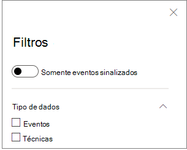

# Técnicas na linha do tempo do dispositivoTechniques in the device timeline

**Aplica-se a:****Applies to:**
- [Microsoft Defender para Ponto de ExtremidadeMicrosoft Defender for Endpoint](https://go.microsoft.com/fwlink/p/?linkid=2154037)

Você pode obter mais informações em uma investigação analisando os eventos que aconteceram em um dispositivo específico.You can gain more insight in an investigation by analyzing the events that happened on a specific device. Primeiro, selecione o dispositivo de interesse na lista [Dispositivos](machines-view-overview.md).First, select the device of interest from the [Devices list](machines-view-overview.md). Na página do dispositivo, você pode selecionar a guia **Linha** do Tempo para exibir todos os eventos que ocorreram no dispositivo.On the device page, you can select the **Timeline** tab to view all the events that occurred on the device.

## Compreender técnicas na linha do tempoUnderstand techniques in the timeline

>[!IMPORTANT]
>Algumas informações se relacionam a um recurso de produto pré-lançado na visualização pública que pode ser substancialmente modificado antes de ser lançado comercialmente.Some information relates to a prereleased product feature in public preview which may be substantially modified before it's commercially released. A Microsoft não faz garantias, expressas ou implícitas, quanto às informações fornecidas aqui.Microsoft makes no warranties, express or implied, with respect to the information provided here.

No Microsoft Defender para Ponto de Extremidade, **as** técnicas são um tipo de dados adicional na linha do tempo do evento.In Microsoft Defender for Endpoint, **Techniques** are an additional data type in the event timeline. As técnicas fornecem mais informações sobre as atividades associadas ao [MITRE ATT&](https://attack.mitre.org/) técnicas de CK ou sub-técnicas.Techniques provide more insight on activities associated with [MITRE ATT&CK](https://attack.mitre.org/) techniques or sub-techniques. 

Esse recurso simplifica a experiência de investigação ajudando os analistas a entender as atividades observadas em um dispositivo.This feature simplifies the investigation experience by helping analysts understand the activities that were observed on a device. Os analistas podem, então, decidir investigar mais.Analysts can then decide to investigate further.

Para visualização pública, as técnicas estão disponíveis por padrão e mostradas em conjunto com eventos quando a linha do tempo de um dispositivo é exibida.For public preview, Techniques are available by default and shown together with events when a device's timeline is viewed. 

As técnicas são realçadas em negrito e aparecem com um ícone azul à esquerda.Techniques are highlighted in bold text and appear with a blue icon on the left. O nome e a técnica correspondentes do MITRE ATT&ID de CK também aparecem como marcas em Informações adicionais.The corresponding MITRE ATT&CK ID and technique name also appear as tags under Additional information. 

Opções de pesquisa e exportação também estão disponíveis para Técnicas.Search and Export options are also available for Techniques.

## Investigar usando o painel lateralInvestigate using the side pane

Selecione uma Técnica para abrir seu painel lateral correspondente.Select a Technique to open its corresponding side pane. Aqui você pode ver informações adicionais e insights como att&técnicas de CK relacionadas, táticas e descrições.Here you can see additional information and insights like related ATT&CK techniques, tactics, and descriptions. 

Selecione a técnica *de Ataque específica* para abrir a página de técnica de CK&ATT relacionada, onde você pode encontrar mais informações sobre ele.Select the specific *Attack technique* to open the related ATT&CK technique page where you can find more information about it.

Você pode copiar os detalhes de uma entidade quando vir um ícone azul à direita.You can copy an entity's details when you see a blue icon on the right. Por exemplo, para copiar SHA1 de um arquivo relacionado, selecione o ícone de página azul.For instance, to copy a related file's SHA1, select the blue page icon.

Você pode fazer o mesmo para linhas de comando.You can do the same for command lines.

## Investigar eventos relacionadosInvestigate related events

Para usar [a busca avançada](advanced-hunting-overview.md) para encontrar eventos relacionados à Técnica selecionada, selecione Procurar eventos **relacionados.**To use [advanced hunting](advanced-hunting-overview.md) to find events related to the selected Technique, select **Hunt for related events**. Isso leva à página de busca avançada com uma consulta para encontrar eventos relacionados à Técnica.This leads to the advanced hunting page with a query to find events related to the Technique.

>[!NOTE]
>A consulta usando o botão **Procurar** eventos relacionados a partir de um painel lateral de Técnica exibe todos os eventos relacionados à técnica identificada, mas não inclui a técnica em si nos resultados da consulta.Querying using the **Hunt for related events** button from a Technique side pane displays all the events related to the identified technique but does not include the Technique itself in the query results.

## Personalizar a linha do tempo do dispositivoCustomize your device timeline

No lado superior direito da linha do tempo do dispositivo, você pode escolher um intervalo de datas para limitar o número de eventos e técnicas na linha do tempo.On the upper right-hand side of the device timeline, you can choose a date range to limit the number of events and techniques in the timeline. 

Você pode personalizar quais colunas expor.You can customize which columns to expose. Você também pode filtrar eventos sinalizados por tipo de dados ou por grupo de eventos.You can also filter for flagged events by data type or by event group.

### Escolher colunas para exporChoose columns to expose
Você pode escolher quais colunas expor na linha do tempo selecionando o **botão Escolher colunas.**You can choose which columns to expose in the timeline by selecting the **Choose columns** button.

A partir daí, você pode selecionar quais informações serão definidas para incluir.From there you can select which information set to include.

### Filtrar para exibir apenas técnicas ou eventosFilter to view techniques or events only

Para exibir apenas eventos ou técnicas, selecione **Filtros** na linha do tempo do dispositivo e escolha seu tipo de dados preferencial para exibir.To view only either events or techniques, select **Filters** from the device timeline and choose your preferred Data type to view.

## Confira tambémSee also
- [Exibir e organizar a lista DispositivosView and organize the Devices list](machines-view-overview.md)
- [Sinalizadores de eventos de linha do tempo do dispositivo do Microsoft Defender for EndpointMicrosoft Defender for Endpoint device timeline event flags](device-timeline-event-flag.md) 

 
