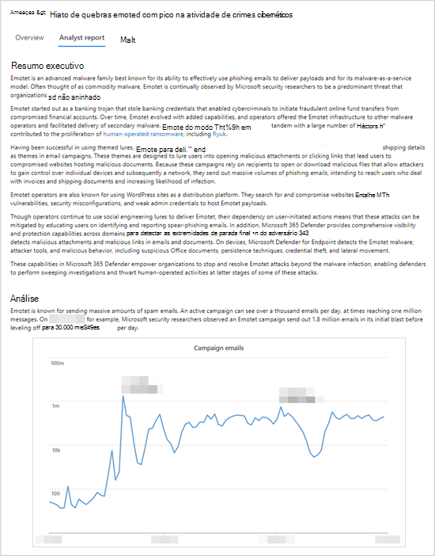

# Compreender o relatório do analista na análise de ameaçasUnderstand the analyst report in threat analytics

[!INCLUDE [Microsoft 365 Defender rebranding](../../includes/microsoft-defender.md)]

**Aplica-se a:****Applies to:**
- [Proteção Avançada contra Ameaças do Microsoft Defender (Microsoft Defender ATP)Microsoft Defender Advanced Threat Protection (Microsoft Defender ATP)](https://go.microsoft.com/fwlink/p/?linkid=2069559)
- [Microsoft Defender para Ponto de ExtremidadeMicrosoft Defender for Endpoint](https://go.microsoft.com/fwlink/p/?linkid=2146631)
- [Microsoft 365 DefenderMicrosoft 365 Defender](https://go.microsoft.com/fwlink/?linkid=2118804)

> Deseja experimentar o Microsoft Defender para Ponto de Extremidade?Want to experience Microsoft Defender for Endpoint? [Inscreva-se para uma avaliação gratuita.Sign up for a free trial.](https://www.microsoft.com/microsoft-365/windows/microsoft-defender-atp?ocid=docs-wdatp-exposedapis-abovefoldlink)

Cada [relatório de análise de ameaças](threat-analytics.md) inclui seções dinâmicas e uma seção por escrito abrangente chamada relatório de _analista._Each [threat analytics report](threat-analytics.md) includes dynamic sections and a comprehensive written section called the _analyst report_. Para acessar esta seção, abra o relatório sobre a ameaça controlada e selecione a **guia Relatório do** Analista.To access this section, open the report about the tracked threat and select the **Analyst report** tab.

_Seção relatório de analista de um relatório de análise de ameaças__Analyst report section of a threat analytics report_

## Examinar o relatório do analistaScan the analyst report 
Cada seção do relatório do analista foi projetada para fornecer informações a actionable.Each section of the analyst report is designed to provide actionable information. Embora os relatórios variem, a maioria dos relatórios inclui as seções descritas na tabela a seguir.While reports vary, most reports include the sections described in the following table.

| Seção RelatórioReport section | DescriçãoDescription |
|--|--|
| Resumo executivoExecutive summary | Visão geral da ameaça, incluindo quando ela foi vista pela primeira vez, suas motivações, eventos notáveis, principais alvos e ferramentas e técnicas distintas.Overview of the threat, including when it was first seen, its motivations, notable events, major targets, and distinct tools and techniques. Você pode usar essas informações para avaliar ainda mais como priorizar a ameaça no contexto de sua indústria, localização geográfica e rede.You can use this information to further assess how to prioritize the threat in the context of your industry, geographic location, and network. |
| AnáliseAnalysis | Informações técnicas sobre as ameaças, incluindo os detalhes de um ataque e como os invasores podem utilizar uma nova técnica ou superfície de ataqueTechnical information about the threats, including the details of an attack and how attackers might utilize a new technique or attack surface | 
| Mitre ATT&técnicas de CK observadasMITRE ATT&CK techniques observed | Como as técnicas observadas mapeiam para o [MITRE ATT](https://attack.mitre.org/)&de ataque CKHow observed techniques map to the [MITRE ATT&CK attack framework](https://attack.mitre.org/) | 
| [MitigaçõesMitigations](#apply-additional-mitigations) | Recomendações que podem parar ou ajudar a reduzir o impacto da ameaça.Recommendations that can stop or help reduce the impact of the threat. Esta seção também inclui mitigações que não são rastreadas dinamicamente como parte do relatório de análise de ameaças.This section also includes mitigations that aren't tracked dynamically as part of the threat analytics report. |
| [Detalhes da detecçãoDetection details](#understand-how-each-threat-can-be-detected) | Detecções específicas e genéricas fornecidas pelas soluções de segurança da Microsoft que podem surgir atividade ou componentes associados à ameaça.Specific and generic detections provided by Microsoft security solutions that can surface activity or components associated with the threat. | 
| [Busca avançadaAdvanced hunting](#find-subtle-threat-artifacts-using-advanced-hunting) | [Consultas avançadas de busca](advanced-hunting-overview.md) para identificar proativamente as possíveis atividades de ameaça.[Advanced hunting queries](advanced-hunting-overview.md) for proactively identifying possible threat activity. A maioria das consultas é fornecida para complementar detecções, especialmente para localizar componentes ou comportamentos potencialmente mal-intencionados que não puderam ser avaliados dinamicamente como mal-intencionados.Most queries are provided to supplement detections, especially for locating potentially malicious components or behaviors that couldn't be dynamically assessed to be malicious. | 
| ReferênciasReferences | Publicações da Microsoft e de terceiros referenciadas por analistas durante a criação do relatório.Microsoft and third-party publications referenced by analysts during the creation of the report. O conteúdo da análise de ameaças baseia-se nos dados validados pelos pesquisadores da Microsoft.Threat analytics content is based on data validated by Microsoft researchers. As informações de fontes de terceiros disponíveis publicamente são identificadas claramente como tal.Information from publicly available, third-party sources are identified clearly as such. | 
| Log de mudançasChange log | A hora em que o relatório foi publicado e quando alterações significativas foram feitas no relatório.The time the report was published and when significant changes were made to the report. |

## Aplicar mitigações adicionaisApply additional mitigations
A análise de ameaças rastreia [dinamicamente o status de atualizações de segurança e configurações seguras.](threat-analytics.md#mitigations-review-list-of-mitigations-and-the-status-of-your-devices)Threat analytics dynamically tracks the [status of security updates and secure configurations](threat-analytics.md#mitigations-review-list-of-mitigations-and-the-status-of-your-devices). Essas informações estão disponíveis como gráficos e tabelas na **guia Mitigações.**This information is available as charts and tables in the **Mitigations** tab.

Além dessas mitigações controladas, o relatório do analista também aborda mitigações que não _são_ monitoradas dinamicamente.In addition to these tracked mitigations, the analyst report also discusses mitigations that are _not_ dynamically monitored. Aqui estão alguns exemplos de mitigações importantes que não são controladas dinamicamente:Here are some examples of important mitigations that are not dynamically tracked:

- Bloquear emails com _anexos .lnk_ ou outros tipos de arquivo suspeitosBlock emails with _.lnk_ attachments or other suspicious file types
- Aleatoriamente senhas de administrador localRandomize local administrator passwords
- Instruir os usuários finais sobre phishing de email e outros vetores de ameaçasEducate end users about phishing email and other threat vectors
- Ativar regras [específicas de redução de superfície de ataque](attack-surface-reduction.md)Turn on specific [attack surface reduction rules](attack-surface-reduction.md)

Embora você possa usar a guia **Mitigações** para avaliar sua postura de segurança contra uma ameaça, essas recomendações permitem que você tome medidas adicionais para melhorar sua postura de segurança.While you can use the **Mitigations** tab to assess your security posture against a threat, these recommendations let you take additional steps towards improving your security posture. Leia cuidadosamente todas as diretrizes de mitigação no relatório do analista e aplique-as sempre que possível.Carefully read all the mitigation guidance in the analyst report and apply them whenever possible.

## Entender como cada ameaça pode ser detectadaUnderstand how each threat can be detected
O relatório de analista também fornece as detecções do Microsoft Defender para recursos de detecção e resposta _de_ antivírus e ponto de extremidade (EDR).The analyst report also provides the detections from Microsoft Defender for Endpoint antivirus and _endpoint detection and response_ (EDR) capabilities.

### Detecções antivírusAntivirus detections
Essas detecções estão disponíveis em dispositivos com [o Microsoft Defender Antivírus](https://docs.microsoft.com/windows/security/threat-protection/microsoft-defender-antivirus/microsoft-defender-antivirus-in-windows-10) ligado.These detections are available on devices with [Microsoft Defender Antivirus](https://docs.microsoft.com/windows/security/threat-protection/microsoft-defender-antivirus/microsoft-defender-antivirus-in-windows-10) turned on. Quando essas detecções ocorrem em dispositivos que foram integrados ao Microsoft Defender para Ponto de Extremidade, eles também disparam alertas que acendem os gráficos no relatório.When these detections occur on devices that have been onboarded to Microsoft Defender for Endpoint, they also trigger alerts that light up the charts in the report.

>[!NOTE]
>O relatório do analista também lista detecções **genéricas** que podem identificar uma ampla variedade de ameaças, além de componentes ou comportamentos específicos da ameaça controlada.The analyst report also lists **generic detections** that can identify a wide-range of threats, in addition to components or behaviors specific to the tracked threat. Essas detecções genéricas não refletem nos gráficos.These generic detections don't reflect in the charts.

### Alertas de detecção e resposta de ponto de extremidade (EDR)Endpoint detection and response (EDR) alerts
Alertas de EDR são gerados para [dispositivos conectados ao Microsoft Defender para Ponto de Extremidade.](onboard-configure.md)EDR alerts are raised for [devices onboarded to Microsoft Defender for Endpoint](onboard-configure.md). Esses alertas geralmente dependem de sinais de segurança coletados pelo sensor do Microsoft Defender para Ponto de Extremidade e outros recursos de ponto de extremidade, como antivírus, proteção de rede, proteção contra adulteração, que servem como fontes de sinal poderosas.These alerts generally rely on security signals collected by the Microsoft Defender for Endpoint sensor and other endpoint capabilities—such as antivirus, network protection, tamper protection—that serve as powerful signal sources.

Como a lista de detecções de antivírus, alguns alertas de EDR são projetados para sinalizar genericamente comportamentos suspeitos que podem não estar associados à ameaça controlada.Like the list of antivirus detections, some EDR alerts are designed to generically flag suspicious behavior that might not be associated with the tracked threat. Nesses casos, o relatório identificará claramente o alerta como "genérico" e não influenciará nenhum dos gráficos no relatório.In such cases, the report will clearly identify the alert as "generic" and that it doesn't influence any of the charts in the report.

## Encontrar artefatos de ameaças sutis usando a busca avançadaFind subtle threat artifacts using advanced hunting
Embora as detecções permitam identificar e interromper a ameaça controlada automaticamente, muitas atividades de ataque deixam rastreamentos sutis que exigem inspeção adicional.While detections allow you to identify and stop the tracked threat automatically, many attack activities leave subtle traces that require additional inspection. Algumas atividades de ataque exibem comportamentos que também podem ser normais, portanto, detectá-los dinamicamente pode resultar em ruído operacional ou até mesmo falsos positivos.Some attack activities exhibit behaviors that can also be normal, so detecting them dynamically can result in operational noise or even false positives.

[A busca avançada](advanced-hunting-overview.md) fornece uma interface de consulta com base no Idioma de Consulta kusto que simplifica a localização de indicadores sutis de atividade de ameaça.[Advanced hunting](advanced-hunting-overview.md) provides a query interface based on Kusto Query Language that simplifies locating subtle indicators of threat activity. Ele também permite que você superfície informações contextuais e verificar se os indicadores estão conectados a uma ameaça.It also allows you to surface contextual information and verify whether indicators are connected to a threat.

Consultas de busca avançadas nos relatórios de analistas foram vetada por analistas da Microsoft e estão prontas para você executar no editor de consulta de [busca avançada.](https://securitycenter.windows.com/advanced-hunting)Advanced hunting queries in the analyst reports have been vetted by Microsoft analysts and are ready for you to run in the [advanced hunting query editor](https://securitycenter.windows.com/advanced-hunting). Você também pode usar as consultas para criar regras de detecção [personalizadas](custom-detection-rules.md) que disparam alertas para futuras combinações.You can also use the queries to create [custom detection rules](custom-detection-rules.md) that trigger alerts for future matches.

## Tópicos relacionadosRelated topics
- [Visão geral de análise de ameaçasThreat analytics overview](threat-analytics.md)
- [Encontrar proativamente ameaças com busca avançadaProactively find threats with advanced hunting](advanced-hunting-overview.md) 
- [Regras de detecção personalizadasCustom detection rules](custom-detection-rules.md)