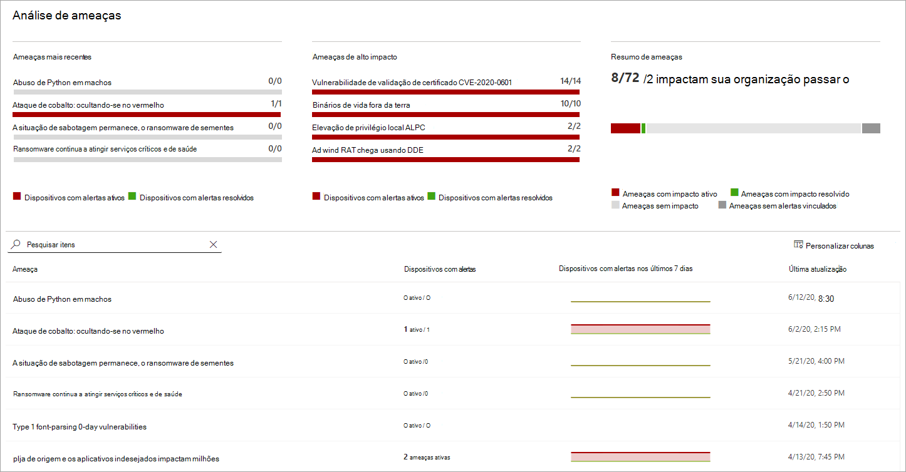
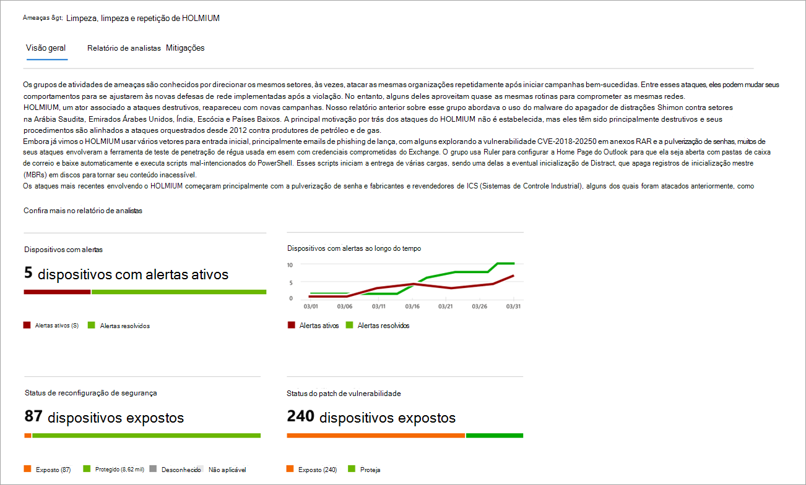
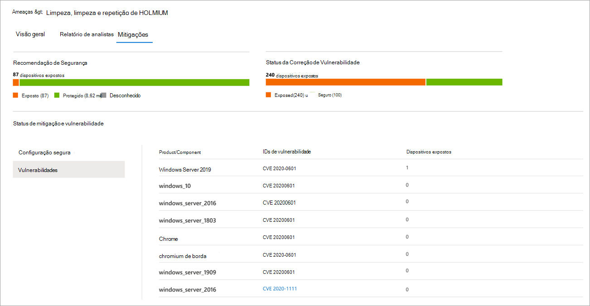

# Rastrear e responder a ameaças emergentes com análise de ameaçasTrack and respond to emerging threats with threat analytics 

[!INCLUDE [Microsoft 365 Defender rebranding](../../includes/microsoft-defender.md)]

**Aplica-se a:****Applies to:**
- [Microsoft Defender para Ponto de ExtremidadeMicrosoft Defender for Endpoint](https://go.microsoft.com/fwlink/?linkid=2154037)
- [Microsoft 365 DefenderMicrosoft 365 Defender](https://go.microsoft.com/fwlink/?linkid=2118804)

> Deseja experimentar o Microsoft Defender para Ponto de Extremidade?Want to experience Microsoft Defender for Endpoint? [Inscreva-se para uma avaliação gratuita.Sign up for a free trial.](https://www.microsoft.com/microsoft-365/windows/microsoft-defender-atp?ocid=docs-wdatp-exposedapis-abovefoldlink)

Com adversários mais sofisticados e novas ameaças surgindo com frequência e predominantemente, é fundamental poder fazer isso rapidamente:With more sophisticated adversaries and new threats emerging frequently and prevalently, it's critical to be able to quickly:

- Avaliar o impacto de novas ameaçasAssess the impact of new threats
- Revise sua resiliência contra ou exposição às ameaçasReview your resilience against or exposure to the threats
- Identificar as ações que você pode tomar para parar ou conter as ameaçasIdentify the actions you can take to stop or contain the threats

Análise de ameaças é um conjunto de relatórios de pesquisadores de segurança especialistas da Microsoft que abrangem as ameaças mais relevantes, incluindo:Threat analytics is a set of reports from expert Microsoft security researchers covering the most relevant threats, including:

- Atores de ameaças ativos e suas campanhasActive threat actors and their campaigns
- Técnicas de ataque populares e novasPopular and new attack techniques
- Vulnerabilidades críticasCritical vulnerabilities
- Superfícies de ataque comunsCommon attack surfaces
- Malware predominantePrevalent malware

Cada relatório fornece uma análise detalhada de uma ameaça e orientações abrangentes sobre como se defender contra essa ameaça.Each report provides a detailed analysis of a threat and extensive guidance on how to defend against that threat. Ele também incorpora dados de sua rede, indicando se a ameaça está ativa e se você tem proteções aplicáveis no local.It also incorporates data from your network, indicating whether the threat is active and if you have applicable protections in place.

Assista a este breve vídeo para saber mais sobre como a análise de ameaças pode ajudá-lo a rastrear as ameaças mais recentes e impedi-las.Watch this short video to learn more about how threat analytics can help you track the latest threats and stop them.

> [!VIDEO https://www.microsoft.com/en-us/videoplayer/embed/RE4bw1f]

## Exibir o painel de análise de ameaçasView the threat analytics dashboard

O painel de análise de ameaças é um ótimo ponto de partida para obter os relatórios mais relevantes para sua organização.The threat analytics dashboard is a great jump off point for getting to the reports that are most relevant to your organization. Ele resume as ameaças nas seções a seguir:It summarizes the threats in the following sections:

- **Ameaças mais** recentes lista os relatórios de ameaças publicados mais recentemente, juntamente com o número de dispositivos com alertas ativos e resolvidos.**Latest threats**—lists the most recently published threat reports, along with the number of devices with active and resolved alerts.
- **Ameaças de alto impacto** lista as ameaças que tiveram o maior impacto para a organização.**High-impact threats**—lists the threats that have had the highest impact to the organization. Esta seção classifica as ameaças pelo número de dispositivos que têm alertas ativos.This section ranks threats by the number of devices that have active alerts.
- **Resumo de** ameaças — mostra o impacto geral das ameaças controladas mostrando o número de ameaças com alertas ativos e resolvidos.**Threat summary**—shows the overall impact of tracked threats by showing the number of threats with active and resolved alerts.

Selecione uma ameaça no painel para exibir o relatório dessa ameaça.Select a threat from the dashboard to view the report for that threat.

## Exibir um relatório de análise de ameaçasView a threat analytics report

Cada relatório de análise de ameaças fornece informações em três seções: **Overview**, **Analyst report** e **Mitigations**.Each threat analytics report provides information in three sections: **Overview**, **Analyst report**, and **Mitigations**.

### Visão geral: entenda rapidamente a ameaça, avalie seu impacto e revise as defesasOverview: Quickly understand the threat, assess its impact, and review defenses

A **seção Visão** Geral fornece uma visualização do relatório detalhado do analista.The **Overview** section provides a preview of the detailed analyst report. Ele também fornece gráficos que realçam o impacto da ameaça à sua organização e sua exposição por meio de dispositivos não configurados e não configurados.It also provides charts that highlight the impact of the threat to your organization and your exposure through misconfigured and unpatched devices.

 _Visão geral de um relatório de análise de ameaças_
_Overview section of a threat analytics report_

#### Avaliar o impacto para sua organizaçãoAssess the impact to your organization
Cada relatório inclui gráficos projetados para fornecer informações sobre o impacto organizacional de uma ameaça:Each report includes charts designed to provide information about the organizational impact of a threat:
- **Dispositivos com alertas** mostram o número atual de dispositivos distintos que foram afetados pela ameaça.**Devices with alerts**—shows the current number of distinct devices that have been impacted by the threat. Um dispositivo será categorizado como **Ativo** se houver pelo menos um  alerta associado a essa ameaça e **Resolvido** se todos os alertas associados à ameaça no dispositivo foram resolvidos.A device is categorized as **Active** if there is at least one alert associated with that threat and **Resolved** if *all* alerts associated with the threat on the device have been resolved.
- **Dispositivos com alertas ao** longo do tempo mostram o número de dispositivos distintos com alertas **ativos** e **resolvidos** ao longo do tempo.**Devices with alerts over time**—shows the number of distinct devices with **Active** and **Resolved** alerts over time. O número de alertas resolvidos indica a rapidez com que sua organização responde a alertas associados a uma ameaça.The number of resolved alerts indicates how quickly your organization responds to alerts associated with a threat. Idealmente, o gráfico deve mostrar alertas resolvidos em alguns dias.Ideally, the chart should be showing alerts resolved within a few days.

#### Revisar a resiliência e a postura de segurançaReview security resilience and posture
Cada relatório inclui gráficos que fornecem uma visão geral de como sua organização é resiliente contra uma determinada ameaça:Each report includes charts that provide an overview of how resilient your organization is against a given threat:
- **Status da configuração** de segurança mostra o número de dispositivos que aplicaram as configurações de segurança recomendadas que podem ajudar a reduzir a ameaça.**Security configuration status**—shows the number of devices that have applied the recommended security settings that can help mitigate the threat. Os dispositivos são **considerados Seguros** se eles aplicaram _todas as_ configurações controladas.Devices are considered **Secure** if they have applied _all_ the tracked settings.
- **Status de patch de vulnerabilidade** mostra o número de dispositivos que aplicaram atualizações de segurança ou patches que abordam vulnerabilidades exploradas pela ameaça.**Vulnerability patching status**—shows the number of devices that have applied security updates or patches that address vulnerabilities exploited by the threat.

### Relatório de analistas: obter informações de especialistas de pesquisadores de segurança da MicrosoftAnalyst report: Get expert insight from Microsoft security researchers
Vá até a **seção Relatório** de Analistas para ler o relatório detalhado do especialista.Go to the **Analyst report** section to read through the detailed expert write-up. A maioria dos relatórios fornece descrições detalhadas de cadeias de ataque, incluindo táticas e técnicas mapeadas para  a estrutura de CK do MITRE ATT&, listas exaustivas de recomendações e orientações avançadas sobre a busca de ameaças.Most reports provide detailed descriptions of attack chains, including tactics and techniques mapped to the MITRE ATT&CK framework, exhaustive lists of recommendations, and powerful [threat hunting](advanced-hunting-overview.md) guidance.

[Saiba mais sobre o relatório do analistaLearn more about the analyst report](threat-analytics-analyst-reports.md)

### Mitigações: revise a lista de mitigações e o status de seus dispositivosMitigations: Review list of mitigations and the status of your devices
Na seção **Mitigações,** revise a lista de recomendações ativas específicas que podem ajudá-lo a aumentar sua resiliência organizacional em relação à ameaça.In the **Mitigations** section, review the list of specific actionable recommendations that can help you increase your organizational resilience against the threat. A lista de mitigações controladas inclui:The list of tracked mitigations includes:

- **Atualizações de segurança**— implantação de atualizações de segurança ou patches para vulnerabilidades**Security updates**—deployment of security updates or patches for vulnerabilities
- **Configurações do Microsoft Defender Antivírus****Microsoft Defender Antivirus settings**
  - Versão de inteligência de segurançaSecurity intelligence version
  - Proteção entregue na nuvemCloud-delivered protection  
  - Proteção de aplicativo potencialmente indesejado (PUA)Potentially unwanted application (PUA) protection
  - Proteção em tempo realReal-time protection
 
As informações de mitigação nesta seção incorporam dados do gerenciamento de ameaças e vulnerabilidades [,](next-gen-threat-and-vuln-mgt.md)que também fornece informações detalhadas de detalhamento de vários links no relatório.Mitigation information in this section incorporates data from [threat and vulnerability management](next-gen-threat-and-vuln-mgt.md), which also provides detailed drill-down information from various links in the report.

 _Seção Mitigações de um relatório de análise de ameaças_
_Mitigations section of a threat analytics report_

## Detalhes e limitações adicionais do relatórioAdditional report details and limitations
Ao usar os relatórios, lembre-se do seguinte:When using the reports, keep the following in mind: 

- Os dados têm escopo com base no escopo do RBAC (controle de acesso baseado em função).Data is scoped based on your role-based access control (RBAC) scope. Você verá o status dos dispositivos em [grupos que você pode acessar](machine-groups.md).You will see the status of devices in [groups that you can access](machine-groups.md).
- Os gráficos refletem apenas mitigações controladas.Charts reflect only mitigations that are tracked. Verifique a visão geral do relatório para obter mitigações adicionais que não são mostradas nos gráficos.Check the report overview for additional mitigations that are not shown in the charts.
- Mitigações não garantem resiliência completa.Mitigations don't guarantee complete resilience. As mitigações fornecidas refletem as melhores ações possíveis necessárias para melhorar a resiliência.The provided mitigations reflect the best possible actions needed to improve resiliency.
- Os dispositivos serão contados como "indisponíveis" se não transmitirem dados para o serviço.Devices are counted as "unavailable" if they have not transmitted data to the service.
- As estatísticas relacionadas ao antivírus são baseadas nas configurações do Microsoft Defender Antivírus.Antivirus-related statistics are based on Microsoft Defender Antivirus settings. Dispositivos com soluções antivírus de terceiros podem aparecer como "expostos".Devices with third-party antivirus solutions can appear as "exposed".

## Tópicos relacionadosRelated topics
- [Encontrar proativamente ameaças com busca avançadaProactively find threats with advanced hunting](advanced-hunting-overview.md) 
- [Compreender a seção relatório de analistasUnderstand the analyst report section](threat-analytics-analyst-reports.md)
- [Avaliar e resolver deficiências e exposições de segurançaAssess and resolve security weaknesses and exposures](next-gen-threat-and-vuln-mgt.md)