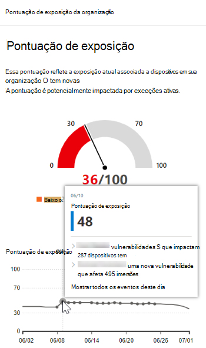
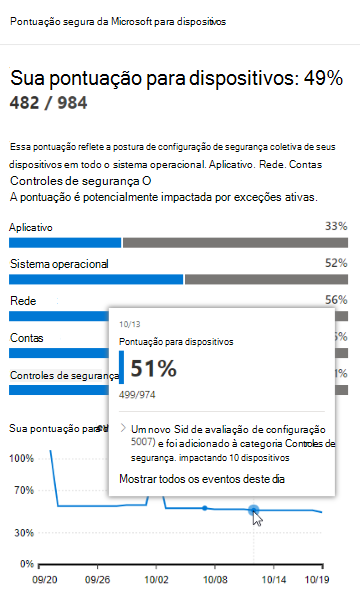
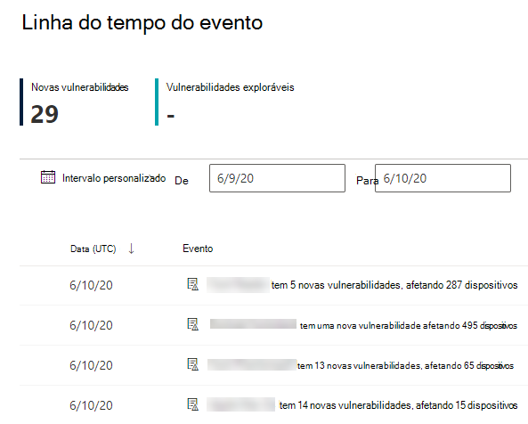
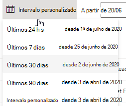
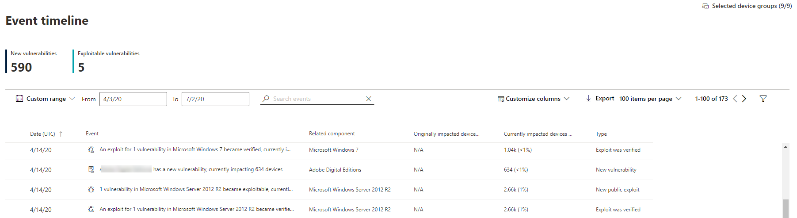
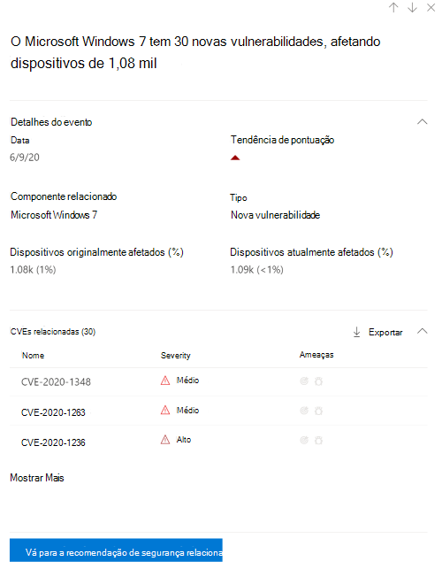
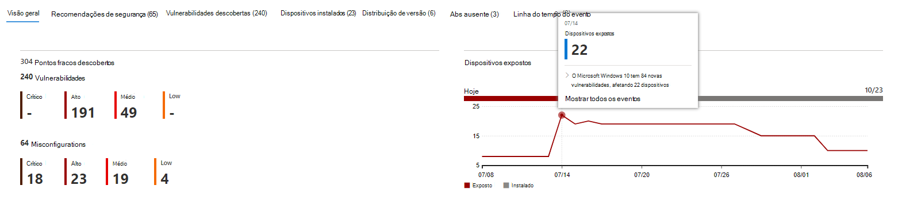

# Linha do tempo do evento - gerenciamento de ameaças e vulnerabilidadesEvent timeline - threat and vulnerability management

[!INCLUDE [Microsoft 365 Defender rebranding](../../includes/microsoft-defender.md)]

**Aplica-se a:****Applies to:**
- [Microsoft Defender para Ponto de ExtremidadeMicrosoft Defender for Endpoint](https://go.microsoft.com/fwlink/?linkid=2154037)
- [Microsoft 365 DefenderMicrosoft 365 Defender](https://go.microsoft.com/fwlink/?linkid=2118804)

>Deseja experimentar o Microsoft Defender para Ponto de Extremidade?Want to experience Microsoft Defender for Endpoint? [Inscreva-se para uma avaliação gratuita.Sign up for a free trial.](https://www.microsoft.com/microsoft-365/windows/microsoft-defender-atp?ocid=docs-wdatp-portaloverview-abovefoldlink)

A linha do tempo do evento é um feed de notícias de risco que ajuda você a interpretar como o risco é introduzido na organização por meio de novas vulnerabilidades ou explorações.Event timeline is a risk news feed that helps you interpret how risk is introduced into the organization through new vulnerabilities or exploits. Você pode exibir eventos que podem afetar o risco da sua organização.You can view events that may impact your organization's risk. Por exemplo, você pode encontrar novas vulnerabilidades que foram introduzidas, vulnerabilidades que se tornaram exploradas, exploração que foi adicionada a um kit de exploração e muito mais.For example, you can find new vulnerabilities that were introduced, vulnerabilities that became exploitable, exploit that was added to an exploit kit, and more.

A linha do tempo  do evento também conta a história da sua pontuação de exposição e da Pontuação Segura da Microsoft para [Dispositivos](tvm-microsoft-secure-score-devices.md) para que você possa determinar a causa de grandes alterações.Event timeline also tells the story of your [exposure score](tvm-exposure-score.md) and [Microsoft Secure Score for Devices](tvm-microsoft-secure-score-devices.md) so you can determine the cause of large changes. Os eventos podem afetar seus dispositivos ou sua pontuação para dispositivos.Events can impact your devices or your score for devices. Reduza a exposição abordando o que precisa ser remediado com base nas recomendações de [segurança priorizadas.](tvm-security-recommendation.md)Reduce you exposure by addressing what needs to be remediated based on the prioritized [security recommendations](tvm-security-recommendation.md).

>[!TIP]
>Para obter emails sobre novos eventos de vulnerabilidade, consulte [Configure vulnerability email notifications in Microsoft Defender for Endpoint](configure-vulnerability-email-notifications.md)To get emails about new vulnerability events, see [Configure vulnerability email notifications in Microsoft Defender for Endpoint](configure-vulnerability-email-notifications.md)

## Navegue até a página linha do tempo do eventoNavigate to the Event timeline page

Há também três pontos de entrada do painel de gerenciamento de ameaças [e vulnerabilidades:](tvm-dashboard-insights.md)There are also three entry points from the [threat and vulnerability management dashboard](tvm-dashboard-insights.md):

- **Cartão de pontuação de** exposição da organização : passe o mouse sobre os pontos de evento no gráfico "Pontuação de Exposição ao longo do tempo" e selecione "Ver todos os eventos deste dia".**Organization exposure score card**: Hover over the event dots in the "Exposure Score over time" graph and select "See all events from this day." Os eventos representam vulnerabilidades de software.The events represent software vulnerabilities.
- **Pontuação segura da Microsoft para dispositivos**: passe o mouse sobre os pontos de evento no gráfico "Sua pontuação para dispositivos ao longo do tempo" e selecione "Ver todos os eventos deste dia".**Microsoft Secure Score for Devices**: Hover over the event dots in the "Your score for devices over time" graph and select "See all events from this day." Os eventos representam novas avaliações de configuração.The events represent new configuration assessments.
- **Cartão de eventos principais**: Selecione "Mostrar mais" na parte inferior da tabela de eventos principais.**Top events card**: Select "Show more" at the bottom of the top events table. O cartão exibe os três eventos mais impactados dos últimos 7 dias.The card displays the three most impactful events in the last 7 days. Eventos impactáveis podem incluir se o evento afetar um grande número de dispositivos ou se for uma vulnerabilidade crítica.Impactful events can include if the event affects a large number of devices, or if it is a critical vulnerability.

### Pontuação de exposição e Pontuação Segura da Microsoft para Dispositivos gráficosExposure score and Microsoft Secure Score for Devices graphs

No painel de gerenciamento de ameaças e vulnerabilidades, passe o mouse sobre o gráfico de pontuação de exposição para exibir os principais eventos de vulnerabilidade de software desse dia que afetaram seus dispositivos.In the threat and vulnerability management dashboard, hover over the Exposure score graph to view top software vulnerability events from that day that impacted your devices. Passe o mouse sobre o gráfico Microsoft Secure Score for Devices para exibir novas avaliações de configuração de segurança que afetam sua pontuação.Hover over the Microsoft Secure Score for Devices graph to view new security configuration assessments that affect your score.

Se não houver eventos que afetem seus dispositivos ou sua pontuação para dispositivos, nenhum será mostrado.If there are no events that affect your devices or your score for devices, then none will be shown.

 
  

### Detalhar até eventos desse diaDrill down to events from that day

Selecionar **Mostrar todos os eventos deste dia** leva você à página linha do tempo do evento com um intervalo de datas personalizado para esse dia.Selecting **Show all events from this day** takes you to the Event timeline page with a custom date range for that day.

Selecione **Intervalo personalizado** para alterar o intervalo de datas para outro personalizado ou um intervalo de tempo pré-definido.Select **Custom range** to change the date range to another custom one, or a pre-set time range.

## Visão geral da linha do tempo do eventoEvent timeline overview

Na página Linha do tempo do evento, você pode exibir todas as informações necessárias relacionadas a um evento.On the Event timeline page, you can view the all the necessary info related to an event. 

Recursos:Features:

- Personalizar colunasCustomize columns
- Filtrar por tipo de evento ou por cento de dispositivos afetadosFilter by event type or percent of impacted devices
- Exibir 30, 50 ou 100 itens por páginaView 30, 50, or 100 items per page

Os dois números grandes na parte superior da página mostram o número de novas vulnerabilidades e vulnerabilidades exploráveis, não eventos.The two large numbers at the top of the page show the number of new vulnerabilities and exploitable vulnerabilities, not events. Alguns eventos podem ter várias vulnerabilidades e algumas vulnerabilidades podem ter vários eventos.Some events can have multiple vulnerabilities, and some vulnerabilities can have multiple events.

### ColunasColumns

- **Data**: mês, dia, ano**Date**: month, day, year
- **Evento**: evento impactante, incluindo componente, tipo e número de dispositivos afetados**Event**: impactful event, including component, type, and number of impacted devices
- **Componente relacionado**: software**Related component**: software
- **Dispositivos originalmente afetados**: o número e a porcentagem de dispositivos afetados quando esse evento ocorreu originalmente.**Originally impacted devices**: the number, and percentage, of impacted devices when this event originally occurred. Você também pode filtrar pela porcentagem de dispositivos originalmente afetados, do número total de dispositivos.You can also filter by the percent of originally impacted devices, out of your total number of devices.
- **Dispositivos atualmente afetados**: o número atual e porcentagem de dispositivos que esse evento afeta no momento.**Currently impacted devices**: the current number, and percentage, of devices that this event currently impacts. Você pode encontrar esse campo selecionando **Personalizar colunas**.You can find this field by selecting **Customize columns**.
- **Tipos**: refletem eventos marcados por hora que impactam a pontuação.**Types**: reflect time-stamped events that impact the score. Eles podem ser filtrados.They can be filtered.
    - Exploit adicionado a um kit de exploraçãoExploit added to an exploit kit
    - Exploit foi verificadoExploit was verified
    - Nova exploração públicaNew public exploit
    - Nova vulnerabilidadeNew vulnerability
    - Nova avaliação de configuraçãoNew configuration assessment
- **Tendência de pontuação**: tendência de pontuação de exposição**Score trend**: exposure score trend

### ÍconesIcons

Os ícones a seguir aparecem ao lado de eventos:The following icons show up next to events:

-  Nova exploração públicaNew public exploit
-  Nova vulnerabilidade foi publicadaNew vulnerability was published
-  Exploit encontrado no kit de exploraçãoExploit found in exploit kit
-  Explorar verificadoExploit verified

### Fazer uma análise de um evento específicoDrill down to a specific event

Depois de selecionar um evento, um flyout aparecerá com uma lista de detalhes e CVEs atuais que afetam seus dispositivos.Once you select an event, a flyout will appear with a list of the details and current CVEs that affect your devices. Você pode mostrar mais CVEs ou exibir a recomendação relacionada.You can show more CVEs or view the related recommendation.

A seta abaixo de "tendência de pontuação" ajuda você a determinar se esse evento potencialmente aumentou ou baixou sua pontuação de exposição organizacional.The arrow below "score trend" helps you determine whether this event potentially raised or lowered your organizational exposure score. Maior pontuação de exposição significa que os dispositivos são mais vulneráveis à exploração.Higher exposure score means devices are more vulnerable to exploitation.

A partir daí, selecione **Ir para recomendação de segurança** relacionada exibir a recomendação que aborda a nova vulnerabilidade de software na página recomendações de [segurança](tvm-security-recommendation.md).From there, select **Go to related security recommendation** view the recommendation that addresses the new software vulnerability in the [security recommendations page](tvm-security-recommendation.md). Depois de ler a descrição e os detalhes de vulnerabilidade na recomendação de segurança, você pode enviar uma solicitação de correção e acompanhar a solicitação na página [de correção.](tvm-remediation.md)After reading the description and vulnerability details in the security recommendation, you can submit a remediation request, and track the request in the [remediation page](tvm-remediation.md).  

## Exibir cronogramas de eventos em páginas de softwareView Event timelines in software pages

Para abrir uma página de software, selecione um evento > selecione o nome do software hiperlink (como Visual Studio 2017) na seção chamada "Componente relacionado" no flyout.To open a software page, select an event > select the hyperlinked software name (like Visual Studio 2017) in the section called "Related component" in the flyout. [Saiba mais sobre páginas de softwareLearn more about software pages](tvm-software-inventory.md#software-pages)

Uma página completa aparecerá com todos os detalhes de um software específico.A full page will appear with all the details of a specific software. Passe o mouse sobre o gráfico para ver a linha do tempo dos eventos para esse software específico.Mouse over the graph to see the timeline of events for that specific software.

Navegue até a guia linha do tempo do evento para exibir todos os eventos relacionados a esse software.Navigate to the event timeline tab to view all the events related to that software. Você também pode ver recomendações de segurança, vulnerabilidades descobertas, dispositivos instalados e distribuição de versão.You can also see security recommendations, discovered vulnerabilities, installed devices, and version distribution.

## Tópicos relacionadosRelated topics

- [Visão geral do gerenciamento de ameaças e vulnerabilidadesThreat and vulnerability management overview](next-gen-threat-and-vuln-mgt.md)
- [PainelDashboard](tvm-dashboard-insights.md)
- [Pontuação de exposiçãoExposure score](tvm-exposure-score.md)
- [Recomendações de segurançaSecurity recommendations](tvm-security-recommendation.md)
- [Correção de vulnerabilidadesRemediate vulnerabilities](tvm-remediation.md)
- [Inventário de softwareSoftware inventory](tvm-software-inventory.md)

