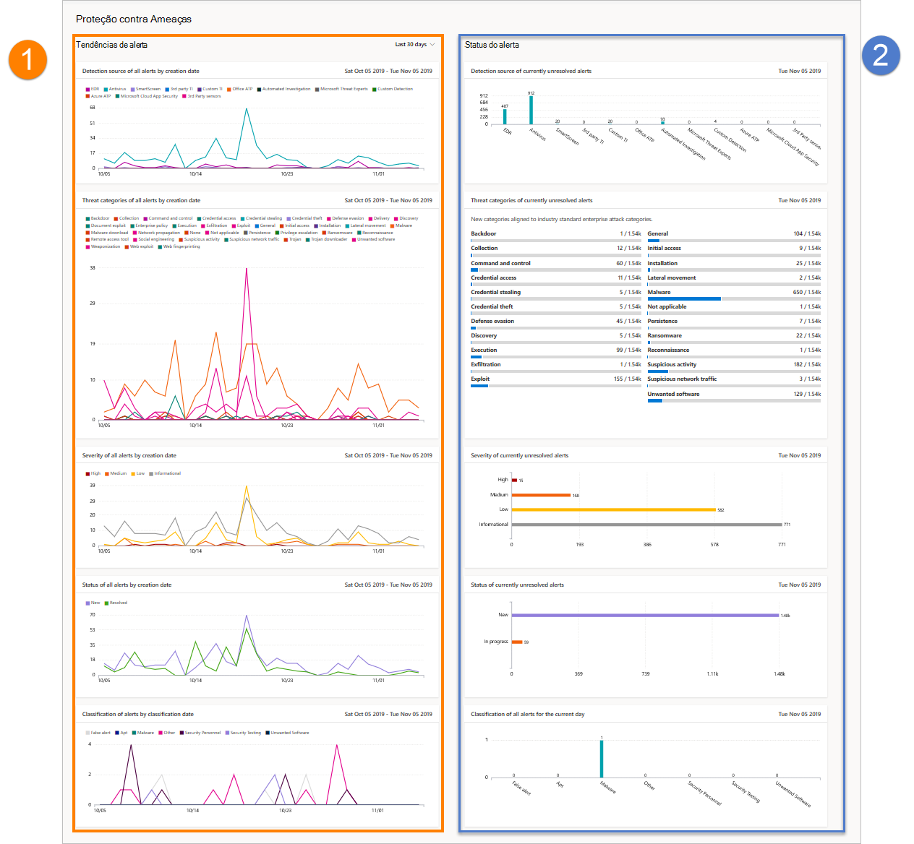

# Relatório de proteção contra ameaças no Microsoft Defender para Ponto de ExtremidadeThreat protection report in Microsoft Defender for Endpoint

[!INCLUDE [Microsoft 365 Defender rebranding](../../includes/microsoft-defender.md)]

**Aplica-se a:****Applies to:**
- [Microsoft Defender para Ponto de ExtremidadeMicrosoft Defender for Endpoint](https://go.microsoft.com/fwlink/p/?linkid=2146631)
- [Microsoft 365 DefenderMicrosoft 365 Defender](https://go.microsoft.com/fwlink/?linkid=2118804)

> Deseja experimentar o Defender para Ponto de Extremidade?Want to experience Defender for Endpoint? [Inscreva-se para uma avaliação gratuita.Sign up for a free trial.](https://www.microsoft.com/microsoft-365/windows/microsoft-defender-atp?ocid=docs-wdatp-pullalerts-abovefoldlink) 

O relatório de proteção contra ameaças fornece informações de alto nível sobre alertas gerados em sua organização.The threat protection report provides high-level information about alerts generated in your organization. O relatório inclui informações de tendência que mostram as fontes de detecção, categorias, gravidades, status, classificações e determinações de alertas ao longo do tempo.The report includes trending information showing the detection sources, categories, severities, statuses, classifications, and determinations of alerts across time.

O painel é estruturado em duas seções:The dashboard is structured into two sections:

SeçãoSection | DescriçãoDescription 
:---|:---
11 | Tendências de alertasAlerts trends
22 | Resumo do alertaAlert summary

## Tendências de alertaAlert trends
Por padrão, as tendências de alerta exibem informações de alerta do período de 30 dias que termina no último dia completo.By default, the alert trends display alert information from the 30-day period ending in the latest full day. Para obter uma perspectiva melhor sobre as tendências que ocorrem em sua organização, você pode ajustar o período de relatório ajustando o período de tempo mostrado.To gain better perspective on trends occurring in your organization, you can fine-tune the reporting period by adjusting the time period shown. Para ajustar o período de tempo, selecione um intervalo de tempo nas opções listadas:To adjust the time period, select a time range from the drop-down options:

- 30 dias30 days
- 3 meses3 months
- 6 meses6 months
- PersonalizadoCustom

>[!NOTE]
>Esses filtros só são aplicados na seção tendências de alerta.These filters are only applied on the alert trends section. Ele não afeta a seção resumo do alerta.It doesn't affect the alert summary section.

## Resumo do alertaAlert summary
Embora as tendências de alerta mostrem informações de alerta tendência, o resumo de alerta mostra informações de alerta com escopo para o dia atual.While the alert trends shows trending alert information, the alert summary shows alert information scoped to the current day.

 O resumo do alerta permite que você faça uma pesquisa em uma fila de alertas específica com o filtro correspondente aplicado a ela.The alert summary allows you to drill down to a particular alert queue with the corresponding filter applied to it. Por exemplo, clicar na barra EDR no cartão Detecção de fontes trará a fila de alertas com resultados mostrando apenas alertas gerados a partir de detecções de EDR.For example, clicking on the EDR bar in the Detection sources card will bring you the alerts queue with results showing only alerts generated from EDR detections. 

>[!NOTE]
>Os dados refletidos na seção resumo são escopos para 180 dias antes da data atual.The data reflected in the summary section is scoped to 180 days prior to the current date. Por exemplo, se a data de hoje for 5 de novembro de 2019, os dados da seção de resumo refletirão números que começam de 5 de maio de 2019 a 5 de novembro de 2019.For example if today's date is November 5, 2019, the data on the summary section will reflect numbers starting from May 5, 2019 to November 5, 2019. 
> O filtro aplicado na seção tendências não é aplicado na seção resumo.The filter applied on the trends section is not applied on the summary section. 

## Atributos de alertaAlert attributes
O relatório é feito de cartões que exibem os seguintes atributos de alerta:The report is made up of cards that display the following alert attributes:

- **Fontes de detecção**: mostra informações sobre os sensores e tecnologias de detecção que fornecem os dados usados pelo Microsoft Defender para Endpoint para disparar alertas.**Detection sources**: shows information about the sensors and detection technologies that provide the data used by Microsoft Defender for Endpoint to trigger alerts.

- **Categorias de** ameaça : mostra os tipos de atividade de ameaça ou ataque que dispararam alertas, indicando possíveis áreas de foco para suas operações de segurança.**Threat categories**: shows the types of threat or attack activity that triggered alerts, indicating possible focus areas for your security operations.

- **Severidade**: mostra o nível de gravidade dos alertas, indicando o impacto potencial coletivo das ameaças à sua organização e o nível de resposta necessário para lidar com eles.**Severity**: shows the severity level of alerts, indicating the collective potential impact of threats to your organization and the level of response needed to address them.

- **Status**: mostra o status de resolução dos alertas, indicando a eficiência de suas respostas de alerta manual e de correção automatizada (se habilitada).**Status**: shows the resolution status of alerts, indicating the efficiency of your manual alert responses and of automated remediation (if enabled). 

- **Classificação &** determinação : mostra como você classificou alertas após a resolução, se você os classificou como ameaças reais (alertas verdadeiros) ou como detecções incorretas (alertas falsos).**Classification & determination**: shows how you have classified alerts upon resolution, whether you have classified them as actual threats (true alerts) or as incorrect detections (false alerts). Esses cartões também mostram a determinação de alertas resolvidos, fornecendo informações adicionais, como os tipos de ameaças reais encontradas ou as atividades legítimas detectadas incorretamente.These cards also show the determination of resolved alerts, providing additional insight like the types of actual threats found or the legitimate activities that were incorrectly detected.

 

## Filtrar dadosFilter data

Use os filtros fornecidos para incluir ou excluir alertas com determinados atributos.Use the provided filters to include or exclude alerts with certain attributes.

>[!NOTE]
>Esses filtros se aplicam **a** todos os cartões do relatório.These filters apply to **all** the cards in the report.

Por exemplo, para mostrar dados somente sobre alertas de alta gravidade:For example, to show data about high-severity alerts only:

1. Em **Filtros > Severidade,** selecione **Alta**Under **Filters > Severity**, select **High**
2. Certifique-se de que todas as outras opções **em Gravidade** sejam deselegidas.Ensure that all other options under **Severity** are deselected.
3. Selecione **Aplicar**.Select **Apply**. 

## Tópicos relacionadosRelated topic
- [Relatório de conformidade e saúde do dispositivoDevice health and compliance report](machine-reports.md)
