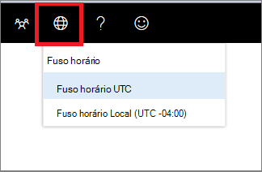

# Configurações do fuso horário do Centro de Segurança do Microsoft Defender

[!INCLUDE [Microsoft 365 Defender rebranding](../../includes/microsoft-defender.md)]

**Aplica-se a:**
- [Microsoft Defender para Ponto de Extremidade](https://go.microsoft.com/fwlink/p/?linkid=2154037)

>Deseja experimentar o Microsoft Defender para Ponto de Extremidade? [Inscreva-se para uma avaliação gratuita.](https://www.microsoft.com/microsoft-365/windows/microsoft-defender-atp?ocid=docs-wdatp-settings-abovefoldlink)

Use o **ícone de configurações** de fuso horário do menu fuso horário1 para configurar o fuso  licença.

## Configurações de fuso horário
O aspecto do tempo é importante na avaliação e análise de ataques cibernéticos percebidos e reais.

As investigações cibernéticas geralmente dependem de carimbos de data/hora para reunir a sequência de eventos. É importante que o sistema reflita as configurações corretas do fuso horário.

O Microsoft Defender para Ponto de Extremidade pode exibir UTC (Tempo Universal Coordenado) ou hora local.

A configuração atual do fuso horário é mostrada no menu Microsoft Defender para Ponto de Extremidade. Você pode alterar o fuso horário exibido no menu **Fuso Horário.**

.

### Fuso horário UTC
O Microsoft Defender para Ponto de Extremidade usa o tempo UTC por padrão.

Definir o fuso horário do Microsoft Defender para Ponto de Extremidade como UTC exibirá todos os data/hora do sistema (alertas, eventos e outros) em UTC para todos os usuários. Isso pode ajudar os analistas de segurança que trabalham em locais diferentes em todo o mundo a usar os mesmos carimbos de data/hora durante a investigação de eventos.

### Fuso horário local
Você pode optar por fazer com que o Microsoft Defender para Ponto de Extremidade use as configurações de fuso horário local. Todos os alertas e eventos serão exibidos usando o fuso horário local.

O fuso horário local é retirado das configurações regionais do dispositivo. Se você alterar suas configurações regionais, o fuso horário do Microsoft Defender para Ponto de Extremidade também mudará. Escolher essa configuração significa que os dados de data/hora exibidos no Microsoft Defender para Ponto de Extremidade serão alinhados à hora local para todos os usuários do Microsoft Defender para o Ponto de Extremidade. Os analistas localizados em locais globais diferentes agora verão os alertas do Microsoft Defender para Ponto de Extremidade de acordo com suas configurações regionais.

Escolher usar o horário local pode ser útil se os analistas estão localizados em um único local. Nesse caso, pode ser mais fácil correlacionar eventos com a hora local, por exemplo, quando um usuário local clicou em um link de email suspeito.

### Definir o fuso horário
O fuso horário do Microsoft Defender para Ponto de Extremidade é definido por padrão como UTC.
A configuração do fuso horário também altera os horários de todos os exibições do Microsoft Defender para Pontos de Extremidade.
Para definir o fuso horário:

1. Clique no **ícone de configurações** de fuso horário do menu Fuso  .
2. Selecione o **indicador UTC de zona de** tempo.
3. Selecione **UTC de fuso** horário ou seu fuso horário local, por exemplo -7:00.

### Configurações regionais
Para aplicar diferentes formatos de data para o Microsoft Defender para o Ponto de Extremidade, use configurações regionais para o Internet Explorer (IE) e o Microsoft Edge (Edge). Se você estiver usando outro navegador, como o Google Chrome, siga as etapas necessárias para alterar as configurações de data e hora desse navegador. 

**Internet Explorer (IE) e Microsoft Edge**

O IE e o Microsoft Edge usam **as** configurações Região configuradas na opção **Relógios,** Idioma e Região no painel controle. 

#### Problemas conhecidos com formatos regionais

**Formatos de data e hora** 
Há alguns problemas conhecidos com os formatos de data e hora. Se você configurar suas configurações regionais para algo diferente dos formatos com suporte, o portal pode não refletir corretamente suas configurações.

Os seguintes formatos de data e hora são suportados:
- Formato de data MM/dd/yyyy
- Formato de data dd/MM/yyyy
- Formato de hora hh:mm:ss (formato de 12 horas)

No momento, não há suporte para os seguintes formatos de data e hora:
- Formato de data yyyy-MM-dd
- Formato de data dd-MMM-yy
- Formato de data dd/MM/yy
- Formato de data MM/dd/yy
- Formato de data com yy. Mostrará somente yyyy.
- Formato de hora HH:mm:ss (formato de 24 horas)

**Símbolo decimal usado em números** 
O símbolo decimal usado é sempre um ponto, mesmo que uma vírgula seja selecionada nas configurações de formato **Números** nas configurações **da** região. Por exemplo, 15,5K é exibido como 15,5K.

