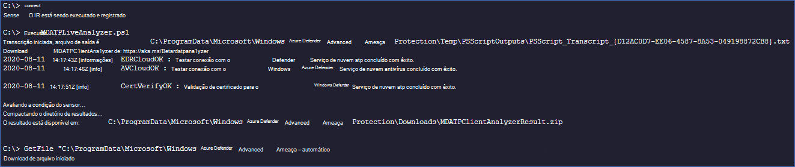

# <a name="collect-support-logs-in-microsoft-defender-for-endpoint-using-live-response"></a>Coletar logs de suporte no Microsoft Defender para Ponto de Extremidade usando a resposta ao vivo 


**Aplica-se a:**
- [Microsoft Defender para Ponto de Extremidade](https://go.microsoft.com/fwlink/p/?linkid=2146631)
- [Microsoft 365 Defender](https://go.microsoft.com/fwlink/?linkid=2118804)

> Deseja experimentar o Defender para Ponto de Extremidade? [Inscreva-se para uma avaliação gratuita.](https://www.microsoft.com/microsoft-365/windows/microsoft-defender-atp?ocid=docs-wdatp-pullalerts-abovefoldlink) 


Ao contatar o suporte, você pode ser solicitado a fornecer o pacote de saída da ferramenta Analisador de Cliente do Microsoft Defender para Ponto de Extremidade.

Este tópico fornece instruções sobre como executar a ferramenta por meio do Live Response.

1. Baixar o script apropriado
    * O Microsoft Defender for Endpoint client logs only: [LiveAnalyzer.ps1 script](https://aka.ms/MDELiveAnalyzer).
      - Tamanho aproximado do pacote de resultados: ~100Kb 
    *  Sensor de cliente do Microsoft Defender para Ponto de Extremidade e logs antivírus: [LiveAnalyzer+MDAV.ps1 script](https://aka.ms/MDELiveAnalyzerAV).
       - Tamanho aproximado do pacote de resultados: ~10 Mb 
 
2.  Inicie uma [sessão de Resposta Ao](live-response.md#initiate-a-live-response-session-on-a-device) Vivo no computador que você precisa investigar.

3.  Selecione **Carregar arquivo na biblioteca**.

    

4. Selecione **Escolher arquivo**.

    

5. Selecione o arquivo baixado chamado MDELiveAnalyzer.ps1 e clique em **Confirmar**


   


6. Enquanto ainda estiver na sessão LiveResponse, use os comandos abaixo para executar o analisador e coletar o arquivo de resultados:

    ```console
    Run MDELiveAnalyzer.ps1
    GetFile "C:\ProgramData\Microsoft\Windows Defender Advanced Threat Protection\Downloads\MDEClientAnalyzerResult.zip" -auto
    ```

    


>[!NOTE]
> - A versão de visualização mais recente do MDEClientAnalyzer pode ser baixada aqui: [https://aka.ms/Betamdeanalyzer](https://aka.ms/Betamdeanalyzer) .
> 
> - O script LiveAnalyzer baixa o pacote de solução de problemas no computador de destino de: https://mdatpclientanalyzer.blob.core.windows.net .
> 
>   Se você não puder permitir que o computador alcance a URL acima, carregue MDEClientAnalyzerPreview.zip arquivo na biblioteca antes de executar o script LiveAnalyzer:
>
>   ```console
>   PutFile MDEClientAnalyzerPreview.zip -overwrite
>   Run MDELiveAnalyzer.ps1
>   GetFile "C:\ProgramData\Microsoft\Windows Defender Advanced Threat Protection\Downloads\MDEClientAnalyzerResult.zip" -auto
>   ```
> 
> - Para obter mais informações sobre como coletar dados localmente em um computador caso o computador não se comunique com o Microsoft Defender para serviços de nuvem do Ponto de Extremidade ou não apareça no portal do Microsoft Defender para Ponto de Extremidade, conforme esperado, consulte [Verify client connectivity to Microsoft Defender for Endpoint service URLs](configure-proxy-internet.md#verify-client-connectivity-to-microsoft-defender-atp-service-urls).
