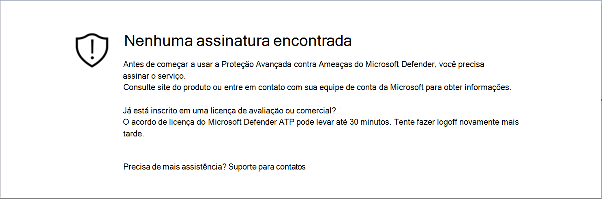
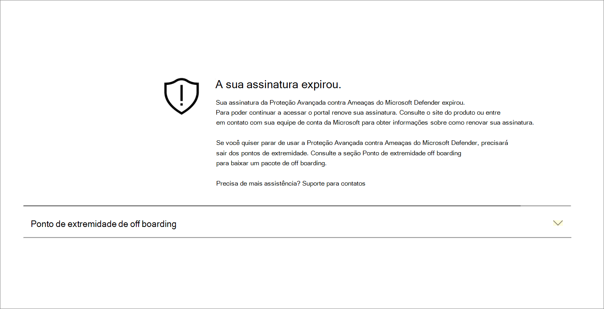
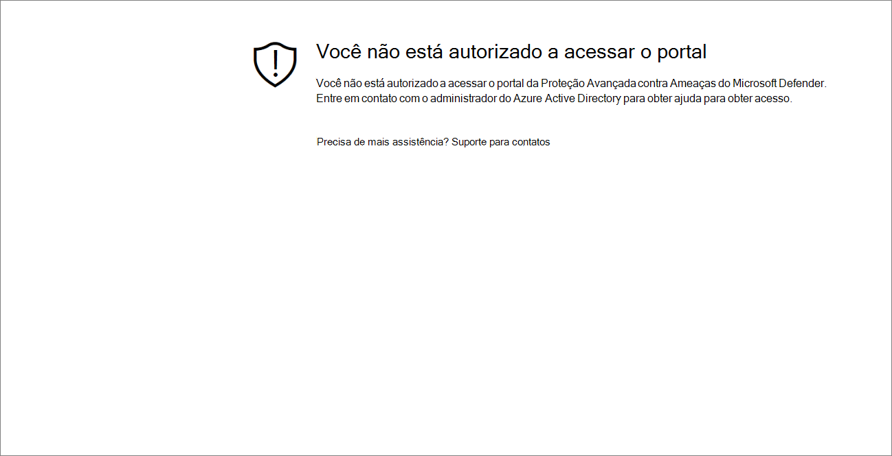
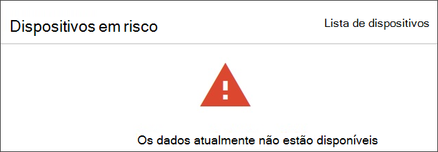

# Solucionar problemas de assinatura e de acesso ao portal

[!INCLUDE [Microsoft 365 Defender rebranding](../../includes/microsoft-defender.md)]

**Aplica-se a:**
- [Microsoft Defender para Ponto de Extremidade](https://go.microsoft.com/fwlink/p/?linkid=2154037)
- [Microsoft 365 Defender](https://go.microsoft.com/fwlink/?linkid=2118804)

>Deseja experimentar o Microsoft Defender para Ponto de Extremidade? [Inscreva-se para uma avaliação gratuita.](https://www.microsoft.com/microsoft-365/windows/microsoft-defender-atp?ocid=docs-wdatp-troublshootonboarding-abovefoldlink)

Esta página fornece etapas detalhadas para solucionar problemas que podem ocorrer ao configurar o serviço do Microsoft Defender para Ponto de Extremidade.

Se você receber uma mensagem de erro, Central de Segurança do Microsoft Defender fornecerá uma explicação detalhada sobre o problema e links relevantes serão fornecidos.

## Nenhuma assinatura encontrada

Se ao acessar Central de Segurança do Microsoft Defender você receber uma mensagem Sem **assinaturas encontradas,** isso significa que o Azure Active Directory (Azure AD) usado para fazer logoff no usuário no portal, não tem uma licença do Microsoft Defender para Ponto de Extremidade.

Motivos potenciais:
- As licenças do Windows E5 e do Office E5 são licenças separadas.
- A licença foi comprada, mas não provisionada para esta instância do Azure AD.
    - Pode ser um problema de provisionamento de licença.
    - Pode ser que você provisionou inadvertidamente a licença para uma Microsoft Azure AD diferente da usada para autenticação no serviço.

Para ambos os casos, você deve entrar em contato com o suporte da Microsoft no [Suporte geral do Microsoft Defender para Endpoint ou](https://support.microsoft.com/getsupport?wf=0&tenant=ClassicCommercial&oaspworkflow=start_1.0.0.0&locale=en-us&supportregion=en-us&pesid=16055&ccsid=636419533611396913) suporte a licença de [volume.](https://www.microsoft.com/licensing/servicecenter/Help/Contact.aspx)

## Sua assinatura expirou

Se ao acessar Central de Segurança do Microsoft Defender você receber **uma** mensagem Sua assinatura expirou, sua assinatura de serviço online expirou. A assinatura do Microsoft Defender para Ponto de Extremidade, como qualquer outra assinatura de serviço online, tem uma data de expiração. 

Você pode optar por renovar ou estender a licença a qualquer momento. Ao acessar o portal após **a** data de expiração, uma mensagem sua assinatura expirada será apresentada com uma opção para baixar o pacote de descarregamento do dispositivo, caso você opte por não renovar a licença.

> [!NOTE]
> Por motivos de segurança, o pacote usado para dispositivos offboard expirará 30 dias após a data em que foi baixado. Os pacotes de offboard expirados enviados para um dispositivo serão rejeitados. Ao baixar um pacote de offboard, você será notificado sobre a data de expiração dos pacotes e ele também será incluído no nome do pacote.

## Você não está autorizado a acessar o portal

Se você receber um Você não está autorizado a acessar o **portal**, esteja ciente de que o Microsoft Defender for Endpoint é um produto de monitoramento de segurança, investigação e resposta de incidentes e, como tal, o acesso a ele é restrito e controlado pelo usuário.
Para obter mais informações, consulte Assign [**user access to the portal**](/windows/threat-protection/windows-defender-atp/assign-portal-access-windows-defender-advanced-threat-protection).

## Os dados atualmente não estão disponíveis em algumas seções do portal
Se o painel do portal e outras seções mostrarem uma mensagem de erro como "Os dados no momento não estão disponíveis":

Você precisará permitir e todos os `securitycenter.windows.com` subdomas abaixo dele. Por exemplo, `*.securitycenter.windows.com`.

## Problemas de comunicação do portal
Se você encontrar problemas ao acessar o portal, dados ausentes ou acesso restrito a partes do portal, você precisará verificar se as URLs a seguir são permitidas e abertas para comunicação.

- `*.blob.core.windows.net`
- `crl.microsoft.com`
- `https://*.microsoftonline-p.com`
- `https://*.securitycenter.windows.com` 
- `https://automatediracs-eus-prd.securitycenter.windows.com`
- `https://login.microsoftonline.com`
- `https://login.windows.net`
- `https://onboardingpackagescusprd.blob.core.windows.net`
- `https://secure.aadcdn.microsoftonline-p.com` 
- `https://securitycenter.windows.com` 
- `https://static2.sharepointonline.com` 

