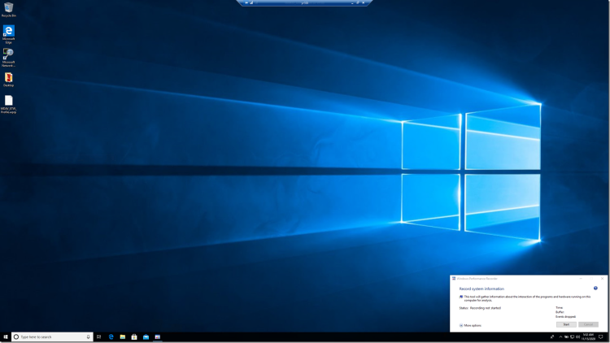

# <a name="troubleshoot-performance-issues-related-to-real-time-protection"></a>Solucionar problemas de desempenho relacionados à proteção em tempo real


[!INCLUDE [Microsoft 365 Defender rebranding](../../includes/microsoft-defender.md)]


**Aplica-se a:**

- [Microsoft Defender para Ponto de Extremidade](https://go.microsoft.com/fwlink/p/?linkid=2146631)
 
Se o seu sistema estiver tendo altos problemas de uso ou desempenho da CPU relacionados ao serviço de proteção em tempo real no Microsoft Defender para Ponto de Extremidade, você pode enviar um tíquete para o suporte da Microsoft. Siga as etapas em [Coletar Microsoft Defender Antivírus dados de diagnóstico](collect-diagnostic-data.md).

Como administrador, você também pode solucionar esses problemas por conta própria. 

Primeiro, talvez você queira verificar se o problema está sendo causado por outro software. Leia [Verificar com o fornecedor sobre exclusões de antivírus.](#check-with-vendor-for-antivirus-exclusions)

Caso contrário, você pode identificar qual software está relacionado ao problema de desempenho identificado seguindo as etapas em [Analisar o Log de Proteção da Microsoft.](#analyze-the-microsoft-protection-log) 

Você também pode fornecer logs adicionais para o seu envio para o suporte da Microsoft seguindo as etapas em:
- [Capturar logs de processo usando o Monitor de Processo](#capture-process-logs-using-process-monitor)
- [Capturar logs de desempenho usando Windows Gravador de Desempenho](#capture-performance-logs-using-windows-performance-recorder) 

## <a name="check-with-vendor-for-antivirus-exclusions"></a>Verificar com o fornecedor sobre exclusões de antivírus

Se você puder identificar prontamente o software que afeta o desempenho do sistema, vá para a base de dados de conhecimento ou centro de suporte do fornecedor de software. Pesquise se eles têm recomendações sobre exclusões de antivírus. Se o site do fornecedor não os tiver, você poderá abrir um tíquete de suporte com eles e pedir que eles publiquem um. 

Recomendamos que os fornecedores de software sigam as várias diretrizes em Parceria com o setor para [minimizar falsos positivos.](https://www.microsoft.com/security/blog/2018/08/16/partnering-with-the-industry-to-minimize-false-positives/) O fornecedor pode enviar seu software por meio do portal de Inteligência de Segurança [do Microsoft Defender (MDSI).](https://www.microsoft.com/wdsi/filesubmission?persona=SoftwareDeveloper)


## <a name="analyze-the-microsoft-protection-log"></a>Analisar o Log de Proteção da Microsoft

Em **MPLog-xxxxxxxx-xxxxxx.log,** você pode encontrar as informações de impacto de desempenho estimadas do software em execução *como EstimatedImpact*:
    
`Per-process counts:ProcessImageName: smsswd.exe, TotalTime: 6597, Count: 1406, MaxTime: 609, MaxTimeFile: \Device\HarddiskVolume3\_SMSTaskSequence\Packages\WQ1008E9\Files\FramePkg.exe, EstimatedImpact: 65%`

| Nome do campo | Descrição |
|---|---|
|ProcessImageName | Processar nome da imagem |
| TotalTime | A duração cumulativa em milissegundos gastos em verificações de arquivos acessados por esse processo |
|Contagem | O número de arquivos verificados acessados por esse processo |
|MaxTime |  A duração em milissegundos na verificação única mais longa de um arquivo acessado por esse processo |
| MaxTimeFile | O caminho do arquivo acessado por esse processo para o qual a verificação mais longa de duração `MaxTime` foi registrada |
| EstimatedImpact | A porcentagem de tempo gasto em verificações de arquivos acessados por esse processo fora do período em que esse processo experimentou a atividade de verificação |

Se o impacto no desempenho for alto, tente adicionar o processo às exclusões de Caminho/Processo seguindo as etapas em Configurar e validar exclusões para Microsoft Defender Antivírus [verificações](collect-diagnostic-data.md).

Se a etapa anterior não resolver o problema, você poderá coletar mais informações por meio do [Monitor](#capture-process-logs-using-process-monitor) de Processo ou do Windows [De](#capture-performance-logs-using-windows-performance-recorder) desempenho nas seções a seguir.
     
## <a name="capture-process-logs-using-process-monitor"></a>Capturar logs de processo usando o Monitor de Processo

O Monitor de Processos (ProcMon) é uma ferramenta de monitoramento avançada que pode mostrar processos em tempo real. Você pode usar isso para capturar o problema de desempenho enquanto ele está ocorrendo.

1. Baixe [o Monitor de Processo v3.60](/sysinternals/downloads/procmon) para uma pasta como `C:\temp` .

2. Para remover a marca do arquivo da Web:
    1. Clique com o botão **direito doProcessMonitor.zip** e selecione **Propriedades**.
    1. Na guia *Geral,* procure *Segurança*.
    1. Marque a caixa ao lado **de Desbloquear**.
    1. Selecione **Aplicar**.
    
     

3. Descomplem o arquivo `C:\temp` para que o caminho da pasta seja `C:\temp\ProcessMonitor` . 

4. Copie **ProcMon.exe** para o cliente Windows ou Windows servidor que você está solucionando.  

5. Antes de executar ProcMon, certifique-se de que todos os outros aplicativos não relacionados ao alto problema de uso da CPU sejam fechados. Isso minimizará o número de processos a verificar.

6. Você pode iniciar ProcMon de duas maneiras.
    1. Clique com o **ProcMon.exe** e selecione **Executar como administrador**. 
    

        Como o registro em log é iniciado automaticamente, selecione o ícone de lupa para interromper a captura atual ou usar o atalho de teclado **Ctrl+E**.
 
        

        Para verificar se você interrompeu a captura, verifique se o ícone da lupa agora aparece com um X vermelho.

                 

        Em seguida, para limpar a captura anterior, selecione o ícone borracha.

        

        Ou use o atalho do teclado **Ctrl+X**.

    2. A segunda maneira é executar a linha **de comando** como administrador e, em seguida, a partir do caminho do Monitor de Processo, execute:

        
 
        ```console
        Procmon.exe /AcceptEula /Noconnect /Profiling
        ```
        
        >[!TIP] 
        >Faça com que a janela ProcMon seja o menor possível ao capturar dados para que você possa iniciar e interromper facilmente o rastreamento.
        > 
        >
    
7. Depois de seguir um dos procedimentos na etapa 6, você verá em seguida uma opção para definir filtros. Selecione **OK**. Você sempre pode filtrar os resultados depois que a captura for concluída.
 
     

8. Para iniciar a captura, selecione o ícone de lupa novamente.
     
9. Reproduza o problema.
 
    >[!TIP] 
    >Aguarde até que o problema seja totalmente reproduzido e, em seguida, anote o data/hora quando o rastreamento foi iniciado.

10. Depois de ter de dois a quatro minutos de atividade de processo durante a condição de alto uso da CPU, pare a captura selecionando o ícone de lupa.

11. Para salvar a captura com um nome exclusivo e com o formato .pml, selecione **Arquivo** e selecione **Salvar...**. Certifique-se de selecionar os botões de opção **Todos os eventos** e Formato de Monitor de Processo Nativo **(PML).**

    

12. Para melhor controle, altere o caminho padrão `C:\temp\ProcessMonitor\LogFile.PML` de para `C:\temp\ProcessMonitor\%ComputerName%_LogFile_MMDDYEAR_Repro_of_issue.PML` onde:
    - `%ComputerName%` é o nome do dispositivo
    - `MMDDYEAR` é o mês, dia e ano
    -  `Repro_of_issue` é o nome do problema que você está tentando reproduzir

    >[!TIP] 
    > Se você tiver um sistema de trabalho, talvez queira obter um log de exemplo para comparar.

13. Feche o arquivo .pml e envie-o para o suporte da Microsoft.


## <a name="capture-performance-logs-using-windows-performance-recorder"></a>Capturar logs de desempenho usando Windows Gravador de Desempenho

Você pode usar Windows WPR (Gravador de Desempenho) para incluir informações adicionais no envio ao suporte da Microsoft. WPR é uma ferramenta de gravação poderosa que cria Rastreamento de Eventos para Windows gravações. 

WPR faz parte do Windows Kit de Avaliação e Implantação (Windows ADK) e pode ser baixado do Download e instalar o [Windows ADK](/windows-hardware/get-started/adk-install). Você também pode baixá-lo como parte do Windows 10 Software Development Kit [em Windows 10 SDK](https://developer.microsoft.com/windows/downloads/windows-10-sdk/).

Você pode usar a interface do usuário WPR seguindo as etapas em Capturar logs de desempenho usando a interface do usuário [WPR](#capture-performance-logs-using-the-wpr-ui). 

Como alternativa, você também pode usar a ferramenta de linha de comando *wpr.exe*, que está disponível no Windows 8 e versões posteriores seguindo as etapas em Capturar logs de desempenho usando a [CLI WPR](#capture-performance-logs-using-the-wpr-cli).


### <a name="capture-performance-logs-using-the-wpr-ui"></a>Capturar logs de desempenho usando a interface do usuário WPR

>[!TIP]
>Se você tiver vários dispositivos em que o problema está ocorrendo, use o que tem a maior quantidade de RAM.

1. Baixe e instale o WPR.

2. Em *Windows Kits,* clique com o botão direito do **mouse Windows Performance Recorder**. 

    

    Selecione **Mais**. Selecione **Executar como administrador**.

3. Quando a caixa de diálogo Controle de Conta de Usuário for exibida, selecione **Sim**.

    

4. Em seguida, baixe o perfil de análise do [Microsoft Defender para Ponto](https://github.com/YongRhee-MDE/Scripts/blob/master/MDAV.wprp) de Extremidade e salve uma pasta como `MDAV.wprp` `C:\temp` . 
     
5. Na caixa de diálogo WPR, selecione **Mais opções**.

    

6. Selecione **Adicionar Perfis...** e navegue até o caminho do `MDAV.wprp` arquivo.

7. Depois disso, você deverá ver um novo conjunto de perfis em *Medidas personalizadas* chamadas *Microsoft Defender para Análise* do Ponto de Extremidade abaixo dele.

    

    >[!WARNING]
    >Se o Windows Server tiver 64 GB de RAM ou mais, use a medida personalizada `Microsoft Defender for Endpoint analysis for large servers` em vez de `Microsoft Defender for Endpoint analysis` . Caso contrário, seu sistema poderia consumir uma grande quantidade de memória de pool não páginada ou buffers que podem levar à instabilidade do sistema. Você pode escolher quais perfis adicionar expandindo **a Análise de Recursos**. Esse perfil personalizado fornece o contexto necessário para análise detalhada de desempenho.
 
8. Para usar o perfil de análise detalhado da medida personalizada do Microsoft Defender for Endpoint na interface do usuário WPR:

    1. Verifique se nenhum perfil está selecionado nos grupos *Triagem* de primeiro nível, Análise *de Recursos* e Análise *de Cenário.*
    2. Selecione **Medidas personalizadas**.
    3. Selecione **Microsoft Defender para análise de ponto de extremidade**.
    4. Selecione **Verbose** em *Nível de* detalhes.
    1. Selecione **Arquivo ou** Memória **no** modo Log. 

    >[!important]
    >Você deve selecionar *Arquivo para* usar o modo de registro em log de arquivos se o problema de desempenho puder ser reproduzido diretamente pelo usuário. A maioria dos problemas se enquadra nessa categoria. No entanto, se o usuário não puder reproduzir diretamente o problema, mas puder notá-lo facilmente depois que o problema ocorrer, o usuário deverá selecionar *Memória* para usar o modo de registro em log de memória. Isso garante que o log de rastreamento não seja inflado excessivamente devido ao tempo de longo prazo.

9. Agora você está pronto para coletar dados. Saia de todos os aplicativos que não são relevantes para reproduzir o problema de desempenho. Você pode selecionar **Ocultar opções** para manter o espaço ocupado pela janela WPR pequena.

    

    >[!TIP]
    >Tente iniciar o rastreamento em segundos inteiros. Por exemplo, 01:30:00. Isso facilitará a análise dos dados. Tente também manter o controle do data/hora exato de quando o problema é reproduzido.

10. Selecione **Iniciar**.

    

11. Reproduza o problema.

    >[!TIP]
    >Mantenha a coleção de dados em até cinco minutos. Dois a três minutos é um bom intervalo, pois muitos dados estão sendo coletados.

12. Selecione **Salvar**.

    

13. Preencha **Digite uma descrição detalhada do problema:** com informações sobre o problema e como você reproduziu o problema.

    

    1. Selecione **Nome do Arquivo:** para determinar onde o arquivo de rastreamento será salvo. Por padrão, ele 1.is salvo em `%user%\Documents\WPR Files\` .
    1. Selecione **Salvar**.

14. Aguarde enquanto o rastreamento está sendo mesclado.

    

15. Depois que o rastreamento for salvo, selecione **Abrir pasta**.

    

    Inclua o arquivo e a pasta no seu envio para o suporte da Microsoft.

    

### <a name="capture-performance-logs-using-the-wpr-cli"></a>Capturar logs de desempenho usando a CLI WPR

A ferramenta de linha *de comandowpr.exe* faz parte do sistema operacional a partir do Windows 8. Para coletar um rastreamento WPR usando a ferramenta de linha de comando wpr.exe:

1. Baixe o perfil de análise **[do Microsoft Defender para Ponto](https://github.com/YongRhee-MDE/Scripts/blob/master/MDAV.wprp)** de Extremidade para rastreamentos de desempenho para um arquivo nomeado em um diretório local como `MDAV.wprp` `C:\traces` .

3. Clique com o botão direito do mouse no **ícone menu** Iniciar e selecione **Windows PowerShell (Administrador)** ou Prompt de **Comando (Administrador)** para abrir uma janela de prompt de comando de administrador.

4. Quando a caixa de diálogo Controle de Conta de Usuário for exibida, selecione **Sim**.

5. No prompt elevado, execute o seguinte comando para iniciar um rastreamento de desempenho do Microsoft Defender para Ponto de Extremidade:

    ```console
    wpr.exe -start C:\traces\MDAV.wprp!WD.Verbose -filemode
    ```
    
    >[!WARNING]
    >Se seu Windows Server tiver 64 GB ou RAM ou mais, use perfis e, em vez de `WDForLargeServers.Light` `WDForLargeServers.Verbose` perfis `WD.Light` e , `WD.Verbose` respectivamente. Caso contrário, seu sistema poderia consumir uma grande quantidade de memória de pool não páginada ou buffers que podem levar à instabilidade do sistema.

6. Reproduza o problema.

    >[!TIP]
    >Mantenha a coleção de dados não para mais de cinco minutos.  Dependendo do cenário, dois a três minutos é um bom intervalo, pois muitos dados estão sendo coletados.

7. No prompt elevado, execute o seguinte comando para interromper o rastreamento de desempenho, fornecendo informações sobre o problema e como você reproduziu o problema:

    ```console
    wpr.exe -stop merged.etl "Timestamp when the issue was reproduced, in HH:MM:SS format" "Description of the issue" "Any error that popped up"
    ```

8. Aguarde até que o rastreamento seja mesclado. 

9. Inclua o arquivo e a pasta no seu envio para o suporte da Microsoft.

## <a name="see-also"></a>Confira também

- [Coletar Microsoft Defender Antivírus dados de diagnóstico](collect-diagnostic-data.md)
- [Configurar e validar exclusões para Microsoft Defender Antivírus verificações](configure-exclusions-microsoft-defender-antivirus.md)
