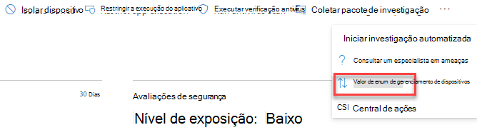
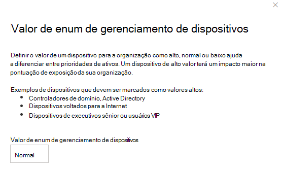

# Atribuir valor de dispositivo - gerenciamento de ameaças e vulnerabilidades

[!INCLUDE [Microsoft 365 Defender rebranding](../../includes/microsoft-defender.md)]

**Aplica-se a:**

- [Microsoft Defender para Ponto de Extremidade](https://go.microsoft.com/fwlink/?linkid=2154037)
- [Gerenciamento de ameaças e vulnerabilidades](next-gen-threat-and-vuln-mgt.md)
- [Microsoft 365 Defender](https://go.microsoft.com/fwlink/?linkid=2118804)

> Deseja experimentar o Microsoft Defender para Ponto de Extremidade? [Inscreva-se para uma avaliação gratuita.](https://www.microsoft.com/microsoft-365/windows/microsoft-defender-atp?ocid=docs-wdatp-portaloverview-abovefoldlink)

[!include[Prerelease information](../../includes/prerelease.md)]

Definir o valor de um dispositivo ajuda você a diferenciar entre prioridades de ativos. O valor do dispositivo é usado para incorporar o desejo de risco de um ativo individual ao cálculo de pontuação de exposição de gerenciamento de ameaças e vulnerabilidades. Os dispositivos atribuídos como "alto valor" receberão mais peso.

Você também pode usar a [API de valor de dispositivo definido.](set-device-value.md)

Opções de valor do dispositivo:

- Baixo
- Normal (padrão)
- Alto

Exemplos de dispositivos que devem ser atribuídos a um valor alto:

- Controladores de domínio, Active Directory
- Dispositivos voltados para a Internet
- Dispositivos VIP
- Dispositivos que hospedam serviços de produção internos/externos

## Escolher o valor do dispositivo

1. Navegue até qualquer página de dispositivo, o local mais fácil é a partir do inventário de dispositivos.

2. Selecione **Valor de dispositivo** de três pontos ao lado da barra de ações na parte superior da página.

    

3. Um flyout aparecerá com o valor do dispositivo atual e o que ele significa. Revise o valor do dispositivo e escolha o que melhor se encaixa em seu dispositivo.

## Como o valor do dispositivo afeta sua pontuação de exposição

A pontuação de exposição é uma média ponderada em todos os dispositivos. Se você tiver grupos de dispositivos, também poderá filtrar a pontuação por grupo de dispositivos.

- Dispositivos normais têm um peso de 1
- Dispositivos de baixo valor têm um peso de 0,75
- Dispositivos de alto valor têm um peso de NumberOfAssets / 10.
    - Se você tiver 100 dispositivos, cada dispositivo de alto valor terá um peso de 10 (100/10)

## Tópicos relacionados

- [Visão geral do gerenciamento de ameaças e vulnerabilidades](next-gen-threat-and-vuln-mgt.md)
- [Pontuação de Exposição](tvm-exposure-score.md)
- [APIs](next-gen-threat-and-vuln-mgt.md#apis)