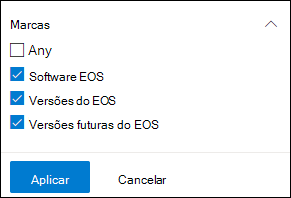
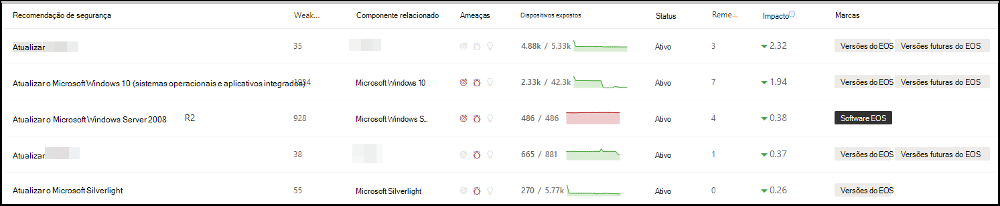
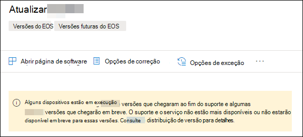
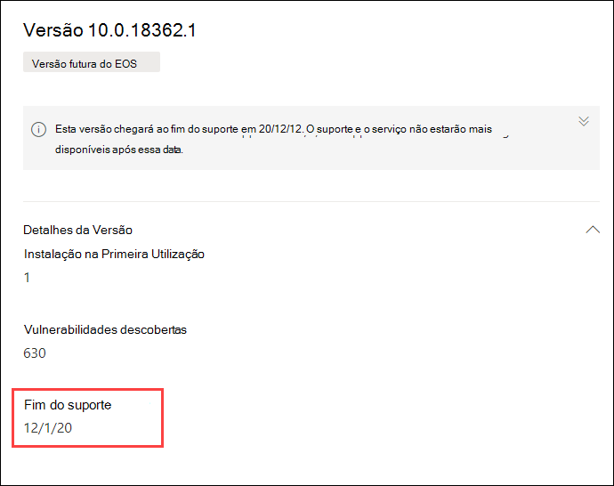

# Planejar versões de software e software de fim de suporte com gerenciamento de ameaças e vulnerabilidadesPlan for end-of-support software and software versions with threat and vulnerability management

[!INCLUDE [Microsoft 365 Defender rebranding](../../includes/microsoft-defender.md)]

**Aplica-se a:****Applies to:**

- [Microsoft Defender para Ponto de ExtremidadeMicrosoft Defender for Endpoint](https://go.microsoft.com/fwlink/?linkid=2154037)
- [Gerenciamento de ameaças e vulnerabilidadesThreat and vulnerability management](next-gen-threat-and-vuln-mgt.md)
- [Microsoft 365 DefenderMicrosoft 365 Defender](https://go.microsoft.com/fwlink/?linkid=2118804)

>Deseja experimentar o Microsoft Defender para Ponto de Extremidade?Want to experience Microsoft Defender for Endpoint? [Inscreva-se para uma avaliação gratuita.Sign up for a free trial.](https://www.microsoft.com/microsoft-365/windows/microsoft-defender-atp?ocid=docs-wdatp-portaloverview-abovefoldlink)

O fim do suporte (EOS), também conhecido como EOL (fim da vida útil), para versões de software ou software significa que eles não serão mais suportados ou atendidos e não receberão atualizações de segurança.End-of-support (EOS), otherwise known as end-of-life (EOL), for software or software versions means that they will no longer be supported or serviced, and will not receive security updates. Quando você usa versões de software ou software com suporte final, você está expondo sua organização a vulnerabilidades de segurança, riscos legais e financeiros.When you use software or software versions with ended support, you're exposing your organization to security vulnerabilities, legal, and financial risks.

É fundamental que os administradores de segurança e DES trabalhem juntos e garantam que o inventário de software da organização seja configurado para obter resultados ideais, conformidade e um ecossistema de rede saudável.It's crucial for Security and IT Administrators to work together and ensure that the organization's software inventory is configured for optimal results, compliance, and a healthy network ecosystem. Eles devem examinar as opções para remover ou substituir aplicativos que chegaram às versões de fim de suporte e atualização que não são mais suportadas.They should examine the options to remove or replace apps that have reached end-of-support and update versions that are no longer supported. É melhor criar e implementar um plano **antes do** final das datas de suporte.It's best to create and implement a plan **before** the end of support dates.

## Encontre versões de software ou software que não são mais suportadasFind software or software versions that are no longer supported

1. No menu gerenciamento de ameaças e vulnerabilidades, navegue até [**Recomendações de segurança.**](tvm-security-recommendation.md)From the threat and vulnerability management menu, navigate to [**Security recommendations**](tvm-security-recommendation.md).
2. Vá para o **painel Filtros** e procure a seção marcas.Go to the **Filters** panel and look for the tags section. Selecione uma ou mais opções de marca EOS.Select one or more of the EOS tag options. Em **seguida, aplique**.Then **Apply**.

    

3. Você verá uma lista de recomendações relacionadas ao software com suporte final, versões de software que são o fim do suporte ou versões com o próximo fim do suporte.You'll see a list of recommendations related to software with ended support, software versions that are end of support, or versions with upcoming end of support. Essas marcas também estão visíveis na [página de inventário de software.](tvm-software-inventory.md)These tags are also visible in the [software inventory](tvm-software-inventory.md) page.

    

## Lista de versões e datasList of versions and dates

Para exibir uma lista de versões que chegaram ao fim do suporte, fim ou suporte em breve, e essas datas, siga as etapas a seguir:To view a list of versions that have reached end of support, or end or support soon, and those dates, follow the below steps:

1. Uma mensagem aparecerá no sobrevoo de recomendação de segurança para software com versões que chegaram ao fim do suporte ou chegarão ao fim do suporte em breve.A message will appear in the security recommendation flyout for software with versions that have reached end of support, or will reach end of support soon.

    

2. Selecione o link **de distribuição** de versão para ir para a página de análise de software.Select the **version distribution** link to go to the software drill-down page. Lá, você pode ver uma lista filtrada de versões com marcas que as identificam como fim do suporte ou o próximo fim do suporte.There, you can see a filtered list of versions with tags identifying them as end of support, or upcoming end of support.

    

3. Selecione uma das versões na tabela a ser aberta.Select one of the versions in the table to open. Por exemplo, versão 10.0.18362.1.For example, version 10.0.18362.1. Um flyout aparecerá com a data de término do suporte.A flyout will appear with the end of support date.

    

Depois de identificar quais versões de software e software são vulneráveis devido ao status de fim de suporte, você deve decidir se as atualizará ou removerá da sua organização.Once you identify which software and software versions are vulnerable due to their end-of-support status, you must decide whether to update or remove them from your organization. Isso reduzirá a exposição de suas organizações a vulnerabilidades e ameaças persistentes avançadas.Doing so will lower your organizations exposure to vulnerabilities and advanced persistent threats.

## Tópicos relacionadosRelated topics

- [Visão geral do gerenciamento de ameaças e vulnerabilidadesThreat and vulnerability management overview](next-gen-threat-and-vuln-mgt.md)
- [Recomendações de segurançaSecurity recommendations](tvm-security-recommendation.md)
- [Inventário de softwareSoftware inventory](tvm-software-inventory.md)
