# Criar e exibir exceções para recomendações de segurança - gerenciamento de ameaças e vulnerabilidades

[!INCLUDE [Microsoft 365 Defender rebranding](../../includes/microsoft-defender.md)]

**Aplica-se a:**

- [Microsoft Defender para Ponto de Extremidade](https://go.microsoft.com/fwlink/?linkid=2154037)
- [Gerenciamento de ameaças e vulnerabilidades](next-gen-threat-and-vuln-mgt.md)
- [Microsoft 365 Defender](https://go.microsoft.com/fwlink/?linkid=2118804)

>Deseja experimentar o Microsoft Defender para Ponto de Extremidade? [Inscreva-se para uma avaliação gratuita.](https://www.microsoft.com/microsoft-365/windows/microsoft-defender-atp?ocid=docs-wdatp-portaloverview-abovefoldlink)

Como alternativa a uma solicitação de correção quando uma recomendação não é relevante no momento, você pode criar exceções para recomendações. Se sua organização tiver grupos de dispositivos, você poderá escopo da exceção para grupos de dispositivos específicos. As exceções podem ser criadas para grupos de dispositivos selecionados ou para todos os grupos de dispositivos passados e presentes.  

Quando uma exceção é criada para uma recomendação, a recomendação não estará ativa até o final da duração da exceção. O estado de recomendação mudará para **Exceção Total** ou **Parcial** (por grupo de dispositivos).

## Permissões

Somente usuários com permissões de "tratamento de exceções" podem gerenciar exceções (incluindo criação ou cancelamento). [Saiba mais sobre funções RBAC](user-roles.md).

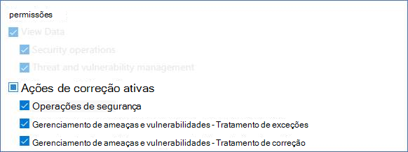

## Criar uma exceção

Selecione uma recomendação de segurança para a que você gostaria de criar uma exceção e selecione **Opções de exceção** e preencha o formulário.  

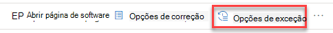

### Exceção por grupo de dispositivos

Aplique a exceção a todos os grupos de dispositivos atuais ou escolha grupos de dispositivos específicos. Os grupos de dispositivos futuros não serão incluídos na exceção. Os grupos de dispositivos que já têm uma exceção não serão exibidos na lista. Se você selecionar apenas determinados grupos de dispositivos, o estado de recomendação mudará de "ativo" para "exceção parcial". O estado será alternado para "exceção completa" se você selecionar todos os grupos de dispositivos.

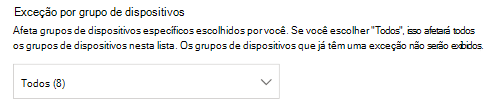

#### Exibições filtradas

Se você tiver filtrado por grupo de dispositivos em qualquer uma das páginas de gerenciamento de ameaças e vulnerabilidades, somente os grupos de dispositivos filtrados aparecerão como opções.

Este é o botão para filtrar por grupo de dispositivos em qualquer uma das páginas de gerenciamento de ameaças e vulnerabilidades: 

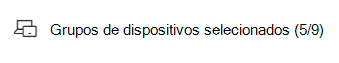

Exibição de exceção com grupos de dispositivos filtrados:

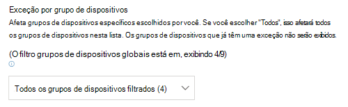

#### Grande número de grupos de dispositivos

Se sua organização tiver mais de 20 grupos de dispositivos, selecione **Editar** ao lado da opção grupo de dispositivos filtrado.

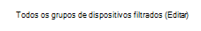

Um flyout aparecerá onde você pode pesquisar e escolher os grupos de dispositivos que deseja incluir. Selecione o ícone de marca de seleção abaixo Pesquisar para verificar/desmarcar tudo.

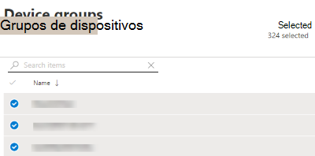

### Exceções globais

Se você tiver permissões globais de administrador, poderá criar e cancelar uma exceção global. Ele afeta todos **os** grupos de dispositivos atuais e futuros em sua organização, e somente um usuário com permissão semelhante poderá alterá-lo. O estado de recomendação mudará de "ativo" para "exceção completa".

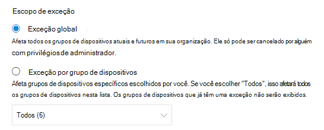

Algumas coisas a se ter em mente:

- Se uma recomendação estiver sob exceção global, as exceções recém-criadas para grupos de dispositivos serão suspensas até que a exceção global tenha expirado ou sido cancelada. Após esse ponto, as novas exceções do grupo de dispositivos entrarão em vigor até expirarem.
- Se uma recomendação já tiver exceções para grupos de dispositivos específicos e uma exceção global for criada, a exceção do grupo de dispositivos será suspensa até expirar ou a exceção global será cancelada antes de expirar.

### Justification

Selecione sua justificativa para a exceção que você precisa arquivar em vez de remediar a recomendação de segurança em questão. Preencha o contexto de justificativa e de definir a duração da exceção.

A lista a seguir detalha as justificativas por trás das opções de exceção:

- **Controle de terceiros** - um produto ou software de terceiros já aborda essa recomendação - Escolher esse tipo de justificativa diminuirá sua pontuação de exposição e aumentará sua pontuação segura porque seu risco é reduzido
- **Mitigação alternativa** - uma ferramenta interna já aborda essa recomendação - Escolher esse tipo de justificativa diminuirá sua pontuação de exposição e aumentará sua pontuação segura porque seu risco é reduzido
- **Risco aceito** - representa baixo risco e/ou implementar a recomendação é muito caro
- **Correção planejada (graça)** - Já planejada, mas aguardando execução ou autorização

## Exibir todas as exceções

Navegue até a guia **Exceções** na **página Correção.** Você pode filtrar por justificativa, tipo e status.

 Selecione uma exceção para abrir um sobremenu com mais detalhes. Exceções por grupo de dispositivos terão uma lista de cada grupo de dispositivos que a exceção abrange, que você pode exportar. Você também pode exibir a recomendação relacionada ou cancelar a exceção.

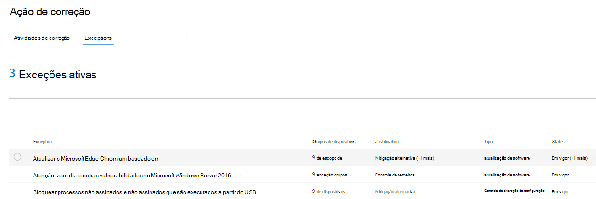

## Como cancelar uma exceção

Para cancelar uma exceção, navegue até a guia **Exceções** na **página Correção.** Selecione a exceção.

Para cancelar a exceção para todos os grupos de dispositivos ou para uma exceção global, selecione o botão **Cancelar exceção para todos os grupos de dispositivos.** Você só poderá cancelar exceções para grupos de dispositivos para os que você tem permissões.

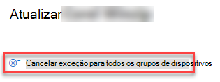

### Cancelar a exceção para um grupo de dispositivos específico

Selecione o grupo de dispositivos específico para cancelar a exceção para ele. Um flyout será exibido para o grupo de dispositivos e você pode selecionar **Cancelar exceção**.

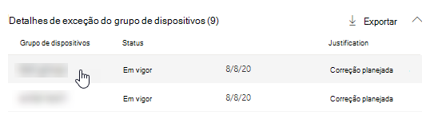

## Exibir impacto após a aplicação de exceções

Na página Recomendações de Segurança, selecione Personalizar **colunas** e marque as caixas para dispositivos expostos **(após exceções)** e **Impacto (após exceções)**.

A coluna dispositivos expostos (após exceções) mostra os dispositivos restantes que ainda estão expostos a vulnerabilidades após a aplicação de exceções. As justificativas de exceção que afetam a exposição incluem "controle de terceiros" e "mitigação alternativa". Outras justificativas não reduzem a exposição de um dispositivo e ainda são consideradas expostas.

O impacto (após exceções) mostra o impacto restante na pontuação de exposição ou na pontuação segura depois que as exceções são aplicadas. As justificativas de exceção que afetam as pontuações incluem "controle de terceiros" e "mitigação alternativa". Outras justificativas não reduzem a exposição de um dispositivo e, portanto, a pontuação de exposição e a pontuação segura não mudam.

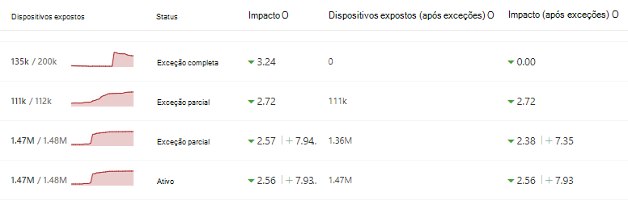

## Tópicos relacionados

- [Visão geral do gerenciamento de ameaças e vulnerabilidades](next-gen-threat-and-vuln-mgt.md)
- [Correção de vulnerabilidades](tvm-remediation.md)
- [Recomendações de segurança](tvm-security-recommendation.md)
- [Pontuação de exposição](tvm-exposure-score.md)
- [Microsoft Secure Score para dispositivos](tvm-microsoft-secure-score-devices.md)
