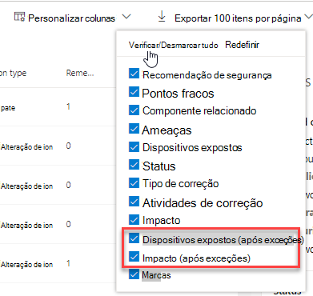

# Criar e exibir exceções para recomendações de segurança - Gerenciamento de Ameaças e VulnerabilidadesCreate and view exceptions for security recommendations - threat and vulnerability management

[!INCLUDE [Microsoft 365 Defender rebranding](../../includes/microsoft-defender.md)]

**Aplica-se a:****Applies to:**

- [Microsoft Defender para Ponto de ExtremidadeMicrosoft Defender for Endpoint](https://go.microsoft.com/fwlink/?linkid=2154037)
- [Ameaça e Gerenciamento de VulnerabilidadesThreat and vulnerability management](next-gen-threat-and-vuln-mgt.md)
- [Microsoft 365 DefenderMicrosoft 365 Defender](https://go.microsoft.com/fwlink/?linkid=2118804)

>Deseja experimentar o Microsoft Defender para Ponto de Extremidade?Want to experience Microsoft Defender for Endpoint? [Inscreva-se para uma avaliação gratuita.Sign up for a free trial.](https://www.microsoft.com/microsoft-365/windows/microsoft-defender-atp?ocid=docs-wdatp-portaloverview-abovefoldlink)

Como alternativa a uma solicitação de correção quando uma recomendação não é relevante no momento, você pode criar exceções para recomendações.As an alternative to a remediation request when a recommendation is not relevant at the moment, you can create exceptions for recommendations. Se sua organização tiver grupos de dispositivos, você poderá escopo da exceção para grupos de dispositivos específicos.If your organization has device groups, you will be able to scope the exception to specific device groups. As exceções podem ser criadas para grupos de dispositivos selecionados ou para todos os grupos de dispositivos passados e presentes.Exceptions can either be created for selected device groups, or for all device groups past and present.  

Quando uma exceção é criada para uma recomendação, a recomendação não estará ativa até o final da duração da exceção.When an exception is created for a recommendation, the recommendation will not be active until the end of the exception duration. O estado de recomendação mudará para **Exceção Total** ou **Parcial** (por grupo de dispositivos).The recommendation state will change to **Full exception** or **Partial exception** (by device group).

## PermissõesPermissions

Somente usuários com permissões de "tratamento de exceções" podem gerenciar exceções (incluindo criação ou cancelamento).Only users with “exceptions handling” permissions can manage exceptions (including creating or canceling). [Saiba mais sobre funções RBAC](user-roles.md).[Learn more about RBAC roles](user-roles.md).

## Criar uma exceçãoCreate an exception

Selecione uma recomendação de segurança para a que você gostaria de criar uma exceção e selecione **Opções de exceção** e preencha o formulário.Select a security recommendation you would like create an exception for, and then select **Exception options** and fill out the form.  

### Exceção por grupo de dispositivosException by device group

Aplique a exceção a todos os grupos de dispositivos atuais ou escolha grupos de dispositivos específicos.Apply the exception to all current device groups or choose specific device groups. Os grupos de dispositivos futuros não serão incluídos na exceção.Future device groups won't be included in the exception. Os grupos de dispositivos que já têm uma exceção não serão exibidos na lista.Device groups that already have an exception will not be displayed in the list. Se você selecionar apenas determinados grupos de dispositivos, o estado de recomendação mudará de "ativo" para "exceção parcial".If you only select certain device groups, the recommendation state will change from “active” to “partial exception.” O estado será alternado para "exceção completa" se você selecionar todos os grupos de dispositivos.The state will change to “full exception” if you select all the device groups.

#### Exibições filtradasFiltered views

Se você tiver filtrado por grupo de dispositivos em qualquer uma das páginas Gerenciamento de Ameaças e Vulnerabilidades, somente os grupos de dispositivos filtrados aparecerão como opções.If you have filtered by device group on any of the threat and vulnerability management pages, only your filtered device groups will appear as options.

Este é o botão para filtrar por grupo de dispositivos em qualquer uma das páginas Gerenciamento de Ameaças e Vulnerabilidades:This is the button to filter by device group on any of the threat and vulnerability management pages: 

Exibição de exceção com grupos de dispositivos filtrados:Exception view with filtered device groups:

#### Grande número de grupos de dispositivosLarge number of device groups

Se sua organização tiver mais de 20 grupos de dispositivos, selecione **Editar** ao lado da opção grupo de dispositivos filtrado.If your organization has more than 20 device groups, select **Edit** next to the filtered device group option.

Um flyout aparecerá onde você pode pesquisar e escolher os grupos de dispositivos que deseja incluir.A flyout will appear where you can search and choose device groups you want included. Selecione o ícone de marca de seleção abaixo Pesquisar para verificar/desmarcar tudo.Select the check mark icon below Search to check/uncheck all.

### Exceções globaisGlobal exceptions

Se você tiver permissões globais de administrador, poderá criar e cancelar uma exceção global.If you have global administrator permissions, you will be able to create and cancel a global exception. Ele afeta todos **os** grupos de dispositivos atuais e futuros em sua organização, e somente um usuário com permissão semelhante poderá alterá-lo.It affects **all** current and future device groups in your organization, and only a user with similar permission would be able to change it. O estado de recomendação mudará de "ativo" para "exceção completa".The recommendation state will change from “active” to “full exception.”

Algumas coisas a se ter em mente:Some things to keep in mind:

- Se uma recomendação estiver sob exceção global, as exceções recém-criadas para grupos de dispositivos serão suspensas até que a exceção global tenha expirado ou sido cancelada.If a recommendation is under global exception, then newly created exceptions for device groups will be suspended until the global exception has expired or been cancelled. Após esse ponto, as novas exceções do grupo de dispositivos entrarão em vigor até expirarem.After that point, the new device group exceptions will go into effect until they expire.
- Se uma recomendação já tiver exceções para grupos de dispositivos específicos e uma exceção global for criada, a exceção do grupo de dispositivos será suspensa até expirar ou a exceção global será cancelada antes de expirar.If a recommendation already has exceptions for specific device groups and a global exception is created, then the device group exception will be suspended until it expires or the global exception is cancelled before it expires.

### JustificationJustification

Selecione sua justificativa para a exceção que você precisa arquivar em vez de remediar a recomendação de segurança em questão.Select your justification for the exception you need to file instead of remediating the security recommendation in question. Preencha o contexto de justificativa e de definir a duração da exceção.Fill out the justification context, then set the exception duration.

A lista a seguir detalha as justificativas por trás das opções de exceção:The following list details the justifications behind the exception options:

- **Controle de terceiros** - um produto ou software de terceiros já aborda essa recomendação - Escolher esse tipo de justificativa diminuirá sua pontuação de exposição e aumentará sua pontuação segura porque seu risco é reduzido**Third party control** - A third party product or software already addresses this recommendation       - Choosing this justification type will lower your exposure score and increase your secure score because your risk is reduced
- **Mitigação alternativa** - uma ferramenta interna já aborda essa recomendação - Escolher esse tipo de justificativa diminuirá sua pontuação de exposição e aumentará sua pontuação segura porque seu risco é reduzido**Alternate mitigation** - An internal tool already addresses this recommendation       - Choosing this justification type will lower your exposure score and increase your secure score because your risk is reduced
- **Risco aceito** - representa baixo risco e/ou implementar a recomendação é muito caro**Risk accepted** - Poses low risk and/or implementing the recommendation is too expensive
- **Correção planejada (graça)** - Já planejada, mas aguardando execução ou autorização**Planned remediation (grace)** - Already planned but is awaiting execution or authorization

## Exibir todas as exceçõesView all exceptions

Navegue até a guia **Exceções** na **página Correção.**Navigate to the **Exceptions** tab in the **Remediation** page. Você pode filtrar por justificativa, tipo e status.You can filter by justification, type, and status.

 Selecione uma exceção para abrir um sobremenu com mais detalhes.Select an exception to open a flyout with more details. Exceções por grupo de dispositivos terão uma lista de cada grupo de dispositivos que a exceção abrange, que você pode exportar.Exceptions per devices group will have a list of every device group the exception covers, which you can export. Você também pode exibir a recomendação relacionada ou cancelar a exceção.You can also view the related recommendation or cancel the exception.

## Como cancelar uma exceçãoHow to cancel an exception

Para cancelar uma exceção, navegue até a guia **Exceções** na **página Correção.**To cancel an exception, navigate to the **Exceptions** tab in the **Remediation** page. Selecione a exceção.Select the exception.

Para cancelar a exceção para todos os grupos de dispositivos ou para uma exceção global, selecione o botão **Cancelar exceção para todos os grupos de dispositivos.**To cancel the exception for all device groups or for a global exception, select the **Cancel exception for all device groups** button. Você só poderá cancelar exceções para grupos de dispositivos para os que você tem permissões.You will only be able to cancel exceptions for device groups you have permissions for.

### Cancelar a exceção para um grupo de dispositivos específicoCancel the exception for a specific device group

Selecione o grupo de dispositivos específico para cancelar a exceção para ele.Select the specific device group to cancel the exception for it. Um flyout será exibido para o grupo de dispositivos e você pode selecionar **Cancelar exceção**.A flyout will appear for the device group, and you can select **Cancel exception**.

## Exibir impacto após a aplicação de exceçõesView impact after exceptions are applied

Na página Segurança Recomendações, selecione Personalizar **colunas** e marque as caixas para dispositivos Expostos **(após exceções)** e **Impacto (após exceções)**.In the Security Recommendations page, select **Customize columns** and check the boxes for **Exposed devices (after exceptions)** and **Impact (after exceptions)**.

A coluna dispositivos expostos (após exceções) mostra os dispositivos restantes que ainda estão expostos a vulnerabilidades após a aplicação de exceções.The exposed devices (after exceptions) column shows the remaining devices that are still exposed to vulnerabilities after exceptions are applied. As justificativas de exceção que afetam a exposição incluem "controle de terceiros" e "mitigação alternativa".Exception justifications that affect the exposure include ‘third party control’ and ‘alternate mitigation’. Outras justificativas não reduzem a exposição de um dispositivo e ainda são consideradas expostas.Other justifications do not reduce the exposure of a device, and they are still considered exposed.

O impacto (após exceções) mostra o impacto restante na pontuação de exposição ou na pontuação segura depois que as exceções são aplicadas.The impact (after exceptions) shows remaining impact to exposure score or secure score after exceptions are applied. As justificativas de exceção que afetam as pontuações incluem "controle de terceiros" e "mitigação alternativa".Exception justifications that affect the scores include ‘third party control’ and ‘alternate mitigation.’ Outras justificativas não reduzem a exposição de um dispositivo e, portanto, a pontuação de exposição e a pontuação segura não mudam.Other justifications do not reduce the exposure of a device, and so the exposure score and secure score do not change.

## Tópicos relacionadosRelated topics

- [Visão geral Gerenciamento de Vulnerabilidades ameaçaThreat and vulnerability management overview](next-gen-threat-and-vuln-mgt.md)
- [Correção de vulnerabilidadesRemediate vulnerabilities](tvm-remediation.md)
- [Recomendações de segurançaSecurity recommendations](tvm-security-recommendation.md)
- [Pontuação de exposiçãoExposure score](tvm-exposure-score.md)
- [Microsoft Secure Score para dispositivosMicrosoft Secure Score for Devices](tvm-microsoft-secure-score-devices.md)
