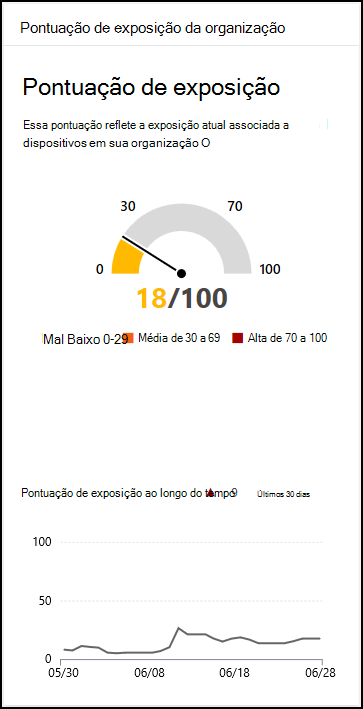

# Pontuação de exposição - Gerenciamento de Ameaças e VulnerabilidadesExposure score - threat and vulnerability management

[!INCLUDE [Microsoft 365 Defender rebranding](../../includes/microsoft-defender.md)]

**Aplica-se a:****Applies to:**

- [Microsoft Defender para Ponto de ExtremidadeMicrosoft Defender for Endpoint](https://go.microsoft.com/fwlink/?linkid=2154037)
- [Ameaça e Gerenciamento de VulnerabilidadesThreat and vulnerability management](next-gen-threat-and-vuln-mgt.md)
- [Microsoft 365 DefenderMicrosoft 365 Defender](https://go.microsoft.com/fwlink/?linkid=2118804)

>Deseja experimentar o Microsoft Defender para Ponto de Extremidade?Want to experience Microsoft Defender for Endpoint? [Inscreva-se para uma avaliação gratuita.Sign up for a free trial.](https://www.microsoft.com/microsoft-365/windows/microsoft-defender-atp?ocid=docs-wdatp-portaloverview-abovefoldlink)

Sua pontuação de exposição é visível no [painel Ameaça e Gerenciamento de Vulnerabilidades](tvm-dashboard-insights.md) do Central de Segurança do Microsoft Defender.Your exposure score is visible in the [Threat and vulnerability management dashboard](tvm-dashboard-insights.md) of the Microsoft Defender Security Center. Ele reflete como sua organização está vulnerável a ameaças de segurança cibernética.It reflects how vulnerable your organization is to cybersecurity threats. Baixa pontuação de exposição significa que seus dispositivos são menos vulneráveis de exploração.Low exposure score means your devices are less vulnerable from exploitation.

- Compreenda e identifique rapidamente as informações de alto nível sobre o estado de segurança em sua organização.Quickly understand and identify high-level takeaways about the state of security in your organization.
- Detectar e responder a áreas que exigem investigação ou ação para melhorar o estado atual.Detect and respond to areas that require investigation or action to improve the current state.
- Comunicar-se com colegas e gerenciamento sobre o impacto dos esforços de segurança.Communicate with peers and management about the impact of security efforts.

O cartão oferece uma exibição de alto nível da sua tendência de pontuação de exposição ao longo do tempo.The card gives you a high-level view of your exposure score trend over time. Quaisquer picos no gráfico dão a você uma indicação visual de uma exposição de alta ameaça de segurança cibernética que você pode investigar ainda mais.Any spikes in the chart give you a visual indication of a high cybersecurity threat exposure that you can investigate further.

## Como funcionaHow it works

A pontuação de exposição é dividida nos seguintes níveis:The exposure score is broken down into the following levels:

- 0 a 29: pontuação de baixa exposição0–29: low exposure score
- 30 a 69: pontuação média de exposição30–69: medium exposure score
- 70 a 100: pontuação de alta exposição70–100: high exposure score

Você pode resolver os problemas com base em recomendações de [segurança priorizadas](tvm-security-recommendation.md) para reduzir a pontuação de exposição.You can remediate the issues based on prioritized [security recommendations](tvm-security-recommendation.md) to reduce the exposure score. Cada software tem pontos fracos que são transformados em recomendações e priorizados com base no risco para a organização.Each software has weaknesses that are transformed into recommendations and prioritized based on risk to the organization.

## Reduzir sua exposição a ameaças e vulnerabilidadesReduce your threat and vulnerability exposure

Reduza sua exposição a ameaças e vulnerabilidades ao remediar recomendações [de segurança.](tvm-security-recommendation.md)Lower your threat and vulnerability exposure by remediating [security recommendations](tvm-security-recommendation.md). Faça o maior impacto na sua pontuação de exposição, remediando as principais recomendações de segurança, que podem ser exibidas no painel Gerenciamento de Ameaças e Vulnerabilidades [.](tvm-dashboard-insights.md)Make the most impact to your exposure score by remediating the top security recommendations, which can be viewed in the [threat and vulnerability management dashboard](tvm-dashboard-insights.md).

## Tópicos relacionadosRelated topics

- [Visão geral Gerenciamento de Vulnerabilidades ameaçaThreat and vulnerability management overview](next-gen-threat-and-vuln-mgt.md)
- [Microsoft Secure Score para dispositivosMicrosoft Secure Score for Devices](tvm-microsoft-secure-score-devices.md)
- [Recomendações de segurançaSecurity recommendations](tvm-security-recommendation.md)
- [Cronograma do eventoEvent timeline](threat-and-vuln-mgt-event-timeline.md)
