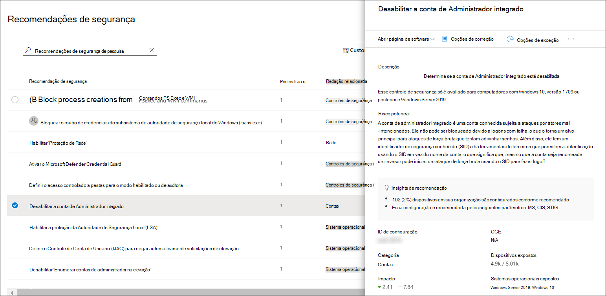
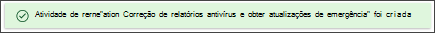
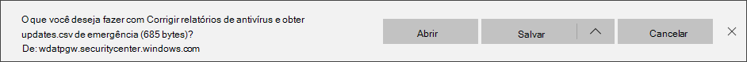

# Microsoft Secure Score para dispositivosMicrosoft Secure Score for Devices

[!INCLUDE [Microsoft 365 Defender rebranding](../../includes/microsoft-defender.md)]

**Aplica-se a:****Applies to:**

- [Microsoft Defender para Ponto de ExtremidadeMicrosoft Defender for Endpoint](https://go.microsoft.com/fwlink/?linkid=2154037)
- [Gerenciamento de ameaças e vulnerabilidadesThreat and vulnerability management](next-gen-threat-and-vuln-mgt.md)
- [Microsoft 365 DefenderMicrosoft 365 Defender](https://go.microsoft.com/fwlink/?linkid=2118804)

> Deseja experimentar o Defender para Ponto de Extremidade?Want to experience Defender for Endpoint? [Inscreva-se para uma avaliação gratuita.Sign up for a free trial.](https://www.microsoft.com/microsoft-365/windows/microsoft-defender-atp?ocid=docs-wdatp-pullalerts-abovefoldlink) 

>[!NOTE]
> A pontuação de configuração agora faz parte do gerenciamento de ameaças e vulnerabilidades como Pontuação Segura da Microsoft para Dispositivos.Configuration score is now part of threat and vulnerability management as Microsoft Secure Score for Devices.

Sua pontuação para dispositivos está visível no painel de gerenciamento de ameaças e [vulnerabilidades](tvm-dashboard-insights.md) do Centro de Segurança do Microsoft Defender.Your score for devices is visible in the [threat and vulnerability management dashboard](tvm-dashboard-insights.md) of the Microsoft Defender Security Center. Uma pontuação segura da Microsoft mais alta para dispositivos significa que seus pontos de extremidade são mais resilientes contra ataques de ameaças de segurança cibernética.A higher Microsoft Secure Score for Devices means your endpoints are more resilient from cybersecurity threat attacks. Ele reflete o estado de configuração de segurança coletiva de seus dispositivos nas seguintes categorias:It reflects the collective security configuration state of your devices across the following categories:

- AplicativoApplication
- Sistema operacionalOperating system
- RedeNetwork
- ContasAccounts
- Controles de segurançaSecurity controls

Selecione uma categoria para ir até a página [**Recomendações de**](tvm-security-recommendation.md) segurança e exibir as recomendações relevantes.Select a category to go to the [**Security recommendations**](tvm-security-recommendation.md) page and view the relevant recommendations.

## Ativar o conector de Pontuação Segura da MicrosoftTurn on the Microsoft Secure Score connector

Encaminhe o Microsoft Defender para sinais de ponto de extremidade, dando visibilidade da Pontuação Segura da Microsoft para a postura de segurança do dispositivo.Forward Microsoft Defender for Endpoint signals, giving Microsoft Secure Score visibility into the device security posture. Os dados encaminhados são armazenados e processados no mesmo local que seus dados de Pontuação Segura da Microsoft.Forwarded data is stored and processed in the same location as your Microsoft Secure Score data.

As alterações podem levar até algumas horas para refletir no painel.Changes might take up to a few hours to reflect in the dashboard.

1. No painel de navegação, acesse **Configurações**  >  **Recursos avançados**In the navigation pane, go to **Settings** > **Advanced features** 

2. Role para baixo até **Microsoft Secure Score** e alterne a configuração para **On**.Scroll down to **Microsoft Secure Score** and toggle the setting to **On**.

3. Selecione **Salvar preferências**.Select **Save preferences**.

## Como funcionaHow it works

>[!NOTE]
> A Pontuação Segura da Microsoft para Dispositivos atualmente dá suporte a configurações definidas por meio da Política de Grupo.Microsoft Secure Score for Devices currently supports configurations set via Group Policy. Devido ao suporte parcial atual do Intune, as configurações que podem ter sido definidas por meio do Intune podem aparecer como mal configuradas.Due to the current partial Intune support, configurations which might have been set through Intune might show up as misconfigured. Entre em contato com o administrador de IT para verificar o status real da configuração caso sua organização use o Intune para gerenciamento de configuração seguro.Contact your IT Administrator to verify the actual configuration status in case your organization is using Intune for secure configuration management.

Os dados no cartão Microsoft Secure Score for Devices são o produto do processo de descoberta de vulnerabilidades meticulosa e contínua.The data in the Microsoft Secure Score for Devices card is the product of meticulous and ongoing vulnerability discovery process. Ele é agregado com avaliações de descoberta de configuração que continuamente:It is aggregated with configuration discovery assessments that continuously:

- Compare as configurações coletadas com os parâmetros de referência coletados para descobrir ativos mal configuradosCompare collected configurations to the collected benchmarks to discover misconfigured assets
- Mapear configurações para vulnerabilidades que podem ser remediadas ou parcialmente remediadas (redução de risco)Map configurations to vulnerabilities that can be remediated or partially remediated (risk reduction)
- Coletar e manter os parâmetros de configuração de práticas (fornecedores, feeds de segurança, equipes de pesquisa internas)Collect and maintain best practice configuration benchmarks (vendors, security feeds, internal research teams)
- Coletar e monitorar alterações do estado de configuração do controle de segurança de todos os ativosCollect and monitor changes of security control configuration state from all assets

## Melhorar sua configuração de segurançaImprove your security configuration

Aprimora sua configuração de segurança, remediando problemas da lista de recomendações de segurança.Improve your security configuration by remediating issues from the security recommendations list. À medida que você faz isso, a Pontuação Segura da Microsoft para Dispositivos melhora e sua organização se torna mais resiliente contra ameaças e vulnerabilidades de segurança cibernética.As you do so, your Microsoft Secure Score for Devices improves and your organization becomes more resilient against cybersecurity threats and vulnerabilities.

1. No cartão Pontuação Segura da Microsoft para Dispositivos no painel de gerenciamento de ameaças e vulnerabilidades, selecione uma das categorias.From the Microsoft Secure Score for Devices card in the threat and vulnerability management dashboard, select the one of the categories. Você exibirá a lista de recomendações relacionadas a essa categoria.You'll view the list of recommendations related to that category. Ele levará você para a página [**Recomendações de**](tvm-security-recommendation.md) segurança.It will take you to the [**Security recommendations**](tvm-security-recommendation.md) page. Se você quiser ver todas as recomendações de segurança, depois de chegar à página Recomendações de segurança, desempure o campo de pesquisa.If you want to see all security recommendations, once you get to the Security recommendations page, clear the search field.

2. Selecione um item na lista.Select an item on the list. O painel de sobremenu será aberto com detalhes relacionados à recomendação.The flyout panel will open with details related to the recommendation. Selecione **Opções de correção**.Select **Remediation options**.

   

3. Leia a descrição para entender o contexto do problema e o que fazer em seguida.Read the description to understand the context of the issue and what to do next. Selecione uma data de vencimento, adicione anotações e selecione Exportar todos os dados de atividade de correção para **CSV** para que você possa anexá-los a um email para acompanhamento.Select a due date, add notes, and select **Export all remediation activity data to CSV** so you can attach it to an email for follow-up.

4. **Enviar solicitação**.**Submit request**. Você verá uma mensagem de confirmação de que a tarefa de correção foi criada.You'll see a confirmation message that the remediation task has been created.
   

5. Salve seu arquivo CSV.Save your CSV file.
   

6. Envie um email de acompanhamento para o administrador de TI e permita o tempo que você aloca para que a correção se propague no sistema.Send a follow-up email to your IT Administrator and allow the time that you've allotted for the remediation to propagate in the system.

7. Revise novamente **a Pontuação Segura da Microsoft para** Dispositivos no painel.Review the **Microsoft Secure Score for Devices** card again on the dashboard. O número de recomendações de controles de segurança diminuirá.The number of security controls recommendations will decrease. Quando você selecionar **Controles** de  segurança para voltar para a página Recomendações de segurança, o item que você endereça não será mais listado lá.When you select **Security controls** to go back to the **Security recommendations** page, the item that you've addressed won't be listed there anymore. A Pontuação Segura da Microsoft para Dispositivos deve aumentar.Your Microsoft Secure Score for Devices should increase.

>[!IMPORTANT]
>Para aumentar suas taxas de detecção de avaliação de vulnerabilidade, baixe as seguintes atualizações de segurança obrigatórias e implante-as em sua rede:To boost your vulnerability assessment detection rates, download the following mandatory security updates and deploy them in your network:
>- Clientes 19H1 | [KB 4512941](https://support.microsoft.com/help/4512941/windows-10-update-kb4512941)19H1 customers | [KB 4512941](https://support.microsoft.com/help/4512941/windows-10-update-kb4512941)
>- Clientes RS5 | [KB 4516077](https://support.microsoft.com/help/4516077/windows-10-update-kb4516077)RS5 customers | [KB 4516077](https://support.microsoft.com/help/4516077/windows-10-update-kb4516077)
>- Clientes RS4 | [KB 4516045](https://support.microsoft.com/help/4516045/windows-10-update-kb4516045)RS4 customers | [KB 4516045](https://support.microsoft.com/help/4516045/windows-10-update-kb4516045)
>- Clientes RS3 | [KB 4516071](https://support.microsoft.com/help/4516071/windows-10-update-kb4516071)RS3 customers | [KB 4516071](https://support.microsoft.com/help/4516071/windows-10-update-kb4516071)
>
>Para baixar as atualizações de segurança:To download the security updates:
>1. Vá para [o Catálogo de Atualizações da Microsoft.](https://www.catalog.update.microsoft.com/home.aspx)Go to [Microsoft Update Catalog](https://www.catalog.update.microsoft.com/home.aspx).
>2. Key-in the security update KB number that you need to download, then click **Search**.Key-in the security update KB number that you need to download, then click **Search**.  

## Tópicos relacionadosRelated topics

- [Visão geral do gerenciamento de ameaças e vulnerabilidadesThreat and vulnerability management overview](next-gen-threat-and-vuln-mgt.md)
- [PainelDashboard](tvm-dashboard-insights.md)
- [Pontuação de exposiçãoExposure score](tvm-exposure-score.md)
- [Recomendações de segurançaSecurity recommendations](tvm-security-recommendation.md)
