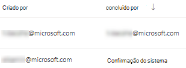
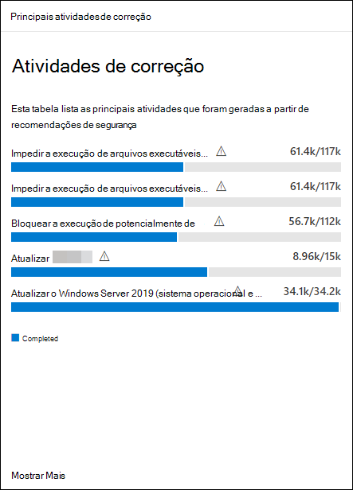

# Correção de vulnerabilidades com Gerenciamento de Ameaças e Vulnerabilidades

[!INCLUDE [Microsoft 365 Defender rebranding](../../includes/microsoft-defender.md)]

**Aplica-se a:**
- [Microsoft Defender para Ponto de Extremidade](https://go.microsoft.com/fwlink/?linkid=2154037)
- [Ameaça e Gerenciamento de Vulnerabilidades](next-gen-threat-and-vuln-mgt.md)
- [Microsoft 365 Defender](https://go.microsoft.com/fwlink/?linkid=2118804)

>Deseja experimentar o Microsoft Defender para Ponto de Extremidade? [Inscreva-se para uma avaliação gratuita.](https://www.microsoft.com/microsoft-365/windows/microsoft-defender-atp?ocid=docs-wdatp-portaloverview-abovefoldlink)

## Solicitar correção

A Gerenciamento de Ameaças e Vulnerabilidades no Microsoft Defender para Ponto de Extremidade faz a ponte entre administradores de SEGURANÇA e DES por meio do fluxo de trabalho de solicitação de correção. Administradores de segurança como você podem solicitar que o Administrador de TI correção de uma vulnerabilidade das páginas de recomendação de **segurança** para o Intune.

### Habilitar Microsoft Intune conexão

Para usar esse recurso, habilita suas Microsoft Intune conexões. No Central de Segurança do Microsoft Defender, navegue **até** Configurações  >  **Recursos Avançados**  >  **Gerais.** Role para baixo e procure **Microsoft Intune conexão**. Por padrão, a alternância está desligada. Ativar a **Microsoft Intune de conexão** de Microsoft Intune **.**

**Observação**: se você tiver a conexão do Intune habilitada, você terá uma opção para criar uma tarefa de segurança do Intune ao criar uma solicitação de correção. Essa opção não será exibida se a conexão não estiver definida.

Consulte [Usar o Intune para correção de vulnerabilidades identificadas](/intune/atp-manage-vulnerabilities) pelo Microsoft Defender para Ponto de Extremidade para obter detalhes.

### Etapas de solicitação de correção

1. Vá para o menu Gerenciamento de Ameaças e Vulnerabilidades de navegação no Central de Segurança do Microsoft Defender e selecione [**Recomendações de segurança.**](tvm-security-recommendation.md)

2. Selecione uma recomendação de segurança que você gostaria de solicitar correção e selecione **Opções de correção.**

3. Preencha o formulário, incluindo o que você está solicitando correção, grupos de dispositivos aplicáveis, prioridade, data de vencimento e anotações opcionais.
    1. Se você escolher a opção de correção "atenção necessária", a seleção de uma data de vencimento não estará disponível, pois não há nenhuma ação específica.

4. Selecione **Enviar solicitação**. Enviar uma solicitação de correção cria um item de atividade de correção dentro Gerenciamento de Ameaças e Vulnerabilidades, que pode ser usado para monitorar o andamento da correção para essa recomendação. Isso não disparará uma correção ou aplicará alterações a dispositivos.

5. Notifique o administrador de IT sobre a nova solicitação e faça com que eles faça logoff no Intune para aprovar ou rejeitar a solicitação e iniciar uma implantação de pacote.

6. Vá para a [**página Correção**](tvm-remediation.md) para exibir o status da sua solicitação de correção.

Se você quiser verificar como o tíquete aparece no Intune, confira [Usar o Intune](/intune/atp-manage-vulnerabilities) para correção de vulnerabilidades identificadas pelo Microsoft Defender para o Ponto de Extremidade para obter detalhes.

>[!NOTE]
>Se sua solicitação envolver a correção de mais de 10.000 dispositivos, só podemos enviar 10.000 dispositivos para correção para o Intune.

Depois que as fraquezas de segurança cibernética da sua organização são [identificadas](tvm-security-recommendation.md)e mapeadas para recomendações de segurança ativas, comece a criar tarefas de segurança. Você pode criar tarefas por meio da integração com Microsoft Intune onde os tíquetes de correção são criados.

Reduza a exposição da sua organização contra vulnerabilidades e aumente sua configuração de segurança, remediando as recomendações de segurança.

## Exibir suas atividades de correção

Quando você envia uma solicitação de correção da página Recomendações de segurança, ela inicia uma atividade de correção. Uma tarefa de segurança é criada que pode ser rastreada na página Gerenciamento de Ameaças e Vulnerabilidades **Correção** e um tíquete de correção é criado Microsoft Intune.

Se você escolher a opção de correção "atenção necessária", não haverá barra de progresso, status de tíquete ou data de vencimento, já que não há nenhuma ação real que possamos monitorar.

Depois de estar na página Correção, selecione a atividade de correção que você deseja exibir. Você pode seguir as etapas de correção, acompanhar o andamento, exibir a recomendação relacionada, exportar para CSV ou marcar como concluída.

>[!NOTE]
> Há um período de retenção de 180 dias para atividades de correção concluídas. Para manter a página correção com desempenho ideal, a atividade de correção será removida 6 meses após a conclusão.

### Concluído por coluna

Acompanhe quem fechou a atividade de correção com a coluna "Concluído por" na página Correção.

- **Endereço de** email : o email da pessoa que concluiu manualmente a tarefa
- **Confirmação do** sistema : a tarefa foi concluída automaticamente (todos os dispositivos remediados)
- **N/A**: As informações não estão disponíveis porque não sabemos como essa tarefa mais antiga foi concluída

### Principais atividades de correção no painel

Exibir **Principais atividades de correção** no painel Gerenciamento de Ameaças e Vulnerabilidades [.](tvm-dashboard-insights.md) Selecione qualquer uma das entradas para ir para a **página Correção.** Você pode marcar a atividade de correção como concluída após a equipe de administração de TI remediar a tarefa.

## Artigos relacionados

- [Visão geral Gerenciamento de Vulnerabilidades ameaça](next-gen-threat-and-vuln-mgt.md)
- [Painel](tvm-dashboard-insights.md)
- [Recomendações de segurança](tvm-security-recommendation.md)