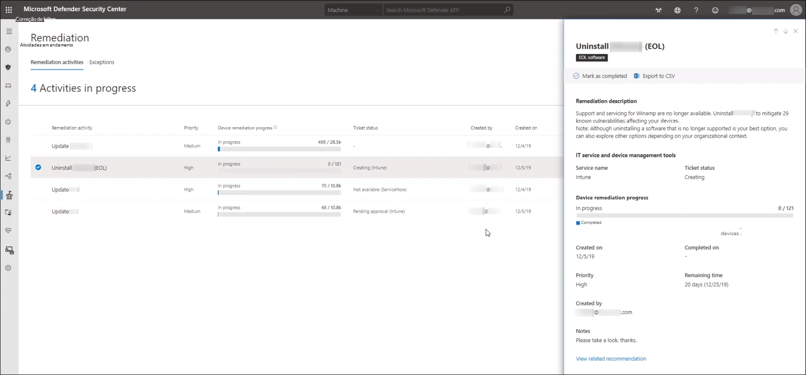

# Correção de vulnerabilidades com Gerenciamento de Ameaças e VulnerabilidadesRemediate vulnerabilities with threat and vulnerability management

[!INCLUDE [Microsoft 365 Defender rebranding](../../includes/microsoft-defender.md)]

**Aplica-se a:****Applies to:**
- [Microsoft Defender para Ponto de ExtremidadeMicrosoft Defender for Endpoint](https://go.microsoft.com/fwlink/?linkid=2154037)
- [Ameaça e Gerenciamento de VulnerabilidadesThreat and vulnerability management](next-gen-threat-and-vuln-mgt.md)
- [Microsoft 365 DefenderMicrosoft 365 Defender](https://go.microsoft.com/fwlink/?linkid=2118804)

>Deseja experimentar o Microsoft Defender para Ponto de Extremidade?Want to experience Microsoft Defender for Endpoint? [Inscreva-se para uma avaliação gratuita.Sign up for a free trial.](https://www.microsoft.com/microsoft-365/windows/microsoft-defender-atp?ocid=docs-wdatp-portaloverview-abovefoldlink)

## Solicitar correçãoRequest remediation

A Gerenciamento de Ameaças e Vulnerabilidades no Microsoft Defender para Ponto de Extremidade faz a ponte entre administradores de SEGURANÇA e DES por meio do fluxo de trabalho de solicitação de correção.The threat and vulnerability management capability in Microsoft Defender for Endpoint bridges the gap between Security and IT administrators through the remediation request workflow. Administradores de segurança como você podem solicitar que o Administrador de TI correção de uma vulnerabilidade das páginas de recomendação de **segurança** para o Intune.Security admins like you can request for the IT Administrator to remediate a vulnerability from the **Security recommendation** pages to Intune.

### Habilitar Microsoft Intune conexãoEnable Microsoft Intune connection

Para usar esse recurso, habilita suas Microsoft Intune conexões.To use this capability, enable your Microsoft Intune connections. No Central de Segurança do Microsoft Defender, navegue **até** Configurações  >  **Recursos Avançados**  >  **Gerais.**In the Microsoft Defender Security Center, navigate to **Settings** > **General** > **Advanced features**. Role para baixo e procure **Microsoft Intune conexão**.Scroll down and look for **Microsoft Intune connection**. Por padrão, a alternância está desligada.By default, the toggle is turned off. Ativar a **Microsoft Intune de conexão** de Microsoft Intune **.**Turn your **Microsoft Intune connection** toggle **On**.

**Observação**: se você tiver a conexão do Intune habilitada, você terá uma opção para criar uma tarefa de segurança do Intune ao criar uma solicitação de correção.**Note**: If you have the Intune connection enabled, you get an option to create an Intune security task when creating a remediation request. Essa opção não será exibida se a conexão não estiver definida.This option does not appear if the connection is not set.

Consulte [Usar o Intune para correção de vulnerabilidades identificadas](/intune/atp-manage-vulnerabilities) pelo Microsoft Defender para Ponto de Extremidade para obter detalhes.See [Use Intune to remediate vulnerabilities identified by Microsoft Defender for Endpoint](/intune/atp-manage-vulnerabilities) for details.

### Etapas de solicitação de correçãoRemediation request steps

1. Vá para o menu Gerenciamento de Ameaças e Vulnerabilidades de navegação no Central de Segurança do Microsoft Defender e selecione [**Recomendações de segurança.**](tvm-security-recommendation.md)Go to the threat and vulnerability management navigation menu in the Microsoft Defender Security Center, and select [**Security recommendations**](tvm-security-recommendation.md).

2. Selecione uma recomendação de segurança que você gostaria de solicitar correção e selecione **Opções de correção.**Select a security recommendation you would like to request remediation for, and then select **Remediation options**.

3. Preencha o formulário, incluindo o que você está solicitando correção, grupos de dispositivos aplicáveis, prioridade, data de vencimento e anotações opcionais.Fill out the form, including what you are requesting remediation for, applicable device groups, priority, due date, and optional notes.
    1. Se você escolher a opção de correção "atenção necessária", a seleção de uma data de vencimento não estará disponível, pois não há nenhuma ação específica.If you choose the "attention required" remediation option, selecting a due date will not be available since there is no specific action.

4. Selecione **Enviar solicitação**.Select **Submit request**. Enviar uma solicitação de correção cria um item de atividade de correção dentro Gerenciamento de Ameaças e Vulnerabilidades, que pode ser usado para monitorar o andamento da correção para essa recomendação.Submitting a remediation request creates a remediation activity item within threat and vulnerability management, which can be used for monitoring the remediation progress for this recommendation. Isso não disparará uma correção ou aplicará alterações a dispositivos.This will not trigger a remediation or apply any changes to devices.

5. Notifique o administrador de IT sobre a nova solicitação e faça com que eles faça logoff no Intune para aprovar ou rejeitar a solicitação e iniciar uma implantação de pacote.Notify your IT Administrator about the new request and have them log into Intune to approve or reject the request and start a package deployment.

6. Vá para a [**página Correção**](tvm-remediation.md) para exibir o status da sua solicitação de correção.Go to the [**Remediation**](tvm-remediation.md) page to view the status of your remediation request.

Se você quiser verificar como o tíquete aparece no Intune, confira [Usar o Intune](/intune/atp-manage-vulnerabilities) para correção de vulnerabilidades identificadas pelo Microsoft Defender para o Ponto de Extremidade para obter detalhes.If you want to check how the ticket shows up in Intune, see [Use Intune to remediate vulnerabilities identified by Microsoft Defender for Endpoint](/intune/atp-manage-vulnerabilities) for details.

>[!NOTE]
>Se sua solicitação envolver a correção de mais de 10.000 dispositivos, só podemos enviar 10.000 dispositivos para correção para o Intune.If your request involves remediating more than 10,000 devices, we can only send 10,000 devices for remediation to Intune.

Depois que as fraquezas de segurança cibernética da sua organização são [identificadas](tvm-security-recommendation.md)e mapeadas para recomendações de segurança ativas, comece a criar tarefas de segurança.After your organization's cybersecurity weaknesses are identified and mapped to actionable [security recommendations](tvm-security-recommendation.md), start creating security tasks. Você pode criar tarefas por meio da integração com Microsoft Intune onde os tíquetes de correção são criados.You can create tasks through the integration with Microsoft Intune where remediation tickets are created.

Reduza a exposição da sua organização contra vulnerabilidades e aumente sua configuração de segurança, remediando as recomendações de segurança.Lower your organization's exposure from vulnerabilities and increase your security configuration by remediating the security recommendations.

## Exibir suas atividades de correçãoView your remediation activities

Quando você envia uma solicitação de correção da página Recomendações de segurança, ela inicia uma atividade de correção.When you submit a remediation request from the Security recommendations page, it kicks-off a remediation activity. Uma tarefa de segurança é criada que pode ser rastreada na página Gerenciamento de Ameaças e Vulnerabilidades **Correção** e um tíquete de correção é criado Microsoft Intune.A security task is created that can be tracked in the threat and vulnerability management **Remediation** page, and a remediation ticket is created in Microsoft Intune.

Se você escolher a opção de correção "atenção necessária", não haverá barra de progresso, status de tíquete ou data de vencimento, já que não há nenhuma ação real que possamos monitorar.If you chose the "attention required" remediation option, there will be no progress bar, ticket status, or due date since there is no actual action we can monitor.

Depois de estar na página Correção, selecione a atividade de correção que você deseja exibir.Once you are in the Remediation page, select the remediation activity that you want to view. Você pode seguir as etapas de correção, acompanhar o andamento, exibir a recomendação relacionada, exportar para CSV ou marcar como concluída.You can follow the remediation steps, track progress, view the related recommendation, export to CSV, or mark as complete.

>[!NOTE]
> Há um período de retenção de 180 dias para atividades de correção concluídas.There is a 180 day retention period for completed remediation activities. Para manter a página correção com desempenho ideal, a atividade de correção será removida 6 meses após a conclusão.To keep the Remediation page performing optimally, the remediation activity will be removed 6 months after its completion.

### Concluído por colunaCompleted by column

Acompanhe quem fechou a atividade de correção com a coluna "Concluído por" na página Correção.Track who closed the remediation activity with the "Completed by" column on the Remediation page.

- **Endereço de** email : o email da pessoa que concluiu manualmente a tarefa**Email address**: The email of the person who manually completed the task
- **Confirmação do** sistema : a tarefa foi concluída automaticamente (todos os dispositivos remediados)**System confirmation**: The task was automatically completed (all devices remediated)
- **N/A**: As informações não estão disponíveis porque não sabemos como essa tarefa mais antiga foi concluída**N/A**: Information is not available because we don't know how this older task was completed

### Principais atividades de correção no painelTop remediation activities in the dashboard

Exibir **Principais atividades de correção** no painel Gerenciamento de Ameaças e Vulnerabilidades [.](tvm-dashboard-insights.md)View **Top remediation activities** in the [threat and vulnerability management dashboard](tvm-dashboard-insights.md). Selecione qualquer uma das entradas para ir para a **página Correção.**Select any of the entries to go to the **Remediation** page. Você pode marcar a atividade de correção como concluída após a equipe de administração de TI remediar a tarefa.You can mark the remediation activity as completed after the IT admin team remediates the task.

## Artigos relacionadosRelated articles

- [Visão geral Gerenciamento de Vulnerabilidades ameaçaThreat and vulnerability management overview](next-gen-threat-and-vuln-mgt.md)
- [PainelDashboard](tvm-dashboard-insights.md)
- [Recomendações de segurançaSecurity recommendations](tvm-security-recommendation.md)