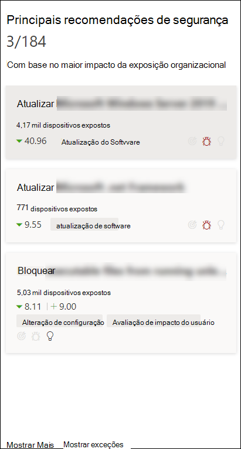
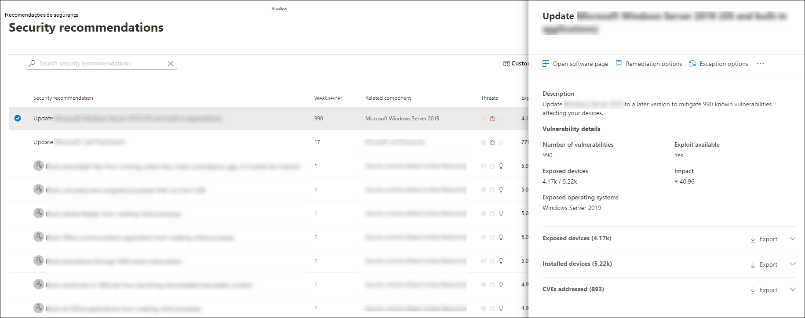
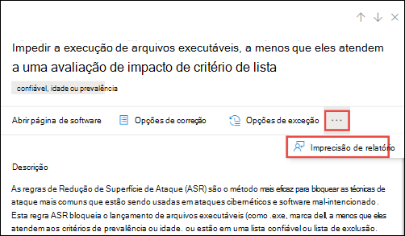

# Recomendações de segurança - gerenciamento de ameaças e vulnerabilidadesSecurity recommendations - threat and vulnerability management

[!INCLUDE [Microsoft 365 Defender rebranding](../../includes/microsoft-defender.md)]

**Aplica-se a:****Applies to:**

- [Microsoft Defender para Ponto de ExtremidadeMicrosoft Defender for Endpoint](https://go.microsoft.com/fwlink/?linkid=2154037)
- [Gerenciamento de ameaças e vulnerabilidadesThreat and vulnerability management](next-gen-threat-and-vuln-mgt.md)
- [Microsoft 365 DefenderMicrosoft 365 Defender](https://go.microsoft.com/fwlink/?linkid=2118804)

>Deseja experimentar o Microsoft Defender para Ponto de Extremidade?Want to experience Microsoft Defender for Endpoint? [Inscreva-se para uma avaliação gratuita.Sign up for a free trial.](https://www.microsoft.com/microsoft-365/windows/microsoft-defender-atp?ocid=docs-wdatp-portaloverview-abovefoldlink)

As deficiências de segurança cibernética identificadas em sua organização são mapeadas para recomendações de segurança ativas e priorizadas pelo impacto.Cybersecurity weaknesses identified in your organization are mapped to actionable security recommendations and prioritized by their impact. Recomendações priorizadas ajudam a reduzir o tempo para mitigar ou remediar vulnerabilidades e impulsionar a conformidade.Prioritized recommendations help shorten the time to mitigate or remediate vulnerabilities and drive compliance.

Cada recomendação de segurança inclui etapas de correção ativas.Each security recommendation includes actionable remediation steps. Para ajudar no gerenciamento de tarefas, a recomendação também pode ser enviada usando o Microsoft Intune e o Microsoft Endpoint Configuration Manager.To help with task management, the recommendation can also be sent using Microsoft Intune and Microsoft Endpoint Configuration Manager. Quando o cenário de ameaças muda, a recomendação também muda conforme coleta informações continuamente do seu ambiente.When the threat landscape changes, the recommendation also changes as it continuously collects information from your environment.

>[!TIP]
>Para obter emails sobre novos eventos de vulnerabilidade, consulte [Configure vulnerability email notifications in Microsoft Defender for Endpoint](configure-vulnerability-email-notifications.md)To get emails about new vulnerability events, see [Configure vulnerability email notifications in Microsoft Defender for Endpoint](configure-vulnerability-email-notifications.md)

## Como funcionaHow it works

Cada dispositivo na organização é pontuado com base em três fatores importantes para ajudar os clientes a se concentrarem nas coisas certas no momento certo.Each device in the organization is scored based on three important factors to help customers to focus on the right things at the right time.

- **Ameaça** - Características das vulnerabilidades e explorações nos dispositivos de suas organizações e no histórico de violações.**Threat** - Characteristics of the vulnerabilities and exploits in your organizations' devices and breach history. Com base nesses fatores, as recomendações de segurança mostram os links correspondentes para alertas ativos, campanhas de ameaças em andamento e seus relatórios de análise de ameaças correspondentes.Based on these factors, the security recommendations show the corresponding links to active alerts, ongoing threat campaigns, and their corresponding threat analytic reports.

- **Probabilidade de violação** - Postura de segurança e resiliência da sua organização contra ameaças**Breach likelihood** - Your organization's security posture and resilience against threats

- **Valor comercial** - ativos, processos críticos e propriedades intelectuais da sua organização**Business value** - Your organization's assets, critical processes, and intellectual properties

## Navegue até a página Recomendações de segurançaNavigate to the Security recommendations page

Acesse a página Recomendações de segurança de algumas maneiras diferentes:Access the Security recommendations page a few different ways:

- Menu de navegação de gerenciamento de ameaças e vulnerabilidades no [Centro de Segurança do Microsoft Defender](portal-overview.md)Threat and vulnerability management navigation menu in the [Microsoft Defender Security Center](portal-overview.md)
- Principais recomendações de segurança no painel de gerenciamento de ameaças [e vulnerabilidades](tvm-dashboard-insights.md)Top security recommendations in the [threat and vulnerability management dashboard](tvm-dashboard-insights.md)

Exibir recomendações de segurança relacionadas nos seguintes locais:View related security recommendations in the following places:

- Página de softwareSoftware page
- Página do dispositivoDevice page

### Menu de navegaçãoNavigation menu

Vá para o menu de navegação de gerenciamento de ameaças e vulnerabilidades e selecione **Recomendações de segurança.**Go to the threat and vulnerability management navigation menu and select **Security recommendations**. A página contém uma lista de recomendações de segurança para as ameaças e vulnerabilidades encontradas em sua organização.The page contains a list of security recommendations for the threats and vulnerabilities found in your organization.

### Principais recomendações de segurança no painel de gerenciamento de ameaças e vulnerabilidadesTop security recommendations in the threat and vulnerability management dashboard

Em um determinado dia como Administrador de Segurança,  você pode dar uma  olhada no painel de gerenciamento de ameaças e vulnerabilidades para ver sua pontuação de exposição lado a lado com sua Pontuação Segura da [Microsoft para Dispositivos.](tvm-microsoft-secure-score-devices.md)In a given day as a Security Administrator, you can take a look at the [threat and vulnerability management dashboard](tvm-dashboard-insights.md) to see your [exposure score](tvm-exposure-score.md) side by side with your [Microsoft Secure Score for Devices](tvm-microsoft-secure-score-devices.md). O objetivo é **reduzir** a exposição da sua  organização contra vulnerabilidades e aumentar a segurança do dispositivo da sua organização para ser mais resiliente contra ataques de ameaças de segurança cibernética.The goal is to **lower** your organization's exposure from vulnerabilities, and **increase** your organization's device security to be more resilient against cybersecurity threat attacks. A lista de recomendações de segurança principais pode ajudá-lo a atingir essa meta.The top security recommendations list can help you achieve that goal.

As principais recomendações de segurança listam as oportunidades de melhoria priorizadas com base nos fatores importantes mencionados na seção anterior : ameaça, probabilidade de violação e valor.The top security recommendations list the improvement opportunities prioritized based on the important factors mentioned in the previous section - threat, likelihood to be breached, and value. Selecionar uma recomendação levará você para a página de recomendações de segurança com mais detalhes.Selecting a recommendation will take you to the security recommendations page with more details.

## Visão geral das recomendações de segurançaSecurity recommendations overview

Recomendações de exibição, o número de pontos fracos encontrados, componentes relacionados, insights de ameaças, número de dispositivos expostos, status, tipo de correção, atividades de correção, impacto na pontuação de exposição e Pontuação Segura da Microsoft para Dispositivos e marcas associadas.View recommendations, the number of weaknesses found, related components, threat insights, number of exposed devices, status, remediation type, remediation activities, impact to your exposure score and Microsoft Secure Score for Devices, and associated tags.

A cor do gráfico **de dispositivos expostos** muda conforme a tendência muda.The color of the **Exposed devices** graph changes as the trend changes. Se o número de dispositivos expostos estiver em alta, a cor será muda para vermelho.If the number of exposed devices is on the rise, the color changes into red. Se houver uma diminuição no número de dispositivos expostos, a cor do gráfico mudará para verde.If there's a decrease in the number of exposed devices, the color of the graph will change into green.

>[!NOTE]
>O gerenciamento de ameaças e vulnerabilidades mostra dispositivos que estavam em uso até **30 dias** atrás.Threat and vulnerability management shows devices that were in use up to **30 days** ago. Isso é diferente do restante do Microsoft Defender para Ponto de Extremidade, onde se um dispositivo não estiver em uso há mais de 7 dias, ele terá um status 'Inativo'.This is different from the rest of Microsoft Defender for Endpoint, where if a device has not been in use for more than 7 days it has in an ‘Inactive’ status.

### ÍconesIcons

Ícones úteis também chamam sua atenção rapidamente:Useful icons also quickly call your attention to:
-  possíveis alertas ativospossible active alerts
-  explorações públicas associadasassociated public exploits
-  insights de recomendaçãorecommendation insights

### Explorar opções de recomendação de segurançaExplore security recommendation options

Selecione a recomendação de segurança que você deseja investigar ou processar.Select the security recommendation that you want to investigate or process.

No sobrevoo, você pode escolher qualquer uma das seguintes opções:From the flyout, you can choose any of the following options:

- **Abra a página de** software - Abra a página de software para obter mais contexto sobre o software e como ele é distribuído.**Open software page** - Open the software page to get more context on the software and how it's distributed. As informações podem incluir contexto de ameaça, recomendações associadas, pontos fracos descobertos, número de dispositivos expostos, vulnerabilidades descobertas, nomes e detalhes de dispositivos com o software instalado e distribuição de versão.The information can include threat context, associated recommendations, weaknesses discovered, number of exposed devices, discovered vulnerabilities, names and detailed of devices with the software installed, and version distribution.

- [**Opções de correção**](tvm-remediation.md) - Envie uma solicitação de correção para abrir um tíquete no Microsoft Intune para que o administrador de IT escolha e endereço.[**Remediation options**](tvm-remediation.md) - Submit a remediation request to open a ticket in Microsoft Intune for your IT administrator to pick up and address. Acompanhe a atividade de correção na página Correção.Track the remediation activity in the Remediation page.

- [**Opções de**](tvm-exception.md) exceção - Envie uma exceção, forneça justificativa e desembaixe a duração da exceção se você ainda não puder remediar o problema.[**Exception options**](tvm-exception.md) - Submit an exception, provide justification, and set exception duration if you can't remediate the issue yet.

>[!NOTE]
>Quando uma alteração de software é feita em um dispositivo, normalmente leva 2 horas para que os dados sejam refletidos no portal de segurança.When a software change is made on a device, it typically takes 2 hours for the data to be reflected in the security portal. No entanto, às vezes, pode levar mais tempo.However, it may sometimes take longer. As alterações de configuração podem levar de 4 a 24 horas.Configuration changes can take anywhere from 4 to 24 hours.

### Investigar alterações na exposição ou impacto do dispositivoInvestigate changes in device exposure or impact

Se houver um grande salto no número de dispositivos expostos ou um aumento acentuado no impacto na pontuação de exposição da sua organização e na Pontuação Segura da Microsoft para Dispositivos, essa recomendação de segurança vale a pena investigar.If there is a large jump in the number of exposed devices, or a sharp increase in the impact on your organization exposure score and Microsoft Secure Score for Devices, then that security recommendation is worth investigating.

1. Selecione a página de recomendação e **abrir software**Select the recommendation and **Open software page**
2. Selecione a **guia Linha do tempo** do evento para exibir todos os eventos impactados relacionados a esse software, como novas vulnerabilidades ou novas explorações públicas.Select the **Event timeline** tab to view all the impactful events related to that software, such as new vulnerabilities or new public exploits. [Saiba mais sobre a linha do tempo do eventoLearn more about event timeline](threat-and-vuln-mgt-event-timeline.md)
3. Decida como resolver o aumento ou a exposição da sua organização, como enviar uma solicitação de correçãoDecide how to address the increase or your organization's exposure, such as submitting a remediation request

## Solicitar correçãoRequest remediation

O recurso de correção de ameaças e vulnerabilidades faz a ponte entre os administradores de Segurança e DES por meio do fluxo de trabalho de solicitação de correção.The threat and vulnerability management remediation capability bridges the gap between Security and IT administrators through the remediation request workflow. Os administradores de segurança como você podem solicitar que o Administrador de TI correção de uma vulnerabilidade da página de recomendação **de** segurança para o Intune.Security admins like you can request for the IT Administrator to remediate a vulnerability from the **Security recommendation** page to Intune. [Saiba mais sobre opções de correçãoLearn more about remediation options](tvm-remediation.md)

### Como solicitar correçãoHow to request remediation

Selecione uma recomendação de segurança que você gostaria de solicitar correção e selecione **Opções de correção.**Select a security recommendation you would like to request remediation for, and then select **Remediation options**. Preencha o formulário e selecione **Enviar solicitação**.Fill out the form and select **Submit request**. Vá para a [**página Correção**](tvm-remediation.md) para exibir o status da sua solicitação de correção.Go to the [**Remediation**](tvm-remediation.md) page to view the status of your remediation request. [Saiba mais sobre como solicitar correçãoLearn more about how to request remediation](tvm-remediation.md#request-remediation)

## Arquivo para exceçãoFile for exception

Como alternativa a uma solicitação de correção quando uma recomendação não é relevante no momento, você pode criar exceções para recomendações.As an alternative to a remediation request when a recommendation is not relevant at the moment, you can create exceptions for recommendations. [Saiba mais sobre exceçõesLearn more about exceptions](tvm-exception.md)

Somente usuários com permissões de "tratamento de exceções" podem adicionar exceção.Only users with “exceptions handling” permissions can add exception. [Saiba mais sobre funções RBAC](user-roles.md).[Learn more about RBAC roles](user-roles.md).

Quando uma exceção é criada para uma recomendação, a recomendação não está mais ativa.When an exception is created for a recommendation, the recommendation is no longer active. O estado de recomendação mudará para **Exceção Total** ou **Parcial** (por grupo de dispositivos).The recommendation state will change to **Full exception** or **Partial exception** (by device group).

### Como criar uma exceçãoHow to create an exception

Selecione uma recomendação de segurança para a que você gostaria de criar uma exceção e selecione **Opções de exceção.**Select a security recommendation you would like create an exception for, and then select **Exception options**.  

Preencha o formulário e envie.Fill out the form and submit. Para exibir todas as exceções (atuais e  passadas), navegue até a página Correção  no menu Gerenciamento de Vulnerabilidades & Ameaça e selecione **a** guia [Exceções.](tvm-exception.md#create-an-exception) Saiba mais sobre como criar uma exceçãoTo view all your exceptions (current and past), navigate to the [Remediation](tvm-remediation.md) page under the **Threat & Vulnerability Management** menu and select the **Exceptions** tab. [Learn more about how to create an exception](tvm-exception.md#create-an-exception)

## Imprecisão de relatórioReport inaccuracy

Você pode relatar um falso positivo quando vir qualquer informação de recomendação de segurança impreciso, impreciso, incompleta ou já remediada.You can report a false positive when you see any vague, inaccurate, incomplete, or already remediated security recommendation information.

1. Abra a recomendação segurança.Open the Security recommendation.

2. Selecione os três pontos ao lado da recomendação de segurança que você deseja relatar e selecione **Relatar imprecisão**.Select the three dots beside the security recommendation that you want to report,  then select **Report inaccuracy**.

    

3. No painel submenu, selecione a categoria impreciso no menu suspenso, preencha seu endereço de email e detalhes sobre a imprecisão.From the flyout pane, select the inaccuracy category from the drop-down menu, fill in your email address, and details regarding the inaccuracy.

4. Selecione **Enviar**.Select **Submit**. Seus comentários são enviados imediatamente para os especialistas em gerenciamento de ameaças e vulnerabilidades.Your feedback is immediately sent to the threat and vulnerability management experts.

## Artigos relacionadosRelated articles

- [Visão geral do gerenciamento de ameaças e vulnerabilidadesThreat and vulnerability management overview](next-gen-threat-and-vuln-mgt.md)
- [PainelDashboard](tvm-dashboard-insights.md)
- [Pontuação de exposiçãoExposure score](tvm-exposure-score.md)
- [Microsoft Secure Score para dispositivosMicrosoft Secure Score for Devices](tvm-microsoft-secure-score-devices.md)
- [Correção de vulnerabilidadesRemediate vulnerabilities](tvm-remediation.md)
- [Criar e exibir exceções para recomendações de segurançaCreate and view exceptions for security recommendations](tvm-exception.md)
- [Cronograma do eventoEvent timeline](threat-and-vuln-mgt-event-timeline.md)
