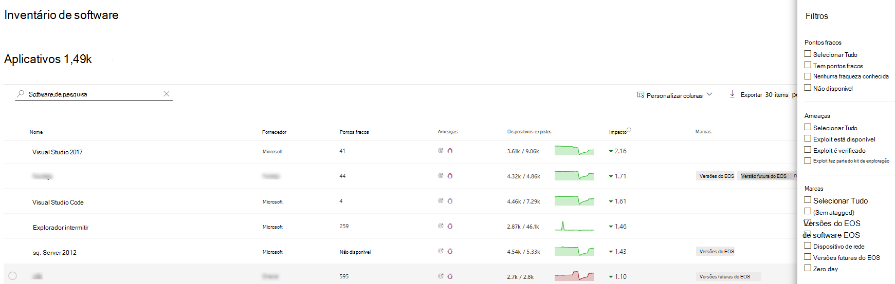
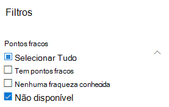
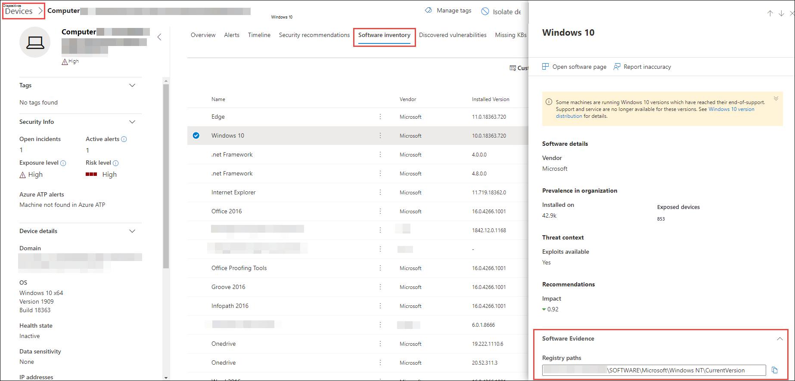
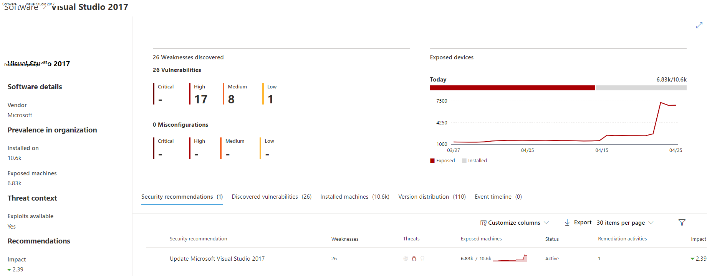

# Inventário de software - Gerenciamento de Ameaças e VulnerabilidadesSoftware inventory - threat and vulnerability management

[!INCLUDE [Microsoft 365 Defender rebranding](../../includes/microsoft-defender.md)]

**Aplica-se a:****Applies to:**
- [Microsoft Defender para Ponto de ExtremidadeMicrosoft Defender for Endpoint](https://go.microsoft.com/fwlink/?linkid=2154037)
- [Ameaça e Gerenciamento de VulnerabilidadesThreat and vulnerability management](next-gen-threat-and-vuln-mgt.md)
- [Microsoft 365 DefenderMicrosoft 365 Defender](https://go.microsoft.com/fwlink/?linkid=2118804)

>Deseja experimentar o Defender para Ponto de Extremidade?Want to experience Defender for Endpoint? [Inscreva-se para uma avaliação gratuita.Sign up for a free trial.](https://www.microsoft.com/microsoft-365/windows/microsoft-defender-atp?ocid=docs-wdatp-portaloverview-abovefoldlink)

O inventário de software no Gerenciamento de Ameaças e Vulnerabilidades é uma lista de softwares conhecidos em sua organização com enumerações de [plataformas comuns oficiais (CPE)](https://nvd.nist.gov/products/cpe).The software inventory in threat and vulnerability management is a list of known software in your organization with official [Common Platform Enumerations (CPE)](https://nvd.nist.gov/products/cpe). Os produtos de software sem uma CPE oficial não têm vulnerabilidades publicadas.Software products without an official CPE don’t have vulnerabilities published. Ele também inclui detalhes como o nome do fornecedor, número de pontos fracos, ameaças e número de dispositivos expostos.It also includes details such as the name of the vendor, number of weaknesses, threats, and number of exposed devices.

## Como funcionaHow it works

No campo da descoberta, estamos aproveitando o mesmo conjunto de sinais que é responsável pela avaliação de detecção e vulnerabilidade no Microsoft Defender para recursos de detecção e resposta de ponto de [extremidade.](overview-endpoint-detection-response.md)In the field of discovery, we're leveraging the same set of signals that is responsible for detection and vulnerability assessment in [Microsoft Defender for Endpoint detection and response capabilities](overview-endpoint-detection-response.md).

Como é em tempo real, em questão de minutos, você verá informações de vulnerabilidade à medida que elas são descobertas.Since it's real time, in a matter of minutes, you'll see vulnerability information as they get discovered. O mecanismo captura automaticamente informações de vários feeds de segurança.The engine automatically grabs information from multiple security feeds. Na verdade, você verá se um software específico está conectado a uma campanha de ameaça ao vivo.In fact, you'll see if a particular software is connected to a live threat campaign. Ele também fornece um link para um relatório de Análise de Ameaças assim que ele está disponível.It also provides a link to a Threat Analytics report soon as it's available.

## Navegue até a página Inventário de softwareNavigate to the Software inventory page

Acesse a página Inventário de software selecionando **Inventário de software** Gerenciamento de Ameaças e Vulnerabilidades menu de navegação no [Central de Segurança do Microsoft Defender](portal-overview.md).Access the Software inventory page by selecting **Software inventory** from the threat and vulnerability management navigation menu in the [Microsoft Defender Security Center](portal-overview.md).

Exibir software em dispositivos específicos nas páginas de dispositivos individuais da lista [de dispositivos](machines-view-overview.md).View software on specific devices in the individual devices pages from the [devices list](machines-view-overview.md).

>[!NOTE]
>Se você procurar software usando a pesquisa global do Microsoft Defender for Endpoint, certifique-se de colocar um sublinhado em vez de um espaço.If you search for software using the Microsoft Defender for Endpoint global search, make sure to put an underscore instead of a space. Por exemplo, para os melhores resultados de pesquisa, você escreveria "windows_10" em vez de "Windows 10".For example, for the best search results you'd write "windows_10" instead of "Windows 10".

## Visão geral do inventário de softwareSoftware inventory overview

A **página inventário** de software é aberta com uma lista de softwares instalados em sua rede, incluindo o nome do fornecedor, as fraquezas encontradas, as ameaças associadas a eles, dispositivos expostos, impacto na pontuação de exposição e marcas.The **Software inventory** page opens with a list of software installed in your network, including the vendor name, weaknesses found, threats associated with them, exposed devices, impact to exposure score, and tags.

Você pode filtrar a exibição de lista com base em pontos fracos encontrados no software, ameaças associadas a eles e marcas como se o software atingiu o fim do suporte.You can filter the list view based on weaknesses found in the software, threats associated with them, and tags like whether the software has reached end-of-support.

Selecione o software que você deseja investigar.Select the software that you want to investigate. Um painel de sobrevoo será aberto com uma exibição mais compacta das informações na página.A flyout panel will open with a more compact view of the information on the page. Você pode mergulhar mais profundamente na investigação e selecionar **Abrir página de software** ou sinalizar quaisquer inconsistências técnicas selecionando Report **inexatidão**.You can either dive deeper into the investigation and select **Open software page**, or flag any technical inconsistencies by selecting **Report inaccuracy**.

### Software que não tem suporteSoftware that isn't supported

Softwares que não são suportados atualmente por ameaças & Gerenciamento de Vulnerabilidades podem estar presentes na página Inventário de software.Software that isn't currently supported by threat & vulnerability management may be present in the Software inventory page. Como não há suporte, apenas dados limitados estarão disponíveis.Because it is not supported, only limited data will be available. Filtrar por software sem suporte com a opção "Não disponível" na seção "Fraqueza".Filter by unsupported software with the "Not available" option in the "Weakness" section.

O seguinte indica que não há suporte para um software:The following indicates that a software is not supported:

- O campo Pontos Fracos mostra "Não disponível"Weaknesses field shows "Not available"
- O campo Dispositivos Expostos mostra um traçoExposed devices field shows a dash
- Texto informacional adicionado no painel lateral e na página de softwareInformational text added in side panel and in software page
- A página de software não terá as recomendações de segurança, vulnerabilidades descobertas ou seções de linha do tempo do eventoThe software page won't have the security recommendations, discovered vulnerabilities, or event timeline sections

Atualmente, os produtos sem um CPE não são mostrados na página de inventário de software, somente no inventário de software no nível do dispositivo.Currently, products without a CPE are not shown in the software inventory page, only in the device level software inventory.

## Inventário de software em dispositivosSoftware inventory on devices

No painel Central de Segurança do Microsoft Defender de navegação, vá para a lista **[Dispositivos](machines-view-overview.md)**.From the Microsoft Defender Security Center navigation panel, go to the **[Devices list](machines-view-overview.md)**. Selecione o nome de um dispositivo para abrir a página do dispositivo (como Computador1) e selecione a guia Inventário de **software** para ver uma lista de todos os softwares conhecidos presentes no dispositivo.Select the name of a device to open the device page (like Computer1), then select the **Software inventory** tab to see a list of all the known software present on the device. Selecione uma entrada de software específica para abrir o sobrevoo com mais informações.Select a specific software entry to open the flyout with more information.

O software pode estar visível no nível do dispositivo, mesmo que ele não tenha suporte no momento por Gerenciamento de Ameaças e Vulnerabilidades.Software may be visible at the device level even if it is currently not supported by threat and vulnerability management. No entanto, apenas dados limitados estarão disponíveis.However, only limited data will be available. Você saberá se o software não tem suporte porque ele dirá "Não disponível" na coluna "Fraqueza".You'll know if software is unsupported because it will say "Not available" in the "Weakness" column.

Software sem CPE também pode aparecer no inventário de software específico deste dispositivo.Software with no CPE can also show up under this device specific software inventory.

### Evidências de softwareSoftware evidence

Consulte evidências de onde detectamos um software específico em um dispositivo do Registro, disco ou ambos. Você pode encontrá-lo em qualquer dispositivo no inventário de software do dispositivo.See evidence of where we detected a specific software on a device from the registry, disk, or both.You can find it on any device in the device software inventory.

Selecione um nome de software para abrir o sobrevoo e procure a seção chamada "Evidência de Software".Select a software name to open the flyout, and look for the section called "Software Evidence."

## Páginas de softwareSoftware pages

Você pode exibir páginas de software de algumas maneiras diferentes:You can view software pages a few different ways:

- Página de inventário de software > Selecione um nome de software > selecione **Abrir página de software** no flyoutSoftware inventory page > Select a software name > Select **Open software page** in the flyout
- [Página de recomendações](tvm-security-recommendation.md) de segurança > Selecione uma recomendação > Selecione **Abrir software** no sobrevoo[Security recommendations page](tvm-security-recommendation.md) > Select a recommendation > Select **Open software page** in the flyout
- [Página de](threat-and-vuln-mgt-event-timeline.md) linha do tempo do evento > Selecione um evento > Selecione o nome do software hiperlink (como Visual Studio 2017) na seção chamada "Componente relacionado" no flyout[Event timeline page](threat-and-vuln-mgt-event-timeline.md) > Select an event > Select the hyperlinked software name (like Visual Studio 2017) in the section called "Related component" in the flyout

 Uma página completa aparecerá com todos os detalhes de um software específico e as seguintes informações:A full page will appear with all the details of a specific software and the following information:

- Painel lateral com informações do fornecedor, prevalência do software na organização (incluindo o número de dispositivos em que ele está instalado e dispositivos expostos que não são remendados), se e exploração está disponível e impacto na pontuação de exposição.Side panel with vendor information, prevalence of the software in the organization (including number of devices it's installed on, and exposed devices that aren't patched), whether and exploit is available, and impact to your exposure score.
- Visualizações de dados mostrando o número de vulnerabilidades e configurações inconfigurações e gravidade.Data visualizations showing the number of, and severity of, vulnerabilities and misconfigurations. Além disso, gráficos com o número de dispositivos expostos.Also, graphs with the number of exposed devices.
- Guias mostrando informações como:Tabs showing information such as:
    - Recomendações de segurança correspondentes para as fraquezas e vulnerabilidades identificadas.Corresponding security recommendations for the weaknesses and vulnerabilities identified.
    - CVEs nomeadas de vulnerabilidades descobertas.Named CVEs of discovered vulnerabilities.
    - Dispositivos que têm o software instalado (juntamente com o nome do dispositivo, domínio, sistema operacional e muito mais).Devices that have the software installed (along with device name, domain, OS, and more).
    - Lista de versões de software (incluindo o número de dispositivos em que a versão está instalada, o número de vulnerabilidades descobertas e os nomes dos dispositivos instalados).Software version list (including number of devices the version is installed on, the number of discovered vulnerabilities, and the names of the installed devices).

    

## Imprecisão de relatórioReport inaccuracy

Reporte um falso positivo quando vir qualquer informação vagas, impreciso ou incompleta.Report a false positive when you see any vague, inaccurate, or incomplete information. Você também pode relatar as recomendações de segurança que já foram remediadas.You can also report on security recommendations that have already been remediated.

1. Abra o sobrevoo de software na página Inventário de software.Open the software flyout on the Software inventory page.
2. Selecione **Relatório impreciso**.Select **Report inaccuracy**.
3. No painel submenu, selecione a categoria impreciso no menu suspenso, preencha seu endereço de email e detalhes sobre a imprecisão.From the flyout pane, select the inaccuracy category from the drop-down menu, fill in your email address, and details about the inaccuracy.
4. Selecione **Enviar**.Select **Submit**. Seus comentários são enviados imediatamente aos especialistas Gerenciamento de Ameaças e Vulnerabilidades segurança.Your feedback is immediately sent to the threat and vulnerability management experts.

## Artigos relacionadosRelated articles

- [Visão geral Gerenciamento de Vulnerabilidades ameaçaThreat and vulnerability management overview](next-gen-threat-and-vuln-mgt.md)
- [Recomendações de segurançaSecurity recommendations](tvm-security-recommendation.md)
- [Cronograma do eventoEvent timeline](threat-and-vuln-mgt-event-timeline.md)
- [Exibir e organizar a lista do Microsoft Defender for Endpoint DevicesView and organize the Microsoft Defender for Endpoint Devices list](machines-view-overview.md)
