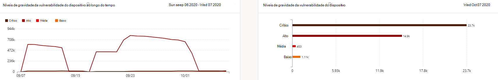
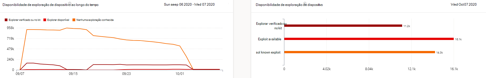
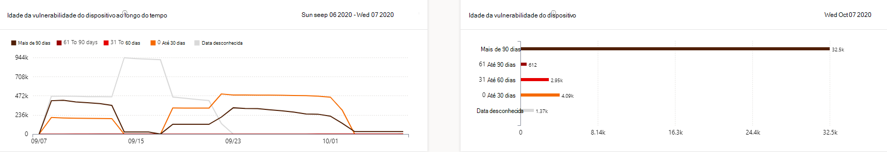
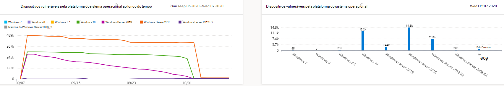
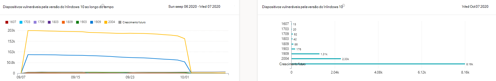

# Relatório de dispositivos vulneráveis - gerenciamento de ameaças e vulnerabilidadesVulnerable devices report - threat and vulnerability management

[!INCLUDE [Microsoft 365 Defender rebranding](../../includes/microsoft-defender.md)]

**Aplica-se a:****Applies to:**

- [Microsoft Defender para Ponto de ExtremidadeMicrosoft Defender for Endpoint](https://go.microsoft.com/fwlink/?linkid=2154037)
- [Gerenciamento de ameaças e vulnerabilidadesThreat and vulnerability management](next-gen-threat-and-vuln-mgt.md)
- [Microsoft 365 DefenderMicrosoft 365 Defender](https://go.microsoft.com/fwlink/?linkid=2118804)

>Deseja experimentar o Microsoft Defender para Ponto de Extremidade?Want to experience Microsoft Defender for Endpoint? [Inscreva-se para uma avaliação gratuita.Sign up for a free trial.](https://www.microsoft.com/microsoft-365/windows/microsoft-defender-atp?ocid=docs-wdatp-portaloverview-abovefoldlink)

O relatório mostra gráficos e gráficos de barras com tendências de dispositivos vulneráveis e estatísticas atuais.The report shows graphs and bar charts with vulnerable device trends and current statistics. O objetivo é que você entenda o hálito e o escopo da exposição do dispositivo.The goal is for you to understand the breath and scope of your device exposure. 

Acesse o relatório no Centro de Segurança do Microsoft Defender acessando **Relatórios > dispositivos vulneráveis**Access the report in the Microsoft Defender Security Center by going to **Reports > Vulnerable devices**

Há duas colunas:There are two columns:

- Tendências (com o tempo).Trends (over time). Pode mostrar os últimos 30 dias, 3 meses, 6 meses ou um intervalo de datas personalizado.Can show the past 30 days, 3 months, 6 months, or a custom date range.
- Hoje (informações atuais)Today (current information)

**Filtro**: Você pode filtrar os dados por níveis de gravidade de vulnerabilidade, disponibilidade de exploração, idade da vulnerabilidade, plataforma do sistema operacional, versão do Windows 10 ou grupo de dispositivos.**Filter**: You can filter the data by vulnerability severity levels, exploit availability, vulnerability age, operating system platform, Windows 10 version, or device group.

**Detalhar**: se houver uma visão que você deseja explorar mais, selecione o gráfico de barras relevante para exibir uma lista filtrada de dispositivos na página Inventário de dispositivos.**Drill down**: If there is an insight you want to explore further, select the relevant bar chart to view a filtered list of devices in the Device inventory page. A partir daí, você pode exportar a lista.From there, you can export the list.

## Gráficos de nível de gravidadeSeverity level graphs

Cada dispositivo é contado apenas uma vez de acordo com a vulnerabilidade mais grave encontrada nesse dispositivo.Each device is counted only once according to the most severe vulnerability found on that device.

## Explorar gráficos de disponibilidadeExploit availability graphs

Cada dispositivo é contado apenas uma vez com base no nível mais alto de exploração conhecida.Each device is counted only once based on the highest level of known exploit.

## Gráficos de idade de vulnerabilidadeVulnerability age graphs

Cada dispositivo é contado apenas uma vez na data de publicação de vulnerabilidade mais antiga.Each device is counted only once under the oldest vulnerability publication date. As vulnerabilidades mais antigas têm mais chances de serem exploradas.Older vulnerabilities have a higher chance of being exploited.

## Dispositivos vulneráveis por gráficos de plataforma do sistema operacionalVulnerable devices by operating system platform graphs

O número de dispositivos em cada sistema operacional que são expostos devido a vulnerabilidades de software.The number of devices on each operating system that are exposed due to software vulnerabilities.

## Dispositivos vulneráveis por gráficos de versão do Windows 10Vulnerable devices by Windows 10 version graphs

O número de dispositivos em cada versão do Windows 10 que são expostos devido a aplicativos ou sistema operacional vulneráveis.The number of devices on each Windows 10 version that are exposed due to vulnerable applications or OS.

## Tópicos relacionadosRelated topics

- [Visão geral do gerenciamento de ameaças e vulnerabilidadesThreat and vulnerability management overview](next-gen-threat-and-vuln-mgt.md)
- [Recomendações de segurançaSecurity recommendations](tvm-security-recommendation.md)
