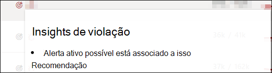
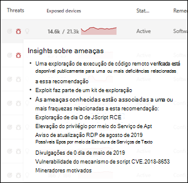
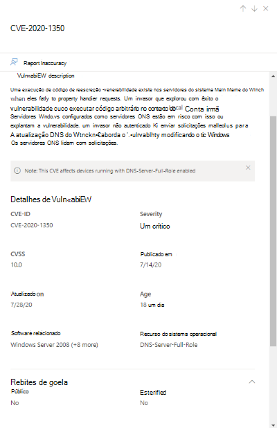
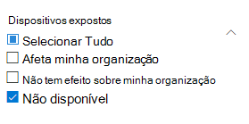
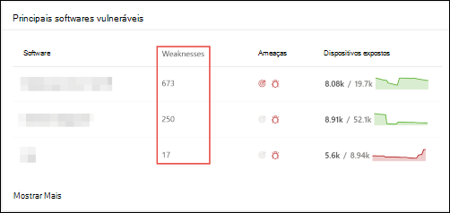
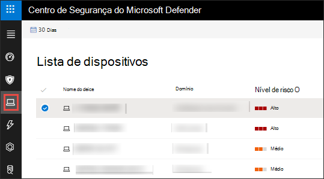
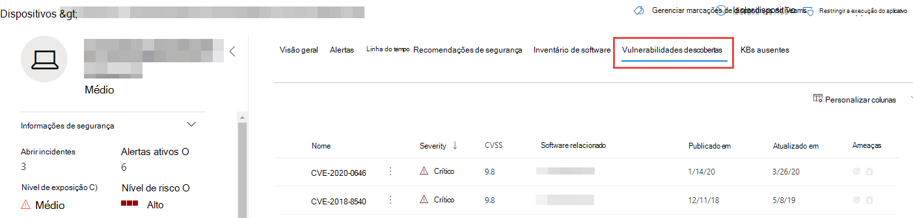
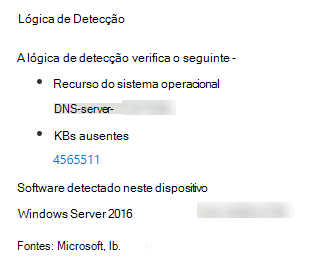

# Vulnerabilidades na minha organização - gerenciamento de ameaças e vulnerabilidades

[!INCLUDE [Microsoft 365 Defender rebranding](../../includes/microsoft-defender.md)]

**Aplica-se a:**
- [Microsoft Defender para Ponto de Extremidade](https://go.microsoft.com/fwlink/?linkid=2154037)
- [Gerenciamento de ameaças e vulnerabilidades](next-gen-threat-and-vuln-mgt.md)
- [Microsoft 365 Defender](https://go.microsoft.com/fwlink/?linkid=2118804)

>Deseja experimentar o Microsoft Defender para Ponto de Extremidade? [Inscreva-se para uma avaliação gratuita.](https://www.microsoft.com/microsoft-365/windows/microsoft-defender-atp?ocid=docs-wdatp-portaloverview-abovefoldlink)

O gerenciamento de ameaças e vulnerabilidades usa os mesmos sinais no Defender for Endpoint's endpoint protection para verificar e detectar vulnerabilidades.

A **página Fraquezas** lista as vulnerabilidades de software às que seus dispositivos são expostos listando a ID de Vulnerabilidades Comuns e Exposições (CVE). Você também pode exibir a gravidade, a classificação do Sistema de Pontuação de Vulnerabilidade Comum (CVSS), a prevalência em sua organização, a violação correspondente, as informações sobre ameaças e muito mais.

>[!NOTE]
>Se não houver nenhuma CVE-ID oficial atribuída a uma vulnerabilidade, o nome da vulnerabilidade será atribuído pelo gerenciamento de ameaças e vulnerabilidades.

>[!TIP]
>Para obter emails sobre novos eventos de vulnerabilidade, consulte [Configure vulnerability email notifications in Microsoft Defender for Endpoint](configure-vulnerability-email-notifications.md)

## Navegue até a página Pontos Fracos

Acesse a página Pontos Fracos de algumas maneiras diferentes:

- Selecionando **pontos fracos** no menu de navegação de gerenciamento de ameaças e vulnerabilidades no [Centro de Segurança do Microsoft Defender](portal-overview.md)
- Pesquisa global

### Menu de navegação

Vá para o menu de navegação de gerenciamento de ameaças e vulnerabilidades e selecione **Pontos Fracos** para abrir a lista de CVEs.

### Vulnerabilidades na pesquisa global

1. Vá para o menu suspenso de pesquisa global.
2. Selecione **Vulnerabilidade e** chave na ID de Vulnerabilidades e Exposições Comuns (CVE) que você está procurando e selecione o ícone de pesquisa. A **página Pontos Fracos** é aberta com as informações CVE que você está procurando.

3. Selecione o CVE para abrir um painel de sobremenu com mais informações, incluindo a descrição da vulnerabilidade, detalhes, insights de ameaças e dispositivos expostos.

Para ver o restante das vulnerabilidades na página **Fraquezas,** digite CVE e selecione pesquisar.

## Visão geral de pontos fracos

Correção das vulnerabilidades em dispositivos expostos para reduzir o risco para seus ativos e organização. Se a **coluna Dispositivos Expostos** mostrar 0, isso significa que você não está em risco.

### Insights sobre violações e ameaças

Exibir quaisquer informações relacionadas de violação e ameaça na coluna **Ameaça** quando os ícones são coloridos em vermelho.

 >[!NOTE]
 > Sempre priorize as recomendações associadas a ameaças em andamento. Essas recomendações são marcadas com o ícone de visão de ameaça  e ícone de insight de violação  .  

O ícone de insights de violação será realçado se houver uma vulnerabilidade encontrada em sua organização.

O ícone de insights de ameaça será realçado se houver explorações associadas na vulnerabilidade encontrada em sua organização. Passar o mouse sobre o ícone mostra se a ameaça faz parte de um kit de exploração ou se está conectada a campanhas ou grupos de atividades persistentes ou persistentes específicos. Quando disponível, há um link para um relatório do Threat Analytics com notícias de exploração zero dia, divulgações ou avisos de segurança relacionados.  

### Obter percepções de vulnerabilidade

Se você selecionar um CVE, um painel de sobremenu será aberto com mais informações, como a descrição da vulnerabilidade, detalhes, percepções de ameaças e dispositivos expostos.

- A categoria "Recurso do sistema operacional" é mostrada em cenários relevantes
- Você pode ir para a recomendação de segurança relacionada para cada CVE com dispositivo exposto

 

### Software que não tem suporte

As CVEs para softwares que não são suportadas atualmente pelo gerenciamento de vulnerabilidades & ameaças ainda estão presentes na página Pontos Fracos. Como o software não tem suporte, somente dados limitados estarão disponíveis.

As informações do dispositivo expostos não estarão disponíveis para CVEs com software sem suporte. Filtrar por software sem suporte selecionando a opção "Não disponível" na seção "Dispositivos expostos".

 

## Exibir entradas CVE (Common Vulnerabilities and Exposures) em outros locais

### Principais softwares vulneráveis no painel

1. Vá para o painel de gerenciamento de ameaças e [vulnerabilidades](tvm-dashboard-insights.md) e role para baixo até o widget de **software principal vulnerável.** Você verá o número de vulnerabilidades encontradas em cada software, juntamente com informações de ameaça e uma exibição de alto nível da exposição do dispositivo ao longo do tempo.

    

2. Selecione o software que você deseja investigar para ir para uma página de detalhamento.
3. Selecione a **guia Vulnerabilidades Descobertas.**
4. Selecione a vulnerabilidade que você deseja investigar para obter mais informações sobre detalhes de vulnerabilidade

    

### Descobrir vulnerabilidades na página do dispositivo

Exibir informações de pontos fracos relacionados na página do dispositivo.

1. Vá até a barra de menus do Centro de Segurança do Microsoft Defender e selecione o ícone do dispositivo. A **página de lista Dispositivos** é aberta.
2. Na página **lista Dispositivos,** selecione o nome do dispositivo que você deseja investigar.

    

3. A página do dispositivo será aberta com detalhes e opções de resposta para o dispositivo que você deseja investigar.
4. Selecione **Vulnerabilidades descobertas.**

    

5. Selecione a vulnerabilidade que você deseja investigar para abrir um painel de sobremenu com os detalhes do CVE, como: descrição da vulnerabilidade, insights de ameaças e lógica de detecção.

#### Lógica de Detecção CVE

Semelhante à evidência de software, agora mostramos a lógica de detecção que aplicamos em um dispositivo para dizer que ele está vulnerável. A nova seção é chamada de "Lógica de Detecção" (em qualquer vulnerabilidade descoberta na página do dispositivo) e mostra a lógica de detecção e a origem.

A categoria "Recurso do sistema operacional" também é mostrada em cenários relevantes. Um CVE afetaria dispositivos que executem um sistema operacional vulnerável somente se um componente do sistema operacional específico estiver habilitado. Digamos que o Windows Server 2019 tenha vulnerabilidade em seu componente DNS. Com esse novo recurso, só anexamos esse CVE aos dispositivos Windows Server 2019 com a funcionalidade DNS habilitada em seu sistema operacional.

## Imprecisão de relatório

Reporte um falso positivo quando vir qualquer informação vagas, impreciso ou incompleta. Você também pode relatar as recomendações de segurança que já foram remediadas.

1. Abra o CVE na página Fraquezas.
2. Selecione **Relatório impreciso** e um painel de sub-subfalsão será aberto.
3. Selecione a categoria impreciso no menu suspenso e preencha seu endereço de email e detalhes impreciso.
4. Selecione **Enviar**. Seus comentários são enviados imediatamente para os especialistas em gerenciamento de ameaças e vulnerabilidades.

## Artigos relacionados

- [Visão geral do gerenciamento de ameaças e vulnerabilidades](next-gen-threat-and-vuln-mgt.md)
- [Recomendações de segurança](tvm-security-recommendation.md)
- [Inventário de software](tvm-software-inventory.md)
- [Painel de insights](tvm-dashboard-insights.md)
- [Exibir e organizar a lista do Microsoft Defender for Endpoint Devices](machines-view-overview.md)
