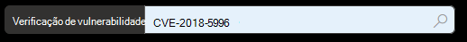

# Vulnerabilidades na minha organização - gerenciamento de ameaças e vulnerabilidadesVulnerabilities in my organization - threat and vulnerability management

[!INCLUDE [Microsoft 365 Defender rebranding](../../includes/microsoft-defender.md)]

**Aplica-se a:****Applies to:**
- [Microsoft Defender para Ponto de ExtremidadeMicrosoft Defender for Endpoint](https://go.microsoft.com/fwlink/?linkid=2154037)
- [Gerenciamento de ameaças e vulnerabilidadesThreat and vulnerability management](next-gen-threat-and-vuln-mgt.md)
- [Microsoft 365 DefenderMicrosoft 365 Defender](https://go.microsoft.com/fwlink/?linkid=2118804)

>Deseja experimentar o Microsoft Defender para Ponto de Extremidade?Want to experience Microsoft Defender for Endpoint? [Inscreva-se para uma avaliação gratuita.Sign up for a free trial.](https://www.microsoft.com/microsoft-365/windows/microsoft-defender-atp?ocid=docs-wdatp-portaloverview-abovefoldlink)

O gerenciamento de ameaças e vulnerabilidades usa os mesmos sinais no Defender for Endpoint's endpoint protection para verificar e detectar vulnerabilidades.Threat and vulnerability management uses the same signals in Defender for Endpoint's endpoint protection to scan and detect vulnerabilities.

A **página Fraquezas** lista as vulnerabilidades de software às que seus dispositivos são expostos listando a ID de Vulnerabilidades Comuns e Exposições (CVE).The **Weaknesses** page lists the software vulnerabilities your devices are exposed to by listing the Common Vulnerabilities and Exposures (CVE) ID. Você também pode exibir a gravidade, a classificação do Sistema de Pontuação de Vulnerabilidade Comum (CVSS), a prevalência em sua organização, a violação correspondente, as informações sobre ameaças e muito mais.You can also view the severity, Common Vulnerability Scoring System (CVSS) rating, prevalence in your organization, corresponding breach, threat insights, and more.

>[!NOTE]
>Se não houver nenhuma CVE-ID oficial atribuída a uma vulnerabilidade, o nome da vulnerabilidade será atribuído pelo gerenciamento de ameaças e vulnerabilidades.If there is no official CVE-ID assigned to a vulnerability, the vulnerability name is assigned by threat and vulnerability management.

>[!TIP]
>Para obter emails sobre novos eventos de vulnerabilidade, consulte [Configure vulnerability email notifications in Microsoft Defender for Endpoint](configure-vulnerability-email-notifications.md)To get emails about new vulnerability events, see [Configure vulnerability email notifications in Microsoft Defender for Endpoint](configure-vulnerability-email-notifications.md)

## Navegue até a página Pontos FracosNavigate to the Weaknesses page

Acesse a página Pontos Fracos de algumas maneiras diferentes:Access the Weaknesses page a few different ways:

- Selecionando **pontos fracos** no menu de navegação de gerenciamento de ameaças e vulnerabilidades no [Centro de Segurança do Microsoft Defender](portal-overview.md)Selecting **Weaknesses** from the threat and vulnerability management navigation menu in the [Microsoft Defender Security Center](portal-overview.md)
- Pesquisa globalGlobal search

### Menu de navegaçãoNavigation menu

Vá para o menu de navegação de gerenciamento de ameaças e vulnerabilidades e selecione **Pontos Fracos** para abrir a lista de CVEs.Go to the threat and vulnerability management navigation menu and select **Weaknesses** to open the list of CVEs.

### Vulnerabilidades na pesquisa globalVulnerabilities in global search

1. Vá para o menu suspenso de pesquisa global.Go to the global search drop-down menu.
2. Selecione **Vulnerabilidade e** chave na ID de Vulnerabilidades e Exposições Comuns (CVE) que você está procurando e selecione o ícone de pesquisa.Select **Vulnerability** and key-in the Common Vulnerabilities and Exposures (CVE) ID that you're looking for, then select the search icon. A **página Pontos Fracos** é aberta com as informações CVE que você está procurando.The **Weaknesses** page opens with the CVE information that you're looking for.

3. Selecione o CVE para abrir um painel de sobremenu com mais informações, incluindo a descrição da vulnerabilidade, detalhes, insights de ameaças e dispositivos expostos.Select the CVE to open a flyout panel with more information, including the vulnerability description, details, threat insights, and exposed devices.

Para ver o restante das vulnerabilidades na página **Fraquezas,** digite CVE e selecione pesquisar.To see the rest of the vulnerabilities in the **Weaknesses** page, type CVE, then select search.

## Visão geral de pontos fracosWeaknesses overview

Correção das vulnerabilidades em dispositivos expostos para reduzir o risco para seus ativos e organização.Remediate the vulnerabilities in exposed devices to reduce the risk to your assets and organization. Se a **coluna Dispositivos Expostos** mostrar 0, isso significa que você não está em risco.If the **Exposed Devices** column shows 0, that means you aren't at risk.

### Insights sobre violações e ameaçasBreach and threat insights

Exibir quaisquer informações relacionadas de violação e ameaça na coluna **Ameaça** quando os ícones são coloridos em vermelho.View any related breach and threat insights in the **Threat** column when the icons are colored red.

 >[!NOTE]
 > Sempre priorize as recomendações associadas a ameaças em andamento.Always prioritize recommendations that are associated with ongoing threats. Essas recomendações são marcadas com o ícone de visão de ameaça These recommendations are marked with the threat insight icon  e ícone de insight de violação  .and breach insight icon .  

O ícone de insights de violação será realçado se houver uma vulnerabilidade encontrada em sua organização.The breach insights icon is highlighted if there's a vulnerability found in your organization.
This one says "possible active alert is associated with this recommendation.](images/tvm-breach-insights.png)

O ícone de insights de ameaça será realçado se houver explorações associadas na vulnerabilidade encontrada em sua organização.The threat insights icon is highlighted if there are associated exploits in the vulnerability found in your organization. Passar o mouse sobre o ícone mostra se a ameaça faz parte de um kit de exploração ou se está conectada a campanhas ou grupos de atividades persistentes ou persistentes específicos.Hovering over the icon shows whether the threat is a part of an exploit kit, or connected to specific advanced persistent campaigns or activity groups. Quando disponível, há um link para um relatório do Threat Analytics com notícias de exploração zero dia, divulgações ou avisos de segurança relacionados.When available, there's a link to a Threat Analytics report with zero-day exploitation news, disclosures, or related security advisories.  

### Obter percepções de vulnerabilidadeGain vulnerability insights

Se você selecionar um CVE, um painel de sobremenu será aberto com mais informações, como a descrição da vulnerabilidade, detalhes, percepções de ameaças e dispositivos expostos.If you select a CVE, a flyout panel will open with more information such as the vulnerability description, details, threat insights, and exposed devices.

- A categoria "Recurso do sistema operacional" é mostrada em cenários relevantesThe "OS Feature" category is shown in relevant scenarios
- Você pode ir para a recomendação de segurança relacionada para cada CVE com dispositivo expostoYou can go to the related security recommendation for every CVE with exposed device

 

### Software que não tem suporteSoftware that isn't supported

As CVEs para softwares que não são suportadas atualmente pelo gerenciamento de vulnerabilidades & ameaças ainda estão presentes na página Pontos Fracos.CVEs for software that isn't currently supported by threat & vulnerability management is still present in the Weaknesses page. Como o software não tem suporte, somente dados limitados estarão disponíveis.Because the software is not supported, only limited data will be available.

As informações do dispositivo expostos não estarão disponíveis para CVEs com software sem suporte.Exposed device information will not be available for CVEs with unsupported software. Filtrar por software sem suporte selecionando a opção "Não disponível" na seção "Dispositivos expostos".Filter by unsupported software by selecting the "Not available" option in the "Exposed devices" section.

 

## Exibir entradas CVE (Common Vulnerabilities and Exposures) em outros locaisView Common Vulnerabilities and Exposures (CVE) entries in other places

### Principais softwares vulneráveis no painelTop vulnerable software in the dashboard

1. Vá para o painel de gerenciamento de ameaças e [vulnerabilidades](tvm-dashboard-insights.md) e role para baixo até o widget de **software principal vulnerável.**Go to the [threat and vulnerability management dashboard](tvm-dashboard-insights.md) and scroll down to the **Top vulnerable software** widget. Você verá o número de vulnerabilidades encontradas em cada software, juntamente com informações de ameaça e uma exibição de alto nível da exposição do dispositivo ao longo do tempo.You will see the number of vulnerabilities found in each software, along with threat information and a high-level view of device exposure over time.

    

2. Selecione o software que você deseja investigar para ir para uma página de detalhamento.Select the software you want to investigate to go to a drilldown page.
3. Selecione a **guia Vulnerabilidades Descobertas.**Select the **Discovered vulnerabilities** tab.
4. Selecione a vulnerabilidade que você deseja investigar para obter mais informações sobre detalhes de vulnerabilidadeSelect the vulnerability you want to investigate for more information on vulnerability details

    

### Descobrir vulnerabilidades na página do dispositivoDiscover vulnerabilities in the device page

Exibir informações de pontos fracos relacionados na página do dispositivo.View related weaknesses information in the device page.

1. Vá até a barra de menus do Centro de Segurança do Microsoft Defender e selecione o ícone do dispositivo.Go to the Microsoft Defender Security Center navigation menu bar, then select the device icon. A **página de lista Dispositivos** é aberta.The **Devices list** page opens.
2. Na página **lista Dispositivos,** selecione o nome do dispositivo que você deseja investigar.In the **Devices list** page, select the device name that you want to investigate.

    

3. A página do dispositivo será aberta com detalhes e opções de resposta para o dispositivo que você deseja investigar.The device page will open with details and response options for the device you want to investigate.
4. Selecione **Vulnerabilidades descobertas.**Select **Discovered vulnerabilities**.

    

5. Selecione a vulnerabilidade que você deseja investigar para abrir um painel de sobremenu com os detalhes do CVE, como: descrição da vulnerabilidade, insights de ameaças e lógica de detecção.Select the vulnerability that you want to investigate to open up a flyout panel with the CVE details, such as: vulnerability description, threat insights, and detection logic.

#### Lógica de Detecção CVECVE Detection logic

Semelhante à evidência de software, agora mostramos a lógica de detecção que aplicamos em um dispositivo para dizer que ele está vulnerável.Similar to the software evidence, we now show the detection logic we applied on a device in order to state that it's vulnerable. A nova seção é chamada de "Lógica de Detecção" (em qualquer vulnerabilidade descoberta na página do dispositivo) e mostra a lógica de detecção e a origem.The new section is called "Detection Logic" (in any discovered vulnerability in the device page) and shows the detection logic and source.

A categoria "Recurso do sistema operacional" também é mostrada em cenários relevantes.The "OS Feature" category is also shown in relevant scenarios. Um CVE afetaria dispositivos que executem um sistema operacional vulnerável somente se um componente do sistema operacional específico estiver habilitado.A CVE would affect devices that run a vulnerable OS only if a specific OS component is enabled. Digamos que o Windows Server 2019 tenha vulnerabilidade em seu componente DNS.Let's say Windows Server 2019 has vulnerability in its DNS component. Com esse novo recurso, só anexamos esse CVE aos dispositivos Windows Server 2019 com a funcionalidade DNS habilitada em seu sistema operacional.With this new capability, we’ll only attach this CVE to the Windows Server 2019 devices with the DNS capability enabled in their OS.

## Imprecisão de relatórioReport inaccuracy

Reporte um falso positivo quando vir qualquer informação vagas, impreciso ou incompleta.Report a false positive when you see any vague, inaccurate, or incomplete information. Você também pode relatar as recomendações de segurança que já foram remediadas.You can also report on security recommendations that have already been remediated.

1. Abra o CVE na página Fraquezas.Open the CVE on the Weaknesses page.
2. Selecione **Relatório impreciso** e um painel de sub-subfalsão será aberto.Select **Report inaccuracy** and a flyout pane will open.
3. Selecione a categoria impreciso no menu suspenso e preencha seu endereço de email e detalhes impreciso.Select the inaccuracy category from the drop-down menu and fill in your email address and inaccuracy details.
4. Selecione **Enviar**.Select **Submit**. Seus comentários são enviados imediatamente para os especialistas em gerenciamento de ameaças e vulnerabilidades.Your feedback is immediately sent to the threat and vulnerability management experts.

## Artigos relacionadosRelated articles

- [Visão geral do gerenciamento de ameaças e vulnerabilidadesThreat and vulnerability management overview](next-gen-threat-and-vuln-mgt.md)
- [Recomendações de segurançaSecurity recommendations](tvm-security-recommendation.md)
- [Inventário de softwareSoftware inventory](tvm-software-inventory.md)
- [Painel de insightsDashboard insights](tvm-dashboard-insights.md)
- [Exibir e organizar a lista do Microsoft Defender for Endpoint DevicesView and organize the Microsoft Defender for Endpoint Devices list](machines-view-overview.md)
