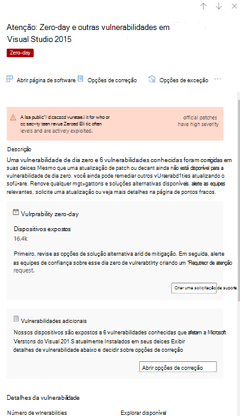

# Mitigar vulnerabilidades de dia zero - Gerenciamento de Ameaças e VulnerabilidadesMitigate zero-day vulnerabilities - threat and vulnerability management

[!INCLUDE [Microsoft 365 Defender rebranding](../../includes/microsoft-defender.md)]

**Aplica-se a:****Applies to:**

- [Microsoft Defender para Ponto de ExtremidadeMicrosoft Defender for Endpoint](https://go.microsoft.com/fwlink/?linkid=2154037)
- [Ameaça e Gerenciamento de VulnerabilidadesThreat and vulnerability management](next-gen-threat-and-vuln-mgt.md)
- [Microsoft 365 DefenderMicrosoft 365 Defender](https://go.microsoft.com/fwlink/?linkid=2118804)

>Deseja experimentar o Microsoft Defender para Ponto de Extremidade?Want to experience Microsoft Defender for Endpoint? [Inscreva-se para uma avaliação gratuita.Sign up for a free trial.](https://www.microsoft.com/microsoft-365/windows/microsoft-defender-atp?ocid=docs-wdatp-portaloverview-abovefoldlink)

Uma vulnerabilidade de dia zero é uma vulnerabilidade publicamente divulgada para a qual nenhum patch oficial ou atualizações de segurança foram lançados.A zero-day vulnerability is a publicly disclosed vulnerability for which no official patches or security updates have been released. As vulnerabilidades de dia zero geralmente têm níveis de alta gravidade e são exploradas ativamente.Zero-day vulnerabilities often have high severity levels and are actively exploited.

A ameaça e Gerenciamento de Vulnerabilidades exibirão apenas vulnerabilidades de dia zero sobre as que ela tem informações.Threat and vulnerability management will only display zero-day vulnerabilities it has information about.

## Encontre informações sobre vulnerabilidades de dia zeroFind information about zero-day vulnerabilities

Depois que uma vulnerabilidade de dia zero tiver sido encontrada, as informações sobre ela serão transmitidas através das experiências a seguir no Central de Segurança do Microsoft Defender.Once a zero-day vulnerability has been found, information about it will be conveyed through the following experiences in the Microsoft Defender Security Center.

>[!NOTE]
> A funcionalidade de 0 dia não está disponível atualmente para produtos que não Windows (Mac, Linux); no entanto, ele será adicionado no futuro.0-day capability is not currently available for non-Windows products (Mac, Linux); it will, however, be added in the future.

### Painel de ameaças e Gerenciamento de Vulnerabilidades de segurançaThreat and vulnerability management dashboard

Procure recomendações com uma marca de dia zero no cartão "Principais recomendações de segurança".Look for recommendations with a zero-day tag in the “Top security recommendations” card.

Encontre o software superior com a marca de dia zero no cartão "Software vulnerável superior".Find top software with the zero-day tag in the "Top vulnerable software" card.

### Página Pontos FracosWeaknesses page

Procure a vulnerabilidade nomeada de dia zero juntamente com uma descrição e detalhes.Look for the named zero-day vulnerability along with a description and details.

- Se essa vulnerabilidade tiver uma CVE-ID atribuída, você verá o rótulo de dia zero ao lado do nome CVE.If this vulnerability has a CVE-ID assigned, you’ll see the zero-day label next to the CVE name.

- Se essa vulnerabilidade não tiver CVE-ID atribuída, você a encontrará em um nome interno e temporário que se parece com "TVM-XXXX-XXXX".If this vulnerability has no CVE-ID assigned, you'll find it under an internal, temporary name that looks like “TVM-XXXX-XXXX”. O nome será atualizado depois que um CVE-ID oficial tiver sido atribuído, mas o nome interno anterior ainda será pesquisável e encontrado no painel lateral.The name will be updated once an official CVE-ID has been assigned, but the previous internal name will still be searchable and found in the side-panel.

### Página de inventário de softwareSoftware inventory page

Procure software com a marca de dia zero.Look for software with the zero-day tag. Filtre pela marca "zero day" para ver apenas software com vulnerabilidades de dia zero.Filter by the "zero day" tag to only see software with zero-day vulnerabilities.

### Página de softwareSoftware page

Procure uma marca de dia zero para cada software afetado pela vulnerabilidade de dia zero.Look for a zero-day tag for each software that has been affected by the zero–day vulnerability.

### Página recomendações de segurançaSecurity recommendations page

Exibir sugestões claras sobre opções de correção e mitigação, incluindo soluções alternativas se elas existirem.View clear suggestions about remediation and mitigation options, including workarounds if they exist. Filtre pela marca "zero dia" para ver apenas as recomendações de segurança que abordam vulnerabilidades de dia zero.Filter by the "zero day" tag to only see security recommendations addressing zero-day vulnerabilities.

Se houver software com uma vulnerabilidade de dia zero e vulnerabilidades adicionais para resolver, você terá uma recomendação sobre todas as vulnerabilidades.If there's software with a zero-day vulnerability and additional vulnerabilities to address, you'll get one recommendation about all vulnerabilities.

## Endereçando vulnerabilidades de dia zeroAddressing zero-day vulnerabilities

Vá para a página de recomendação de segurança e selecione uma recomendação com um dia zero.Go to the security recommendation page and select a recommendation with a zero-day. Um sub-sub-código abrirá com informações sobre o dia zero e outras vulnerabilidades para esse software.A flyout will open with information about the zero-day and other vulnerabilities for that software.

Haverá um link para opções de mitigação e soluções alternativas se elas estão disponíveis.There will be a link to mitigation options and workarounds if they are available. As soluções alternativas podem ajudar a reduzir o risco imposto por essa vulnerabilidade de dia zero até que um patch ou atualização de segurança possa ser implantado.Workarounds may help reduce the risk posed by this zero-day vulnerability until a patch or security update can be deployed.

Abra opções de correção e escolha o tipo de atenção.Open remediation options and choose the attention type. Uma opção de correção "atenção necessária" é recomendada para as vulnerabilidades de dia zero, já que uma atualização ainda não foi lançada.An "attention required" remediation option is recommended for the zero-day vulnerabilities, since an update hasn't been released yet. Você não poderá selecionar uma data de vencimento, já que não há nenhuma ação específica para executar.You won't be able to select a due date, since there's no specific action to perform. Se houver vulnerabilidades mais antigas para esse software que você deseja remediar, você pode substituir a opção de correção "atenção necessária" e escolher "atualizar".If there are older vulnerabilities for this software you wish to remediation, you can override the "attention required" remediation option and choose “update.”

## Acompanhar atividades de correção de dia zeroTrack zero-day remediation activities

Vá para a página Gerenciamento de Ameaças e Vulnerabilidades [Correção para](tvm-remediation.md) exibir o item de atividade de correção.Go to the threat and vulnerability management [Remediation](tvm-remediation.md) page to view the remediation activity item. Se você escolher a opção de correção "atenção necessária", não haverá barra de progresso, status de tíquete ou data de vencimento, já que não há nenhuma ação real que possamos monitorar.If you chose the "attention required" remediation option, there will be no progress bar, ticket status, or due date since there's no actual action we can monitor. Você pode filtrar por tipo de correção, como "atualização de software" ou "atenção necessária", para ver todos os itens de atividade na mesma categoria.You can filter by remediation type, such as "software update" or "attention required," to see all activity items in the same category.

## Corrigir vulnerabilidades de dia zeroPatching zero-day vulnerabilities

Quando um patch é lançado para o dia zero, a recomendação será alterada para "Atualização" e um rótulo azul ao lado dele que diz "Nova atualização de segurança para dia zero".When a patch is released for the zero-day, the recommendation will be changed to “Update” and a blue label next to it that says “New security update for zero day.” Ela não será mais considerada como um dia zero, a marca de dia zero será removida de todas as páginas.It will no longer consider as a zero-day, the zero-day tag will be removed from all pages.

## Artigos relacionadosRelated articles

- [Visão geral Gerenciamento de Vulnerabilidades ameaçaThreat and vulnerability management overview](next-gen-threat-and-vuln-mgt.md)
- [PainelDashboard](tvm-dashboard-insights.md)
- [Recomendações de segurançaSecurity recommendations](tvm-security-recommendation.md)
- [Inventário de softwareSoftware inventory](tvm-software-inventory.md)
- [Vulnerabilidades na minha organizaçãoVulnerabilities in my organization](tvm-weaknesses.md)
