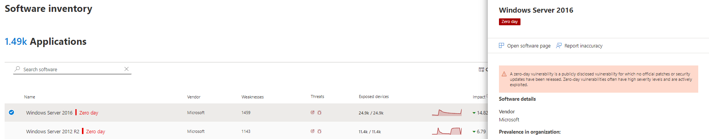

# Mitigar vulnerabilidades de dia zero - Gerenciamento de Ameaças e Vulnerabilidades

[!INCLUDE [Microsoft 365 Defender rebranding](../../includes/microsoft-defender.md)]

**Aplica-se a:**

- [Microsoft Defender para Ponto de Extremidade](https://go.microsoft.com/fwlink/?linkid=2154037)
- [Ameaça e Gerenciamento de Vulnerabilidades](next-gen-threat-and-vuln-mgt.md)
- [Microsoft 365 Defender](https://go.microsoft.com/fwlink/?linkid=2118804)

>Deseja experimentar o Microsoft Defender para Ponto de Extremidade? [Inscreva-se para uma avaliação gratuita.](https://www.microsoft.com/microsoft-365/windows/microsoft-defender-atp?ocid=docs-wdatp-portaloverview-abovefoldlink)

Uma vulnerabilidade de dia zero é uma vulnerabilidade publicamente divulgada para a qual nenhum patch oficial ou atualizações de segurança foram lançados. As vulnerabilidades de dia zero geralmente têm níveis de alta gravidade e são exploradas ativamente.

A ameaça e Gerenciamento de Vulnerabilidades exibirão apenas vulnerabilidades de dia zero sobre as que ela tem informações.

## Encontre informações sobre vulnerabilidades de dia zero

Depois que uma vulnerabilidade de dia zero tiver sido encontrada, as informações sobre ela serão transmitidas através das experiências a seguir no Central de Segurança do Microsoft Defender.

>[!NOTE]
> A funcionalidade de 0 dia não está disponível atualmente para produtos que não Windows (Mac, Linux); no entanto, ele será adicionado no futuro.

### Painel de ameaças e Gerenciamento de Vulnerabilidades de segurança

Procure recomendações com uma marca de dia zero no cartão "Principais recomendações de segurança".

Encontre o software superior com a marca de dia zero no cartão "Software vulnerável superior".

### Página Pontos Fracos

Procure a vulnerabilidade nomeada de dia zero juntamente com uma descrição e detalhes.

- Se essa vulnerabilidade tiver uma CVE-ID atribuída, você verá o rótulo de dia zero ao lado do nome CVE.

- Se essa vulnerabilidade não tiver CVE-ID atribuída, você a encontrará em um nome interno e temporário que se parece com "TVM-XXXX-XXXX". O nome será atualizado depois que um CVE-ID oficial tiver sido atribuído, mas o nome interno anterior ainda será pesquisável e encontrado no painel lateral.

### Página de inventário de software

Procure software com a marca de dia zero. Filtre pela marca "zero day" para ver apenas software com vulnerabilidades de dia zero.

### Página de software

Procure uma marca de dia zero para cada software afetado pela vulnerabilidade de dia zero.

### Página recomendações de segurança

Exibir sugestões claras sobre opções de correção e mitigação, incluindo soluções alternativas se elas existirem. Filtre pela marca "zero dia" para ver apenas as recomendações de segurança que abordam vulnerabilidades de dia zero.

Se houver software com uma vulnerabilidade de dia zero e vulnerabilidades adicionais para resolver, você terá uma recomendação sobre todas as vulnerabilidades.

## Endereçando vulnerabilidades de dia zero

Vá para a página de recomendação de segurança e selecione uma recomendação com um dia zero. Um sub-sub-código abrirá com informações sobre o dia zero e outras vulnerabilidades para esse software.

Haverá um link para opções de mitigação e soluções alternativas se elas estão disponíveis. As soluções alternativas podem ajudar a reduzir o risco imposto por essa vulnerabilidade de dia zero até que um patch ou atualização de segurança possa ser implantado.

Abra opções de correção e escolha o tipo de atenção. Uma opção de correção "atenção necessária" é recomendada para as vulnerabilidades de dia zero, já que uma atualização ainda não foi lançada. Você não poderá selecionar uma data de vencimento, já que não há nenhuma ação específica para executar. Se houver vulnerabilidades mais antigas para esse software que você deseja remediar, você pode substituir a opção de correção "atenção necessária" e escolher "atualizar".

## Acompanhar atividades de correção de dia zero

Vá para a página Gerenciamento de Ameaças e Vulnerabilidades [Correção para](tvm-remediation.md) exibir o item de atividade de correção. Se você escolher a opção de correção "atenção necessária", não haverá barra de progresso, status de tíquete ou data de vencimento, já que não há nenhuma ação real que possamos monitorar. Você pode filtrar por tipo de correção, como "atualização de software" ou "atenção necessária", para ver todos os itens de atividade na mesma categoria.

## Corrigir vulnerabilidades de dia zero

Quando um patch é lançado para o dia zero, a recomendação será alterada para "Atualização" e um rótulo azul ao lado dele que diz "Nova atualização de segurança para dia zero". Ela não será mais considerada como um dia zero, a marca de dia zero será removida de todas as páginas.

## Artigos relacionados

- [Visão geral Gerenciamento de Vulnerabilidades ameaça](next-gen-threat-and-vuln-mgt.md)
- [Painel](tvm-dashboard-insights.md)
- [Recomendações de segurança](tvm-security-recommendation.md)
- [Inventário de software](tvm-software-inventory.md)
- [Vulnerabilidades na minha organização](tvm-weaknesses.md)
