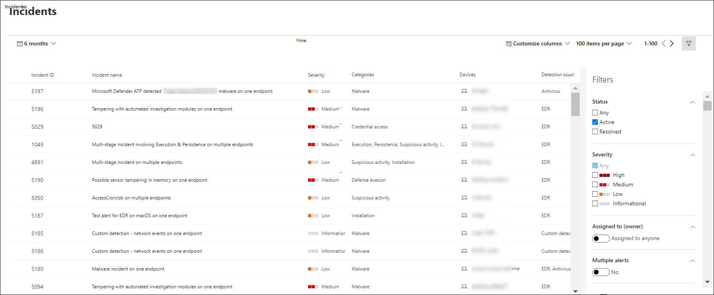

# Exibir e organizar a fila do Microsoft Defender para Incidentes de Ponto de Extremidade

[!INCLUDE [Microsoft 365 Defender rebranding](../../includes/microsoft-defender.md)]

**Aplica-se a:**
- [Microsoft Defender para Ponto de Extremidade](https://go.microsoft.com/fwlink/?linkid=2154037)
- [Microsoft 365 Defender](https://go.microsoft.com/fwlink/?linkid=2118804)

> Deseja experimentar o Defender para Ponto de Extremidade? [Inscreva-se para uma avaliação gratuita.](https://www.microsoft.com/microsoft-365/windows/microsoft-defender-atp?ocid=docs-wdatp-pullalerts-abovefoldlink) 

A **fila Incidentes** mostra uma coleção de incidentes que foram sinalizados de dispositivos em sua rede. Isso ajuda a classificar incidentes e criar uma decisão de resposta de segurança cibernética embasada.

Por padrão, a fila exibe incidentes vistos nos últimos 30 dias, com o incidente mais recente sendo exibido na parte superior da lista, ajudando você a ver os incidentes mais recentes primeiro.

Há várias opções que você pode escolher para personalizar o exibição de fila de incidentes. 

Na navegação superior, você pode:
- Personalizar colunas para adicionar ou remover colunas 
- Modificar o número de itens para exibição por página
- Selecione os itens a mostrar por página
- Selecione em lotes os incidentes a atribuir 
- Navegar entre páginas
- Aplicar filtros

## Classificar e filtrar a fila de incidentes
Você pode aplicar os filtros a seguir para limitar a lista de incidentes e obter uma exibição mais focada.

### Severity

Gravidade do incidente | Descrição
:---|:---
Alto  (Vermelho) | Ameaças frequentemente associadas a ameaças persistentes avançadas (APT). Esses incidentes indicam um alto risco devido à gravidade dos danos que podem causar em dispositivos.
Médio  (Laranja) | Ameaças raramente observadas na organização, como alteração anômala do Registro, execução de arquivos suspeitos e comportamentos observados típicos de estágios de ataque.
Baixo  (Amarelo) | Ameaças associadas a malwares e ferramentas de hackers predominantes que não indicam necessariamente uma ameaça avançada direcionando a organização.
Informações  (Cinza) | Incidentes informacionais podem não ser considerados prejudiciais para a rede, mas podem ser bons para acompanhar.

## Atribuído a
Você pode optar por filtrar a lista selecionando não atribuir a ninguém ou os que estão atribuídos a você.

### Categoria
Os incidentes são categorizados com base na descrição do estágio em que a cadeia de crimes de segurança cibernética está. Essa exibição ajuda o analista de ameaças a determinar a prioridade, a urgência e a estratégia de resposta correspondente a ser implantada com base no contexto.

### Status
Você pode optar por limitar a lista de incidentes exibidos com base em seu status para ver quais estão ativos ou resolvidos.

### Confidencialidade de dados
Use este filtro para mostrar incidentes que contêm rótulos de sensibilidade.

## Nomeação de incidente

Para entender rapidamente o escopo do incidente, os nomes de incidentes são gerados automaticamente com base em atributos de alerta, como o número de pontos de extremidade afetados, usuários afetados, fontes de detecção ou categorias.

Por exemplo: *incidente em vários estágios em vários pontos de extremidade relatados por várias fontes.*

> [!NOTE]
> Incidentes que existiam antes da adoção da nomenização automática de incidentes manterão seu nome.

## Confira também
- [Fila de incidentes](https://docs.microsoft.com/microsoft-365/security/defender-endpoint/view-incidents-queue)
- [Gerenciar incidentes](manage-incidents.md)
- [Investigar incidentes](investigate-incidents.md)

