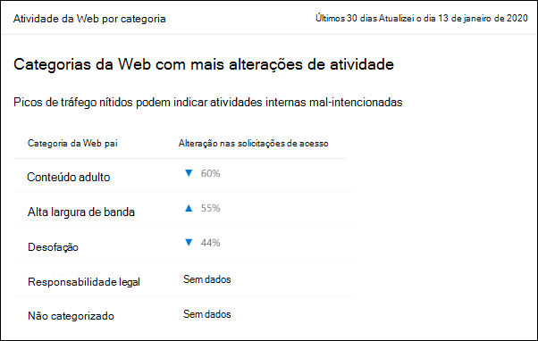
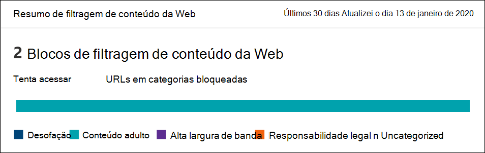
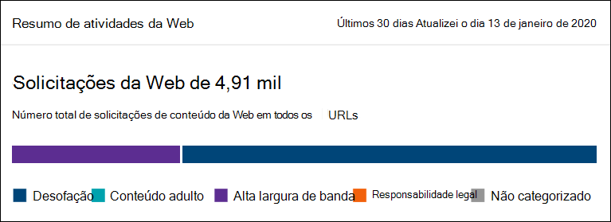

# Filtragem de conteúdo da WebWeb content filtering

[!INCLUDE [Microsoft 365 Defender rebranding](../../includes/microsoft-defender.md)]

**Aplica-se a:****Applies to:**
- [Microsoft Defender para Ponto de ExtremidadeMicrosoft Defender for Endpoint](https://go.microsoft.com/fwlink/p/?linkid=2154037)
- [Microsoft 365 DefenderMicrosoft 365 Defender](https://go.microsoft.com/fwlink/?linkid=2118804)

> [!IMPORTANT]
> **A filtragem de conteúdo da Web está atualmente em visualização pública****Web content filtering is currently in public preview** 
> Esta versão de visualização é fornecida sem um contrato de nível de serviço e não é recomendada para cargas de trabalho de produção.This preview version is provided without a service level agreement, and it's not recommended for production workloads. Determinados recursos podem não ser suportados ou podem ter recursos restritos.Certain features might not be supported or might have constrained capabilities.
> Para obter mais informações, consulte Recursos de visualização do [Microsoft Defender for Endpoint](preview.md).For more information, see [Microsoft Defender for Endpoint preview features](preview.md).

> [!TIP]
> Deseja experimentar o Microsoft Defender para Ponto de Extremidade?Want to experience Microsoft Defender for Endpoint? [Inscreva-se para uma avaliação gratuita.Sign up for a free trial.](https://www.microsoft.com/microsoft-365/windows/microsoft-defender-atp?ocid=docs-wdatp-main-abovefoldlink&rtc=1)

A filtragem de conteúdo da Web faz parte dos recursos [de proteção](web-protection-overview.md) da Web no Microsoft Defender para Ponto de Extremidade.Web content filtering is part of [Web protection](web-protection-overview.md) capabilities in Microsoft Defender for Endpoint. Ele permite que sua organização acompanhe e regular o acesso a sites com base em suas categorias de conteúdo.It enables your organization to track and regulate access to websites based on their content categories. Muitos desses sites, embora não sejam mal-intencionados, podem ser problemáticos devido a regulamentos de conformidade, uso de largura de banda ou outras preocupações.Many of these websites, while not malicious, might be problematic because of compliance regulations, bandwidth usage, or other concerns.

Configure políticas em seus grupos de dispositivos para bloquear determinadas categorias.Configure policies across your device groups to block certain categories. O bloqueio de uma categoria impede que os usuários dentro de grupos de dispositivos especificados acessem URLs associadas à categoria.Blocking a category prevents users within specified device groups from accessing URLs associated with the category. Para qualquer categoria que não seja bloqueada, as URLs são auditadas automaticamente.For any category that's not blocked, the URLs are automatically audited. Os usuários podem acessar as URLs sem interrupção e você reunirá estatísticas de acesso para ajudar a criar uma decisão de política mais personalizada.Your users can access the URLs without disruption, and you'll gather access statistics to help create a more custom policy decision. Seus usuários verão uma notificação de bloqueio se um elemento na página que eles estão exibindo estiver fazendo chamadas para um recurso bloqueado.Your users will see a block notification if an element on the page they're viewing is making calls to a blocked resource.

A filtragem de conteúdo da Web está disponível nos principais navegadores da Web, com blocos executados por Windows Defender SmartScreen (Microsoft Edge) e Proteção de Rede (Chrome, Firefox, Brave e Opera).Web content filtering is available on the major web browsers, with blocks performed by Windows Defender SmartScreen (Microsoft Edge) and Network Protection (Chrome, Firefox, Brave and Opera). Para obter mais informações sobre o suporte ao navegador, consulte a seção pré-requisitos.For more information about browser support, see the prerequisites section.

Resumindo os benefícios:Summarizing the benefits:

- Os usuários são impedidos de acessar sites em categorias bloqueadas, quer eles estão navegando no local ou foraUsers are prevented from accessing websites in blocked categories, whether they're browsing on-premises or away
- Sua equipe de segurança pode implantar convenientemente políticas em grupos de usuários usando grupos de dispositivos definidos no [Microsoft Defender para](/microsoft-365/security/defender-endpoint/rbac) configurações de controle de acesso baseado em função de ponto de extremidadeYour security team can conveniently deploy policies to groups of users using device groups defined in [Microsoft Defender for Endpoint role-based access control settings](/microsoft-365/security/defender-endpoint/rbac)
- Sua equipe de segurança pode acessar relatórios da Web no mesmo local central, com visibilidade sobre blocos reais e uso da WebYour security team can access web reports in the same central location, with visibility over actual blocks and web usage

## Experiência do usuárioUser experience

A experiência de bloqueio para navegadores com suporte de terceiros é fornecida pela Proteção de Rede, que fornece um sistema notificando o usuário de uma conexão bloqueada.The blocking experience for 3rd party supported browsers is provided by Network Protection, which provides a system-level toast notifying the user of a blocked connection. Para uma experiência mais fácil de usar no navegador, considere o uso Microsoft Edge.For a more user-friendly, in-browser experience, consider using Microsoft Edge.

## Pré-requisitosPrerequisites

Antes de tentar esse recurso, certifique-se de atender aos seguintes requisitos:Before trying out this feature, make sure you meet the following requirements:

- Windows 10 Enterprise E5, Microsoft 365 E5, Microsoft 365 E5 Security, Microsoft 365 E3 + Microsoft 365 E5 Security complemento ou a licença autônoma do Microsoft Defender para Ponto de Extremidade.Windows 10 Enterprise E5, Microsoft 365 E5, Microsoft 365 E5 Security, Microsoft 365 E3 + Microsoft 365 E5 Security add-on or the Microsoft Defender for Endpoint standalone license. 
- Acesso ao Central de Segurança do Microsoft Defender portal ( https://securitycenter.windows.com) .Access to Microsoft Defender Security Center portal (https://securitycenter.windows.com).
- Dispositivos executando Windows 10 Atualização de Aniversário (versão 1607) ou posterior com a atualização mais recente do MoCAMP.Devices running Windows 10 Anniversary Update (version 1607) or later with the latest MoCAMP update.
- Windows Defender Proteção smartScreen e rede habilitada.Windows Defender SmartScreen and Network protection enabled.

## Manipulação de dadosData handling

Os dados são armazenados na região selecionada como parte das configurações de tratamento de dados do [Microsoft Defender para Endpoint.](data-storage-privacy.md)Data is stored in the region that was selected as part of your [Microsoft Defender for Endpoint data handling settings](data-storage-privacy.md). Seus dados não sairão do data center nessa região.Your data will not leave the data center in that region. Além disso, seus dados não serão compartilhados com terceiros, incluindo nossos provedores de dados.In addition, your data will not be shared with any third-parties, including our data providers.

## Ativar a filtragem de conteúdo da WebTurn on web content filtering

No menu de navegação à esquerda, **selecione** Configurações  >  **Recursos**  >  **Avançados Gerais**.From the left-hand navigation menu, select **Settings** > **General** > **Advanced Features**. Role para baixo até ver a entrada para filtragem **de conteúdo da Web**.Scroll down until you see the entry for **Web content filtering**. Alterne a alternância **para As preferências** **Ligar e Salvar.**Switch the toggle to **On** and **Save preferences**.

### Configurar políticas de filtragem de conteúdo da WebConfigure web content filtering policies

As políticas de filtragem de conteúdo da Web especificam quais categorias de site são bloqueadas em quais grupos de dispositivos.Web content filtering policies specify which site categories are blocked on which device groups. Para gerenciar as políticas, acesse **Configurações**  >  **filtragem**  >  **de conteúdo da Web de Regras.**To manage the policies, go to **Settings** > **Rules** > **Web content filtering**.

Use o filtro para localizar políticas que contêm determinadas categorias bloqueadas ou são aplicadas a grupos de dispositivos específicos.Use the filter to locate policies that contain certain blocked categories or are applied to specific device groups.

### Criar uma políticaCreate a policy

Para adicionar uma nova política:To add a new policy:

1. Selecione **Adicionar política** na página de **filtragem de** conteúdo da Web em **Configurações**.Select **Add policy** on the **Web content filtering** page in **Settings**.

2. Especifique um nome.Specify a name.

3. Selecione as categorias a bloquear.Select the categories to block. Use o ícone de expansão para expandir totalmente cada categoria pai e selecione categorias de conteúdo da Web específicas.Use the expand icon to fully expand each parent category and select specific web content categories.

4. Especifique o escopo da política.Specify the policy scope. Selecione os grupos de dispositivos para especificar onde aplicar a política.Select the device groups to specify where to apply the policy. Somente dispositivos nos grupos de dispositivos selecionados serão impedidos de acessar sites nas categorias selecionadas.Only devices in the selected device groups will be prevented from accessing websites in the selected categories.

5. Revise o resumo e salve a política.Review the summary and save the policy. A atualização da política pode levar até 2 horas para ser aplicada aos dispositivos selecionados.The policy refresh may take up to 2 hours to apply to your selected devices.

> [!NOTE]
> - Você pode implantar uma política sem selecionar qualquer categoria em um grupo de dispositivos.You can deploy a policy without selecting any category on a device group. Essa ação criará uma política somente de auditoria, para ajudá-lo a entender o comportamento do usuário antes de criar uma política de bloqueio.This action will create an audit only policy, to help you understand user behavior before creating a block policy.
> - Se você estiver removendo uma política ou alterando grupos de dispositivos ao mesmo tempo, isso pode causar um atraso na implantação da política.If you are removing a policy or changing device groups at the same time, this might cause a delay in policy deployment.
> - Bloquear a categoria "Não categorizada" pode levar a resultados inesperados e indesejáveis.Blocking the "Uncategorized" category may lead to unexpected and undesired results.  

### Permitir sites específicosAllow specific websites

É possível substituir a categoria bloqueada na filtragem de conteúdo da Web para permitir um único site criando uma política de indicador personalizada.It's possible to override the blocked category in web content filtering to allow a single site by creating a custom indicator policy. A política de indicador personalizado irá sobressuar a política de filtragem de conteúdo da Web quando ela for aplicada ao grupo de dispositivos em questão.The custom indicator policy will supersede the web content filtering policy when it's applied to the device group in question.

1. Crie um indicador personalizado no Central de Segurança do Microsoft Defender, Configurações  >    >  **URL de indicadores/Item de**  >  **adoção de domínio.**Create a custom indicator in the Microsoft Defender Security Center by going to **Settings** > **Indicators** > **URL/Domain** > **Add Item**.

2. Insira o domínio do site.Enter the domain of the site.

3. Definir a ação de política como **Permitir**.Set the policy action to **Allow**.  

### Imprecisões de relatóriosReporting inaccuracies

Se você encontrar um domínio que tenha sido categorizado incorretamente, você poderá relatar imprecisões diretamente para nós na página Relatórios de Filtragem de Conteúdo da Web.If you encounter a domain that has been incorrectly categorized, you can report inaccuracies directly to us from the Web Content Filtering reports page. Esse recurso está disponível apenas no novo centro de Microsoft 365 de segurança (security.microsoft.com).This feature is available only in the new Microsoft 365 security center (security.microsoft.com).

Para relatar uma imprecisão, navegue até **Relatórios**  >  **web protection** Web Content  >  **Filtering Details**  >  **Domains**.To report an inaccuracy, navigate to **Reports** > **Web protection** > **Web Content Filtering Details** > **Domains**. Na guia domínios de nossos relatórios de Filtragem de Conteúdo da Web, você verá uma elipse ao lado de cada um dos domínios.On the domains tab of our Web Content Filtering reports, you will see an ellipsis beside each of the domains. Passe o mouse sobre essa reellipse e selecione **Report Inaccuracy**.Hover over this ellipsis and select **Report Inaccuracy**.

Um painel será aberto onde você pode selecionar a prioridade e adicionar detalhes adicionais, como a categoria sugerida para re-categorização.A panel will open where you can select the priority and add additional details such as the suggested category for re-categorization. Depois de concluir o formulário, selecione **Enviar**.Once you complete the form, select **Submit**. Nossa equipe revisará a solicitação em um dia útil.Our team will review the request within one business day. Para desbloquear imediatamente, crie um [indicador de autorização personalizado.](indicator-ip-domain.md)For immediate unblocking, create a [custom allow indicator](indicator-ip-domain.md).

## Cartões e detalhes de filtragem de conteúdo da WebWeb content filtering cards and details

Selecione **Relatórios de** Proteção da  >  **Web** para exibir cartões com informações sobre filtragem de conteúdo da Web e proteção contra ameaças da Web.Select **Reports** > **Web protection** to view cards with information about web content filtering and web threat protection. Os cartões a seguir fornecem informações resumidas sobre a filtragem de conteúdo da Web.The following cards provide summary information about web content filtering.

### Atividade da Web por categoriaWeb activity by category

Este cartão lista as categorias de conteúdo da Web pai com o maior aumento ou diminuição no número de tentativas de acesso.This card lists the parent web content categories with the largest increase or decrease in the number of access attempts. Entenda as alterações drásticas nos padrões de atividade da Web em sua organização dos últimos 30, 3 meses ou 6 meses.Understand drastic changes in web activity patterns in your organization from last 30 days, 3 months, or 6 months. Selecione um nome de categoria para exibir mais informações.Select a category name to view more information.

Nos primeiros 30 dias de uso desse recurso, sua organização pode não ter dados suficientes para exibir essas informações.In the first 30 days of using this feature, your organization might not have enough data to display this information.

### Cartão de resumo de filtragem de conteúdo da WebWeb content filtering  summary card

Esse cartão exibe a distribuição de tentativas de acesso bloqueado nas diferentes categorias de conteúdo da Web pai.This card displays the distribution of blocked access attempts across the different parent web content categories. Selecione uma das barras coloridas para exibir mais informações sobre uma categoria da Web pai específica.Select one of the colored bars to view more information about a specific parent web category.

### Cartão de resumo de atividade da WebWeb activity summary card

Esse cartão exibe o número total de solicitações de conteúdo da Web em todas as URLs.This card displays the total number of requests for web content in all URLs.

### Exibir detalhes do cartãoView card details

Você pode acessar os **detalhes do Relatório** para cada cartão selecionando uma linha de tabela ou uma barra colorida do gráfico no cartão.You can access the **Report details** for each card by selecting a table row or colored bar from the chart in the card. A página de detalhes do relatório para cada cartão contém dados estatísticos abrangentes sobre categorias de conteúdo da Web, domínios de site e grupos de dispositivos.The report details page for each card contains extensive statistical data about web content categories, website domains, and device groups.

- **Categorias da Web**: lista as categorias de conteúdo da Web que tiveram tentativas de acesso em sua organização.**Web categories**: Lists the web content categories that have had access attempts in your organization. Selecione uma categoria específica para abrir um sobrevoo de resumo.Select a specific category to open a summary flyout.

- **Domínios**: lista os domínios da Web que foram acessados ou bloqueados em sua organização.**Domains**: Lists the web domains that have been accessed or blocked in your organization. Selecione um domínio específico para exibir informações detalhadas sobre esse domínio.Select a specific domain to view detailed information about that domain.

- **Grupos de dispositivos**: lista todos os grupos de dispositivos que geraram atividade da Web em sua organização**Device groups**: Lists all the device groups that have generated web activity in your organization

Use o filtro de intervalo de tempo na parte superior esquerda da página para selecionar um período de tempo.Use the time range filter at the top left of the page to select a time period. Você também pode filtrar as informações ou personalizar as colunas.You can also filter the information or customize the columns. Selecione uma linha para abrir um painel de sobrevoo com ainda mais informações sobre o item selecionado.Select a row to open a flyout pane with even more information about the selected item.

## Erros e problemasErrors and issues

### Limitações e problemas conhecidos nesta visualizaçãoLimitations and known issues in this preview

- Somente Microsoft Edge suporte se a configuração do sistema operacional do dispositivo for Server (**cmd**  >  **Systeminfo**  >  **OS Configuration**).Only Microsoft Edge is supported if your device's OS configuration is Server (**cmd** > **Systeminfo** > **OS Configuration**). A Proteção de Rede só tem suporte no modo Inspecionar em dispositivos Server, que é responsável por proteger o tráfego em navegadores de terceiros com suporte.Network Protection is only supported in Inspect mode on Server devices, which is responsible for securing traffic across supported 3rd party browsers.

- Os dispositivos não atribuídos terão dados incorretos mostrados no relatório.Unassigned devices will have incorrect data shown within the report. No **pivô Detalhes do relatório**  >  **Grupos de** dispositivos, você pode ver uma linha com um campo Grupo de Dispositivos em branco.In the **Report details** > **Device groups** pivot, you might see a row with a blank Device Group field. Esse grupo contém seus dispositivos não atribuídos antes que eles sejam colocados no grupo especificado.This group contains your unassigned devices before they get put into your specified group. O relatório dessa linha pode não conter uma contagem precisa de dispositivos ou contagens de acesso.The report for this row might not contain an accurate count of devices or access counts.

- Atualmente, os relatórios de Filtragem de Conteúdo da Web estão limitados a mostrar os 5.000 principais registros.Web Content Filtering reports are currently limited to showing the top 5000 records. Por exemplo, o relatório Domínios mostrará apenas um máximo dos 5.000 domínios principais para uma determinada consulta de filtro, se aplicável.For example, the Domains report will only show a maximum of the top 5000 domains for a given filter query, if applicable. 

- [Visão geral da proteção da WebWeb protection overview](web-protection-overview.md)
- [Proteção contra ameaças da WebWeb threat protection](web-threat-protection.md)
- [Monitorar a segurança da WebMonitor web security](web-protection-monitoring.md)
- [Responder a ameaças da WebRespond to web threats](web-protection-response.md)
- [Requisitos para Proteção de RedeRequirements for Network Protection](web-content-filtering.md)

