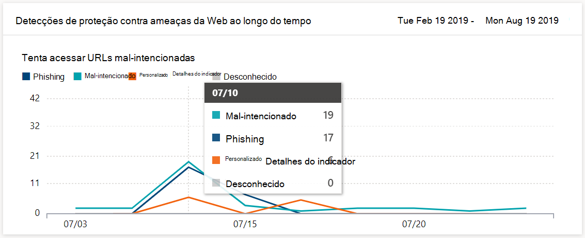
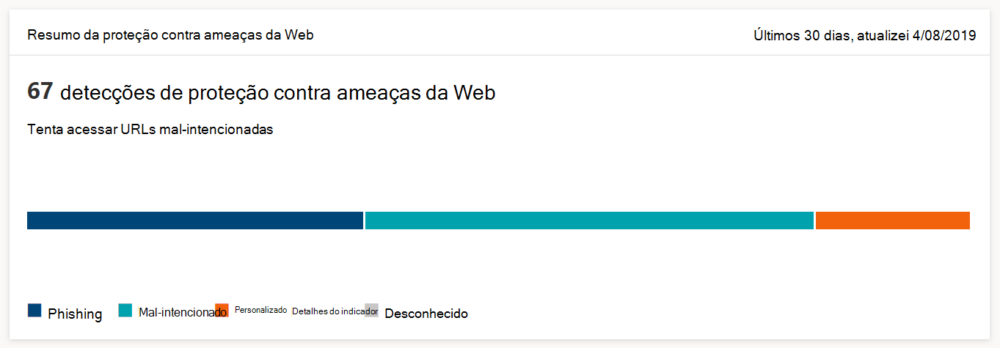

# Monitorar a segurança de navegação na Web

[!INCLUDE [Microsoft 365 Defender rebranding](../../includes/microsoft-defender.md)]

**Aplica-se a:**
- [Microsoft Defender para Ponto de Extremidade](https://go.microsoft.com/fwlink/p/?linkid=2154037)
- [Microsoft 365 Defender](https://go.microsoft.com/fwlink/?linkid=2118804)

>Deseja experimentar o Microsoft Defender para Ponto de Extremidade? [Inscreva-se para uma avaliação gratuita.](https://www.microsoft.com/microsoft-365/windows/microsoft-defender-atp?ocid=docs-wdatp-main-abovefoldlink&rtc=1)

A proteção da Web permite monitorar a segurança de navegação na Web da sua organização por meio de relatórios em Relatórios > **Proteção da Web** no Central de Segurança do Microsoft Defender. O relatório contém cartões que fornecem estatísticas de detecção de ameaças da Web.

- **Detecções** de proteção contra ameaças da Web ao longo do tempo - esse cartão de tendência exibe o número de ameaças da Web detectadas por tipo durante o período de tempo selecionado (Últimos 30 dias, Últimos 3 meses, Últimos 6 meses)
 
    

- **Resumo da proteção contra** ameaças da Web - esse cartão exibe o total de detecções de ameaças da Web nos últimos 30 dias, mostrando a distribuição entre os diferentes tipos de ameaças à Web. Selecionar uma fatia abre a lista dos domínios encontrados com sites mal-intencionados ou indesejados.

    

>[!Note]
>Pode levar até 12 horas antes que um bloco seja refletido nos cartões ou na lista de domínios.

## Tipos de ameaças à Web

A proteção da Web categoriza sites mal-intencionados e indesejados como:

- **Phishing** - sites que contêm formulários web falsos e outros mecanismos de phishing projetados para enganar os usuários para divulgar credenciais e outras informações confidenciais
- **Mal-intencionado** - sites que hospedam malware e exploram código
- **Indicador personalizado** - sites cujas URLs ou domínios você adicionou à sua lista [de indicadores personalizados](manage-indicators.md) para bloqueio

## Exibir a lista de domínios

Selecione uma categoria de ameaça da Web específica no cartão de resumo de proteção contra ameaças da **Web** para abrir a **página Domínios.** Esta página exibe a lista dos domínios sob essa categoria de ameaça. A página fornece as seguintes informações para cada domínio:

- **Contagem de** acesso - número de solicitações para URLs no domínio
- **Blocos** - número de vezes que as solicitações foram bloqueadas
- **Tendência de acesso** - alteração no número de tentativas de acesso
- **Categoria de ameaça** - tipo de ameaça da Web
- **Dispositivos** - número de dispositivos com tentativas de acesso

Selecione um domínio para exibir a lista de dispositivos que tentaram acessar URLs nesse domínio e a lista de URLs.

## Tópicos relacionados

- [Visão geral da proteção da Web](web-protection-overview.md)
- [Filtragem de conteúdo da Web](web-content-filtering.md)
- [Proteção contra ameaças da Web](web-threat-protection.md)
- [Responder a ameaças da Web](web-protection-response.md)
