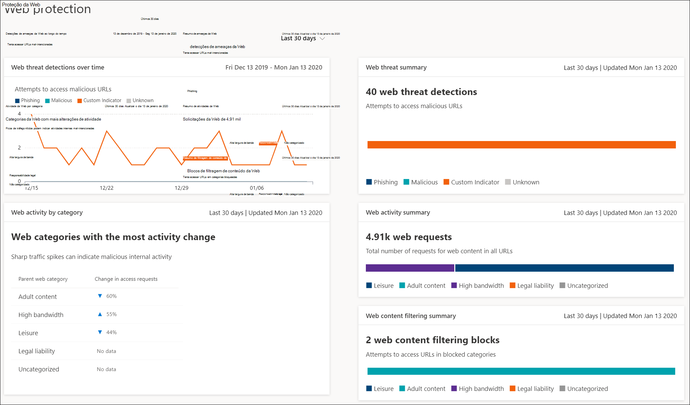

# Proteção da Web

[!INCLUDE [Microsoft 365 Defender rebranding](../../includes/microsoft-defender.md)]

**Aplica-se a:**
- [Microsoft Defender para Ponto de Extremidade](https://go.microsoft.com/fwlink/p/?linkid=2146631)
- [Microsoft 365 Defender](https://go.microsoft.com/fwlink/?linkid=2118804)

>Deseja experimentar o Microsoft Defender para Ponto de Extremidade? [Inscreva-se para uma avaliação gratuita.](https://www.microsoft.com/microsoft-365/windows/microsoft-defender-atp?ocid=docs-wdatp-main-abovefoldlink&rtc=1)

A proteção da Web no Microsoft Defender para Ponto de Extremidade é um recurso que é feito de proteção contra ameaças da [Web](web-threat-protection.md) e [filtragem de conteúdo da Web.](web-content-filtering.md) A proteção da Web permite proteger seus dispositivos contra ameaças à Web e ajuda a regular conteúdo indesejado. Você pode encontrar relatórios de proteção da Web no Centro de Segurança do Microsoft Defender indo para **Relatórios > Web Protection**.

## Proteção contra ameaças da Web

Os cartões que comem a proteção contra ameaças da Web são detecções de ameaças da **Web ao longo do tempo** e resumo de ameaças da **Web.**

A proteção contra ameaças da Web inclui:
- Visibilidade abrangente das ameaças da Web que afetam sua organização
- Recursos de investigação sobre a atividade de ameaça relacionada à Web por meio de alertas e perfis abrangentes de URLs e os dispositivos que acessam essas URLs
- Um conjunto completo de recursos de segurança que acompanham tendências gerais de acesso a sites mal-intencionados e indesejados

## Filtragem de conteúdo da Web

Os cartões que compõem a filtragem de conteúdo da Web são atividade da Web por **categoria,** resumo de filtragem de conteúdo **da Web** e resumo de atividades da **Web.**

A filtragem de conteúdo da Web inclui:
- Os usuários são impedidos de acessar sites em categorias bloqueadas, quer eles estão navegando no local ou fora
- Convenientemente, você pode implantar políticas variadas em vários conjuntos de usuários usando os grupos de dispositivos definidos nas configurações de controle de acesso baseado em função do [Microsoft Defender para Endpoint](https://docs.microsoft.com/microsoft-365/security/defender-endpoint/rbac)
- Você pode acessar relatórios da Web no mesmo local central, com visibilidade sobre blocos reais e uso da Web

## Nesta seção

Tópico | Descrição
:---|:---
[Proteção contra ameaças da Web](web-threat-protection.md) | Pare o acesso a sites de phishing, vetores de malware, sites de exploração, sites não falsos ou de baixa reputação, bem como sites bloqueados.
[Filtragem de conteúdo da Web](web-content-filtering.md) | Controlar e regular o acesso a sites com base em suas categorias de conteúdo.
