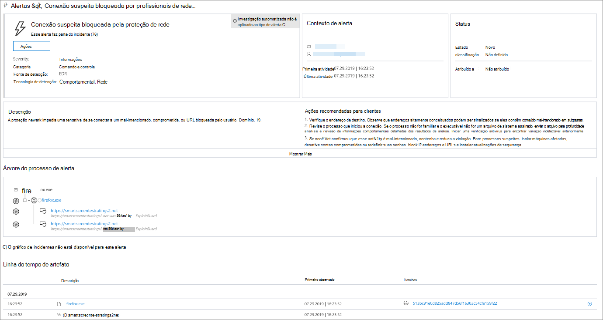
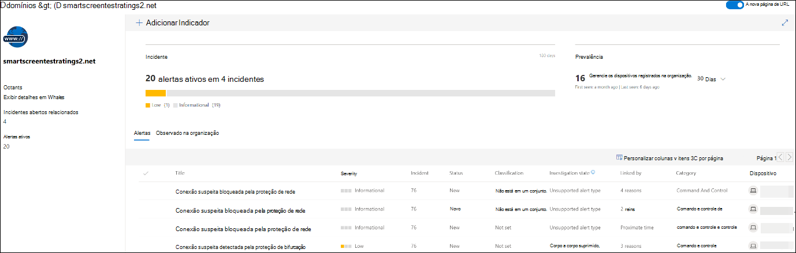
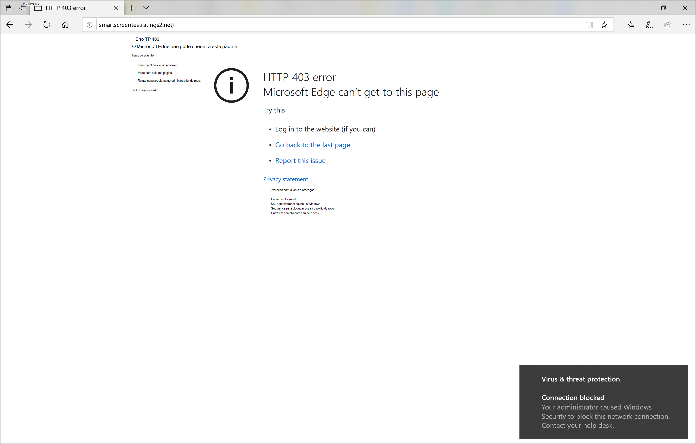
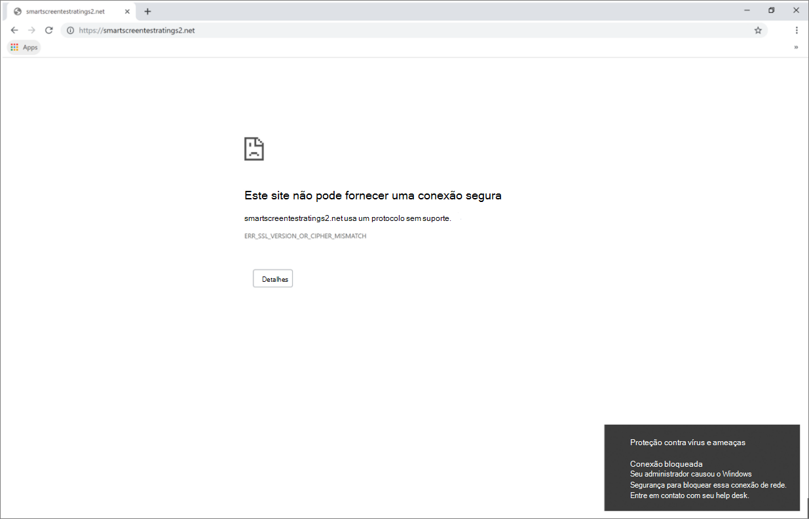

# Responder a ameaças da WebRespond to web threats

[!INCLUDE [Microsoft 365 Defender rebranding](../../includes/microsoft-defender.md)]

**Aplica-se a:****Applies to:**
- [Microsoft Defender para Ponto de ExtremidadeMicrosoft Defender for Endpoint](https://go.microsoft.com/fwlink/p/?linkid=2154037)
- [Microsoft 365 DefenderMicrosoft 365 Defender](https://go.microsoft.com/fwlink/?linkid=2118804)

>Deseja experimentar o Microsoft Defender para Ponto de Extremidade?Want to experience Microsoft Defender for Endpoint? [Inscreva-se para uma avaliação gratuita.Sign up for a free trial.](https://www.microsoft.com/microsoft-365/windows/microsoft-defender-atp?ocid=docs-wdatp-main-abovefoldlink&rtc=1)

A proteção da Web no Microsoft Defender para Ponto de Extremidade permite investigar e responder com eficiência a alertas relacionados a sites mal-intencionados e sites em sua lista de indicadores personalizados.Web protection in Microsoft Defender for Endpoint lets you efficiently investigate and respond to alerts related to malicious websites and websites in your custom indicator list.

## Exibir alertas de ameaça da WebView web threat alerts
O Microsoft Defender para Ponto de Extremidade gera os seguintes [alertas](manage-alerts.md) para atividades da Web mal-intencionadas ou suspeitas:Microsoft Defender for Endpoint generates the following [alerts](manage-alerts.md) for malicious or suspicious web activity:
- **Conexão suspeita bloqueada pela** proteção de rede — esse alerta é gerado quando uma  tentativa de acessar um site mal-intencionado ou um site em sua lista de indicadores personalizados é interrompida pela proteção de rede no modo *de* bloqueio**Suspicious connection blocked by network protection** — this alert is generated when an attempt to access a malicious website or a website in your custom indicator list is *stopped* by network protection in *block* mode
- **Conexão suspeita detectada** pela proteção de rede — esse alerta é gerado quando uma tentativa de acessar um site mal-intencionado ou um site em sua lista de indicadores personalizados é detectada pela proteção de rede no modo somente *auditoria***Suspicious connection detected by network protection** — this alert is generated when an attempt to access a malicious website or a website in your custom indicator list is detected by network protection in *audit only* mode

Cada alerta fornece as seguintes informações:Each alert provides the following information: 
- Dispositivo que tentou acessar o site bloqueadoDevice that attempted to access the blocked website
- Aplicativo ou programa usado para enviar a solicitação da WebApplication or program used to send the web request
- URL ou URL mal-intencionadas na lista de indicadores personalizadosMalicious URL or URL in the custom indicator list
- Ações recomendadas para respondentesRecommended actions for responders

>[!Note]
>Para reduzir o volume de alertas, o Microsoft Defender for Endpoint consolida detecções de ameaças da Web para o mesmo domínio no mesmo dispositivo todos os dias para um único alerta.To reduce the volume of alerts, Microsoft Defender for Endpoint consolidates web threat detections for the same domain on the same device each day to a single alert. Somente um alerta é gerado e contado no [relatório de proteção da Web.](web-protection-monitoring.md)Only one alert is generated and counted into the [web protection report](web-protection-monitoring.md).

## Inspecionar detalhes do siteInspect website details
Você pode mergulhar mais fundo selecionando a URL ou o domínio do site no alerta.You can dive deeper by selecting the URL or domain of the website in the alert. Isso abre uma página sobre essa URL ou domínio específico com várias informações, incluindo:This opens a page about that particular URL or domain with various information, including:
- Dispositivos que tentaram acessar o siteDevices that attempted to access website
- Incidentes e alertas relacionados ao siteIncidents and alerts related to the website
- A frequência com que o site foi visto em eventos em sua organizaçãoHow frequent the website was seen in events in your organization

    

[Saiba mais sobre páginas de URL ou entidade de domínioLearn more about URL or domain entity pages](investigate-domain.md)

## Inspecionar o dispositivoInspect the device
Você também pode verificar o dispositivo que tentou acessar uma URL bloqueada.You can also check the device that attempted to access a blocked URL. Selecionar o nome do dispositivo na página de alerta abre uma página com informações abrangentes sobre o dispositivo.Selecting the name of the device on the alert page opens a page with comprehensive information about the device.

[Saiba mais sobre páginas de entidade de dispositivoLearn more about device entity pages](investigate-machines.md)

## Navegador da Web e notificações do Windows para usuários finaisWeb browser and Windows notifications for end users

Com a proteção da Web no Microsoft Defender para Ponto de Extremidade, seus usuários finais serão impedidos de visitar sites mal-intencionados ou indesejados usando o Microsoft Edge ou outros navegadores.With web protection in Microsoft Defender for Endpoint, your end users will be prevented from visiting malicious or unwanted websites using Microsoft Edge or other browsers. Como o bloqueio é realizado pela proteção [de rede,](network-protection.md)eles verão um erro genérico do navegador da Web.Because blocking is performed by [network protection](network-protection.md), they will see a generic error from the web browser. Eles também verão uma notificação do Windows.They will also see a notification from Windows.

 *bloqueada no Microsoft Edge*
*Web threat blocked on Microsoft Edge*

 *bloqueada no Chrome*
*Web threat blocked on Chrome*

## Tópicos relacionadosRelated topics
- [Visão geral da proteção da WebWeb protection overview](web-protection-overview.md)
- [Filtragem de conteúdo da WebWeb content filtering](web-content-filtering.md)
- [Proteção contra ameaças da WebWeb threat protection](web-threat-protection.md)
- [Monitorar a segurança da WebMonitor web security](web-protection-monitoring.md)
