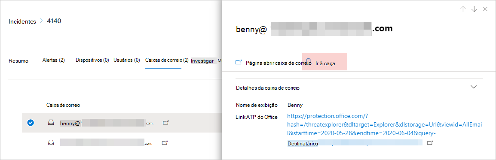
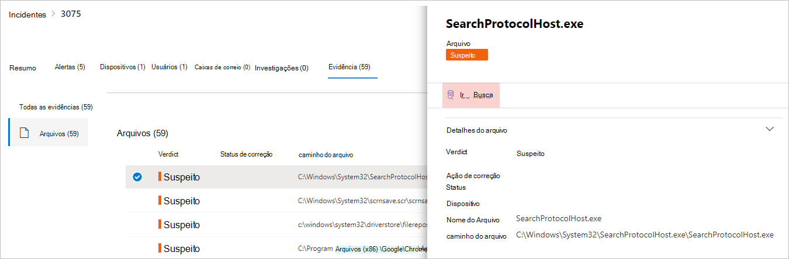
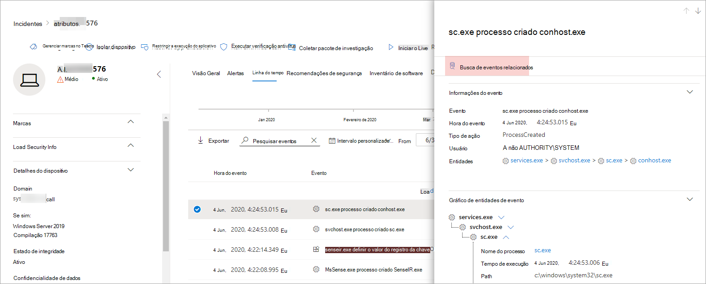

# <a name="quickly-hunt-for-entity-or-event-information-with-go-hunt"></a>Busca rápida por informações de entidade ou evento com a busca de ida e volta

[!INCLUDE [Microsoft 365 Defender rebranding](../includes/microsoft-defender.md)]


**Aplica-se a:**
- Microsoft 365 Defender
- Microsoft Defender para Ponto de Extremidade

Com a *ação ir à* busca, você pode investigar rapidamente eventos e vários tipos de entidade usando recursos avançados de busca avançados baseados [em](advanced-hunting-overview.md) consulta. Essa ação executa automaticamente uma consulta de busca avançada para encontrar informações relevantes sobre o evento ou entidade selecionado.

A *ação de busca* de go está disponível em várias seções do centro de segurança sempre que os detalhes do evento ou da entidade são exibidos. Por exemplo, você pode usar *ir procurar* nas seguintes seções:

- Na página [incidente,](investigate-incidents.md#summary)você pode revisar detalhes sobre usuários, dispositivos e muitas outras entidades associadas a um incidente. Ao selecionar uma entidade, você obterá informações adicionais, bem como várias ações que poderia tomar nessa entidade. No exemplo abaixo, uma caixa de correio é selecionada, mostrando detalhes sobre a caixa de correio, bem como a opção de procurar mais informações sobre a caixa de correio.

    

- Na página incidente, você também pode acessar uma lista de entidades na guia evidências. Selecionar uma dessas entidades fornece uma opção para procurar rapidamente informações sobre essa entidade.

    


- Ao exibir a linha do tempo de um dispositivo, você pode selecionar um evento na linha do tempo para exibir informações adicionais sobre esse evento. Depois que um evento é selecionado, você tem a opção de procurar outros eventos relevantes na busca avançada.

    

Selecionar **Ir procurar** ou procurar **eventos** relacionados passa por diferentes consultas, dependendo se você selecionou uma entidade ou um evento.

## <a name="query-for-entity-information"></a>Consulta para informações da entidade
Ao usar *o go hunt* to query for information about a user, device, or any other type of entity, the query checks all relevant schema tables for any events involving that entity. Para manter os resultados gerenciáveis, a consulta tem escopo para o mesmo período de tempo que a atividade mais antiga nos últimos 30 dias que envolve a entidade e está associada ao incidente.

Aqui está um exemplo da consulta go hunt para um dispositivo:

```kusto
let selectedTimestamp = datetime(2020-06-02T02:06:47.1167157Z);
let deviceName = "fv-az770.example.com";
let deviceId = "device-guid";
search in (DeviceLogonEvents, DeviceProcessEvents, DeviceNetworkEvents, DeviceFileEvents, DeviceRegistryEvents, DeviceImageLoadEvents, DeviceEvents, DeviceImageLoadEvents, IdentityLogonEvents, IdentityQueryEvents)
Timestamp between ((selectedTimestamp - 1h) .. (selectedTimestamp + 1h))
and DeviceName == deviceName
// or RemoteDeviceName == deviceName
// or DeviceId == deviceId
| take 100
```
### <a name="supported-entity-types"></a>Tipos de entidade com suporte
Você pode usar *ir procurar depois* de selecionar qualquer um desses tipos de entidade:

- Arquivos
- Emails
- Clusters de email
- Caixas de correio
- Usuários
- Dispositivos
- Endereços IP
- URLs

## <a name="query-for-event-information"></a>Consulta para informações do evento
Ao usar *o go hunt* to query for information about a timeline event, the query checks all relevant schema tables for other events around the time of the selected event. Por exemplo, a consulta a seguir lista eventos em várias tabelas de esquema que ocorreram ao redor do mesmo período de tempo no mesmo dispositivo:

```kusto
// List relevant events 30 minutes before and after selected LogonAttempted event
let selectedEventTimestamp = datetime(2020-06-04T01:29:09.2496688Z);
search in (DeviceFileEvents, DeviceProcessEvents, DeviceEvents, DeviceRegistryEvents, DeviceNetworkEvents, DeviceImageLoadEvents, DeviceLogonEvents)
    Timestamp between ((selectedEventTimestamp - 30m) .. (selectedEventTimestamp + 30m))
    and DeviceId == "079ecf9c5798d249128817619606c1c47369eb3e"
| sort by Timestamp desc
| extend Relevance = iff(Timestamp == selectedEventTimestamp, "Selected event", iff(Timestamp < selectedEventTimestamp, "Earlier event", "Later event"))
| project-reorder Relevance
```

## <a name="adjust-the-query"></a>Ajustar a consulta
Com algum conhecimento do [idioma de consulta,](advanced-hunting-query-language.md)você pode ajustar a consulta à sua preferência. Por exemplo, você pode ajustar essa linha, que determina o tamanho da janela de tempo:

```kusto
Timestamp between ((selectedTimestamp - 1h) .. (selectedTimestamp + 1h))
```

Além de modificar a consulta para obter resultados mais relevantes, você também pode:
- [Exibir os resultados como gráficos](advanced-hunting-query-results.md#view-query-results-as-a-table-or-chart)
- [Criar uma regra de detecção personalizada](custom-detection-rules.md)

>[!NOTE]
>Algumas tabelas neste artigo podem não estar disponíveis no Microsoft Defender para Ponto de Extremidade. [A Microsoft 365 Defender para](m365d-enable.md) procurar ameaças usando mais fontes de dados. Você pode mover seus fluxos de trabalho de busca avançados do Microsoft Defender para o Endpoint para o Microsoft 365 Defender seguindo as etapas em Migrar consultas de busca avançadas do Microsoft Defender para o Ponto de [Extremidade.](advanced-hunting-migrate-from-mde.md)

## <a name="related-topics"></a>Tópicos relacionados
- [Visão geral da busca avançada](advanced-hunting-overview.md)
- [Aprender a linguagem de consulta](advanced-hunting-query-language.md)
- [Trabalhar com os resultados da consulta](advanced-hunting-query-results.md)
- [Regras de detecção personalizadas](custom-detection-rules.md)
