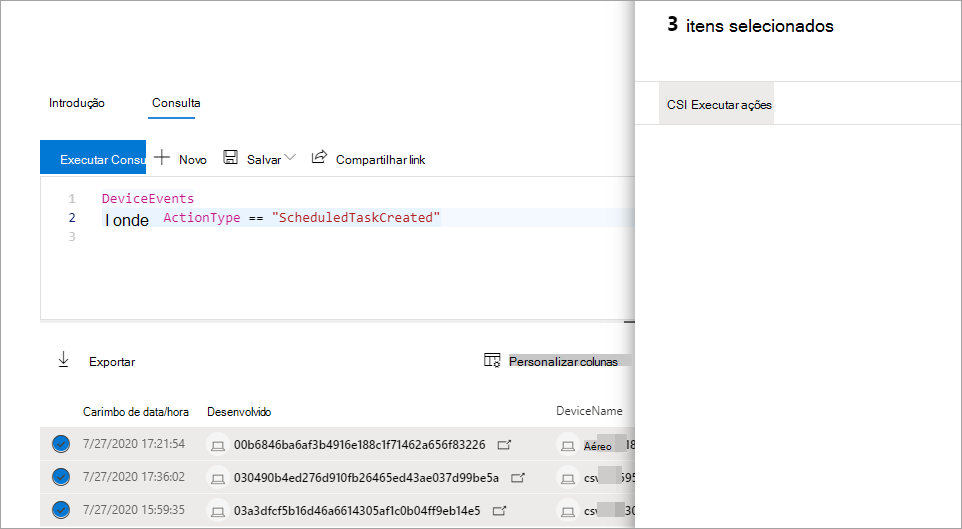

# Tomar medidas nos resultados avançados da consulta de buscaTake action on advanced hunting query results

[!INCLUDE [Microsoft 365 Defender rebranding](../includes/microsoft-defender.md)]

**Aplica-se a:****Applies to:**
- Microsoft 365 DefenderMicrosoft 365 Defender
- Microsoft Defender para Ponto de ExtremidadeMicrosoft Defender for Endpoint

[!INCLUDE [Prerelease information](../includes/prerelease.md)]

Você pode conter rapidamente ameaças ou resolver ativos comprometidos que você encontra na busca [avançada](advanced-hunting-overview.md) usando opções de ação avançadas e abrangentes.You can quickly contain threats or address compromised assets that you find in [advanced hunting](advanced-hunting-overview.md) using powerful and comprehensive action options. Com essas opções, você pode:With these options, you can:

- Tomar várias ações em dispositivosTake various actions on devices
- Arquivos de quarentenaQuarantine files

## Permissões obrigatóriasRequired permissions
Para poder realizar ações por meio da busca avançada, você precisa de uma função no Microsoft Defender para Ponto de Extremidade com permissões para enviar ações de [correção em dispositivos](/windows/security/threat-protection/microsoft-defender-atp/user-roles#permission-options).To be able to take action through advanced hunting, you need a role in Microsoft Defender for Endpoint with [permissions to submit remediation actions on devices](/windows/security/threat-protection/microsoft-defender-atp/user-roles#permission-options). Se você não puder tomar uma ação, contate um administrador global sobre como obter a seguinte permissão:If you can't take action, contact a global administrator about getting the following permission:

*Ações de correção ativas > Ameaças e Gerenciamento de Vulnerabilidades - Tratamento de correção**Active remediation actions > Threat and vulnerability management - Remediation handling*

## Tomar várias ações em dispositivosTake various actions on devices
Você pode tomar as seguintes ações em dispositivos identificados pela `DeviceId` coluna em seus resultados de consulta:You can take the following actions on devices identified by the `DeviceId` column in you query results:

- Isolar dispositivos afetados para conter uma infecção ou impedir que os ataques se movem lateralmenteIsolate affected devices to contain an infection or prevent attacks from moving laterally
- Coletar pacote de investigação para obter mais informações forensesCollect investigation package to obtain more forensic information
- Executar uma verificação antivírus para encontrar e remover ameaças usando as atualizações mais recentes de inteligência de segurançaRun an antivirus scan to find and remove threats using the latest security intelligence updates
- Inicie uma investigação automatizada para verificar e remediar ameaças no dispositivo e, possivelmente, em outros dispositivos afetadosInitiate an automated investigation to check and remediate threats on the device and possibly other affected devices
- Restringir a execução de aplicativos somente a arquivos executáveis assinados pela Microsoft, impedindo atividades de ameaças subsequentes por meio de malware ou outros executáveis não-confiançaRestrict app execution to only Microsoft-signed executable files, preventing subsequent threat activity through malware or other untrusted executables

Para saber mais sobre como essas ações de resposta são executadas por meio do Microsoft Defender para Ponto de Extremidade, [leia sobre ações de resposta em dispositivos](/windows/security/threat-protection/microsoft-defender-atp/respond-machine-alerts).To learn more about how these response actions are performed through Microsoft Defender for Endpoint, [read about response actions on devices](/windows/security/threat-protection/microsoft-defender-atp/respond-machine-alerts).
   
## Arquivos de quarentenaQuarantine files
Você pode implantar a *ação de* quarentena em arquivos para que eles sejam automaticamente colocados em quarentena quando encontrados.You can deploy the *quarantine* action on files so that they are automatically quarantined when encountered. Ao selecionar essa ação, você pode escolher entre as seguintes colunas para identificar quais arquivos em sua consulta resulta em quarentena:When selecting this action, you can choose between the following columns to identify which files in your query results to quarantine:

- `SHA1` — Nas tabelas de busca mais avançadas, este é o SHA-1 do arquivo que foi afetado pela ação gravada.`SHA1` — In most advanced hunting tables, this is the SHA-1 of the file that was affected by the recorded action. Por exemplo, se um arquivo foi copiado, esse seria o arquivo copiado.For example, if a file was copied, this would be the copied file.
- `InitiatingProcessSHA1` — Nas tabelas de busca mais avançadas, esse é o arquivo responsável por iniciar a ação gravada.`InitiatingProcessSHA1` — In most advanced hunting tables, this is the file responsible for initiating the recorded action. Por exemplo, se um processo filho foi lançado, esse seria o processo pai.For example, if a child process was launched, this would be the parent process. 
- `SHA256` — Esse é o equivalente sha-256 do arquivo identificado pela `SHA1` coluna.`SHA256` — This is the SHA-256 equivalent of the file identified by the `SHA1` column.
- `InitiatingProcessSHA256` — Esse é o equivalente sha-256 do arquivo identificado pela `InitiatingProcessSHA1` coluna.`InitiatingProcessSHA256` — This is the SHA-256 equivalent of the file identified by the `InitiatingProcessSHA1` column.

Para saber mais sobre como as ações de quarentena são tomadas e como os arquivos podem ser restaurados, [leia sobre ações de resposta em arquivos](/windows/security/threat-protection/microsoft-defender-atp/respond-file-alerts).To learn more about how quarantine actions are taken and how files can be restored, [read about response actions on files](/windows/security/threat-protection/microsoft-defender-atp/respond-file-alerts).

>[!NOTE]
>Para localizar arquivos e colocar em quarentena, os resultados da consulta também devem incluir `DeviceId` valores como identificadores de dispositivo.To locate files and quarantine them, the query results should also include `DeviceId` values as device identifiers.  

## Tomar medidasTake action
Para tomar qualquer uma das ações descritas, selecione um ou mais registros nos resultados da consulta e selecione **Tomar ações**.To take any of the described actions, select one or more records in your query results and then select **Take actions**. Um assistente o guiará pelo processo de seleção e, em seguida, enviará suas ações preferenciais.A wizard will guide you through the process of selecting and then submitting your preferred actions.

## Revisar ações realizadasReview actions taken
Cada ação é registrada individualmente no centro [de](m365d-action-center.md) ações em **Histórico do Centro** de Ações (  >   [security.microsoft.com/action-center/history](https://security.microsoft.com/action-center/history)).Each action is individually recorded in the [action center](m365d-action-center.md) under **Action center** > **History** ([security.microsoft.com/action-center/history](https://security.microsoft.com/action-center/history)). Vá para o centro de ações para verificar o status de cada ação.Go to the action center to check the status of each action.
 
>[!NOTE]
>Algumas tabelas neste artigo podem não estar disponíveis no Microsoft Defender para Ponto de Extremidade.Some tables in this article might not be available in Microsoft Defender for Endpoint. [A Microsoft 365 Defender para](m365d-enable.md) procurar ameaças usando mais fontes de dados.[Turn on Microsoft 365 Defender](m365d-enable.md) to hunt for threats using more data sources. Você pode mover seus fluxos de trabalho de busca avançados do Microsoft Defender para o Endpoint para o Microsoft 365 Defender seguindo as etapas em Migrar consultas de busca avançadas do Microsoft Defender para o Ponto de [Extremidade.](advanced-hunting-migrate-from-mde.md)You can move your advanced hunting workflows from Microsoft Defender for Endpoint to Microsoft 365 Defender by following the steps in [Migrate advanced hunting queries from Microsoft Defender for Endpoint](advanced-hunting-migrate-from-mde.md).

## Tópicos relacionadosRelated topics
- [Visão geral da busca avançadaAdvanced hunting overview](advanced-hunting-overview.md)
- [Aprender a linguagem de consultaLearn the query language](advanced-hunting-query-language.md)
- [Trabalhar com os resultados da consultaWork with query results](advanced-hunting-query-results.md)
- [Compreender o esquemaUnderstand the schema](advanced-hunting-schema-tables.md)
- [Visão geral do Centro de AçõesAction center overview](m365d-action-center.md)
