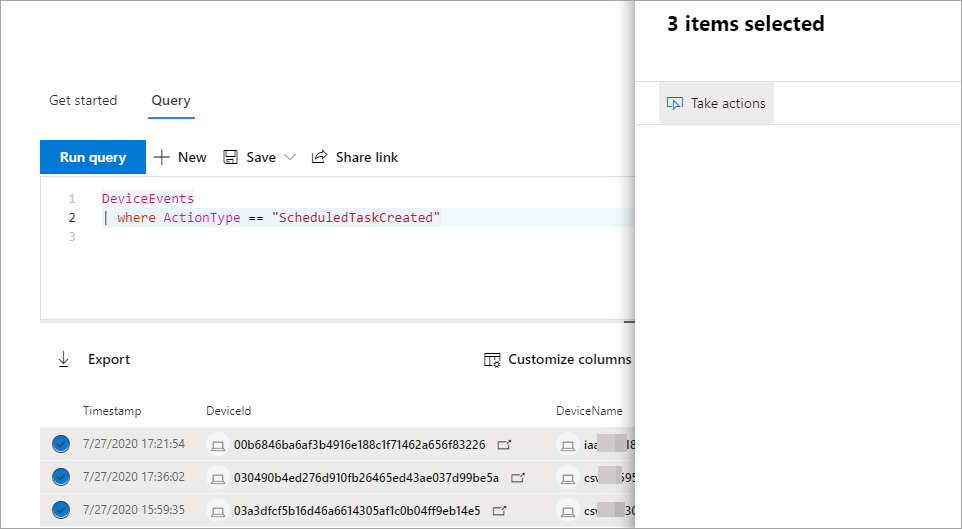

# Tomar medidas nos resultados avançados da consulta de busca

[!INCLUDE [Microsoft 365 Defender rebranding](../includes/microsoft-defender.md)]

**Aplica-se a:**
- Microsoft 365 Defender
- Microsoft Defender para Ponto de Extremidade

[!INCLUDE [Prerelease information](../includes/prerelease.md)]

Você pode conter rapidamente ameaças ou resolver ativos comprometidos que você encontra na busca [avançada](advanced-hunting-overview.md) usando opções de ação avançadas e abrangentes. Com essas opções, você pode:

- Tomar várias ações em dispositivos
- Arquivos de quarentena

## Permissões obrigatórias
Para poder realizar ações por meio da busca avançada, você precisa de uma função no Microsoft Defender para Ponto de Extremidade com permissões para enviar ações de [correção em dispositivos](/windows/security/threat-protection/microsoft-defender-atp/user-roles#permission-options). Se você não puder tomar uma ação, contate um administrador global sobre como obter a seguinte permissão:

*Ações de correção ativas > Ameaças e Gerenciamento de Vulnerabilidades - Tratamento de correção*

## Tomar várias ações em dispositivos
Você pode tomar as seguintes ações em dispositivos identificados pela `DeviceId` coluna em seus resultados de consulta:

- Isolar dispositivos afetados para conter uma infecção ou impedir que os ataques se movem lateralmente
- Coletar pacote de investigação para obter mais informações forenses
- Executar uma verificação antivírus para encontrar e remover ameaças usando as atualizações mais recentes de inteligência de segurança
- Inicie uma investigação automatizada para verificar e remediar ameaças no dispositivo e, possivelmente, em outros dispositivos afetados
- Restringir a execução de aplicativos somente a arquivos executáveis assinados pela Microsoft, impedindo atividades de ameaças subsequentes por meio de malware ou outros executáveis não-confiança

Para saber mais sobre como essas ações de resposta são executadas por meio do Microsoft Defender para Ponto de Extremidade, [leia sobre ações de resposta em dispositivos](/windows/security/threat-protection/microsoft-defender-atp/respond-machine-alerts).
   
## Arquivos de quarentena
Você pode implantar a *ação de* quarentena em arquivos para que eles sejam automaticamente colocados em quarentena quando encontrados. Ao selecionar essa ação, você pode escolher entre as seguintes colunas para identificar quais arquivos em sua consulta resulta em quarentena:

- `SHA1` — Nas tabelas de busca mais avançadas, este é o SHA-1 do arquivo que foi afetado pela ação gravada. Por exemplo, se um arquivo foi copiado, esse seria o arquivo copiado.
- `InitiatingProcessSHA1` — Nas tabelas de busca mais avançadas, esse é o arquivo responsável por iniciar a ação gravada. Por exemplo, se um processo filho foi lançado, esse seria o processo pai. 
- `SHA256` — Esse é o equivalente sha-256 do arquivo identificado pela `SHA1` coluna.
- `InitiatingProcessSHA256` — Esse é o equivalente sha-256 do arquivo identificado pela `InitiatingProcessSHA1` coluna.

Para saber mais sobre como as ações de quarentena são tomadas e como os arquivos podem ser restaurados, [leia sobre ações de resposta em arquivos](/windows/security/threat-protection/microsoft-defender-atp/respond-file-alerts).

>[!NOTE]
>Para localizar arquivos e colocar em quarentena, os resultados da consulta também devem incluir `DeviceId` valores como identificadores de dispositivo.  

## Tomar medidas
Para tomar qualquer uma das ações descritas, selecione um ou mais registros nos resultados da consulta e selecione **Tomar ações**. Um assistente o guiará pelo processo de seleção e, em seguida, enviará suas ações preferenciais.

## Revisar ações realizadas
Cada ação é registrada individualmente no centro [de](m365d-action-center.md) ações em **Histórico do Centro** de Ações (  >   [security.microsoft.com/action-center/history](https://security.microsoft.com/action-center/history)). Vá para o centro de ações para verificar o status de cada ação.
 
>[!NOTE]
>Algumas tabelas neste artigo podem não estar disponíveis no Microsoft Defender para Ponto de Extremidade. [A Microsoft 365 Defender para](m365d-enable.md) procurar ameaças usando mais fontes de dados. Você pode mover seus fluxos de trabalho de busca avançados do Microsoft Defender para o Endpoint para o Microsoft 365 Defender seguindo as etapas em Migrar consultas de busca avançadas do Microsoft Defender para o Ponto de [Extremidade.](advanced-hunting-migrate-from-mde.md)

## Tópicos relacionados
- [Visão geral da busca avançada](advanced-hunting-overview.md)
- [Aprender a linguagem de consulta](advanced-hunting-query-language.md)
- [Trabalhar com os resultados da consulta](advanced-hunting-query-results.md)
- [Compreender o esquema](advanced-hunting-schema-tables.md)
- [Visão geral do Centro de Ações](m365d-action-center.md)
