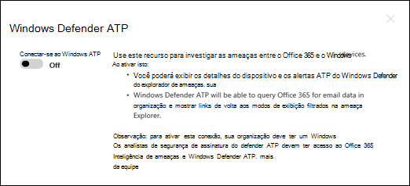
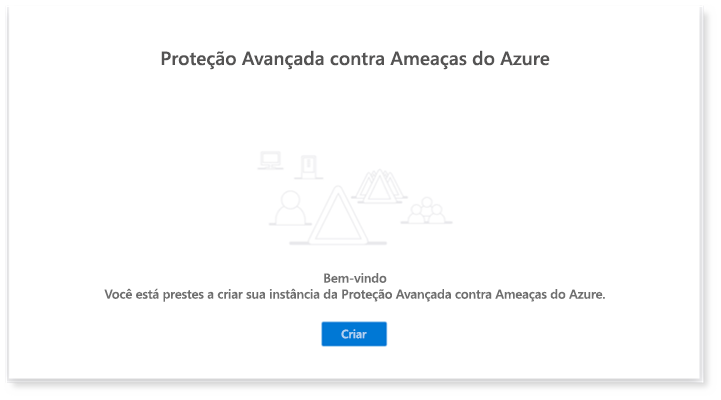
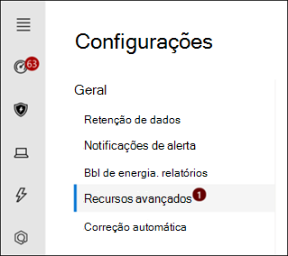

# Configurar Microsoft 365 Defender pilares para seu laboratório de avaliação ou ambiente pilotoConfigure Microsoft 365 Defender pillars for your trial lab or pilot environment

[!INCLUDE [Microsoft 365 Defender rebranding](../includes/microsoft-defender.md)]

**Aplica-se a:****Applies to:**
- Microsoft 365 DefenderMicrosoft 365 Defender

Criar um Microsoft 365 Defender ou ambiente piloto de avaliação e implantá-lo é um processo de três fases:Creating a Microsoft 365 Defender trial lab or pilot environment and deploying it is a three-phase process:

| [Fase 1: PrepararPhase 1: Prepare](prepare-m365d-eval.md) | [Fase 2: ConfigurarPhase 2: Set up](setup-m365deval.md) | Fase 3: IntegrarPhase 3: Onboard |  [Voltar ao playbook pilotoBack to pilot playbook](m365d-pilot.md) |
|--|--|--|--|
|| |*Você está aqui!**You are here!* | |

No momento, você está na fase de configuração.You're currently in the configuration phase.

A preparação é fundamental para qualquer implantação bem-sucedida.Preparation is key to any successful deployment. Neste artigo, você será orientado sobre os pontos que você precisará considerar ao se preparar para implantar o Microsoft Defender para o Ponto de Extremidade.In this article, you'll be guided on the points you'll need to consider as you prepare to deploy Microsoft Defender for Endpoint.

## Microsoft 365 Defender pilaresMicrosoft 365 Defender pillars
Microsoft 365 Defender consiste em quatro pilares.Microsoft 365 Defender consists of four pillars. Embora um pilar já possa fornecer valor para a segurança da sua organização de rede, a habilitação dos quatro Microsoft 365 Defender pilares dará mais valor à sua organização.Although one pillar can already provide value to your network organization's security, enabling the four Microsoft 365 Defender pillars will give your organization the most value.

Esta seção o orientará a configurar:This section will guide you to configure:

- Obter o Microsoft Defender para Office 365Microsoft Defender for Office 365
- Microsoft Defender para Identidade?Microsoft Defender for Identity
- Microsoft Cloud App SecurityMicrosoft Cloud App Security
- Microsoft Defender para Ponto de ExtremidadeMicrosoft Defender for Endpoint

## Configurar o Microsoft Defender para Office 365Configure Microsoft Defender for Office 365

> [!NOTE]
> Ignore esta etapa se você já habilitar o Defender para Office 365.Skip this step if you've already enabled Defender for Office 365.

Há um Módulo do PowerShell chamado *Office 365 OrCA (Advanced Threat Protection Recommended Configuration Analyzer)* que ajuda a determinar algumas dessas configurações.There's a PowerShell Module called the *Office 365 Advanced Threat Protection Recommended Configuration Analyzer (ORCA)* that helps determine some of these settings. Quando executado como administrador em seu locatário, get-ORCAReport ajudará a gerar uma avaliação das configurações anti-spam, anti-phish e outras configurações de higienização de mensagens.When run as an administrator in your tenant, get-ORCAReport will help generate an assessment of the anti-spam, anti-phish, and other message hygiene settings. Você pode baixar esse módulo de https://www.powershellgallery.com/packages/ORCA/ .You can download this module from https://www.powershellgallery.com/packages/ORCA/.

1. Navegue [até Office 365 Política de gerenciamento de ameaças](https://protection.office.com/homepage)& Centro de  >    >  **Conformidade.**Navigate to [Office 365 Security & Compliance Center](https://protection.office.com/homepage) > **Threat management** > **Policy**.

   

2. Clique **em Anti-phishing,** selecione **Criar** e preencher o nome e a descrição da política.Click **Anti-phishing**, select **Create** and fill in the policy name and description. Clique em **Próximo**.Click **Next**.

   

   > [!NOTE]
   > Edite sua política anti-phishing avançada no Microsoft Defender para Office 365.Edit your Advanced anti-phishing policy in Microsoft Defender for Office 365. Alterar **o Limite Avançado de Phishing** para **2 - Agressivo**.Change **Advanced Phishing Threshold** to **2 - Aggressive**.

3. Clique no **menu suspenso Adicionar uma** condição e selecione seu domínio(s) como domínio de destinatário.Click the **Add a condition** drop-down menu and select your domain(s) as recipient domain. Clique em **Próximo**.Click **Next**.

   

4. Revise suas configurações.Review your settings. Clique **em Criar essa política** para confirmar.Click **Create this policy** to confirm.

   

5. Selecione **Cofre Anexos** e selecione a opção Ativar ATP para **SharePoint, OneDrive e Microsoft Teams.**Select **Safe Attachments** and select the **Turn on ATP for SharePoint, OneDrive, and Microsoft Teams** option.

   

6. Clique no ícone + para criar uma nova política de anexo seguro, aplique-a como domínio de destinatário aos seus domínios.Click the + icon to create a new safe attachment policy, apply it as recipient domain to your domains. Clique em **Salvar**.Click **Save**.

   

7. Em seguida, selecione a **política Cofre Links** e clique no ícone de lápis para editar a política padrão.Next, select the **Safe Links** policy, then click the pencil icon to edit the default policy.

8. Certifique-se de que **a opção Não rastrear quando os** usuários clicarem em links seguros não estiver selecionada, enquanto o restante das opções estiver selecionado.Make sure that the **Do not track when users click safe links** option is not selected, while the rest of the options are selected. Consulte [Cofre Configurações de Links](/microsoft-365/security/office-365-security/recommended-settings-for-eop-and-office365) para obter detalhes.See [Safe Links settings](/microsoft-365/security/office-365-security/recommended-settings-for-eop-and-office365) for details. Clique em **Salvar**.Click **Save**.

   

9. Em seguida, selecione **a política Anti-malware,** selecione o padrão e escolha o ícone de lápis.Next select the **Anti-malware** policy, select the default, and choose the pencil icon.

10. Clique **Configurações** e selecione **Sim e use o** texto de notificação padrão para habilitar a Resposta de Detecção **de Malware.**Click **Settings** and select **Yes and use the default notification text** to enable **Malware Detection Response**. Ativar o **Filtro de Tipos de Anexo** Comum.Turn the **Common Attachment Types Filter** on. Clique em **Salvar**.Click **Save**.

    

11. Navegue [até Office 365 pesquisa de log](https://protection.office.com/homepage)de Auditoria de Pesquisa do Centro de Conformidade & Segurança e a ativar a  >    >   Auditoria.Navigate to [Office 365 Security & Compliance Center](https://protection.office.com/homepage) > **Search** > **Audit log search** and turn Auditing on.

    

12. Integre o Microsoft Defender para Office 365 com o Microsoft Defender para Ponto de Extremidade.Integrate Microsoft Defender for Office 365 with Microsoft Defender for Endpoint. Navegue [até Office 365 Security & Compliance Center](https://protection.office.com/homepage)Threat management Explorer e selecione Microsoft Defender for  >    >   **Endpoint Configurações** no canto superior direito da tela.Navigate to [Office 365 Security & Compliance Center](https://protection.office.com/homepage) > **Threat management** > **Explorer** and select **Microsoft Defender for Endpoint Settings** on the upper right corner of the screen. Na caixa de diálogo Conexão do Defender para Ponto de Extremidade, a Conexão **para o Microsoft Defender para Ponto de Extremidade**.In the Defender for Endpoint connection dialog box, turn on **Connect to Microsoft Defender for Endpoint**.

    

## Configurar o Microsoft Defender para IdentidadeConfigure Microsoft Defender for Identity

> [!NOTE]
> Ignore esta etapa se você já habilitar o Microsoft Defender para IdentidadeSkip this step if you've already enabled Microsoft Defender for Identity

1. Navegue [até Microsoft 365 Centro](https://security.microsoft.com/info) de Segurança > selecione Mais **Recursos** do Microsoft Defender  >  **para Identidade**.Navigate to [Microsoft 365 Security Center](https://security.microsoft.com/info) > select **More Resources** > **Microsoft Defender for Identity**.

   

2. Clique **em Criar** para iniciar o assistente do Microsoft Defender para Identidade.Click **Create** to start the Microsoft Defender for Identity wizard.

   

3. Escolha **Fornecer um nome de usuário e uma senha para se conectar à sua floresta do Active Directory.**Choose **Provide a username and password to connect to your Active Directory forest**.

   

4. Insira suas credenciais locais do Active Directory.Enter your Active Directory on-premises credentials. Pode ser qualquer conta de usuário que tenha acesso de leitura ao Active Directory.This can be any user account that has read access to Active Directory.

   

5. Em seguida, **escolha Baixar a Instalação do Sensor** e transferir o arquivo para o controlador de domínio.Next, choose **Download Sensor Setup** and transfer file to your domain controller.

   

6. Execute a Instalação do Microsoft Defender para Sensor de Identidade e comece a seguir o assistente.Execute the Microsoft Defender for Identity Sensor Setup and begin following the wizard.

   

7. Clique **em Próximo** no tipo de implantação do sensor.Click **Next** at the sensor deployment type.

   

8. Copie a chave de acesso porque você precisa insiá-la em seguida no Assistente.Copy the access key because you need to enter it next in the Wizard.

   

9. Copie a chave de acesso para o Assistente e clique em **Instalar**.Copy the access key into the Wizard and click **Install**.

   

10. Parabéns, você configurou com êxito o Microsoft Defender para Identidade no controlador de domínio.Congratulations, you've successfully configured Microsoft Defender for Identity on your domain controller.

    

11. Na seção [Configurações](https://go.microsoft.com/fwlink/?linkid=2040449) do Microsoft Defender para Identidade, selecione \*\*Microsoft Defender para Ponto de Extremidade \*\*e, em seguida, acione a alternância.Under the [Microsoft Defender for Identity](https://go.microsoft.com/fwlink/?linkid=2040449) settings section, select \*\*Microsoft Defender for Endpoint \*\*, then turn on the toggle. Clique em **Salvar**.Click **Save**.

    

## Configurar Microsoft Cloud App SecurityConfigure Microsoft Cloud App Security

> [!NOTE]
> Ignore esta etapa se você já tiver habilitado Microsoft Cloud App Security.Skip this step if you've already enabled Microsoft Cloud App Security.

1. Navegue [até Microsoft 365 Central](https://security.microsoft.com/info)de Segurança Mais Recursos  >    >  **Microsoft Cloud App Security**.Navigate to [Microsoft 365 Security Center](https://security.microsoft.com/info) > **More Resources** > **Microsoft Cloud App Security**.

   

2. No prompt de informações para integrar o Microsoft Defender para Identidade, selecione **Habilitar a integração de dados do Microsoft Defender para Identidade.**At the information prompt to integrate Microsoft Defender for Identity, select **Enable Microsoft Defender for Identity data integration**.

   

   > [!NOTE]
   > Se você não vir esse prompt, pode significar que a integração de dados do Microsoft Defender for Identity já foi habilitada.If you don’t see this prompt, it might mean that your Microsoft Defender for Identity data integration has already been enabled. No entanto, se você não tiver certeza, entre em contato com o administrador de TI para confirmar.However, if you are not sure, contact your IT Administrator to confirm.

3. Vá para **Configurações**, adque a alternância de integração do **Microsoft Defender for Identity** e clique em **Salvar**.Go to **Settings**, turn on the **Microsoft Defender for Identity integration** toggle, then click **Save**.

   

   > [!NOTE]
   > Para novas instâncias do Microsoft Defender para Identidade, essa alternância de integração é automaticamente ativado.For new Microsoft Defender for Identity instances, this integration toggle is automatically turned on. Confirme se a integração com o Microsoft Defender for Identity foi habilitada antes de prosseguir para a próxima etapa.Confirm that your Microsoft Defender for Identity integration has been enabled before you proceed to the next step.

4. Nas configurações de descoberta na nuvem, selecione **Integração do Microsoft Defender para Ponto de Extremidade** e habilita a integração.Under the Cloud discovery settings, select **Microsoft Defender for Endpoint integration**, then enable the integration. Clique em **Salvar**.Click **Save**.

   

5. Em Configurações de descoberta na nuvem, selecione **Enriquecimento de usuário** e, em seguida, habilita a integração com Azure Active Directory.Under Cloud discovery settings, select **User enrichment**, then enable the integration with Azure Active Directory.

   

## Configurar o Microsoft Defender para Ponto de ExtremidadeConfigure Microsoft Defender for Endpoint

> [!NOTE]
> Ignore esta etapa se você já habilitar o Microsoft Defender para Ponto de Extremidade.Skip this step if you've already enabled Microsoft Defender for Endpoint.

1. Navegue [até Microsoft 365 Central de Segurança](https://security.microsoft.com/info)Mais Recursos  >    >  **Central de Segurança do Microsoft Defender**.Navigate to [Microsoft 365 Security Center](https://security.microsoft.com/info) > **More Resources** > **Microsoft Defender Security Center**. Clique em **Abrir**. Click **Open**.

   

2. Siga o assistente do Microsoft Defender para Ponto de Extremidade.Follow the Microsoft Defender for Endpoint wizard. Clique em **Próximo**.Click **Next**.

   

3. Escolha com base em seu local de armazenamento de dados preferencial, política de retenção de dados, tamanho da organização e aceitação para recursos de visualização.Choose based on your preferred data storage location, data retention policy, organization size, and opt-in for preview features.

   

   > [!NOTE]
   > Você não pode alterar algumas das configurações, como o local de armazenamento de dados, posteriormente.You cannot change some of the settings, like data storage location, afterwards.

   Clique em **Próximo**.Click **Next**.

4. Clique **em Continuar** e ele provisiona seu locatário do Microsoft Defender para Ponto de Extremidade.Click **Continue** and it will provision your Microsoft Defender for Endpoint tenant.

   

5. A integração de seus pontos de extremidade por meio de Políticas de Grupo, Microsoft Endpoint Manager ou executando um script local para o Microsoft Defender para Ponto de Extremidade.Onboard your endpoints through Group Policies, Microsoft Endpoint Manager or by running a local script to Microsoft Defender for Endpoint. Para simplificar, este guia usa o script local.For simplicity, this guide uses the local script.

6. Clique **em Baixar pacote** e copie o script de integração para seus pontos de extremidade.Click **Download package** and copy the onboarding script to your endpoint(s).

   

7. No ponto de extremidade, execute o script de integração como Administrador e escolha Y.On your endpoint, run the onboarding script as Administrator and choose Y.

   

8. Parabéns, você integra seu primeiro ponto de extremidade.Congratulations, you've onboarded your first endpoint.

   

9. Copie o teste de detecção do assistente do Microsoft Defender para Ponto de Extremidade.Copy-paste the detection test from the Microsoft Defender for Endpoint wizard.

   

10. Copie o script do PowerShell para um prompt de comando elevado e execute-o.Copy the PowerShell script to an elevated command prompt and run it.

    

11. Selecione **Iniciar usando o Microsoft Defender para Ponto de** Extremidade no Assistente.Select **Start using Microsoft Defender for Endpoint** from the Wizard.

    

12. Visite o [Central de Segurança do Microsoft Defender](https://securitycenter.windows.com/).Visit the [Microsoft Defender Security Center](https://securitycenter.windows.com/). Vá para **Configurações** e selecione **Recursos avançados**.Go to **Settings** and then select **Advanced features**.

    

13. Ativar a integração com **o Microsoft Defender para Identidade.**Turn on the integration with **Microsoft Defender for Identity**.

    

14. Ativar a integração com **o Office 365 Threat Intelligence**.Turn on the integration with **Office 365 Threat Intelligence**.

    

15. Ativar a integração com **Microsoft Cloud App Security**.Turn on integration with **Microsoft Cloud App Security**.

    

16. Role para baixo e **clique em Salvar preferências** para confirmar as novas integrações.Scroll down and click **Save preferences** to confirm the new integrations.

    

## Iniciar o serviço Microsoft 365 DefenderStart the Microsoft 365 Defender service

> [!NOTE]
> A partir de 1º de junho de 2020, a Microsoft habilita automaticamente Microsoft 365 Defender recursos para todos os locatários qualificados.Starting June 1, 2020, Microsoft automatically enables Microsoft 365 Defender features for all eligible tenants. Consulte este [artigo do Microsoft Tech Community sobre qualificação de licença para](https://techcommunity.microsoft.com/t5/security-privacy-and-compliance/microsoft-threat-protection-will-automatically-turn-on-for/ba-p/1345426) obter detalhes.See this [Microsoft Tech Community article on license eligibility](https://techcommunity.microsoft.com/t5/security-privacy-and-compliance/microsoft-threat-protection-will-automatically-turn-on-for/ba-p/1345426) for details.

Vá para [Microsoft 365 Central de Segurança.](https://security.microsoft.com/homepage)Go to [Microsoft 365 Security Center](https://security.microsoft.com/homepage). Navegue **até Configurações** e selecione **Microsoft 365 Defender**.Navigate to **Settings** and then select **Microsoft 365 Defender**.

Para obter uma orientação mais abrangente, consulte [Ativar Microsoft 365 Defender](m365d-enable.md).For a more comprehensive guidance, see [Turn on Microsoft 365 Defender](m365d-enable.md).

Parabéns!Congratulations! Você acabou de criar seu laboratório de avaliação Microsoft 365 Defender ou ambiente piloto!You've just created your Microsoft 365 Defender trial lab or pilot environment! Agora você pode se familiarizar com a interface Microsoft 365 Defender usuário!Now you can familiarize yourself with the Microsoft 365 Defender user interface! Veja o que você pode aprender com o guia interativo Microsoft 365 Defender a seguir e saiba como usar cada painel para suas tarefas de operação de segurança diárias.See what you can learn from the following Microsoft 365 Defender interactive guide and know how to use each dashboard for your day-to-day security operation tasks.

[Conferir o guia interativoCheck out the interactive guide](https://aka.ms/MTP-Interactive-Guide)

Em seguida, você pode simular um ataque e ver como os recursos entre produtos detectam, criam alertas e respondem automaticamente a um ataque sem arquivo em um ponto de extremidade.Next, you can simulate an attack and see how the cross product capabilities detect, create alerts, and automatically respond to a fileless attack on an endpoint.

## Próxima etapaNext step

- [Gerar um alerta de teste](generate-test-alert.md) - Execute uma simulação de ataque em seu laboratório de Microsoft 365 Defender de avaliação.[Generate a test alert](generate-test-alert.md) - Run an attack simulation in your Microsoft 365 Defender trial lab.
