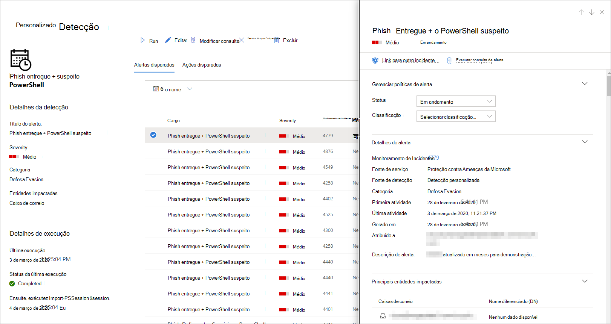

# <a name="create-and-manage-custom-detections-rules"></a>Criar e gerenciar regras de detecções personalizadas

[!INCLUDE [Microsoft 365 Defender rebranding](../includes/microsoft-defender.md)]


**Aplica-se a:**
- Microsoft 365 Defender

Regras de detecção personalizadas são regras que você pode projetar e ajustar usando [consultas de busca](advanced-hunting-overview.md) avançadas. Essas regras permitem que você monitore proativamente vários eventos e estados do sistema, incluindo atividades suspeitas de violação e pontos de extremidade configurados incorretamente. Você pode defini-los para executar em intervalos regulares, gerando alertas e tomando ações de resposta sempre que houver corresponde.

## <a name="required-permissions-for-managing-custom-detections"></a>Permissões necessárias para gerenciar detecções personalizadas

Para gerenciar detecções personalizadas, você precisa ter uma dessas funções:

- **Administrador de** segurança — os usuários com essa função do [Azure Active Directory](/azure/active-directory/users-groups-roles/directory-assign-admin-roles#security-administrator) podem gerenciar configurações de segurança no Centro de segurança do Microsoft 365 e em outros portais e serviços.

- **Operador de** segurança — os usuários com essa função do [Azure Active Directory](/azure/active-directory/users-groups-roles/directory-assign-admin-roles#security-administrator) podem gerenciar alertas e ter acesso global somente leitura a recursos relacionados à segurança, incluindo todas as informações no Centro de segurança do Microsoft 365. Essa função é suficiente para gerenciar detecções personalizadas somente se o controle de acesso baseado em função (RBAC) estiver desligado no Microsoft Defender para Ponto de Extremidade. Se você tiver o RBAC configurado, também precisará da permissão gerenciar configurações **de segurança** para o Defender para o Ponto de Extremidade.

Para gerenciar permissões necessárias, um **administrador global** pode:

- Atribua **a função de administrador de** segurança ou operador **de** segurança no Centro de administração do [Microsoft 365](https://admin.microsoft.com/) em **Roles**  >  **Security admin**.
- Verifique as configurações do RBAC para o Microsoft Defender para Ponto de Extremidade no Centro de Segurança do [Microsoft Defender](https://securitycenter.windows.com/) em **Funções de** Permissões  >  **de**  >  **Configurações.** Selecione a função correspondente para atribuir a **permissão gerenciar configurações de** segurança.

> [!NOTE]
> Para gerenciar detecções **personalizadas,** os operadores de segurança precisarão da permissão gerenciar configurações de **segurança** no Microsoft Defender para Ponto de Extremidade se o RBAC estiver ligado.

## <a name="create-a-custom-detection-rule"></a>Criar uma regra de detecção personalizada
### <a name="1-prepare-the-query"></a>1. Preparar a consulta.

No Centro de segurança do Microsoft 365, vá para **Busca** Avançada e selecione uma consulta existente ou crie uma nova consulta. Ao usar uma nova consulta, execute a consulta para identificar erros e compreender possíveis resultados.

>[!IMPORTANT]
>Para impedir que o serviço retorne alertas demais, cada regra é limitada à geração de apenas 100 alertas sempre que ele é executado. Antes de criar uma regra, ajuste sua consulta para evitar alertas para atividades normais do dia a dia.


#### <a name="required-columns-in-the-query-results"></a>Colunas necessárias nos resultados da consulta
Para criar uma regra de detecção personalizada, a consulta deve retornar as seguintes colunas:

- `Timestamp`— usado para definir o data/hora dos alertas gerados
- `ReportId`— habilita as buscas para os registros originais
- Uma das seguintes colunas que identificam dispositivos, usuários ou caixas de correio específicas:
    - `DeviceId`
    - `DeviceName`
    - `RemoteDeviceName`
    - `RecipientEmailAddress`
    - `SenderFromAddress` (remetente de envelope ou Return-Path endereço)
    - `SenderMailFromAddress` (endereço do remetente exibido pelo cliente de email)
    - `RecipientObjectId`
    - `AccountObjectId`
    - `AccountSid`
    - `AccountUpn`
    - `InitiatingProcessAccountSid`
    - `InitiatingProcessAccountUpn`
    - `InitiatingProcessAccountObjectId`

>[!NOTE]
>O suporte para entidades adicionais será adicionado à medida que novas tabelas são adicionadas ao [esquema avançado de busca.](advanced-hunting-schema-tables.md)

Consultas simples, como aquelas que não usam o operador ou para personalizar ou agregar resultados, normalmente `project` `summarize` retornam essas colunas comuns.

Há várias maneiras de garantir que consultas mais complexas retornem essas colunas. Por exemplo, se você preferir agregar e contar por entidade em uma coluna como , você ainda pode retornar e conseguindo-o do evento mais recente envolvendo `DeviceId` `Timestamp` cada exclusivo `ReportId` `DeviceId` .

A consulta de exemplo abaixo conta o número de dispositivos exclusivos ( ) com detecções antivírus e usa essa contagem para encontrar apenas os dispositivos com mais de `DeviceId` cinco detecções. Para retornar o mais `Timestamp` recente e o correspondente , ele usa o operador com a `ReportId` `summarize` `arg_max` função.

```kusto
DeviceEvents
| where Timestamp > ago(1d)
| where ActionType == "AntivirusDetection"
| summarize (Timestamp, ReportId)=arg_max(Timestamp, ReportId), count() by DeviceId
| where count_ > 5
```

> [!TIP]
> Para melhorar o desempenho da consulta, de definir um filtro de tempo que corresponde à frequência de execução pretendido para a regra. Como a duração menos frequente é a cada _24 horas,_ a filtragem do último dia abrangerá todos os novos dados.

### <a name="2-create-new-rule-and-provide-alert-details"></a>2. Crie nova regra e forneça detalhes de alerta.

Com a consulta no editor de consulta, selecione **Criar regra de** detecção e especifique os seguintes detalhes de alerta:

- **Nome da detecção**— nome da regra de detecção
- **Frequência**— intervalo para executar a consulta e executar a ação. [Consulte orientações adicionais abaixo](#rule-frequency)
- **Título do** alerta — título exibido com alertas disparados pela regra
- **Severidade**— risco potencial do componente ou atividade identificado pela regra
- **Categoria**— componente de ameaça ou atividade identificada pela regra
- **MITRE ATT&técnicas de CK**— uma ou mais técnicas de ataque identificadas pela regra como documentadas na estrutura CK do [MITRE ATT&CK](https://attack.mitre.org/). Esta seção está oculta para determinadas categorias de alerta, incluindo malware, ransomware, atividade suspeita e software indesejado
- **Descrição**— mais informações sobre o componente ou atividade identificada pela regra 
- **Ações recomendadas**— ações adicionais que os respondentes podem tomar em resposta a um alerta

#### <a name="rule-frequency"></a>Frequência de regra
Quando você salva ou edita uma nova regra, ela é executado e verifica se há combinações dos últimos 30 dias de dados. Em seguida, a regra é executado novamente em intervalos fixos, aplicando uma duração de retorno com base na frequência escolhida:

- **A cada 24 horas**— é executado a cada 24 horas, verificando dados dos últimos 30 dias
- **A cada 12 horas**— é executado a cada 12 horas, verificando dados das últimas 24 horas
- **A cada 3 horas**— é executado a cada 3 horas, verificando dados das últimas 6 horas
- **A cada hora**— é executado por hora, verificando dados das últimas 2 horas

>[!TIP]
> Match the time filters in your query with the lookback duration. Os resultados fora da duração do retorno de pesquisa são ignorados.  

Selecione a frequência que corresponde à proximidade com que você deseja monitorar detecções. Considere a capacidade da sua organização de responder aos alertas.

### <a name="3-choose-the-impacted-entities"></a>3. Escolha as entidades impactadas.
Identifique as colunas nos resultados da consulta onde você espera encontrar a entidade principal afetada ou afetada. Por exemplo, uma consulta pode retornar endereços de remetente ( `SenderFromAddress` ou ) e destinatário ( `SenderMailFromAddress` `RecipientEmailAddress` ). Identificar qual dessas colunas representa a entidade principal impactada ajuda o serviço a agregar alertas relevantes, correlacionar incidentes e ações de resposta de destino.

Você pode selecionar apenas uma coluna para cada tipo de entidade (caixa de correio, usuário ou dispositivo). As colunas que não são retornadas pela consulta não podem ser selecionadas.

### <a name="4-specify-actions"></a>4. Especifique ações.
Sua regra de detecção personalizada pode tomar ações automaticamente em dispositivos, arquivos ou usuários retornados pela consulta.

#### <a name="actions-on-devices"></a>Ações em dispositivos
Essas ações são aplicadas a dispositivos na `DeviceId` coluna dos resultados da consulta:
- **Isolar dispositivo** usa o Microsoft Defender para Endpoint para aplicar isolamento total de rede, impedindo que o dispositivo se conecte a qualquer aplicativo ou serviço. [Saiba mais sobre o isolamento de máquina do Microsoft Defender for Endpoint](/windows/security/threat-protection/microsoft-defender-atp/respond-machine-alerts#isolate-devices-from-the-network)
- **Coletar pacote de investigação**— coleta informações do dispositivo em um arquivo ZIP. [Saiba mais sobre o pacote de investigação do Microsoft Defender for Endpoint](/windows/security/threat-protection/microsoft-defender-atp/respond-machine-alerts#collect-investigation-package-from-devices)
- **Executar a verificação antivírus**— executa uma verificação completa Windows Defender antivírus no dispositivo
- **Iniciar investigação**— inicia uma investigação [automatizada](m365d-autoir.md) no dispositivo
- **Restringir a execução de** aplicativos define restrições no dispositivo para permitir que apenas arquivos assinados com um certificado emitido pela Microsoft sejam executados. [Saiba mais sobre restrições de aplicativo com o Microsoft Defender para Ponto de Extremidade](/microsoft-365/security/defender-endpoint/respond-machine-alerts#restrict-app-execution)

#### <a name="actions-on-files"></a>Ações em arquivos
Quando selecionado, você pode  optar por aplicar a ação de arquivo de quarentena em arquivos na coluna , , ou nos `SHA1` resultados da `InitiatingProcessSHA1` `SHA256` `InitiatingProcessSHA256` consulta. Essa ação exclui o arquivo de seu local atual e coloca uma cópia em quarentena.

#### <a name="actions-on-users"></a>Ações em usuários
Quando selecionado, o **usuário Mark como ação** comprometida é tomada em usuários na coluna , ou nos resultados da `AccountObjectId` `InitiatingProcessAccountObjectId` `RecipientObjectId` consulta. Essa ação define o nível de risco dos usuários como "alto" no Azure Active Directory, disparando as políticas de proteção [de identidade correspondentes.](/azure/active-directory/identity-protection/overview-identity-protection)

> [!NOTE]
> No momento, a ação permitir ou bloquear regras de detecção personalizadas não é suportada no Microsoft 365 Defender.

### <a name="5-set-the-rule-scope"></a>5. De definir o escopo da regra.
De definir o escopo para especificar quais dispositivos são cobertos pela regra. O escopo influencia regras que verificam dispositivos e não afetam regras que verificam apenas caixas de correio e contas de usuário ou identidades.

Ao definir o escopo, você pode selecionar:

- Todos os dispositivos
- Grupos de dispositivos específicos

Somente os dados de dispositivos no escopo serão consultados. Além disso, as ações serão realizadas somente nesses dispositivos.

### <a name="6-review-and-turn-on-the-rule"></a>6. Revise e a turn on the rule.
Depois de revisar a regra, selecione **Criar** para salvá-la. A regra de detecção personalizada é imediatamente executado. Ele é executado novamente com base na frequência configurada para verificar se há resultados, gerar alertas e tomar ações de resposta.


>[!Important] 
>As detecções personalizadas devem ser regularmente revisadas para eficiência e eficácia. Para garantir que você está criando detecções que disparam alertas verdadeiros, desdove para revisar suas detecções personalizadas existentes seguindo as etapas em Gerenciar regras de detecção [personalizadas existentes.](#manage-existing-custom-detection-rules) <br>  
Você mantém o controle sobre a ampla ou a especificidade de suas detecções personalizadas para que quaisquer alertas falsos gerados por detecções personalizadas possam indicar a necessidade de modificar determinados parâmetros das regras.


## <a name="manage-existing-custom-detection-rules"></a>Gerenciar regras de detecção personalizadas existentes
Você pode exibir a lista de regras de detecção personalizadas existentes, verificar suas versões anteriores e revisar os alertas disparados. Você também pode executar uma regra sob demanda e modificá-la.

### <a name="view-existing-rules"></a>Exibir regras existentes

Para exibir todas as regras de detecção personalizadas existentes, navegue até **Hunting**  >  **Custom detections**. A página lista todas as regras com as seguintes informações de executar:

- **Última executar**— quando uma regra foi executado pela última vez para verificar se há verificações de consultas e gerar alertas
- **Status da última executar**— se uma regra foi realizada com êxito
- **Próxima executar**— a próxima sequência agendada
- **Status**— se uma regra foi 1ada ou desligada

### <a name="view-rule-details-modify-rule-and-run-rule"></a>Exibir detalhes da regra, modificar regra e executar regra

Para exibir informações abrangentes sobre uma regra de detecção personalizada, acesse **Hunting**  >  **Custom detections** e selecione o nome da regra. Em seguida, você pode exibir informações gerais sobre a regra, incluindo informações sobre seu status e escopo de executar. A página também fornece a lista de alertas e ações disparados.

<br>
*Detalhes da regra de detecção personalizada*

Você também pode tomar as seguintes ações na regra nesta página:

- **Executar**— execute a regra imediatamente. Isso também redefine o intervalo para a próxima executar.
- **Editar**— modificar a regra sem alterar a consulta
- **Modificar consulta —** editar a consulta na busca avançada
- **Ativar**  /  **Desativar —** habilitar a regra ou impedi-la de executar
- **Excluir**— desativar a regra e removê-la

### <a name="view-and-manage-triggered-alerts"></a>Exibir e gerenciar alertas disparados

Na tela de detalhes da regra (**Hunting**  >  **Custom detections**  >  **[Nome** da regra] ), vá para **Alertas disparados**, que lista os alertas gerados por corresponde à regra. Selecione um alerta para exibir informações detalhadas sobre ele e tome as seguintes ações:

- Gerencie o alerta definindo seu status e classificação (alerta verdadeiro ou falso)
- Vincular o alerta a um incidente
- Execute a consulta que disparou o alerta na busca avançada

### <a name="review-actions"></a>Revisar ações
Na tela de detalhes da regra (**Hunting**  >  **Custom detections**  >  **[Nome** da regra] ), vá para **Ações** disparadas , que lista as ações realizadas com base em corresponde à regra.

>[!TIP]
>Para exibir rapidamente informações e tomar medidas em um item em uma tabela, use a coluna de seleção [&#10003;] à esquerda da tabela.

## <a name="see-also"></a>Confira também
- [Visão geral de detecções personalizadas](custom-detections-overview.md)
- [Visão geral da busca avançada](advanced-hunting-overview.md)
- [Conhecer a linguagem de consulta de busca avançada](advanced-hunting-query-language.md)
- [Migrar consultas de busca avançadas do Microsoft Defender para o Ponto de Extremidade](advanced-hunting-migrate-from-mde.md)
