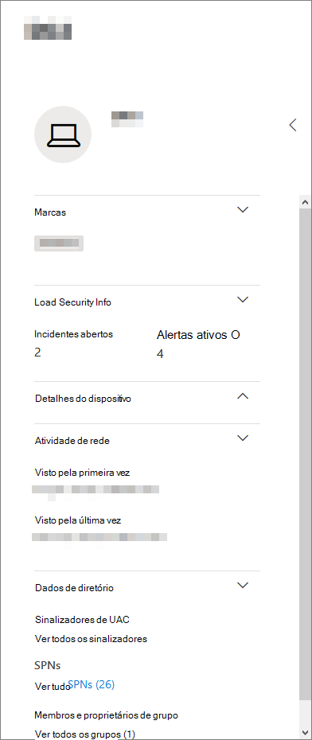
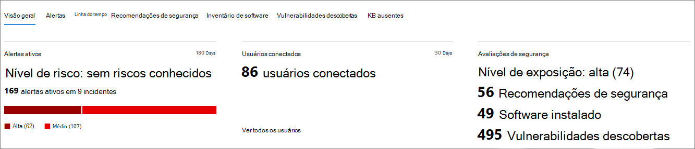
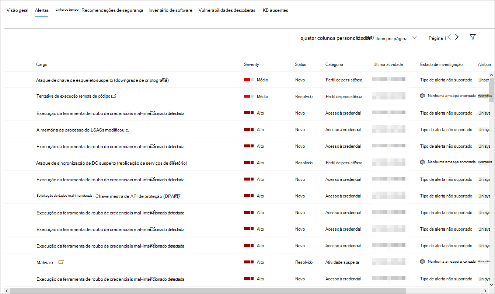
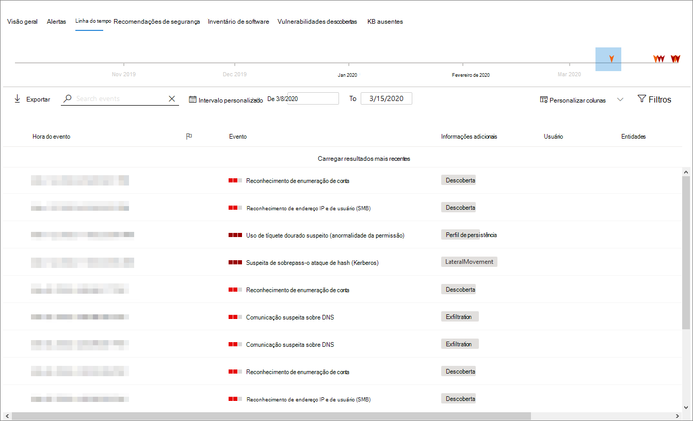
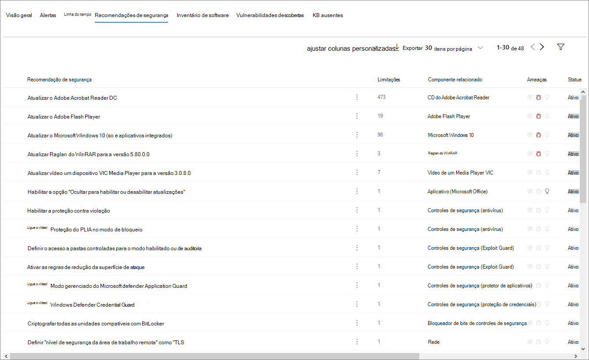
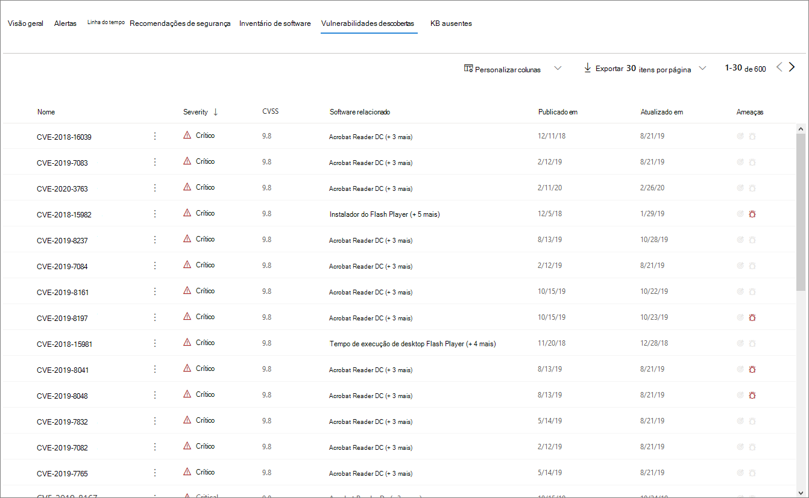

# Página de perfil de dispositivo

[!INCLUDE [Microsoft 365 Defender rebranding](../includes/microsoft-defender.md)]

O Microsoft 365 de segurança fornece páginas de perfil de dispositivo, para que você possa avaliar rapidamente a saúde e o status dos dispositivos em sua rede.

> [!IMPORTANT]
> A página de perfil de dispositivo pode parecer um pouco diferente, dependendo se o dispositivo está inscrito no Microsoft Defender para Ponto de Extremidade, No Microsoft Defender para Identidade ou ambos.

Se o dispositivo estiver inscrito no Microsoft Defender para Ponto de Extremidade, você também poderá usar a página de perfil do dispositivo para executar algumas tarefas comuns de segurança.

## Navegando a página de perfil do dispositivo

A página de perfil é dividida em várias seções amplas.

A barra lateral (1) lista detalhes básicos sobre o dispositivo.

A área de conteúdo principal (2) contém guias que você pode alternar para exibir diferentes tipos de informações sobre o dispositivo.

Se o dispositivo estiver inscrito no Microsoft Defender para Ponto de Extremidade, você também verá uma lista de ações de resposta (3). As ações de resposta permitem que você execute tarefas comuns relacionadas à segurança.

## Barra lateral

Ao lado da área de conteúdo principal da página de perfil de dispositivo está a barra lateral.

A barra lateral lista o nome completo do dispositivo e o nível de exposição. Ele também fornece algumas informações básicas importantes em pequenas subseções que podem ser alternadas abertas ou fechadas, como:

* **Tags** - Qualquer Microsoft Defender para Ponto de Extremidade, Microsoft Defender para Identidade ou marcas personalizadas associadas ao dispositivo. As marcas do Microsoft Defender para Identidade não são editáveis.
* **Informações de segurança** - Abra incidentes e alertas ativos. Os dispositivos inscritos no Microsoft Defender para Ponto de Extremidade também exibirão o nível de exposição e o nível de risco.

> [!TIP]
> O nível de exposição diz respeito ao quanto o dispositivo está em conformidade com as recomendações de segurança, enquanto o nível de risco é calculado com base em vários fatores, incluindo os tipos e a gravidade dos alertas ativos.

* **Detalhes do** dispositivo - Domínio, sistema operacional, data/hora para quando o dispositivo foi visto pela primeira vez, endereços IP, recursos. Os dispositivos inscritos no Microsoft Defender para Ponto de Extremidade também exibem estado de saúde. Os dispositivos inscritos no Microsoft Defender para Identidade exibirão o nome SAM e um data/hora para quando o dispositivo foi criado pela primeira vez.
* **Atividade de rede** - Timestamps pela primeira e última vez que o dispositivo foi visto na rede.
* **Dados de** diretório (*somente para dispositivos inscritos* no Microsoft Defender para Identidade ) - sinalizadores [UAC,](/windows/security/identity-protection/user-account-control/user-account-control-overview) [SPNs](/windows/win32/ad/service-principal-names)e associações de grupo.

## Ações de resposta

As ações de resposta oferecem uma maneira rápida de se defender e analisar ameaças.

> [!IMPORTANT]
> * [As ações de](/windows/security/threat-protection/microsoft-defender-atp/respond-machine-alerts) resposta só estarão disponíveis se o dispositivo estiver inscrito no Microsoft Defender para Endpoint.
> * Dispositivos que estão inscritos no Microsoft Defender para Ponto de Extremidade podem exibir números diferentes de ações de resposta, com base no sistema operacional do dispositivo e no número da versão.

As ações disponíveis na página de perfil do dispositivo incluem:

* **Gerenciar marcas** - Atualiza marcas personalizadas que você aplicou a este dispositivo.
* **Isolar o** dispositivo - isola o dispositivo da rede da sua organização enquanto o mantém conectado ao Microsoft Defender para o Ponto de Extremidade. Você pode optar por permitir que Outlook, Teams e Skype for Business seja executado enquanto o dispositivo está isolado, para fins de comunicação.
* **Centro de ações** - Exibir o status das ações enviadas. Disponível somente se outra ação já tiver sido selecionada.
* **Restringir a execução do** aplicativo - impede que aplicativos que não são assinados pela Microsoft sejam executados.
* **Executar a verificação antivírus** - atualiza Windows Defender Antivírus definições e executa imediatamente uma verificação antivírus. Escolha entre Verificação Rápida ou Verificação Completa.
* **Coletar pacote de investigação** - Coleta informações sobre o dispositivo. Quando a investigação for concluída, você poderá baixá-la.
* **Iniciar Sessão de Resposta Ao Vivo** - Carrega um shell remoto no dispositivo para [investigações detalhadas de segurança.](/microsoft-365/security/defender-endpoint/live-response)
* **Iniciar investigação automatizada** - Investiga e corrigi automaticamente [ameaças.](../office-365-security/office-365-air.md) Embora você possa disparar manualmente investigações automatizadas para executar a partir desta [página,](../../compliance/alert-policies.md?view=o365-worldwide#default-alert-policies) determinadas políticas de alerta disparam investigações automáticas por conta própria.
* **Centro de ações** - Exibe informações sobre todas as ações de resposta que estão sendo executados no momento.

## Seção Tabs

As guias de perfil de dispositivo permitem que você alterne uma visão geral dos detalhes de segurança sobre o dispositivo e tabelas que contêm uma lista de alertas.

Os dispositivos inscritos no Microsoft Defender para Ponto de Extremidade também exibirão guias que apresentam uma linha do tempo, uma lista de recomendações de segurança, um inventário de software, uma lista de vulnerabilidades descobertas e KBs ausentes (atualizações de segurança).

### Guia Visão geral

A guia padrão é **Visão Geral**. Ele fornece uma rápida olhada no fato de segurança mais importante sobre o dispositivo.

Aqui, você pode ver rapidamente os alertas ativos do dispositivo e qualquer usuário conectado no momento.

Se o dispositivo estiver inscrito no Microsoft Defender para Ponto de Extremidade, você também verá o nível de risco do dispositivo e todos os dados disponíveis sobre avaliações de segurança. As avaliações de segurança descrevem o nível de exposição do dispositivo, fornecem recomendações de segurança e listam software afetado e vulnerabilidades descobertas.

### Guia Alertas

A **guia Alertas** contém uma lista de alertas que foram gerados no dispositivo, tanto do Microsoft Defender para Identidade quanto do Microsoft Defender para Ponto de Extremidade.

Você pode personalizar o número de itens exibidos, bem como quais colunas são exibidas para cada item. O comportamento padrão é listar trinta itens por página.

As colunas nesta guia incluem informações sobre a gravidade da ameaça que disparou o alerta, bem como status, estado de investigação e a quem o alerta foi atribuído.

A *coluna entidades* afetadas refere-se ao dispositivo (entidade) cujo perfil você está visualizando no momento, além de quaisquer outros dispositivos em sua rede afetados.

Selecionar um item desta lista abrirá um sobrevoo contendo ainda mais informações sobre o alerta selecionado.

Essa lista pode ser filtrada por gravidade, status ou a quem o alerta foi atribuído.

### Guia Linha do Tempo

A **guia Linha** do Tempo inclui um gráfico interativo e cronologicamente de todos os eventos gerados no dispositivo. Ao mover a área realçada do gráfico para a esquerda ou para a direita, você pode exibir eventos em diferentes períodos de tempo. Você também pode escolher um intervalo personalizado de datas no menu suspenso entre o gráfico interativo e a lista de eventos.

Abaixo do gráfico está uma lista de eventos para o intervalo de datas selecionado.

O número de itens exibidos e as colunas na lista podem ser personalizadas. As colunas padrão listam a hora do evento, o usuário ativo, o tipo de ação, as entidades (processos) e informações adicionais sobre o evento.

Selecionar um item desta lista abrirá um sobrevoo exibindo um gráfico de entidades de evento, mostrando os processos pai e filho envolvidos no evento.

A lista pode ser filtrada pelo tipo específico de evento; por exemplo, eventos do Registro ou Eventos de Tela Inteligente.

A lista também pode ser exportada para um arquivo CSV, para download. Embora o arquivo não seja limitado pelo número de eventos, o intervalo máximo de tempo que você pode optar por exportar é de sete dias.

### Guia Recomendações de segurança

A **guia Recomendações de segurança** lista ações que você pode tomar para proteger o dispositivo. Selecionar um item nesta lista abrirá um sobrevoo onde você pode obter instruções sobre como aplicar a recomendação.

Assim como nas guias anteriores, o número de itens exibidos por página, bem como quais colunas estão visíveis, pode ser personalizado.

O modo de exibição padrão inclui colunas que detalham as deficiências de segurança abordadas, a ameaça associada, o componente ou software relacionado afetado pela ameaça e muito mais. Os itens podem ser filtrados pelo status da recomendação.

### Inventário de software

A **guia Inventário de** software lista software instalado no dispositivo.

O modo de exibição padrão exibe o fornecedor de software, o número de versão instalado, o número de pontos fracos de software conhecidos, as percepções sobre ameaças, o código do produto e as marcas. O número de itens exibidos e quais colunas são exibidas podem ser personalizadas.

Selecionar um item desta lista abre um flyout contendo mais detalhes sobre o software selecionado, bem como o caminho e o data/hora da última vez em que o software foi encontrado.

Essa lista pode ser filtrada pelo código do produto.

### Guia Vulnerabilidades descobertas

A **guia Vulnerabilidades Descobertas** lista quaisquer Vulnerabilidades Comuns e Explorações (CVEs) que possam afetar o dispositivo.

O modo de exibição padrão lista a gravidade do CVE, a Pontuação comum de vulnerabilidades (CVS), o software relacionado à CVE, quando o CVE foi publicado, quando a CVE foi atualizada pela última vez e as ameaças associadas à CVE.

Assim como nas guias anteriores, o número de itens exibidos e quais colunas estão visíveis podem ser personalizados.

Selecionar um item desta lista abrirá um sobrevoo que descreve o CVE.

### KBs ausentes

A **guia KBs Ausentes** lista todas as Atualizações da Microsoft que ainda não foram aplicadas ao dispositivo. Os "KBs" em questão são artigos [da Base](https://support.microsoft.com/help/242450/how-to-query-the-microsoft-knowledge-base-by-using-keywords-and-query) de Dados de Conhecimento que descrevem essas atualizações; por exemplo, [KB4551762](https://support.microsoft.com/help/4551762/windows-10-update-kb4551762).

O modo de exibição padrão lista o boletim que contém as atualizações, versão do sistema operacional, produtos afetados, CVEs endereçadas, o número KB e as marcas.

O número de itens exibidos por página e quais colunas são exibidas podem ser personalizadas.

Selecionar um item abrirá um flyout que se vincula à atualização.

## Tópicos relacionados

* [Microsoft 365 Visão geral do Defender](microsoft-365-defender.md)
* [Ativar o Microsoft 365 Defender](m365d-enable.md)
* [Investigar entidades em dispositivos usando a resposta ao vivo](../defender-endpoint/live-response.md)
* [Investigação e resposta automatizadas (AIR) em Office 365](../office-365-security/office-365-air.md)
