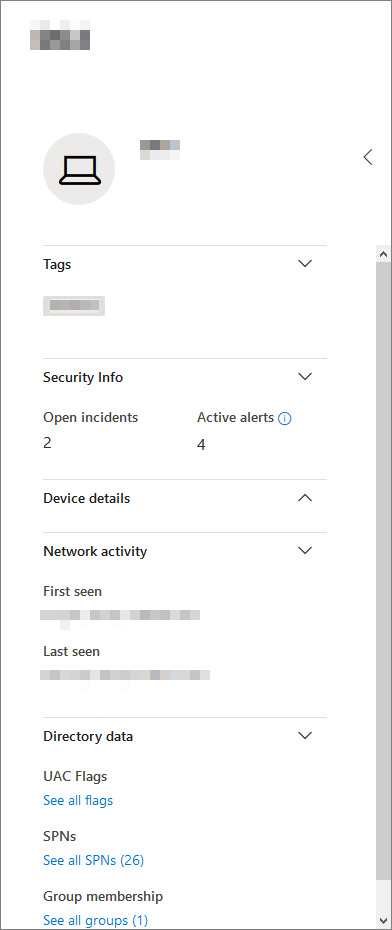

# Página de perfil de dispositivoDevice profile page

[!INCLUDE [Microsoft 365 Defender rebranding](../includes/microsoft-defender.md)]

O portal de segurança do Microsoft 365 fornece páginas de perfil de dispositivo, para que você possa avaliar rapidamente a saúde e o status dos dispositivos em sua rede.The Microsoft 365 security portal provides you with device profile pages, so you can quickly assess the health and status of devices on your network.

> [!IMPORTANT]
> A página de perfil de dispositivo pode parecer um pouco diferente, dependendo se o dispositivo está inscrito no Microsoft Defender para Ponto de Extremidade, No Microsoft Defender para Identidade ou ambos.The device profile page may appear slightly different, depending on whether the device is enrolled in Microsoft Defender for Endpoint, Microsoft Defender for Identity, or both.

Se o dispositivo estiver inscrito no Microsoft Defender para Ponto de Extremidade, você também poderá usar a página de perfil do dispositivo para executar algumas tarefas comuns de segurança.If the device is enrolled in Microsoft Defender for Endpoint, you can also use the device profile page to perform some common security tasks.

## Navegando a página de perfil do dispositivoNavigating the device profile page

A página de perfil é dividida em várias seções amplas.The profile page is broken up into several broad sections.

A barra lateral (1) lista detalhes básicos sobre o dispositivo.The sidebar (1) lists basic details about the device.

A área de conteúdo principal (2) contém guias que você pode alternar para exibir diferentes tipos de informações sobre o dispositivo.The main content area (2) contains tabs that you can toggle through to view different kinds of information about the device.

Se o dispositivo estiver inscrito no Microsoft Defender para Ponto de Extremidade, você também verá uma lista de ações de resposta (3).If the device is enrolled in Microsoft Defender for Endpoint, you will also see a list of response actions (3). As ações de resposta permitem que você execute tarefas comuns relacionadas à segurança.Response actions allow you to perform common security-related tasks.

## Barra lateralSidebar

Ao lado da área de conteúdo principal da página de perfil de dispositivo está a barra lateral.Beside the main content area of the device profile page is the sidebar.

A barra lateral lista o nome completo do dispositivo e o nível de exposição.The sidebar lists the device's full name and exposure level. Ele também fornece algumas informações básicas importantes em pequenas subseções que podem ser alternadas abertas ou fechadas, como:It also provides some important basic information in small subsections which can be toggled open or closed, such as:

* **Tags** - Qualquer Microsoft Defender para Ponto de Extremidade, Microsoft Defender para Identidade ou marcas personalizadas associadas ao dispositivo.**Tags** - Any Microsoft Defender for Endpoint, Microsoft Defender for Identity, or custom tags associated with the device. As marcas do Microsoft Defender para Identidade não são editáveis.Tags from Microsoft Defender for Identity are not editable.
* **Informações de segurança** - Abra incidentes e alertas ativos.**Security info** - Open incidents and active alerts. Os dispositivos inscritos no Microsoft Defender para Ponto de Extremidade também exibirão o nível de exposição e o nível de risco.Devices enrolled in Microsoft Defender for Endpoint will also display exposure level and risk level.

> [!TIP]
> O nível de exposição diz respeito ao quanto o dispositivo está em conformidade com as recomendações de segurança, enquanto o nível de risco é calculado com base em vários fatores, incluindo os tipos e a gravidade dos alertas ativos.Exposure level relates to how much the device is complying with security recommendations, while risk level is calculated based on a number of factors, including the types and severity of active alerts.

* **Detalhes do** dispositivo - Domínio, sistema operacional, data/hora para quando o dispositivo foi visto pela primeira vez, endereços IP, recursos.**Device details** - Domain, OS, timestamp for when the device was first seen, IP addresses, resources. Os dispositivos inscritos no Microsoft Defender para Ponto de Extremidade também exibem estado de saúde.Devices enrolled in Microsoft Defender for Endpoint also display health state. Os dispositivos inscritos no Microsoft Defender para Identidade exibirão o nome SAM e um data/hora para quando o dispositivo foi criado pela primeira vez.Devices enrolled in Microsoft Defender for Identity will display SAM name and a timestamp for when the device was first created.
* **Atividade de rede** - Timestamps pela primeira e última vez que o dispositivo foi visto na rede.**Network activity** - Timestamps for the first time and last time the device was seen on the network.
* **Dados de** diretório (*somente para dispositivos inscritos* no Microsoft Defender para Identidade ) - sinalizadores [UAC,](/windows/security/identity-protection/user-account-control/user-account-control-overview) [SPNs](/windows/win32/ad/service-principal-names)e associações de grupo.**Directory data** (*only for devices enrolled in Microsoft Defender for Identity*) - [UAC](/windows/security/identity-protection/user-account-control/user-account-control-overview) flags, [SPNs](/windows/win32/ad/service-principal-names), and group memberships.

## Ações de respostaResponse actions

As ações de resposta oferecem uma maneira rápida de se defender e analisar ameaças.Response actions offer a quick way to defend against and analyze threats.

> [!IMPORTANT]
> * [As ações de](/windows/security/threat-protection/microsoft-defender-atp/respond-machine-alerts) resposta só estarão disponíveis se o dispositivo estiver inscrito no Microsoft Defender para Endpoint.[Response actions](/windows/security/threat-protection/microsoft-defender-atp/respond-machine-alerts) are only available if the device is enrolled in Microsoft Defender for Endpoint.
> * Dispositivos que estão inscritos no Microsoft Defender para Ponto de Extremidade podem exibir números diferentes de ações de resposta, com base no sistema operacional do dispositivo e no número da versão.Devices that are enrolled in Microsoft Defender for Endpoint may display different numbers of response actions, based on the device's OS and version number.

As ações disponíveis na página de perfil do dispositivo incluem:Actions available on the device profile page include:

* **Gerenciar marcas** - Atualiza marcas personalizadas que você aplicou a este dispositivo.**Manage tags** - Updates custom tags you have applied to this device.
* **Isolar o** dispositivo - isola o dispositivo da rede da sua organização enquanto o mantém conectado ao Microsoft Defender para o Ponto de Extremidade.**Isolate device** - Isolates the device from your organization's network while keeping it connected to Microsoft Defender for Endpoint. Você pode optar por permitir que o Outlook, o Teams e o Skype for Business executem enquanto o dispositivo está isolado, para fins de comunicação.You can choose to allow Outlook, Teams, and Skype for Business to run while the device is isolated, for communication purposes.
* **Centro de ações** - Exibir o status das ações enviadas.**Action center** - View the status of submitted actions. Disponível somente se outra ação já tiver sido selecionada.Only available if another action has already been selected.
* **Restringir a execução do** aplicativo - impede que aplicativos que não são assinados pela Microsoft sejam executados.**Restrict app execution** - Prevents applications that are not signed by Microsoft from running.
* **Executar a verificação antivírus** - atualiza Windows Defender definições do Antivírus e executa imediatamente uma verificação antivírus.**Run antivirus scan** - Updates Windows Defender Antivirus definitions and immediately runs an antivirus scan. Escolha entre Verificação Rápida ou Verificação Completa.Choose between Quick scan or Full scan.
* **Coletar pacote de investigação** - Coleta informações sobre o dispositivo.**Collect investigation package** - Gathers information about the device. Quando a investigação for concluída, você poderá baixá-la.When the investigation is completed, you can download it.
* **Iniciar Sessão de Resposta Ao Vivo** - Carrega um shell remoto no dispositivo para [investigações detalhadas de segurança.](/microsoft-365/security/defender-endpoint/live-response)**Initiate Live Response Session** - Loads a remote shell on the device for [in-depth security investigations](/microsoft-365/security/defender-endpoint/live-response).
* **Iniciar investigação automatizada** - Investiga e corrigi automaticamente [ameaças.](../office-365-security/office-365-air.md)**Initiate automated investigation** - Automatically [investigates and remediates threats](../office-365-security/office-365-air.md). Embora você possa disparar manualmente investigações automatizadas para executar a partir desta [página,](../../compliance/alert-policies.md?view=o365-worldwide#default-alert-policies) determinadas políticas de alerta disparam investigações automáticas por conta própria.Although you can manually trigger automated investigations to run from this page, [certain alert policies](../../compliance/alert-policies.md?view=o365-worldwide#default-alert-policies) trigger automatic investigations on their own.
* **Centro de ações** - Exibe informações sobre todas as ações de resposta que estão sendo executados no momento.**Action center** - Displays information about any response actions that are currently running.

## Seção TabsTabs section

As guias de perfil de dispositivo permitem que você alterne uma visão geral dos detalhes de segurança sobre o dispositivo e tabelas que contêm uma lista de alertas.The device profile tabs allow you to toggle through an overview of security details about the device, and tables containing a list of alerts.

Os dispositivos inscritos no Microsoft Defender para Ponto de Extremidade também exibirão guias que apresentam uma linha do tempo, uma lista de recomendações de segurança, um inventário de software, uma lista de vulnerabilidades descobertas e KBs ausentes (atualizações de segurança).Devices enrolled in Microsoft Defender for Endpoint will also display tabs that feature a timeline, a list of security recommendations, a software inventory, a list of discovered vulnerabilities, and missing KBs (security updates).

### Guia Visão geralOverview tab

A guia padrão é **Visão Geral**.The default tab is **Overview**. Ele fornece uma rápida olhada no fato de segurança mais importante sobre o dispositivo.It provides a quick look at the most important security fact about the device.

Aqui, você pode ver rapidamente os alertas ativos do dispositivo e qualquer usuário conectado no momento.Here, you can get a quick look at the device's active alerts, and any currently logged on users.

Se o dispositivo estiver inscrito no Microsoft Defender para Ponto de Extremidade, você também verá o nível de risco do dispositivo e todos os dados disponíveis sobre avaliações de segurança.If the device is enrolled in Microsoft Defender for Endpoint, you will also see the device's risk level and any available data on security assessments. As avaliações de segurança descrevem o nível de exposição do dispositivo, fornecem recomendações de segurança e listam software afetado e vulnerabilidades descobertas.The security assessments describe the device's exposure level, provide security recommendations, and list affected software and discovered vulnerabilities.

### Guia AlertasAlerts tab

A **guia Alertas** contém uma lista de alertas que foram gerados no dispositivo, tanto do Microsoft Defender para Identidade quanto do Microsoft Defender para Ponto de Extremidade.The **Alerts** tab contains a list of alerts that have been raised on the device, from both Microsoft Defender for Identity and Microsoft Defender for Endpoint.

Você pode personalizar o número de itens exibidos, bem como quais colunas são exibidas para cada item.You can customize the number of items displayed, as well as which columns are displayed for each item. O comportamento padrão é listar trinta itens por página.The default behavior is to list thirty items per page.

As colunas nesta guia incluem informações sobre a gravidade da ameaça que disparou o alerta, bem como status, estado de investigação e a quem o alerta foi atribuído.The columns in this tab include information on the severity of the threat that triggered the alert, as well as status, investigation state, and who the alert has been assigned to.

A *coluna entidades* afetadas refere-se ao dispositivo (entidade) cujo perfil você está visualizando no momento, além de quaisquer outros dispositivos em sua rede afetados.The *impacted entities* column refers to the device (entity) whose profile you are currently viewing, plus any other devices in your network that are affected.

Selecionar um item desta lista abrirá um sobrevoo contendo ainda mais informações sobre o alerta selecionado.Selecting an item from this list will open a flyout containing even more information about the selected alert.

Essa lista pode ser filtrada por gravidade, status ou a quem o alerta foi atribuído.This list can be filtered by severity, status, or who the alert has been assigned to.

### Guia Linha do TempoTimeline tab

A **guia Linha** do Tempo inclui um gráfico interativo e cronologicamente de todos os eventos gerados no dispositivo.The **Timeline** tab includes an interactive, chronological chart of all events raised on the device. Ao mover a área realçada do gráfico para a esquerda ou para a direita, você pode exibir eventos em diferentes períodos de tempo.By moving the highlighted area of the chart left or right, you can view events over different periods of time. Você também pode escolher um intervalo personalizado de datas no menu suspenso entre o gráfico interativo e a lista de eventos.You can also choose a custom range of dates from the dropdown menu in between the interactive chart and the list of events.

Abaixo do gráfico está uma lista de eventos para o intervalo de datas selecionado.Below the chart is a list of events for the selected range of dates.

O número de itens exibidos e as colunas na lista podem ser personalizadas.The number of items displayed and the columns on the list can both be customized. As colunas padrão listam a hora do evento, o usuário ativo, o tipo de ação, as entidades (processos) e informações adicionais sobre o evento.The default columns list the event time, active user, action type, entities (processes), and additional information about the event.

Selecionar um item desta lista abrirá um sobrevoo exibindo um gráfico de entidades de evento, mostrando os processos pai e filho envolvidos no evento.Selecting an item from this list will open a flyout displaying an Event entities graph, showing the parent and child processes involved in the event.

A lista pode ser filtrada pelo tipo específico de evento; por exemplo, eventos do Registro ou Eventos de Tela Inteligente.The list can be filtered by the specific kind of event; for example, Registry events or Smart Screen Events.

A lista também pode ser exportada para um arquivo CSV, para download.The list can also be exported to a CSV file, for download. Embora o arquivo não seja limitado pelo número de eventos, o intervalo máximo de tempo que você pode optar por exportar é de sete dias.Although the file is not limited by number of events, the maximum time range you can choose to export is seven days.

### Guia Recomendações de segurançaSecurity recommendations tab

A **guia Recomendações de segurança** lista ações que você pode tomar para proteger o dispositivo.The **Security recommendations** tab lists actions you can take to protect the device. Selecionar um item nesta lista abrirá um sobrevoo onde você pode obter instruções sobre como aplicar a recomendação.Selecting an item on this list will open a flyout where you can get instructions on how to apply the recommendation.

Assim como nas guias anteriores, o número de itens exibidos por página, bem como quais colunas estão visíveis, pode ser personalizado.As with the previous tabs, the number of items displayed per page, as well as which columns are visible, can be customized.

O modo de exibição padrão inclui colunas que detalham as deficiências de segurança abordadas, a ameaça associada, o componente ou software relacionado afetado pela ameaça e muito mais.The default view includes columns that detail the security weaknesses addressed, the associated threat, the related component or software affected by the threat, and more. Os itens podem ser filtrados pelo status da recomendação.Items can be filtered by the recommendation's status.

### Inventário de softwareSoftware inventory

A **guia Inventário de** software lista software instalado no dispositivo.The **Software inventory** tab lists software installed on the device.

O modo de exibição padrão exibe o fornecedor de software, o número de versão instalado, o número de pontos fracos de software conhecidos, as percepções sobre ameaças, o código do produto e as marcas.The default view displays the software vendor, installed version number, number of known software weaknesses, threat insights, product code, and tags. O número de itens exibidos e quais colunas são exibidas podem ser personalizadas.The number of items displayed and which columns are displayed can both be customized.

Selecionar um item desta lista abre um flyout contendo mais detalhes sobre o software selecionado, bem como o caminho e o data/hora da última vez em que o software foi encontrado.Selecting an item from this list opens a flyout containing more details about the selected software, as well as the path and timestamp for the last time the software was found.

Essa lista pode ser filtrada pelo código do produto.This list can be filtered by product code.

### Guia Vulnerabilidades descobertasDiscovered vulnerabilities tab

A **guia Vulnerabilidades Descobertas** lista quaisquer Vulnerabilidades Comuns e Explorações (CVEs) que possam afetar o dispositivo.The **Discovered vulnerabilities** tab lists any Common Vulnerabilities and Exploits (CVEs) that may affect the device.

O modo de exibição padrão lista a gravidade do CVE, a Pontuação comum de vulnerabilidades (CVS), o software relacionado à CVE, quando o CVE foi publicado, quando a CVE foi atualizada pela última vez e as ameaças associadas à CVE.The default view lists the severity of the CVE, the Common Vulnerability Score (CVS), the software related to the CVE, when the CVE was published, when the CVE was last updated, and threats associated with the CVE.

Assim como nas guias anteriores, o número de itens exibidos e quais colunas estão visíveis podem ser personalizados.As with the previous tabs, the number of items displayed and which columns are visible can be customized.

Selecionar um item desta lista abrirá um sobrevoo que descreve o CVE.Selecting an item from this list will open a flyout that describes the CVE.

### KBs ausentesMissing KBs

A **guia KBs Ausentes** lista todas as Atualizações da Microsoft que ainda não foram aplicadas ao dispositivo.The **Missing KBs** tab lists any Microsoft Updates that have yet to be applied to the device. Os "KBs" em questão são artigos [da Base](https://support.microsoft.com/help/242450/how-to-query-the-microsoft-knowledge-base-by-using-keywords-and-query) de Dados de Conhecimento que descrevem essas atualizações; por exemplo, [KB4551762](https://support.microsoft.com/help/4551762/windows-10-update-kb4551762).The "KBs" in question are [Knowledge Base articles](https://support.microsoft.com/help/242450/how-to-query-the-microsoft-knowledge-base-by-using-keywords-and-query) which describe these updates; for example, [KB4551762](https://support.microsoft.com/help/4551762/windows-10-update-kb4551762).

O modo de exibição padrão lista o boletim que contém as atualizações, versão do sistema operacional, produtos afetados, CVEs endereçadas, o número KB e as marcas.The default view lists the bulletin containing the updates, OS version, products affected, CVEs addressed, the KB number, and tags.

O número de itens exibidos por página e quais colunas são exibidas podem ser personalizadas.The number of items displayed per page and which columns are displayed can be customized.

Selecionar um item abrirá um flyout que se vincula à atualização.Selecting an item will open a flyout that links to the update.

## Tópicos relacionadosRelated topics

* [Visão geral do Microsoft 365 DefenderMicrosoft 365 Defender overview](microsoft-365-defender.md)
* [Ativar o Microsoft 365 DefenderTurn on Microsoft 365 Defender](m365d-enable.md)
* [Investigar entidades em dispositivos usando a resposta ao vivoInvestigate entities on devices, using live response](../defender-endpoint/live-response.md)
* [Investigação e resposta automatizadas (AIR) no Office 365Automated investigation and response (AIR) in Office 365](../office-365-security/office-365-air.md)
