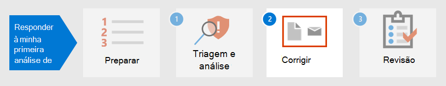

# Etapa 1. Triagem e analise seu primeiro incidente

[!INCLUDE [Microsoft 365 Defender rebranding](../includes/microsoft-defender.md)]

**Aplica-se a:**
- Microsoft 365 Defender

À medida que você passa algum tempo estabelecendo, implementando e mantendo medidas de segurança de acordo com os padrões da organização, você pode configurar soluções de segurança para ajudá-lo a identificar rapidamente riscos e ameaças de segurança. Microsoft 365 O Defender permite detectar, triagem e investigar incidentes por meio de sua experiência de painel de vidro único, onde você pode encontrar as informações necessárias para tomar decisões em tempo há tempo. 

Depois que um incidente de segurança for detectado, Microsoft 365 Defender apresentará detalhes que você precisará triagem ou priorizar um incidente ou incidentes sobre outras pessoas. Depois de determinar a priorização, os analistas podem concentrar sua energia na investigação de casos atribuídos a eles.

## Detecção por Microsoft 365 Defender

Microsoft 365 O Defender recebe alertas e eventos de várias plataformas de segurança da Microsoft como fontes de detecção para criar uma imagem holística e um contexto de atividade mal-intencionada. Estas são as possíveis fontes de detecção:

- [O Microsoft Defender for Endpoint](../defender-endpoint/microsoft-defender-endpoint.md) é uma solução detecção e resposta de ponto de extremidade (EDR) que usa o antivírus do Microsoft Defender, bem como proteção avançada contra ameaças habilitada para nuvem usando o Microsoft Security Graph. O Defender for Endpoint é uma plataforma unificada para proteção preventiva, detecção pós-violação, investigação automatizada e resposta. Ele protege os pontos de extremidade contra ameaças cibernéticas, detecta ataques avançados e violações de dados, automatiza incidentes de segurança e melhora a postura de segurança. 
- O [Microsoft Defender for Identity](https://docs.microsoft.com/defender-for-identity/what-is) é uma solução de segurança baseada em nuvem que usa seus sinais locais dos Serviços de Domínio do Active Directory (AD DS) para identificar, detectar e investigar ameaças avançadas, identidades comprometidas e ações internas mal-intencionadas direcionadas à sua organização. 
- [Microsoft Cloud App Security](https://docs.microsoft.com/cloud-app-security/) atua como um gatekeeper para intermediar o acesso em tempo real entre seus usuários corporativos e os recursos de nuvem que eles usam, onde quer que seus usuários estejam localizados e independentemente do dispositivo que estejam usando. 
- [O Microsoft Defender para Office 365](../office-365-security/overview.md) protege sua organização contra ameaças mal-intencionadas em mensagens de email, links (URLs) e ferramentas de colaboração. 
- O Centro de Segurança do [Azure](https://docs.microsoft.com/azure/security-center/security-center-introduction) é um sistema de gerenciamento de segurança de infraestrutura unificado que reforça a postura de segurança de seus data centers e fornece proteção avançada contra ameaças em suas cargas de trabalho híbridas na nuvem, bem como no local. 

No Microsoft 365 Defender, [os incidentes](incidents-overview.md) são identificados pela correlação de alertas dessas diferentes fontes de detecção. Em vez de gastar recursos em conjunto ou distinguir vários alertas em seus respectivos incidentes, você pode começar com a fila de incidentes no Microsoft 365 Defender imediatamente. Isso permite triagem de incidentes de maneira eficiente entre pontos de extremidade, identidades, email e aplicativos e reduzir os danos de um ataque.

## Triagem de seus incidentes

A resposta a incidentes no Microsoft 365 Defender começa depois que você triagem a lista de incidentes usando o método recomendado de priorização da sua organização. A triagem significa atribuir um nível de importância ou urgência a incidentes, que determina a ordem na qual serão investigados. 

Um guia de exemplo útil para determinar qual incidente priorizar no Microsoft 365 Defender pode ser resumido pela fórmula: *Severy + Impact = Priority*. 

- **Severidade** é o nível designado pelo Microsoft 365 Defender e seus componentes de segurança integrados. 
- **O** impacto é determinado pela organização e geralmente inclui, mas não se limita a um número limite de usuários afetados, dispositivos, serviços afetados (ou uma combinação dele) e até mesmo o tipo de alerta. 

Em seguida, os analistas iniciam investigações com base nos critérios **priority** definidos pela organização.

A priorização de incidentes pode variar dependendo da organização. O NIST recomenda também considerar o impacto funcional e informacional do incidente e a capacidade de recuperação.  

Veja a seguir apenas uma abordagem de triagem: 

1. Vá para a [página incidentes](incidents-overview.md) para iniciar a triagem. Aqui você pode ver uma lista de incidentes que afetam sua organização. Por padrão, eles são organizados do incidente mais recente ao mais antigo. A partir daqui, você também pode ver colunas diferentes para cada incidente mostrando sua gravidade, categoria, número de alertas ativos e entidades impactadas, entre outras. Você pode personalizar o conjunto de colunas e classificar a fila de incidentes por algumas dessas colunas selecionando o nome da coluna. Você também pode filtrar a fila de incidentes de acordo com suas necessidades. Para ver uma lista completa de filtros disponíveis, consulte [Priorizar incidentes](incident-queue.md#available-filters).
  
   :::image type="content" source="../../media/first-incident-analyze/first-incident-analyze-queue.png" alt-text="Exemplo da fila de incidentes"::: 

    Um exemplo de como você pode executar a triagem para esse conjunto de incidentes é priorizar incidentes que afetaram mais usuários e dispositivos. Neste exemplo, você pode priorizar a ID de incidente 6769 porque ela afetou o maior número de entidades: 7 dispositivos, 6 usuários e 2 caixas de correio. Além disso, o incidente parece conter alertas do Microsoft Defender for Identity que indicam um alerta baseado em identidade e possível roubo de credenciais.

   :::image type="content" source="../../media/first-incident-analyze/first-incident-analyze-high-impact.png" alt-text="Exemplo de um incidente de alto impacto":::
 
2. Selecione o círculo ao lado do nome do incidente para revisar os detalhes. Um painel lateral aparecerá no lado direito, que contém informações adicionais que podem ajudar ainda mais sua triagem. 
 
   :::image type="content" source="../../media/first-incident-analyze/first-incident-analyze-incident-flyout.png" alt-text="Exemplo de um painel do lado do incidente"::: 

   Por exemplo, ao ver quais táticas de CK do [MITRE ATT](https://attack.mitre.org/)&o invasor usou com base nas categorias do incidente, você pode priorizar esse incidente porque o invasor usou credenciais roubadas, estabeleceu o comando e o controle, realizou movimento lateral e exfiltra alguns dados. Isso sugere que o invasor já entrou profundamente na rede e possivelmente roubou informações confidenciais.

   Além disso, se sua organização implementou a estrutura De confiança zero, você consideraria o acesso de credenciais como uma violação de segurança importante que vale a pena priorizar.
 
   Rolando para baixo o painel lateral, você verá as entidades impactadas específicas, como usuários, dispositivos e caixas de correio. Você pode verificar o nível de exposição de cada dispositivo e os proprietários das caixas de correio afetadas.

   :::image type="content" source="../../media/first-incident-analyze/first-incident-analyze-incident-flyout-details.png" alt-text="Exemplo de detalhes do painel de incidentes"::: 
 
3. Mais abaixo no painel lateral, você pode encontrar os alertas associados. Microsoft 365 O Defender já realizou a correlação dos alertas em um único incidente, economizando tempo e recursos melhor gastos para correção do ataque. Alertas são suspeitos e, portanto, possivelmente eventos mal-intencionados do sistema que sugerem a presença de um invasor em uma rede. 

   Neste exemplo, 87 alertas individuais foram determinados como parte de um incidente de segurança. Você pode exibir todos os alertas para obter uma visão rápida de como o ataque foi tocado.

   :::image type="content" source="../../media/first-incident-analyze/first-incident-analyze-incident-flyout-alerts.png" alt-text="Exemplo de alertas em um painel do lado do incidente"::: 
 
## Analisar seu primeiro incidente

Compreender o contexto em torno dos alertas é igualmente importante. Geralmente, um alerta não é um único evento independente. Há uma cadeia de processos criados, comandos e ações que podem não ter ocorrido ao mesmo tempo. Portanto, um analista deve procurar as primeiras e últimas atividades da entidade suspeita nas linhas do tempo do dispositivo para entender o contexto dos alertas.

Há várias maneiras de ler e analisar dados usando o Microsoft 365 Defender, mas o objetivo final para os analistas é responder a incidentes o mais rápido possível. Embora Microsoft 365 Defender possa reduzir significativamente o Tempo Média para [Correção (MTTR)](https://www.microsoft.com/security/blog/2020/05/04/lessons-learned-microsoft-soc-part-3c/) por meio do recurso de Correção Automática líder do setor, sempre há casos que exigem análise manual. 

Veja um exemplo:

1. Depois que a prioridade de triagem é determinada, um analista inicia uma análise detalhada selecionando o nome do incidente. Esta página traz o Resumo **de Incidentes** em que os dados são exibidos em guias para ajudar na análise. Na guia **Alertas,** o tipo de alertas é exibido. Os analistas podem clicar em cada alerta para detalhar a respectiva fonte de detecção. 

    :::image type="content" source="../../media/first-incident-analyze/first-incident-analyze-summary-tab.png" alt-text="Exemplo da guia Resumo de um incidente"::: 
 
    Para um guia rápido sobre qual domínio cada fonte de detecção abrange, consulte a [seção Detectar](#detection-by-microsoft-365-defender) deste artigo.

2.  Na guia **Alertas,** um analista pode girar até a fonte de detecção para conduzir uma investigação e uma análise mais detalhadas. Por exemplo, selecionar Detecção de Malware com Microsoft Cloud App Security como a fonte de detecção leva o analista para sua página de alerta correspondente.
  
    :::image type="content" source="../../media/first-incident-analyze/first-incident-analyze-select-alert.png" alt-text="Exemplo de seleção de um alerta de um incidente"::: 
  
    :::image type="content" source="../../media/first-incident-analyze/first-incident-analyze-link-to-mcas.png" alt-text="Exemplo de uma página correspondente no Microsoft Cloud App Security"::: 
  
3.  Para investigar ainda mais nosso exemplo, role até a parte inferior da página para exibir **os Usuários afetados**. Para ver a atividade e o contexto em torno da detecção de malware, selecione a página de usuário de Annette Hill. 
  
    :::image type="content" source="../../media/first-incident-analyze/first-incident-analyze-user-page.png" alt-text="Exemplo de uma página de usuário":::
  
4.  Na página do usuário está uma lista cronológica de eventos que começam com um Login Arriscado de um alerta de Endereço IP de rede *TOR.* Embora a suspeita de uma atividade dependa da natureza de como uma organização conduz seus negócios, na maioria dos casos o uso do Roteador de Onion (TOR), uma rede que permite que os usuários naveguem na Web anonimamente, em um ambiente empresarial pode ser considerada altamente improvável e desnecessária para operações online regulares.
  
    :::image type="content" source="../../media/first-incident-analyze/first-incident-analyze-user-event-list.png" alt-text="Exemplo da lista cronológica de eventos para um usuário":::
  
5.  Cada alerta pode ser selecionado para obter mais informações sobre a atividade. Por exemplo, selecionar Atividade a partir de um alerta de Endereço **IP tor** leva você para a própria página desse alerta. Annette é uma administradora da Office 365, o que significa que ela tem privilégios elevados e o incidente de origem pode ter levado ao acesso a informações confidenciais. 
  
    :::image type="content" source="../../media/first-incident-analyze/first-incident-analyze-mcas-alert.png" alt-text="Exemplo de detalhes de alertas para Microsoft Cloud App Security"::: 
 
6.  Selecionando outros alertas, um analista pode obter uma imagem completa do ataque.

## Próxima etapa

Saiba como [remediar incidentes.](first-incident-remediate.md)

## Confira também

- [Visão geral dos incidentes](incidents-overview.md)
- [Analisar os incidentes](investigate-incidents.md)
- [Gerenciar incidentes](manage-incidents.md)
