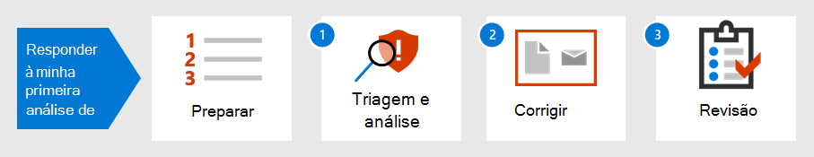

# Introdução à resposta ao seu primeiro incidenteIntroduction to responding to your first incident

[!INCLUDE [Microsoft 365 Defender rebranding](../includes/microsoft-defender.md)]

**Aplica-se a:****Applies to:**
- Microsoft 365 DefenderMicrosoft 365 Defender

A estratégia de resposta a incidentes de uma organização determina sua capacidade de lidar com incidentes de segurança cada vez mais disruptivos e crimes cibernéticos.An organization's incident response strategy determines its ability to deal with increasingly disruptive security incidents and cybercrime. Ao tomar medidas preventivas é importante, a capacidade de agir rapidamente para conter, erradicar e recuperar de incidentes detectados pode minimizar danos e perdas comerciais.While taking preventative measures is important, the ability to act quickly to contain, eradicate, and recover from detected incidents can minimize damage and business losses.

Este passo a passo da resposta a incidentes mostra como você, como parte de uma equipe de operações de segurança, pode executar a maioria das principais etapas de resposta a incidentes no Microsoft 365 Defender.This incident response walkthrough shows how you, as part of a security operations team, can perform most of the key incident response steps within Microsoft 365 Defender. Estas são as etapas:Here are the steps:

- Preparação da postura de segurançaPreparation of your security posture
- Para cada incidente:For each incident:
  - Etapa 1: Triagem e análiseStep 1: Triage and analysis
  - Etapa 2: Correção (contenção, erradicação e recuperação)Step 2: Remediation (containment, eradication, and recovery)
  - Etapa 3: Revisão pós-incidenteStep 3: Post-incident review

Um incidente de segurança é definido pelo Instituto Nacional de Padrões e Tecnologia (NIST) como "uma ocorrência que, na verdade ou potencialmente, compromete a confidencialidade, a integridade ou a disponibilidade de um sistema de informações; ou as informações que o sistema processa, armazena ou transmite; ou que constitui uma violação ou ameaça iminente de violação de políticas de segurança, procedimentos de segurança ou políticas de uso aceitáveis."A security incident is defined by National Institute of Standards and Technology (NIST) as "an occurrence that actually or potentially jeopardizes the confidentiality, integrity, or availability of an information system; or the information the system processes, stores, or transmits; or that constitutes a violation or imminent threat of violation of security policies, security procedures, or acceptable use policies."

Incidentes no Microsoft 365 Defender são os pontos de partida lógicos para análise e resposta a incidentes.Incidents in Microsoft 365 Defender are the logical starting points for analysis and incident response. A análise e a correção de incidentes normalmente comm a maioria das tarefas de uma equipe de operações de segurança.Analyzing and remediating incidents typically makes up most of a security operations team's tasks.

## Próxima etapaNext step

Certifique-se de que sua organização e Microsoft 365 locatário [esteja preparado para o tratamento de incidentes.](first-incident-prepare.md)Make sure your organization and Microsoft 365 tenant is [prepared for incident handling](first-incident-prepare.md).

## Confira tambémSee also

- [Visão geral dos incidentesIncidents overview](incidents-overview.md)
- [Analisar os incidentesAnalyze incidents](investigate-incidents.md)
- [Gerenciar incidentesManage incidents](manage-incidents.md)
