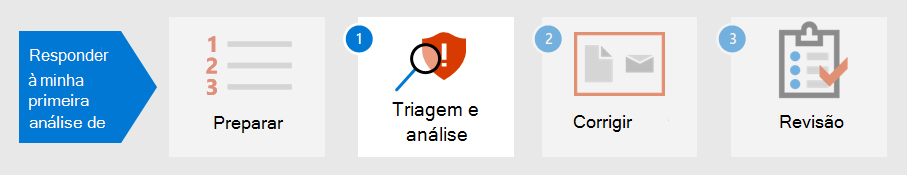

# Preparar sua postura de segurança para o primeiro incidente

[!INCLUDE [Microsoft 365 Defender rebranding](../includes/microsoft-defender.md)]

**Aplica-se a:**
- Microsoft 365 Defender

A preparação para o tratamento de incidentes envolve a configuração de proteção suficiente da rede de uma organização contra diferentes tipos de incidentes de segurança. Para reduzir o risco de incidentes de segurança, o Instituto Nacional de Padrões e Tecnologia (NIST) recomenda várias práticas de segurança, incluindo avaliações de risco, proteção da segurança do host, configuração de redes com segurança e prevenção de malware. 

Microsoft 365 O Defender pode ajudar a resolver vários aspectos da prevenção de incidentes: 

- Implementando uma [estrutura de Confiança](/security/zero-trust/) Zero
- Determinando sua postura de segurança atribuindo uma pontuação com a [Pontuação Segura da Microsoft](microsoft-secure-score.md)
- Prevenção de ameaças por meio de avaliações de vulnerabilidade no [Gerenciamento de Ameaças e Vulnerabilidades](../defender-endpoint/next-gen-threat-and-vuln-mgt.md)
- Noções básicas sobre as ameaças de segurança mais recentes para que você possa se preparar para elas

## Etapa 1. Implementar Confiança Zero

[A](/security/zero-trust/) Confiança Zero é uma filosofia de segurança integrada e uma estratégia de ponta a ponta que considera a natureza complexa de qualquer ambiente moderno, incluindo a força de trabalho móvel e os usuários, dispositivos, aplicativos e dados, onde quer que estejam localizados. Ao fornecer um único painel de vidro para gerenciar todas as detecções de forma consistente, o Microsoft 365  Defender pode facilitar para sua equipe de operações de segurança implementar os princípios orientadores do Zero Trust. 

Os componentes do Microsoft 365 Defender podem exibir violações de regras implementadas para estabelecer políticas de Acesso Condicional para Confiança Zero integrando dados do Microsoft Defender para Ponto de Extremidade (MDE) ou outros fornecedores de segurança móvel como fonte de informações para políticas de conformidade de dispositivo e implementação de políticas de Acesso Condicional baseadas em dispositivo. 

O risco do dispositivo influencia diretamente quais recursos serão acessíveis pelo usuário desse dispositivo. A negação de acesso a recursos com base em determinados critérios é o tema principal do Zero Trust e Microsoft 365 Defender fornece informações necessárias para determinar os critérios de nível de confiança. Por exemplo, o Microsoft 365 Defender pode fornecer o nível de versão de software de um dispositivo por meio da página Gerenciamento de Ameaças e Vulnerabilidades, enquanto as políticas de Acesso Condicional restringem dispositivos que têm versões desatualizadas ou vulneráveis.

A automação é uma parte crucial da implementação e manutenção de um ambiente de Confiança Zero, além de reduzir o número de alertas que potencialmente levariam a eventos de resposta a incidentes (IR). Componentes do Microsoft 365 Defender podem ser  automatizados, como ações de correção (conhecidas como investigações de um incidente no centro de segurança do Microsoft 365), ações de notificação e até mesmo a criação de tíquetes de suporte, como [em ServiceNow](https://microsoft.service-now.com/sp/).

## Etapa 2. Determinar a postura de segurança da sua organização

Em seguida, as organizações podem usar o [Microsoft Secure Score](microsoft-secure-score.md) no Microsoft 365 Defender para determinar sua postura de segurança atual e considerar recomendações sobre como aprimora-la. Quanto maior a pontuação, mais recomendações de segurança e ações de melhoria foram tomadas pela organização. As recomendações de Pontuação Segura podem ser tomadas em diferentes produtos e permitir que as organizações aumentem ainda mais suas pontuações. 

:::image type="content" source="../../media/first-incident-prepare/first-incident-secure-score.png" alt-text="Exemplo de Pontuação Segura da Microsoft no centro de segurança da Microsoft":::
 
## Etapa 3. Avaliar a exposição de vulnerabilidade da sua organização

A prevenção de incidentes pode ajudar a simplificar os esforços de operações de segurança para se concentrar em ocorrências críticas e importantes de segurança. As vulnerabilidades de software geralmente são um ponto de entrada impedivel para ataques que podem levar a roubo de dados, perda de dados ou interrupção de operações comerciais. Se nenhum ataque estiver em funcionamento, as operações de segurança devem se esforçar para alcançar e manter um nível aceitável de exposição [de vulnerabilidade](../defender-endpoint/tvm-exposure-score.md) em sua organização.

Para verificar o progresso da  correção de software, visite a página Gerenciamento de Ameaças e Vulnerabilidades no Defender para Ponto de **Extremidade,** que você pode acessar do Microsoft 365 Defender por meio da guia Mais recursos.

:::image type="content" source="../../media/first-incident-prepare/first-incident-vulnerability.png" alt-text="Exemplo da página Ameaça e Vulnerabilidade no centro de segurança da Microsoft"::: 
 
## 4. Entenda as ameaças emergentes

Use [a análise de](threat-analytics.md) ameaças no Microsoft 365 de segurança para se manter atualizado com o cenário atual de ameaças à segurança. Especialistas em segurança da Microsoft criam relatórios que descrevem as ameaças cibernéticas mais recentes em detalhes para que você possa entender como elas podem afetar sua assinatura de Microsoft 365, dispositivos e usuários. Esses relatórios podem incluir:

- Atores de ameaças ativos e suas campanhas
- Técnicas de ataque populares e novas
- Vulnerabilidades críticas
- Superfícies de ataque comuns
- Malware predominante

A análise de ameaças também analisa sua configuração e alertas para determinar como você está em risco e se há alertas ativos aplicáveis a um relatório.

Você pode implementar as recomendações de uma ameaça emergente para fortalecer sua postura de segurança e minimizar sua área de superfície de ataque.

Faça o tempo em sua agenda para verificar regularmente a seção [Análise](threat-analytics.md) de Ameaças do centro de Microsoft 365 segurança.

## Próxima etapa

Saiba como [triagem e análise de incidentes.](first-incident-analyze.md)

## Confira também

- [Visão geral dos incidentes](incidents-overview.md)
- [Investigar incidentes](investigate-incidents.md)
- [Gerenciar incidentes](manage-incidents.md)
