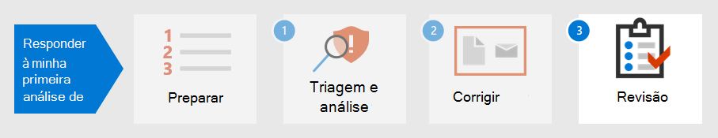

# Etapa 2. Correção do primeiro incidente

[!INCLUDE [Microsoft 365 Defender rebranding](../includes/microsoft-defender.md)]

**Aplica-se a:**
- Microsoft 365 Defender

Microsoft 365 O Defender não só fornece recursos de detecção e análise, mas também fornece contenção e erradicação de malware. A contenção inclui etapas para reduzir o impacto do ataque enquanto a erradicação garante que todos os rastreamentos da atividade do invasor sejam removidos da rede.  Microsoft 365 O Defender oferece várias ações de correção que podem ser configuradas para correção [automática,](m365d-autoir.md) dependendo do sistema operacional e do tipo de ataque.

Microsoft 365 O Defender oferece várias ações de correção que os analistas podem iniciar manualmente. As ações são separadas em duas categorias, Ações em dispositivos e Ações em arquivos. Algumas ações podem ser usadas para interromper imediatamente a ameaça enquanto outras ações ajudam na análise forense.

## Ações em dispositivos

- **Isolar o** dispositivo - Essa atividade bloqueia imediatamente todo o tráfego de rede (internet e interno) para minimizar a propagação de malware e permitir que os analistas continuem a análise sem que um ator mal-intencionado possa continuar um ataque. A única conexão permitida é a nuvem do serviço Microsoft Defender for Identity para que o Microsoft Defender for Identity possa continuar a monitorar o dispositivo. 
- **Restringir a** execução do aplicativo - Para restringir a execução de um aplicativo, uma política de integridade de código é aplicada que só permite que os arquivos sejam executados se eles são assinados por um certificado emitido pela Microsoft. Esse método de restrição pode ajudar a impedir que um invasor controle dispositivos comprometidos e a executar outras atividades mal-intencionadas.
- **Executar a verificação antivírus** - uma verificação Microsoft Defender Antivírus pode ser executado juntamente com outras soluções antivírus, se o Defender Antivírus é a solução antivírus ativa ou não. Se outro produto do fornecedor antivírus for a solução de proteção de ponto de extremidade principal, você poderá executar o Defender Antivírus no modo Passivo.
- **Iniciar uma investigação automatizada** - Você pode iniciar uma nova investigação automatizada de finalidade geral no dispositivo. Enquanto uma investigação estiver em execução, qualquer outro alerta gerado do dispositivo será adicionado a uma investigação automatizada em andamento até que essa investigação seja concluída. Além disso, se a mesma ameaça for vista em outros dispositivos, esses dispositivos serão adicionados à investigação.
- **Iniciar resposta ao vivo** - A resposta ao vivo é um recurso que oferece acesso instantâneo a um dispositivo usando uma conexão de shell remoto. Isso permite que você faça um trabalho de investigação aprofundado e tome ações de resposta imediatas para conter prontamente ameaças identificadas em tempo real. A resposta ao vivo foi projetada para aprimorar investigações, permitindo que você colete dados forenses, execute scripts, envie entidades suspeitas para análise, correção de ameaças e busca proativamente por ameaças emergentes.
- **Coletar pacote de investigação** - Como parte do processo de investigação ou resposta, você pode coletar um pacote de investigação de um dispositivo. Ao coletar o pacote de investigação, você pode identificar o estado atual do dispositivo e entender ainda mais as ferramentas e técnicas usadas pelo invasor. 
- **Consulte um especialista** em ameaças (disponível em Ações em dispositivos e arquivos) - Você pode consultar um especialista em ameaças da Microsoft para obter mais informações sobre dispositivos ou dispositivos potencialmente comprometidos que já estão comprometidos. Os especialistas em ameaças da Microsoft podem ser contratados diretamente de dentro do Central de Segurança do Microsoft Defender para uma resposta o tempo e precisão. 

## Ações em arquivos

- **Arquivo de parada e quarentena** - Essa ação inclui a interrupção de processos em execução, a quarentena de arquivos e a exclusão de dados persistentes, como quaisquer chaves do Registro. Essa ação entra em vigor em dispositivos com Windows 10, versão 1703 ou posterior, onde o arquivo foi observado nos últimos 30 dias. 
- **Adicionar indicadores para bloquear ou** permitir arquivo - Impedir a propagação de um ataque em sua organização, proibindo arquivos potencialmente mal-intencionados ou malwares suspeitos. Essa operação impedirá que o arquivo seja lido, gravado ou executado em dispositivos em sua organização.
- **Baixar ou coletar arquivo** – Essa ação permite que os analistas baixem um arquivo em um arquivo morto protegido por senha .zip arquivo morto para análise posterior pela organização.
- **Análise profunda** – essa ação executa um arquivo em um ambiente de nuvem seguro e totalmente instrumentado. Os resultados da análise profunda mostram as atividades do arquivo, comportamentos observados e artefatos associados, como arquivos descartados, modificações no Registro e comunicação com endereços IP. 

Continuando o exemplo em [Detectar, triagem](first-incident-analyze.md#analyze-your-first-incident)e analisar incidentes, um analista pode remediar esse incidente com estas ações:

1. Redefinir imediatamente a senha da conta de usuário
2. Isolar o dispositivo no Microsoft 365 Defender até que a análise profunda seja concluída
3. Verifique se o arquivo mal-intencionado foi colocado em quarentena SharePoint
4. Verificar quais pontos de extremidade foram afetados por malware
5. Reconstruir sistemas
6. Verifique se há alertas Microsoft Cloud App Security semelhantes para outros usuários
7. Criar um indicador personalizado no Microsoft Defender para Ponto de Extremidade para bloquear um endereço IP tor
8. Crie uma ação de governança em Microsoft Cloud App Security para esse tipo de alerta, como aqueles mostrados na imagem a seguir:

   :::image type="content" source="../../media/first-incident-remediate/first-incident-mcas-governance.png" alt-text="Exemplo de ações de governança no Microsoft Cloud App Security portal"::: 
 
A maioria das ações de correção pode ser aplicada e controlada no Microsoft 365 Defender. 

## Usando Playbooks

Além disso, a correção automatizada pode ser criada usando playbooks. Atualmente, a Microsoft tem [modelos do Playbook](https://github.com/microsoft/Microsoft-Cloud-App-Security/tree/master/Playbooks) no GitHub que fornecem playbooks para os seguintes cenários:

- Remover o compartilhamento de arquivos confidenciais após solicitar a validação do usuário
- Alertas de país de triagem automática infreqüente
- Solicitar a ação do gerente antes de desabilitar uma conta
- Desabilitar regras de caixa de entrada mal-intencionadas

As playbooks usam Power Automate para criar fluxos de automação de processos robóticos personalizados para automatizar determinadas atividades depois que critérios específicos foram disparados. As organizações podem criar playbooks a partir de modelos existentes ou do zero. 

Veja um exemplo.
 
:::image type="content" source="../../media/first-incident-remediate/first-incident-power-automate.png" alt-text="Exemplo de um fluxo de Power Automate de automação de processos robóticos personalizados"::: 
 
Os playbooks também podem ser criados durante a revisão [pós-incidente](first-incident-post.md) para criar ações de correção a partir de incidentes para ações de correção mais rápidas. 

## Próxima etapa

Saiba como executar [uma revisão pós-incidente de um incidente](first-incident-post.md).

## Confira também

- [Visão geral dos incidentes](incidents-overview.md)
- [Investigar incidentes](investigate-incidents.md)
- [Gerenciar incidentes](manage-incidents.md)
