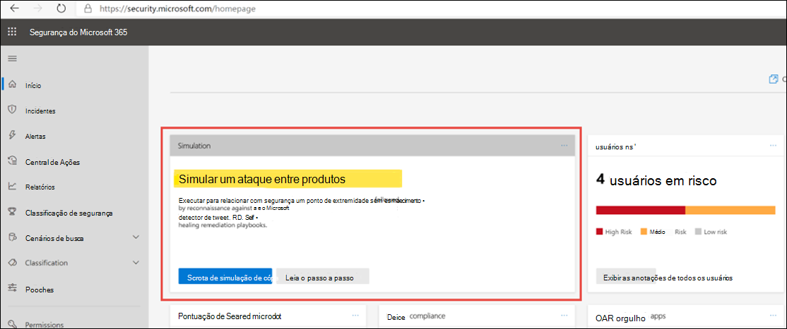

# Gerar um alerta de teste no laboratório de avaliação do Microsoft 365 DefenderGenerate a test alert in your Microsoft 365 Defender evaluation lab  

[!INCLUDE [Microsoft 365 Defender rebranding](../includes/microsoft-defender.md)]

**Aplica-se a:****Applies to:**
- Microsoft 365 DefenderMicrosoft 365 Defender

Agora que você concluiu a configuração e configuração do laboratório de avaliação do Microsoft 365 Defender, você pode executar uma simulação de ataque contra ameaças para experimentar os recursos de detecção, correlação de alerta e correção de auto-recuperação da solução de segurança integrada.Now that you've completed your Microsoft 365 Defender evaluation lab setup and configuration, you can run a threat attack simulation to experience the detection, alert correlation, and self-healing remediation capabilities of the integrated security solution.  

1. Faça logoff no https://security.microsoft.comLog on to https://security.microsoft.com
2. Na home page, procure um telha intitulado **Simulação**.On the Home page, look for a tile titled **Simulation**.  Consulte o guia passo a passo para ver as etapas para criar um incidente de teste no Microsoft 365 Defender.Review the walkthrough guide for steps to create a test incident in Microsoft 365 Defender.
   

## Próximas etapasNext steps

Navegue pelo centro de arquitetura e solução do [Microsoft 365](../../solutions/index.yml) para entender como projetar a solução e a arquitetura adequadas para sua organização.Browse through the [Microsoft 365 solution and architecture center](../../solutions/index.yml) to understand how to design the solution and architecture that is right for your organization.