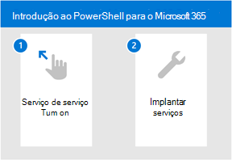

# Começar com o Microsoft 365 para DefenderGet started with Microsoft 365 for Defender

[!INCLUDE [Microsoft 365 Defender rebranding](../includes/microsoft-defender.md)]

**Aplica-se a:****Applies to:**
- Microsoft 365 DefenderMicrosoft 365 Defender

O Microsoft 365 Defender é uma experiência unificada em que você pode monitorar e gerenciar a segurança em toda a sua empresa.Microsoft 365 Defender is a unified experience where you can monitor and manage security across your enterprise. Com os alertas integrados entre identidades, pontos de extremidade, dados, aplicativos, email e ferramentas de colaboração - a investigação e a resposta a ameaças agora ocorrem em um local central.With the integrated alerts across identities, endpoints, data, apps, email, and collaboration tools - investigating and responding to threats now happen in a central location. 

Se você é novo no pacote de produtos de segurança da Microsoft ou familiarizado com fluxos de trabalho individuais, este tópico o guiará nas etapas simples necessárias para começar com o Microsoft 365 Defender.Whether you're new to the Microsoft suite of security products or familiar with individual workflows, this topic will guide you in the simple steps you need to take to get started with Microsoft 365 Defender.

Em geral, você precisará seguir as seguintes etapas para começar:In general, you'll need to take the following steps to get started:

- **[Etapa 1: Ativar o Microsoft 365 Defender](m365d-enable.md)****[Step 1: Turn on Microsoft 365 Defender](m365d-enable.md)**  
    Primeiro, você precisará ativar o serviço, certificar-se de ter a licença correta e as funções atribuídas para que você possa acessar o portal.You'll first need to turn on the service by making sure you have the right license in place and roles are assigned so that you can access the portal. 

    Em seguida, você vai passar por algumas configurações simples e, em seguida, pode confirmar se o serviço está em.You'll then go through some simple settings and then you can confirm that the service is on.

- **[Etapa 2: Implantar serviços com suporte](deploy-supported-services.md)****[Step 2: Deploy supported services](deploy-supported-services.md)**  
    Após concluir as etapas iniciais, você precisará implantar os serviços com suporte que vêm com o Microsoft 365 Defender.After completing the initial steps, you'll need to deploy the supported services that come with Microsoft 365 Defender. A implantação de serviços aumenta efetivamente sua visibilidade nos sinais de ativos em toda a rede.Deploying services effectively increases your visibility in the signals from assets across your network.

## Principais recursosKey capabilities
A acionar o Microsoft 365 Defender e implantar serviços lhe dará acesso aos seguintes recursos principais:Turning on Microsoft 365 Defender and deploying services will give you access to the following key capabilities:

| FuncionalidadeCapability | DescriçãoDescription |
| ------ | ------ |
| Microsoft Defender para Ponto de ExtremidadeMicrosoft Defender for Endpoint | Pacote de proteção de ponto de extremidade criado em torno de sensores comportamentais poderosos, análise de nuvem e inteligência contra ameaçasEndpoint protection suite built around powerful behavioral sensors, cloud analytics, and threat intelligence |
|Obter o Microsoft Defender para Office 365Microsoft Defender for Office 365 | Proteção avançada para seus aplicativos e dados no Office 365, incluindo email e outras ferramentas de colaboraçãoAdvanced protection for your apps and data in Office 365, including email and other collaboration tools |
| Microsoft Defender para Identidade?Microsoft Defender for Identity | Defender contra ameaças avançadas, identidades comprometidas e insiders mal-intencionados usando sinais correlacionados do Active DirectoryDefend against advanced threats, compromised identities, and malicious insiders using correlated Active Directory signals |
| Microsoft Cloud App SecurityMicrosoft Cloud App Security | Identificar e combater ameaças cibernéticas em seus serviços de nuvem da Microsoft e de terceirosIdentify and combat cyberthreats across your Microsoft and third-party cloud services |

