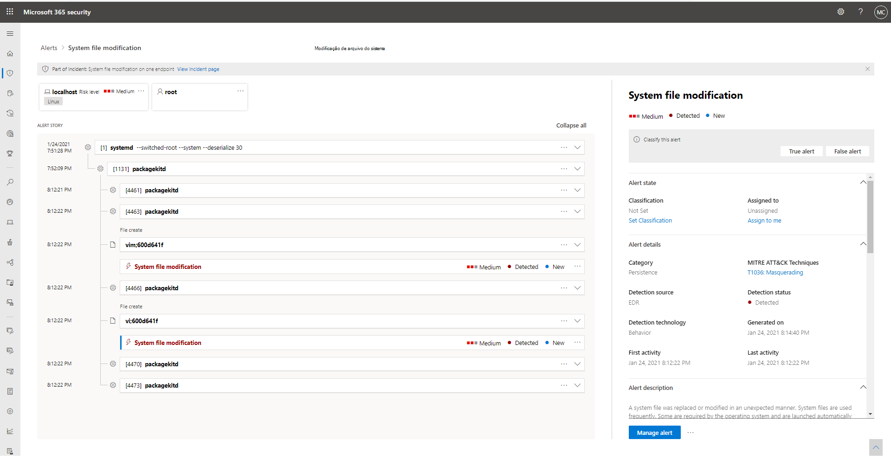
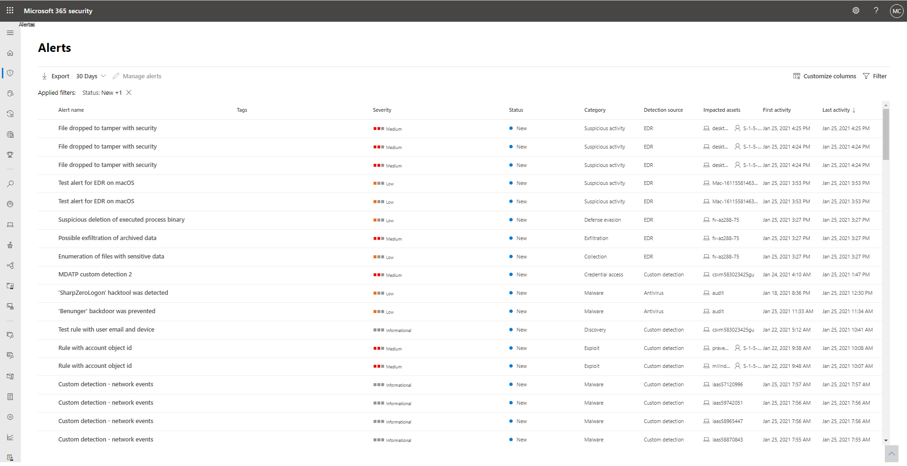

# Investigar alertas no Microsoft 365 DefenderInvestigate alerts in Microsoft 365 Defender

[!INCLUDE [Microsoft 365 Defender rebranding](../includes/microsoft-defender.md)]

**Aplica-se a:****Applies to:**
- Microsoft 365 DefenderMicrosoft 365 Defender

Os alertas são a base de todos os incidentes e indicam a ocorrência de eventos mal-intencionados ou suspeitos em seu ambiente.Alerts are the basis of all incidents and indicate the occurrence of malicious or suspicious events in your environment. Os alertas geralmente fazem parte de um ataque mais amplo e fornecem pistas sobre um incidente.Alerts are typically part of a broader attack and provide pieces of clues about an incident.

No Microsoft 365 Defender, os alertas relacionados são agregados em incidentes de formulário.In Microsoft 365 Defender, related alerts are aggregated together to form incidents. Os incidentes sempre fornecerão o contexto mais amplo de um ataque, no entanto, a investigação de alertas pode ser valiosa quando uma análise mais profunda é necessária.Incidents will always provide the broader context of an attack, however, investigating alerts can be valuable when deeper analysis is required. 

## Usando páginas de alerta em investigaçõesUsing alert pages in investigations

Na guia Alertas de qualquer página de incidente, selecionar um alerta o leva às páginas de alerta individuais.From the Alerts tab of any incident page, selecting an alert brings you to the individual alert pages. Uma página de alerta é composta por três seções: ativos afetados, o alerta e o painel de detalhes.An alert page is composed of three sections: affected assets, alert story, and the details pane.

Ao longo de uma página de alerta, você pode selecionar o ícone de três pontos (**...**) ao lado de qualquer entidade para que você possa ver ações disponíveis, como abrir a página de ativo específica ou realizar etapas de correção específicas.Throughout an alert page, you can select the three-dot icon (**...**) beside any entity so you can see available actions like opening the specific asset page or doing specific remediation steps.

### Analisar ativos afetadosAnalyze affected assets
A seção ativos afetados lista caixas de correio, dispositivos e usuários afetados por esse alerta.The affected assets section lists mailboxes, devices, and users affected by this alert. Selecionar qualquer um dos cartões de ativos preenche o painel de detalhes com informações, incluindo outros alertas que ocorreram envolvendo os ativos, se for o caso.Selecting any of the asset cards populates the details side pane with information, including other alerts that occurred involving the assets, if any.

### Rastrear a função de um alerta no artigo de alertaTrace an alert's role in the alert story
O artigo de alerta exibe todos os ativos ou entidades relacionados ao alerta em uma exibição de árvore de processo.The alert story displays all assets or entities related to the alert in a process tree view. O alerta no título é aquele em foco quando você aterra pela primeira vez na página do alerta selecionado.The alert in the title is the one in focus when you first land on your selected alert's page. Os ativos no artigo de alerta são expansíveis e clicáveis.Assets in the alert story are expandable and clickable. Eles fornecem informações adicionais e aceleram a resposta permitindo que você tome ações imediatamente no contexto da página de alerta.They provide additional information and expedite response by allowing you to take actions right in the context of the alert page. 

> [!NOTE]
> A seção de texto do alerta pode conter mais de um alerta, com alertas adicionais relacionados à mesma árvore de execução que aparece antes ou depois do alerta selecionado.The alert story section may contain more than one alert, with additional alerts related to the same execution tree appearing before or after the alert you've selected.

### Exibir mais informações de alerta no painel de detalhesView more alert information in the details pane

O painel de detalhes mostra os detalhes do alerta selecionado no início, com detalhes e ações relacionadas a ele.The details pane shows the details of the selected alert at first, with details and actions related to it. Se você selecionar qualquer um dos ativos ou entidades afetados no histórico de alertas, o painel de detalhes muda para fornecer informações contextuais e ações para o objeto selecionado.If you select any of the affected assets or entities in the alert story, the details pane changes to provide contextual information and actions for the selected object.

Depois de selecionar uma entidade de interesse, o painel de detalhes muda para exibir informações sobre o tipo de entidade selecionado, informações históricas quando ela estiver disponível e opções para tomar medidas nessa entidade diretamente na página de alerta.Once you've selected an entity of interest, the details pane changes to display information about the selected entity type, historic information when it's available, and options to take action on this entity directly from the alert page.

### Gerenciar alertasManage alerts

Depois de terminar de investigar os alertas, você pode voltar ao alerta com o que começou, marcar o status do alerta como Resolvido e classificá-lo como um alerta False ou True.Once you're done investigating the alerts, you can go back to the alert you started with, mark the alert's status as Resolved and classify it as either a False alert or True alert. Classificar alertas ajuda a ajustar seu produto para fornecer alertas mais verdadeiros e menos alertas falsos.Classifying alerts helps tune your product to provide more true alerts and less false alerts.

> [!NOTE]
> Uma maneira de gerenciar o alerta por meio do uso de marcas.One way of managing alerts it through the use of tags. O recurso de marcação do Microsoft Defender para Office 365 está sendo lançado incrementalmente e está atualmente em visualização.The tagging capability for Microsoft Defender for Office 365 in incrementally being rolled out and is currently in preview.  
> Atualmente, os nomes de marcas modificadas só são aplicados a alertas criados *após* a atualização.Currently, modified tag names are only applied to alerts created *after* the update. Os alertas gerados antes da modificação não refletirão o nome da marca atualizado.Alerts that were generated prior to the modification will not reflect the updated tag name. 

## Gerenciar a fila de alertas unificadaManage the unified alert queue

Selecionar Alertas em Incidentes & alertas no painel de navegação do Centro de Segurança do Microsoft 365 o leva à fila de alertas unificada.Selecting Alerts under Incidents & Alerts in the Microsoft 365 security center navigation pane brings you to the unified alert queue. Alertas de diferentes soluções de segurança da Microsoft, como o Microsoft Defender para Ponto de Extremidade, o Microsoft Defender para Office 365 e o Microsoft 365 Defender aparecem nesta seção.Alerts from different Microsoft security solutions like Microsoft Defender for Endpoint, Microsoft Defender for Office 365, and Microsoft 365 Defender appear in this section. 

A fila Alertas mostra uma lista de alertas que foram sinalizados em sua rede.The Alerts queue shows a list of alerts that were flagged in your network. Por padrão, a fila exibe alertas vistos nos últimos 30 dias.By default, the queue displays alerts seen in the last 30 days. Os alertas mais recentes são mostrados na parte superior da lista, ajudando você a ver os alertas mais recentes primeiro.The most recent alerts are shown at the top of the list helping you see the most recent alerts first.

> [!NOTE]
> No momento do início, a fila de alertas unificados terá apenas 7 dias de alertas do Microsoft Defender para Office 365 disponíveis.At the time of launch, the unified alerts queue will only have 7 days’ worth of Microsoft Defender for Office 365 alerts available. A fila continuará a ser construída ao longo do tempo.The queue will continue to build over time. Se você precisar triagem de alertas antes do início da fila de alertas unificados, use a fila de alertas no Centro de Segurança [e Conformidade.](https://protection.office.com/viewalerts)If you need to triage alerts prior to the launch of the unified alerts queue, use the alerts queue in the [Security and Compliance Center](https://protection.office.com/viewalerts).

Na navegação superior, você pode:On the top navigation, you can:

- Aplicar filtrosApply filters
- Personalizar colunas para adicionar ou remover colunasCustomize columns to add or remove columns
- Exportar dadosExport data

Você também pode filtrar alertas de acordo com diferentes critérios:You can also filter alerts according to different criteria:

- SeveritySeverity
- StatusStatus
- CategoriaCategory
- Fonte de detecçãoDetection source
- PolíticaPolicy
- Ativos afetadosImpacted assets
- Primeira atividadeFirst activity
- Última atividadeLast activity

Para iniciar uma investigação sobre um incidente, leia [Investigar incidentes no Microsoft 365 Defender](investigate-incidents.md)To start an investigation on an incident, read [Investigate incidents in Microsoft 365 Defender](investigate-incidents.md)
## Confira tambémSee also

- [Visão geral dos incidentesIncidents overview](incidents-overview.md)
- [Investigar incidentesInvestigate incidents](investigate-incidents.md)
- [Gerenciar incidentesManage incidents](manage-incidents.md)
