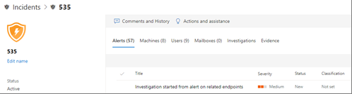

# Detalhes e resultados de uma investigação automatizada

[!INCLUDE [Microsoft 365 Defender rebranding](../includes/microsoft-defender.md)]

**Aplica-se a:**
- Microsoft 365 Defender

Com o Microsoft 365  Defender, quando uma investigação automatizada é executado, detalhes sobre essa investigação ficam disponíveis durante e após o processo de investigação automatizado. Se você tiver as [permissões necessárias](m365d-action-center.md#required-permissions-for-action-center-tasks), poderá exibir esses detalhes na exibição de detalhes da investigação. A exibição de detalhes da investigação fornece o status atualizado e a capacidade de aprovar as ações pendentes. 

## (NEW!) Página de investigação unificada

A página de investigação foi atualizada recentemente para incluir informações em seus dispositivos, email e conteúdo de colaboração. A nova página de investigação unificada define um idioma comum e fornece uma experiência unificada para investigações automáticas no [Microsoft Defender para Ponto](/windows/security/threat-protection/microsoft-defender-atp/microsoft-defender-advanced-threat-protection) de Extremidade e no Microsoft Defender para Office [365](../defender-365-security/defender-for-office-365.md). Para acessar a página de investigação unificada, selecione o link na faixa amarela que você verá em:
- Qualquer página de investigação no Centro de Conformidade e Segurança & do Office 365 ( [https://protection.office.com](https://protection.office.com) )
- Qualquer página de investigação no Centro de Segurança do Microsoft Defender ( [https://securitycenter.windows.com](https://securitycenter.windows.com) )
- Qualquer incidente ou experiência do Centro de Ações no centro de segurança do Microsoft 365 aprimorado ( [https://security.microsoft.com](https://security.microsoft.com) )

## Abrir a exibição de detalhes da investigação

Você pode abrir a exibição de detalhes da investigação usando um destes métodos:
- [Selecionar um item na central de Ações](#select-an-item-in-the-action-center)
- [Selecionar uma investigação em uma página de detalhes do incidente](#open-an-investigation-from-an-incident-details-page)

### Selecionar um item na central de Ações

O Centro de [Ações](m365d-action-center.md) aprimorado ( ) reúne ações de correção em seus dispositivos, email & conteúdo de colaboração [https://security.microsoft.com/action-center](https://security.microsoft.com/action-center) e identidades.  As ações listadas incluem ações de correção que foram realizadas automaticamente ou manualmente. No Centro de ações, você pode exibir ações que estão aguardando aprovação e ações que já foram aprovadas ou concluídas. Você também pode navegar até mais detalhes, como uma página de investigação.

> [!TIP]
> Você deve ter [certas permissões para](m365d-action-center.md#required-permissions-for-action-center-tasks) aprovar, rejeitar ou desfazer ações.

1. Vá para [https://security.microsoft.com](https://security.microsoft.com) e entre. 
2. No painel de navegação, escolha **Central de ações**. 
3. Na guia **Pendente** ou **Histórico**, selecione um item. Seu painel de sobrevoo é aberto.
4. Revise as informações no painel de sobrevoos e, em seguida, dê uma das seguintes etapas:
   - Selecione **Abrir página de investigação** para exibir mais detalhes sobre a investigação.
   - Selecione **Aprovar** para iniciar uma ação pendente.
   - Selecione **Rejeitar** para impedir que uma ação pendente seja tomada.
   - Selecione **Ir procurar** para entrar em Busca [Avançada](advanced-hunting-overview.md).

### Abrir uma investigação em uma página de detalhes do incidente

Use uma página de detalhes do incidente para exibir informações detalhadas sobre um incidente, incluindo os alertas que foram disparados com informações sobre os dispositivos afetados, contas de usuários ou caixas de correio.

1. Vá para [https://security.microsoft.com](https://security.microsoft.com) e entre. 
2. No painel de navegação, escolha **Incidentes &**  >  **alertas Incidentes**. 
3. Selecione um item na lista e escolha **Abrir página de incidentes**.
4. Selecione a **guia Investigações** e selecione uma investigação na lista. Seu painel de sobrevoo é aberto.
5. Selecione **Abrir página de investigação**. 

## Detalhes da investigação

Use o modo de exibição de detalhes da investigação para ver as atividades antigas, atuais e pendentes referentes a uma investigação. A exibição de detalhes de investigação se parece com a seguinte imagem:

Na exibição de detalhes da investigação, você pode ver as informações nas guias **Gráfico de Investigação**, **Alertas**, **Dispositivos**, **Identidades**, **Principais descobertas**, **Entidades**,**Log** e **Ações pendentes**, descritas na tabela a seguir.

> [!NOTE]
> As guias específicas que você vê em uma página de detalhes da investigação dependem do que sua assinatura inclui. Por exemplo, se sua assinatura não incluir o Microsoft Defender para o Plano 2 do Office 365, você não verá uma guia **Caixas de** Correio.

| Guia | Descrição |
|:--------|:--------|
| **Gráficos de investigação**   | Oferece uma representação visual da investigação. Descreve entidades e lista as ameaças encontradas, juntamente com os alertas, e se as ações estão aguardando aprovação. Você pode selecionar um item no gráfico para exibir mais detalhes. Por exemplo, selecionar **o ícone**  Evidência o leva à guia Evidências, onde você pode ver entidades detectadas e seus vereditos. |
| **Alertas**    | Lista os alertas associados à investigação. Os alertas podem vir de recursos de proteção contra ameaças no dispositivo de um usuário, em aplicativos do Office, segurança de aplicativos na nuvem e outros recursos do Microsoft 365 Defender.|
| **Dispositivos** | Lista os dispositivos incluídos na investigação juntamente com seu nível de correção. (Os níveis de correção correspondem [ao nível de automação para grupos de dispositivos](m365d-configure-auto-investigation-response.md#review-or-change-the-automation-level-for-device-groups).) |
| **Caixas de correio** |Lista caixas de correio que são impactadas por ameaças detectadas.  |
| **Usuários**  | Lista contas de usuário que são impactadas por ameaças detectadas. |
| **Evidências** | Lista partes de evidências levantadas por alertas/investigações. Inclui vereditos (*Mal-intencionados,* *suspeitos* ou *nenhuma ameaça encontrada*) e status de correção. |
| **Entities**  | Fornece detalhes sobre cada entidade analisada, incluindo um veredito para cada tipo de entidade (*Mal-intencionado,* *suspeito* ou *nenhuma ameaça encontrada*).|
|**Log**    | Fornece uma exibição cronológica e detalhada de todas as ações de investigação realizadas após a acionamento de um alerta.|
| **Ações pendentes** | Lista os itens que exigem aprovação para prosseguir. Vá para a Central de Ações ( [https://security.microsoft.com/action-center](https://security.microsoft.com/action-center) ) para aprovar ações pendentes. |

## Próximas etapas

- [Aprovar ou rejeitar ações de correção após uma investigação automatizada](m365d-autoir-actions.md)
- [Saiba mais sobre ações de correção](m365d-remediation-actions.md)
