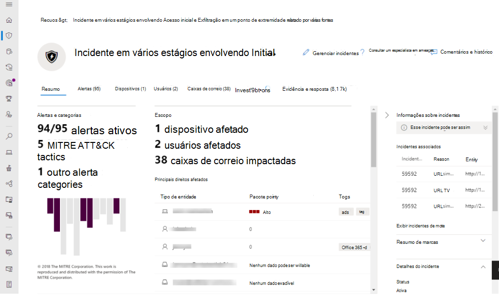

# Ativar o Microsoft 365 Defender

[!INCLUDE [Microsoft 365 Defender rebranding](../includes/microsoft-defender.md)]

**Aplica-se a:**
- Microsoft 365 Defender

[O Microsoft 365 Defender](microsoft-365-defender.md) unifica seu processo de resposta a incidentes integrando os principais recursos do Microsoft Defender para Endpoint, do Microsoft Defender para Office 365, do Microsoft Cloud App Security e do Microsoft Defender for Identity. Essa experiência unificada adiciona recursos avançados que podem acessados no centro de segurança do Microsoft 365.

O Microsoft 365 Defender é ativado automaticamente quando clientes qualificados com as permissões necessárias visitam o Centro de segurança do Microsoft 365. Leia este artigo para entender vários pré-requisitos e como o Microsoft 365 Defender é provisionado.

## Verificar a qualificação da licença e as permissões necessárias

Uma licença para um produto de segurança do Microsoft 365 geralmente lhe dá o direito de usar o Microsoft 365 Defender no Centro de segurança do Microsoft 365 sem custo adicional de licenciamento. Recomendamos obter uma licença de segurança do Microsoft 365 E5, E5 Security, A5 ou A5 ou uma combinação válida de licenças que fornece acesso a todos os serviços com suporte.

Para obter informações detalhadas sobre licenciamento, [leia os requisitos de licenciamento.](prerequisites.md#licensing-requirements)

### Verificar sua função

Você deve ser um **administrador global** ou um administrador **de** segurança no Azure Active Directory para ativar o Microsoft 365 Defender. [Exibir suas funções no Azure AD](/azure/active-directory/users-groups-roles/directory-manage-roles-portal)

## Serviços com suporte

O Microsoft 365 Defender agrega dados dos vários serviços com suporte que você já implantou. Ele processará e armazenará dados centralmente para identificar novas percepções e tornar os fluxos de trabalho de resposta centralizados possíveis. Ele faz isso sem afetar implantações, configurações ou dados existentes associados aos serviços integrados.

Para obter a melhor proteção e otimizar o Microsoft 365 Defender, recomendamos implantar todos os serviços com suporte aplicáveis em sua rede. Para obter mais informações, [leia sobre a implantação de serviços com suporte.](deploy-supported-services.md)

## Integração ao serviço
A integração com o Microsoft 365 Defender é simples. No menu de navegação, selecione qualquer item na seção Pontos de Extremidade, como Incidentes, Busca, Centro de Ações ou Análise de Ameaças para iniciar o processo de integração. 

### Local do data center

O Microsoft 365 Defender armazenará e processará dados no [mesmo local usado pelo Microsoft Defender para o Ponto de Extremidade.](/windows/security/threat-protection/microsoft-defender-atp/data-storage-privacy) Se você não tiver o Microsoft Defender para Ponto de Extremidade, um novo local do data center será selecionado automaticamente com base no local dos serviços de segurança ativos do Microsoft 365. O local do data center selecionado é mostrado na tela.

Selecione **Precisa de ajuda?** no centro de segurança do Microsoft 365 para entrar em contato com o suporte da Microsoft sobre o provisionamento do Microsoft 365 Defender em um local de data center diferente.

> [!NOTE]
> O Microsoft Defender para Ponto de Extremidade provisiona automaticamente em data centers da União Europeia (UE) quando ativado por meio do Azure Defender. O Microsoft 365 Defender provisiona automaticamente no mesmo data center da UE para clientes que provisionam o Defender para o Ponto de Extremidade dessa maneira.

### Confirmar se o serviço está ativado

Depois que o serviço é provisionado, ele adiciona:

- [Gerenciamento de incidentes](incidents-overview.md)
- [Fila de alertas](investigate-alerts.md)
- Uma central de ações para gerenciar [investigações e respostas automatizadas](m365d-autoir.md)
- [Recursos avançados de busca](advanced-hunting-overview.md)
- Análise de ameaças

 *Microsoft 365 Defender*

### Obter dados do Microsoft Defender para Identidade 
Para habilitar a integração com o Microsoft Cloud App Security, você precisará fazer logon no Microsoft Cloud App Security pelo menos uma vez.

## Obter assistência

Para obter respostas para as perguntas mais frequentes sobre como ligar o Microsoft 365 Defender, [leia as perguntas frequentes](m365d-enable-faq.md).

A equipe de suporte da Microsoft pode ajudar a provisionamento ou desprovisionamento do serviço e recursos relacionados em seu locatário. Para assistência, selecione **Precisa de ajuda?** no centro de segurança do Microsoft 365. Ao entrar em contato com o suporte, mencione o Microsoft 365 Defender.

## Tópicos relacionados

- [Perguntas frequentes](m365d-enable-faq.md)
- [Requisitos de licenciamento e outros pré-requisitos](prerequisites.md)
- [Implantar serviços com suporte](deploy-supported-services.md)
- [Visão geral do Microsoft 365 Defender](microsoft-365-defender.md)
- [Visão geral do Microsoft Defender para Ponto de Extremidade](../defender-endpoint/microsoft-defender-endpoint.md)
- [Visão geral do Defender para Office 365](../office-365-security/defender-for-office-365.md)
- [Visão geral do Microsoft Cloud App Security](/cloud-app-security/what-is-cloud-app-security)
- [Visão geral do Microsoft Defender para Identidade](/azure-advanced-threat-protection/what-is-atp)
- [Microsoft Defender para armazenamento de dados do Ponto de Extremidade](../defender-endpoint/data-storage-privacy.md)
