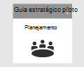
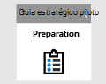
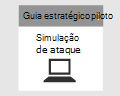
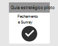

# Planejando seu projeto piloto do Microsoft 365 Defender 

[!INCLUDE [Microsoft 365 Defender rebranding](../includes/microsoft-defender.md)]

**Aplica-se a:**
- Microsoft 365 Defender

| Planejamento| [Preparação](prepare-m365d-eval.md) |  [Simular ameaças](m365d-pilot-simulate.md) |  [Fechar e resumir](m365d-pilot-close.md)|
|--|--|--|--|
|*Você está aqui!*| | | |

No momento, você está na fase de planejamento.

Para garantir que seu projeto piloto seja um sucesso, é essencial planejar completamente e obter aprovações de seus participantes no início. Os elementos de planejamento incluem a identificação de escopo, casos de uso, requisitos e critérios de sucesso.

Este guia orienta você sobre como planejar seu projeto piloto. 

>[!IMPORTANT]
>Para obter resultados ideais, siga as instruções piloto o mais próximo possível.

## Escopo

O escopo do piloto determinará a amplitude do teste, com base no seu ambiente e nos métodos de teste aceitáveis. Aqui estão alguns escopos de exemplo a considerar:
- Ambiente de desenvolvimento ou teste que inclui pontos de extremidade, servidores, controladores de domínio.
- Ambiente de produção com o Microsoft 365, Azure, serviços do Active Directory, pontos de extremidade e servidores

>[!NOTE]
>Se você ainda não tiver as licenças completas, poderá obter licenças de avaliação para avaliar o [Microsoft 365 Defender](m365d-evaluation.md?ocid=cx-docs-MTPtriallab) – planejar, preparar, configurar, configurar e executar seu projeto piloto. Seus participantes terão um papel importante para ajudar a facilitar o processo do início ao fim.

Os tipos de sistemas operacionais a serem avaliados também devem ser definidos com base na composição organizacional. Isso pode incluir os seguintes pontos de extremidade [do Mac,](/windows/security/threat-protection/microsoft-defender-atp/microsoft-defender-atp-mac#system-requirements)Servidores [Linux,](/windows/security/threat-protection/microsoft-defender-atp/microsoft-defender-atp-linux#system-requirements)pontos de extremidade [do Windows 10,](/windows/security/threat-protection/microsoft-defender-atp/minimum-requirements#supported-windows-versions) [Windows Server 2016](/windows/security/threat-protection/microsoft-defender-atp/minimum-requirements#supported-windows-versions).

## Casos de uso

Os casos de uso representam instruções de como a ferramenta que está sendo testada deve ser consumida pelos usuários pretendidas. Elas podem ser formuladas como histórias de usuário do ponto de vista de uma determinada persona, como um analista soc. Por exemplo:
- Como analista soc, preciso exibir, correlacionar, avaliar e gerenciar alertas e eventos em dispositivos, usuários e caixas de correio em minha rede. [Gerenciamento de incidentes]
- Como analista soc, preciso ter a ferramenta e o processo para investigar e responder automaticamente a eventos mal-intencionados na minha rede. [IR automático]
- Como analista soc, preciso pesquisar dados do meu ambiente para encontrar ameaças conhecidas e potenciais e atividades suspeitas. [Busca Avançada]

Lembre-se de que esses casos de uso devem ser criados dentro dos parâmetros do escopo definido. Se, por exemplo, o escopo do teste não incluir uma avaliação de ferramentas como o Microsoft Cloud App Security, use casos que dependem disso como uma fonte de dados não deve ser criado.

## Requisitos

Na lista de casos de uso, você pode começar a criar requisitos. Os requisitos incluem recursos que uma ferramenta deve ter para atender aos casos de uso. Esses requisitos podem ser divididos em categorias como configuração e manutenção, suporte para integrações e requisitos específicos de recursos, como a capacidade de busca e a capacidade de criar alertas personalizados.

## Plano de teste

Dependendo dos requisitos, diferentes métodos de teste podem ser apropriados. Por exemplo, se o requisito for avaliar a eficácia da Correção Automatizada, o plano de teste precisará incluir etapas para gerar os comportamentos que disparariam uma ação de correção automatizada no Microsoft 365 Defender. Se o requisito for detectar um comportamento específico ou um ataque, o teste poderá envolver mais etapas. O ponto é ter um plano em prática para testar com precisão em relação aos seus requisitos.

## Critérios de sucesso

Os critérios de sucesso são, em última análise, o conjunto de barras a ser medido em relação ao que você está testando. Se você está testando o Microsoft 365 Defender (ou qualquer outra tecnologia para esse assunto) em relação a outras ferramentas ou por si só, deve haver alguns critérios quantificáveis para determinar o valor que a ferramenta fornece. Com base no escopo, requisitos e plano de teste, os critérios de sucesso determinarão como marcar o teste. Isso deve ser menos de uma passagem ou falha e mais de uma pontuação ponderada com base em suas necessidades. Por exemplo, para ter êxito, uma ferramenta pode precisar pontuar acima de 80% em determinadas áreas críticas identificadas.

## Scorecard

Uma maneira de reunir todos os elementos do seu plano pode ser criar um scorecard. Consulte um scorecard de exemplo abaixo:

| Caso de uso | Requisitos | Requisitos de configuração | Plano de teste | Resultado esperado | Status do teste | Pontuação | Observações |
|:-------|:-------|:-------|:-------|:-------|:-------|:-------|:-------|
|Gestão de incidentes|- Microsoft 365 Defender    - Microsoft Defender para Identidade   - Microsoft Defender para Ponto de Extremidade   – Microsoft Cloud App Security (opcional)|Consulte os [pré-requisitos para](m365d-evaluation.md?ocid=cx-docs-MTPtriallab) preparação, configuração e configuração para obter detalhes |[Simular ameaças](m365d-pilot-simulate.md)   [Investigar o incidente](./m365d-pilot-simulate.md#investigate-an-incident) |Os investigadores podem entender o escopo e o impacto do incidente e gerenciar o incidente||||
|AutoIR|- Microsoft 365 Defender   - Microsoft Defender para Identidade   - Microsoft Defender para Ponto de Extremidade |Consulte os [pré-requisitos para](m365d-evaluation.md?ocid=cx-docs-MTPtriallab) preparação, configuração e configuração para obter detalhes  Habilitar o AutoIR  |[Simular ameaças](m365d-pilot-simulate.md)   [Investigação automatizada](m365d-pilot-simulate.md#automated-investigation-and-remediation) |Alertas e incidentes são automaticamente remediados pelo Microsoft 365 Defender||||
|Busca avançada|- Microsoft 365 Defender   - Microsoft Defender para Ponto de Extremidade   -Microsoft Defender para Office 365 |Consulte os [pré-requisitos para](m365d-evaluation.md?ocid=cx-docs-MTPtriallab) preparação, configuração e configuração para obter detalhes|[Cenário de busca avançada](./m365d-pilot-simulate.md#advanced-hunting-scenario) |Os investigadores podem encontrar dados por meio de busca avançada, pivô para entidades impactadas e criação de detecções personalizadas||||

## Próxima etapa
|  [Fase de preparação](prepare-m365d-eval.md) | Preparar seu ambiente piloto do Microsoft 365 Defender
|:-------|:-----|
