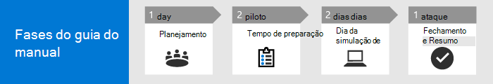

# Executar seu projeto piloto do Microsoft 365 Defender 

[!INCLUDE [Microsoft 365 Defender rebranding](../includes/microsoft-defender.md)]

**Aplica-se a:**
- Microsoft 365 Defender

Este guia ajuda você a executar um projeto piloto fornecendo ponteiros para garantir que você tenha um plano bem estruturado, orientando você usando o recurso de simulação de ataque e, finalmente, concluindo o piloto com as principais dicas para você refletir e documentar os resultados.

Executar um piloto ajuda você a determinar efetivamente o benefício de adotar o Microsoft 365 Defender. Antes de habilenciar o Microsoft 365 Defender em seu ambiente de produção e iniciar seus casos de uso, é melhor planejar a determinação das tarefas a realizar para seu projeto piloto e definir os critérios de sucesso. 

## Como usar esse playbook piloto

Este guia fornece uma visão geral do Microsoft 365 Defender e instruções passo a passo sobre como configurar seu projeto piloto. 

O Microsoft 365 Defender é um pacote de defesa empresarial unificado pré e pós-violação que coordena a proteção, a detecção, a prevenção, a investigação e a resposta entre pontos de extremidade, identidades, email e aplicativos para fornecer proteção integrada contra ataques sofisticados. Ele faz isso combinando e orquestrando os seguintes recursos em uma única solução de segurança:
  - Microsoft Defender para Ponto de Extremidade (pontos de extremidade)
  - Microsoft Defender para Office 365 (email) 
  - Microsoft Defender para Identidade (identidade) 
  - Microsoft Cloud App Security (aplicativos)

Com a solução integrada do Microsoft 365 Defender, os profissionais de segurança podem unir os sinais de ameaça que o Microsoft Defender para Ponto de Extremidade, o Microsoft Defender para Office 365, o Microsoft Defender para Identidade e o Microsoft Cloud App Security recebem e determinam o escopo completo e o impacto da ameaça, como ela entrou no ambiente, o que ela é afetada e como ela está afetando a organização no momento. O Microsoft 365 Defender toma medidas automáticas para impedir ou interromper o ataque e a auto-recuperação de caixas de correio afetadas, pontos de extremidade e identidades de usuário. Consulte a [visão geral do Microsoft 365 Defender](microsoft-365-defender.md) para obter detalhes.

A linha do tempo de exemplo a seguir varia dependendo de ter os recursos certos em seu ambiente. Algumas detecções e fluxos de trabalho podem precisar de mais tempo de aprendizado do que as outras.

>[!IMPORTANT]
>Para obter resultados ideais, siga as instruções piloto o mais próximo possível.

### Fases piloto do playbook 

Há quatro fases na execução de um piloto do Microsoft 365 Defender:

|Fase | Descrição | 
|:-------|:-----|
| [Planejamento](m365d-pilot-plan.md)  ~ 1 dia| Saiba o que você precisa considerar antes de executar seu projeto piloto do Microsoft 365 Defender:   - Escopo   - Usar casos  - Requisitos  - Plano de teste   - Critérios de sucesso   - Scorecard 
| [Preparação](m365d-evaluation.md)  ~2 dias|  Acesse o Centro de Segurança do Microsoft 365 para configurar seu ambiente piloto do Microsoft 365 Defender. Você será guiado para:  - Identificar participantes e buscar aprovação para seu piloto   - Considerações sobre o ambiente  - Access  - Configuração do Azure Active Directory   - Ordem de configuração   - Inscrever-se na avaliação do Microsoft 365 E5   - Configurar domínio  - Atribuir licenças do Microsoft 365 E5   – Conclua o assistente de instalação no portal|
| [Simulação de ataque](m365d-pilot-simulate.md)  ~2 dias| Para simular um ataque, você será orientado a:  - Verificar os requisitos do ambiente de teste  - Executar a simulação  - Investigar um incidente  - resolver o incidente 
| [Fechamento e resumo](m365d-pilot-close.md)  ~ 1 dia| Quando você chegar ao final do processo, você será orientado a:  - Passar pela saída final - Apresentar sua saída para seus participantes  - Fornecer comentários  - Dê as próximas etapas 

## Próxima etapa
|[Fase de planejamento](m365d-pilot-plan.md) | Planejar seu projeto piloto do Microsoft 365 Defender 
|:-------|:-----|
